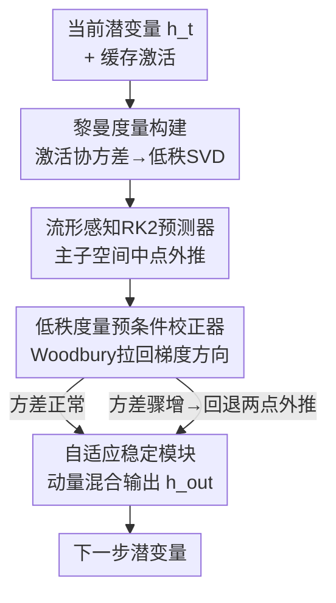

# GeoRK2: Geometry-Guided Runge-Kutta Integration for Diffusion Transformer Acceleration

**会议**: CVPR 2026  
**论文**: [CVF Open Access](https://openaccess.thecvf.com/content/CVPR2026/html/Sun_GeoRK2_Geometry-Guided_Runge-Kutta_Integration_for_Diffusion_Transformer_Acceleration_CVPR_2026_paper.html)  
**代码**: 无  
**领域**: 扩散模型  
**关键词**: 扩散加速, Diffusion Transformer, 黎曼流形, Runge-Kutta积分, 免训练采样  

## 一句话总结
GeoRK2 把扩散 Transformer 的少步采样重新建模为「在特征协方差诱导的黎曼流形上做二阶 Runge-Kutta 积分」，用免训练、即插即用的「预测-校正」模块替换原采样器的数值更新，在 ImageNet/FLUX/HunyuanVideo 上实现 4–5× 加速且 FID 几乎不掉（ΔFID≈0.81）。

## 研究背景与动机
**领域现状**：扩散 Transformer（DiT、FLUX、HunyuanVideo）合成质量顶尖，但要几十到上百次串行神经网络评估（NFE）才能去噪一张图，推理延迟高。免训练加速主要走两条路：一是数值 ODE 求解器（DDIM、DPM-Solver++）在数据空间对概率流 ODE 做高阶离散；二是预测-校正框架（TaylorSeer、ToCa）在特征空间用 Taylor 展开/外推先猜未来状态再修正。

**现有痛点**：两类方法在激进减步（如 10–25 步）时都会扭曲中间特征、掉保真度。作者指出根因是它们都**隐式假设各向同性、平坦的黎曼度量**，于是无论在数据空间还是特征空间，都用欧氏向量操作（线性插值、L2 校正）。

**核心矛盾**：深网络学到的中间特征其实贴在一个低维黎曼流形上（作者实测 DiT-XL/2 与 FLUX 的激活：top-64 主方向解释了 99%+ 方差，去噪轨迹偏离欧氏直线预测达 12%）。平坦空间的数值积分会**横切流形曲率**而非沿测地线走，导致去噪状态逐步偏离预训练模型隐式定义的特征流形——作者称之为 **manifold drift（流形漂移）**。步长越激进，漂移累积越快，表现为动态不稳、保真下降，从而卡死了可达的加速比。

**本文目标**：在不重训、不改架构的前提下，让大步长积分「感知流形」，把漂移压住，从而把加速比推到 4–5× 还保住质量。

**核心 idea**：把采样看成「在预训练网络诱导的黎曼特征流形上求解概率流 ODE」，用激活协方差直接估出度量，再用一个尊重该度量的二阶 RK2 预测器 + 低秩度量预条件校正器，让积分路径贴着流形走。

## 方法详解

### 整体框架
GeoRK2 是一个轻量 PyTorch wrapper：前向时拦截若干瓶颈层（$\ell\in\{6,12,18,24\}$）的中间激活，在线估出一个**低秩黎曼度量**，然后用一个「预测-校正」模块替换原采样器（DDIM/DPM-Solver）在每一步的默认数值更新。整条流程在概念上是三段：先从激活协方差**构建度量**（捕捉特征几何的各向异性，决定哪些方向能放心大步走、哪些方向会过冲）；再用**流形感知 RK2 预测器**把潜变量沿大间隔外推、但把外推限制在主子空间里；最后用**度量预条件校正器**把预测拉回真正的黎曼梯度方向，并由**自适应稳定模块**（方差触发回退 + 动量混合）兜底激进步长下的异常。

度量的根基是：对第 $\ell$ 层、时间步 $t$ 的去均值激活 $H_t^{(\ell)}\in\mathbb{R}^{d_\ell\times B}$（$B$ 个空间 token），定义局部协方差

$$G_t^{(\ell)} = \tfrac{1}{B}H_t^{(\ell)}\bigl(H_t^{(\ell)}\bigr)^\top + \varepsilon I_{d_\ell},\quad \varepsilon=10^{-6}.$$

它充当 pull-back 度量，把特征空间的各向异性翻译成潜空间的步长大小：大特征值方向上激进更新有过冲风险，小特征值方向上加速是安全的。去噪目标是最小化预测误差能量 $U(h_t)=\tfrac{1}{2}\lVert h_t-F(h_t,t)\rVert^2$，其黎曼梯度流为 $\dot{h}_t=-\Pi_{T_{h_t}\mathcal{M}}\bigl[G_{\text{eff}}(h_t)^{-1}\nabla U(h_t)\bigr]$，其中 $G_{\text{eff}}=\sum_{\ell\in L}\alpha_\ell G_t^{(\ell)}$ 融合四个瓶颈层，$\Pi$ 投影到主特征子空间。直接积分需 $O(d_\ell^3)$（DiT 的 $d_\ell=1152$）不可行，于是保留 top-$r$（$r\approx48$–$72$）特征方向做低秩近似 $G_t^{(\ell)}\approx U_{r,t}\Sigma_{r,t}U_{r,t}^\top+\varepsilon I$，复杂度降到 $O(d_\ell r^2)$，FID 退化 <0.5%。

### 关键设计

**1. 流形感知 RK2 预测器（Projection-as-Retraction）：让大步外推不跌出流形**

标准 RK2 靠评估中点拿到二阶精度，但高维里大多数方向都是噪声，盲目外推会冲进度量定义不良的低置信区域。GeoRK2 把外推**限制在 top-$r$ 特征子空间**：给定从近期潜变量估出的特征速度 $v_t$，投影中点 $h_{\text{mid}}=U_{r,t}U_{r,t}^\top\bigl(h_t+\tfrac{\Delta t}{2}v_t\bigr)$ 充当几何滤波器——正交于流形的分量被压掉，防止漂移；再算中点速度 $v_{\text{mid}}=(F(h_{\text{mid}})-h_{\text{mid}})/\Delta t$ 得到预测 $h_{\text{pred}}=U_{r,t}U_{r,t}^\top\bigl(h_t+\Delta t\,v_{\text{mid}}\bigr)$。它的巧妙在于绕开了黎曼优化里昂贵的指数映射（测地线）：把「正交投影到主子空间」当作一阶 retraction，在 99% 方差保留下，投影误差被证明是二阶可忽略的（$\lim_{\lVert\Delta h\rVert\to0}\lVert\exp_{h_t}(\Delta h)-P_{S_t}(h_t+\Delta h)\rVert/\lVert\Delta h\rVert=O(\lVert\Delta h\rVert)$），从而以 $O(d_\ell r^2)$ 代价拿到二阶精度。

**2. 低秩度量预条件校正器：用真实曲率把预测拉回测地线**

RK2 的线性插值假设局部曲率恒定，这在噪声级跳变时会被破坏。校正步用度量缩放把预测拉向真正的黎曼梯度：$\Delta h_{\text{geo}}=-\lambda\,\bar{G}_{r,t}^{-1}\bigl(h_{\text{pred}}-F(h_{\text{pred}})\bigr)$，其中 $\bar{G}_{r,t}$ 是近期度量的指数滑动平均（$\beta=0.9$），用时间平滑稳住矩阵求逆、同时保留对曲率渐变的响应。关键是求逆走 **Woodbury 恒等式**：$\bar{G}_{r,t}^{-1}=\varepsilon^{-1}I-\varepsilon^{-1}U_{r,t}(\varepsilon I_r+\Sigma_{r,t})^{-1}U_{r,t}^\top$，把 $O(d_\ell^3)$ 降到 $O(d_\ell r^2+r^3)$。这一步本质是「沿流形最有影响的方向最小化势函数」，让特征保持一致，又不带来高昂算力——它正是欧氏 L2 校正所缺的曲率补偿。

**3. 自适应稳定模块：激进步长下的异常检测与兜底**

「度量缓变」假设在高噪声→低噪声相位切换时会灾难性失效（加速度方差骤增）。GeoRK2 用一个简单统计量检测：令加速度 $a_t=(v_t-v_{t-1})/\Delta t$，当 $\mathrm{Var}(a_t)$ 超过近期中位数的 1.5 倍（即 +50%）时，回退到保守的两点外推 $h_{\text{pred}}=h_t+\Delta t\,v_t$。最终输出再用动量混合稳一手：$h_{\text{out}}=\rho\bigl(h_{\text{pred}}+\Delta h_{\text{geo}}\bigr)+(1-\rho)h_t$，$\rho=0.85$，抑制振荡又不牺牲响应。回退在 6–10% 的高速步触发（主要在时间步 200–400 模型从布局转向细节精修处），额外开销 <1%，却能在 0.3% 随机种子上防止发散。配合每 5 步才更新一次度量、前 4 步用 DDIM warmup，整套机制让积分器在多种步长 schedule 下都可靠。

### 损失函数 / 训练策略
GeoRK2 **完全免训练**，无任何可学习参数，全局单一超参配置（$\lambda=0.1,\rho=0.85,\beta=0.9$，截断秩 $r=64$，平均窗口 $n=4$，阈值 $\alpha=1.5$）跨 DiT-S/B/XL 通用。度量每 5 步在 1024 token 的激活 bank 上做截断 SVD 摊销。实测额外开销仅 5.1% FLOPs、3.8% wall-clock，显存 <15% 增量，且不随 batch size 增长。

## 实验关键数据

### 主实验（ImageNet-256, DiT-XL/2）
Speed↑ 相对 DDIM-50。GeoRK2 在各加速档位都拿到最优 FID。

| 方法 | 步数/配置 | 延迟(s)↓ | Speed↑ | FID↓ | SSIM↑ |
|------|-----------|---------|--------|------|-------|
| DDIM-50 | 50 | 8.38 | 1.00× | 2.51 | 0.74 |
| **GeoRK2 (N=2)** | 50 | 4.42 | 1.95× | **2.41** | **0.96** |
| TaylorSeer (N=3) | 50 | 4.82 | 2.54× | 2.73 | 0.92 |
| **GeoRK2 (N=3)** | 50 | 4.84 | 2.70× | **2.67** | 0.94 |
| TaylorSeer (N=5) | 50 | 3.68 | 4.51× | 4.31 | 0.83 |
| FORA (N=5) | 50 | 2.86 | 4.51× | 9.87 | 0.72 |
| **GeoRK2 (N=8)** | 50 | 2.78 | **4.92×** | **3.32** | 0.88 |

高速档（4.92×）下 GeoRK2 把 FID 压到 3.32，而同延迟竞品普遍 >4.3；FLUX.1-dev 上 GeoRK2 (N=5) 在 3.52× 加速拿到 ImageReward 0.989、CLIP 34.96 的最高分（TeaCache/DBCache 同档 ImageReward 跌到 0.878/0.616）；HunyuanVideo 上 GeoRK2 (N=8) 4.66× 加速、VBench 80.73，超过同档 TaylorSeer 的 79.99。

### 消融实验（DiT-XL/2, N=3, NFE=25）
%FID Degradation 为相对完整模型的退化。

| 配置 | FID↓ | SSIM↑ | 延迟(s) | 退化 |
|------|------|-------|---------|------|
| GeoRK2 (Full) | **2.31** | 0.94 | 4.84 | – |
| w/o GC（度量校正，$\bar{G}_r=I$） | 3.02 | 0.89 | 4.12 | +30.7% |
| w/o RK2（退化为 Euler） | 2.87 | 0.91 | 4.05 | +24.2% |
| w/o Euclidean（纯欧氏 RK2 baseline） | 3.41 | 0.86 | 4.82 | +47.6% |

另外，用**瞬时度量不做时间平均**反而 FID 升到 3.45，验证曲率估计必须时间平滑才稳。

### 关键发现
- **几何校正贡献最大**：去掉度量校正（w/o GC）退化 +30.7%，是单项掉点最多的——证明欧氏 L2 校正确实在横切曲率。
- **二阶更新本身也关键**：把 RK2 换成 Euler 仍退化 +24.2%，说明加速不能只靠几何校正，二阶精度独立有效。
- **截断秩有明显平台**：$r$ 从 32→64 把 FID 从 2.89 改善到 2.31，再到 128 仅 2.28（边际递减），印证 64 个方向已抓住主谱、与 99% 谱能量一致。
- **几何确实变平滑**：投影到主特征向量后，去噪轨迹平均曲率从 $\kappa=0.31$ 降到 $0.18$（−42%），且高曲率轨迹一致对应有语义瑕疵的样本；相邻子空间主夹角平均仅 4.7°，说明主导几何缓变、retraction 投影站得住。

## 亮点与洞察
- **「不只是更短，而是更直——在流形上」**：作者把加速问题从「减步数」重构成「让积分路径贴测地线」，是个很干净的视角转换，把数值分析和信息几何接上了。
- **Projection-as-Retraction 这一招很巧**：用正交投影替代昂贵的指数映射，还能严格证明在 99% 方差保留下投影误差二阶可忽略，把黎曼积分的理论代价和工程代价同时压下来。
- **Woodbury + 低秩 + 摊销 SVD 的组合拳**让「在线估度量+求逆」从不可行变成 5.1% 开销，这套工程化思路可迁移到任何需要在线估二阶信息（如自然梯度、Fisher 预条件）的推理加速场景。
- **方差触发回退**只用一个加速度方差统计量就识别相位切换并兜底，简单但有效，是即插即用稳定性的关键。

## 局限与展望
- 作者承认开销虽小但非零（5.1% FLOPs / 3.8% 时间 / <15% 显存），且度量构建依赖激活 buffer，未来想用 hypernetwork 直接产生度量以省掉在线 SVD。
- ⚠️ 度量只从固定四个瓶颈层 $\{6,12,18,24\}$ 估出、融合权重 $\alpha_\ell$ 如何设原文未充分展开，跨架构是否仍最优存疑（以原文为准）。
- 「度量缓变」假设在相位切换处会失效，虽有回退兜底，但回退即退回欧氏两点外推，本质是放弃了几何收益——极端激进步长下能保住的加速比仍受此约束。
- 评测集中在 DiT 系（DiT-XL、FLUX、HunyuanVideo），对 UNet 类扩散或潜空间结构差异大的骨干是否同样有效未验证。

## 相关工作与启发
- **vs 数值 ODE 求解器（DDIM / DPM-Solver++）**：它们在数据空间把去噪当平坦欧氏 ODE 解；GeoRK2 在特征空间承认流形曲率并据此积分，区别在「平坦假设 vs 黎曼度量」，因此激进步长下保真更稳。
- **vs 预测-校正框架（TaylorSeer / ToCa）**：同样在特征空间预测+校正，但它们的预测/校正仍是欧氏向量操作（Taylor 外推、因果校正），忽略曲率；GeoRK2 的预测和校正都被流形度量约束，避免了 manifold drift。
- **vs 缓存类（FORA / TeaCache / DBCache）**：缓存策略在复杂文本条件/视频时易出现质量塌陷（DBCache 的 ImageReward 跌到 0.62、视频出现 flicker）；GeoRK2 的逐层度量天然尊重 cross-attention 与时空注意力流形，语义一致性和时序连贯更好。
- **vs 黎曼优化/积分**：经典工作用自然梯度、流形上的 RK 求解训练期优化；GeoRK2 把这些原则搬到**预训练网络的推理期**，关键区别是处理推理而非训练。

## 评分
- 新颖性: ⭐⭐⭐⭐⭐ 把 manifold drift 形式化为加速瓶颈，并用黎曼 RK2 统一解决，视角和方法都新。
- 实验充分度: ⭐⭐⭐⭐ 三任务三骨干 + 多档加速 + 系统消融与几何验证，较充分；但缺 UNet 类骨干。
- 写作质量: ⭐⭐⭐⭐ 逻辑清晰、公式与算法完整，结尾点题漂亮；部分超参设置（$\alpha_\ell$）交代略简。
- 价值: ⭐⭐⭐⭐⭐ 免训练即插即用 + 4–5× 加速 + 几乎不掉质量，落地价值高。

<!-- RELATED:START -->

## 相关论文

- [\[ICLR 2026\] Error as Signal: Stiffness-Aware Diffusion Sampling via Embedded Runge-Kutta Guidance](../../ICLR2026/image_generation/error_as_signal_stiffness-aware_diffusion_sampling_via_embedded_runge-kutta_guid.md)
- [\[CVPR 2026\] DDT: Decoupled Diffusion Transformer](ddt_decoupled_diffusion_transformer.md)
- [\[CVPR 2026\] ResCa: Residual Caching for Diffusion Transformers Acceleration](resca_residual_caching_for_diffusion_transformers_acceleration.md)
- [\[CVPR 2026\] SPREAD: Spatial-Physical REasoning via geometry Aware Diffusion](spread_spatial-physical_reasoning_via_geometry_aware_diffusion.md)
- [\[CVPR 2026\] Guiding a Diffusion Transformer with the Internal Dynamics of Itself](guiding_a_diffusion_transformer_with_the_internal_dynamics_of_itself.md)

<!-- RELATED:END -->
