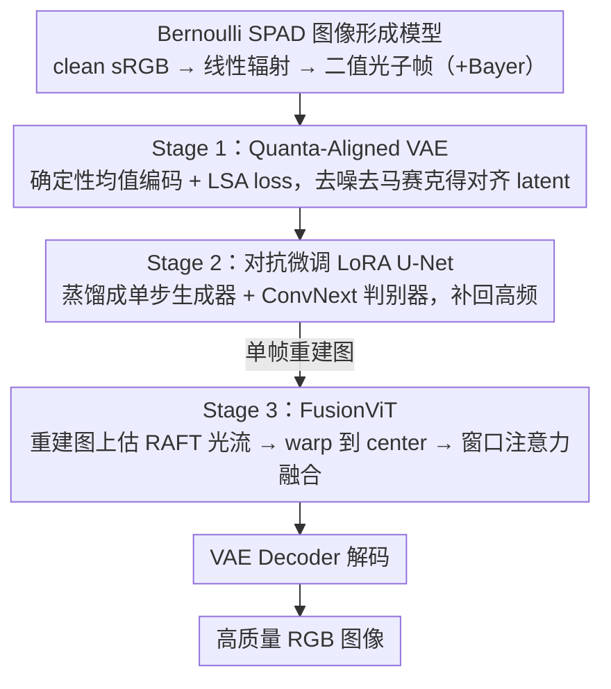

# gQIR: Generative Quanta Image Reconstruction

**会议**: CVPR 2026  
**arXiv**: [2602.20417](https://arxiv.org/abs/2602.20417)  
**代码**: [GitHub](https://github.com/Aryan-Garg/gQIR)  
**领域**: 图像生成 / 图像重建 / 计算成像  
**关键词**: 单光子传感器, 扩散模型, 图像重建, burst imaging, VAE对齐

## 一句话总结

将大规模 text-to-image latent diffusion model 适配到单光子雪崩二极管（SPAD）的极端光子受限成像场景，通过三阶段框架（Quanta-aligned VAE → 对抗微调 LoRA U-Net → FusionViT 时空融合）实现从稀疏二值光子检测到高质量 RGB 图像的重建，在 10K-100K fps 极端条件下显著超越所有现有方法。

## 研究背景与动机

**领域现状**：SPAD 单光子传感器能在传统相机失败的极低光照和高速场景中成像，但每个像素仅记录二值光子检测（有/无光子到达），单帧数据极度稀疏且噪声主导。现有方法主要分两类：(1) 经典视觉方法如 QBP，通过块匹配+帧对齐+Wiener 滤波重建；(2) 学习方法如 QUIVER 和 QuDI，用光流估计+循环融合或时间条件 U-Net 处理 burst 序列。

**现有痛点**：
- 经典方法在光子极度稀缺时运动估计不可靠，且缺乏语义先验导致高频细节丢失
- 学习方法虽引入 learned modules，但任务特定、从零训练，未利用大规模预训练生成模型的结构和语义知识
- 所有现有方法在极端形变或超高速运动（>10K fps）下严重退化
- color SPAD 的 Bayer mosaic 进一步加剧稀疏性，每个颜色通道光子事件更少

**核心矛盾**：大规模 T2I 扩散模型拥有强大的自然图像先验，但它们假设连续高斯噪声，而 SPAD 数据服从离散 Bernoulli 分布、噪声远超常规摄影——朴素微调会导致 encoder 崩溃（catastrophic forgetting）和 shortcut learning。

**本文切入角度**：不从零训练，而是通过精心设计的分阶段适配策略，将 Stable Diffusion 的结构先验迁移到 quanta 域。关键观察：VAE encoder 直接微调会因 SPAD 的极端噪声而退化为常数输出，必须引入 latent space 对齐约束来防止崩溃。

**核心 idea**：三阶段模块化框架——先对齐 latent space 处理 Bernoulli 统计特性，再蒸馏扩散先验为单步生成器增强感知质量，最后在 latent space 做 burst 级时空融合。

## 方法详解

### 整体框架

输入为 SPAD 传感器的 binary photon frames（或其 aggregated 3-bit nano-burst），输出为高质量 RGB 图像。训练数据由一条物理一致的 Bernoulli SPAD 图像形成模型从 clean 图像合成而来。Pipeline 分三个顺序训练的阶段：Stage 1 训练 quanta-aligned VAE encoder 实现去噪+去马赛克；Stage 2 对抗训练 LoRA U-Net 增强感知保真度；Stage 3 训练 FusionViT 在 latent space 做 burst 级时空融合。每个阶段冻结前序模块的参数。

### 关键设计

**1. Bernoulli SPAD 图像形成模型：把 clean 图像物理一致地"打碎"成单光子观测**

整套方法要在合成数据上训练，但 SPAD 的统计特性和普通摄影完全不同，所以第一步是搭一条物理一致的前向模拟链，否则训出来的模型在真实传感器上会失配。clean sRGB 图像 $x_{gt}$ 先经 gamma 校正回到线性辐射空间 $x_{lin}=x_{gt}^{2.2}$，再让每个像素的光子检测服从 Bernoulli 分布：

$$x_{spad} = \mathrm{Bern}\!\left(1 - e^{-\alpha \cdot x_{lin}}\right)$$

其中 $\alpha$ 控制每像素期望光子数（PPP），训练统一取 $\alpha=1.0$（PPP≈3.5）。对 color SPAD 还要叠一层随机 Bayer pattern，得到 mosaiced 的二值帧；$N$ 帧平均后是 $\log_2(N+1)$ bit 的观测。这条 Bernoulli（而非高斯）链是后面所有技术选择的源头——正因为噪声离散、强度依赖、又远超常规摄影，朴素套用现成的扩散修复方法才会失败。

**2. Stage 1 — Quanta-Aligned VAE：让 encoder 在极噪输入下仍吐出"对齐 clean 图"的 latent**

直接拿 SD 的 VAE encoder 去微调适配 SPAD 输入，会塌成一个常数映射：不管输进什么都给出近似相同的 latent。原因是现有修复方法（SUPIR/DiffBIR）用同一个可训练 encoder 同时产生监督信号和预测，在极端噪声下这条捷径会被迅速学到。本文冻结 decoder $\mathcal{D}$、只微调 encoder $\mathcal{E}_{\phi^*}$，并做两处关键修改来切断捷径。一是**确定性均值编码**：不从后验采样，直接取均值 $\mu_\phi(x_{lq})$，避免 Bernoulli 噪声把方差进一步放大。二是 **Latent Space Alignment (LSA) loss**，拿一个冻结的预训练 encoder 去编码 GT 当对齐目标：

$$\mathcal{L}_{lsa} = \big\|\mu_{\phi^*}(x_{lq}) - \mu_\phi(x_{gt})\big\|_2^2$$

注意第二项的 $\mu_\phi$ 是冻结副本，监督端不再随训练漂移，encoder 没法靠"两端一起退化"作弊——这正是它和 SUPIR/DiffBIR 那种可训练 encoder 目标的本质区别。总损失 $\mathcal{L}=\lambda_{lsa}\mathcal{L}_{lsa}+\lambda_{MSE}\mathcal{L}_{MSE}+\lambda_{perc}\mathcal{L}_{perc}$，这一阶段同时把去噪和去马赛克做掉。

**3. Stage 2 — 对抗微调 LoRA U-Net：把多步扩散蒸馏成单步生成器补回高频**

Stage 1 对齐后的重建偏平、缺细节，而 SPAD 的 10K–100K fps 又意味着数据量巨大，跑多步扩散采样根本不现实。于是这里把扩散 U-Net 蒸馏成单步生成器：用 LoRA adapter 初始化生成器 $\mathcal{G}_{lora}$（继承扩散权重，保证初始梯度小、不破坏先验），配一个多层 ConvNext-Large 判别器 $\mathcal{V}_\theta$，按标准 min-max GAN 对抗训练：

$$\min_\phi \max_\theta\ \mathbb{E}[\log \mathcal{V}_\theta(x)] + \mathbb{E}\big[\log(1-\mathcal{V}_\theta(\mathcal{G}(x)))\big]$$

总损失再加感知项和像素项 $\mathcal{L}=\mathcal{L}_{adv}+\mathcal{L}_{perc}+\|\mathcal{D}(\mathcal{G}_{lora}(\mu_{\phi^*}(x_{lq})))-x_{gt}\|_2^2$。这样既保住了预训练生成知识，又把推理压到单步、满足超高帧率的实时需求。代价是会引入轻微内容漂移，留给 Stage 3 收拾。

**4. Stage 3 — FusionViT：在 latent space 对齐并动态融合 burst，换回保真度与时域稳定**

单帧重建再好也用不上 burst 序列里的时间冗余，而朴素的 flow-warp + 平均一遇运动就糊。FusionViT 的关键是把对齐和融合都搬到 latent space，并绕开"在噪声帧上估光流"这个坑。具体地，先用 Stage 1+2 把每帧都重建出来 $Y=\mathcal{D}(\mathcal{G}_{lora}(\mathcal{E}_{\phi^*}(X_{lq})))$，在这些**重建图**上跑预训练 RAFT 估光流（直接在 noisy SPAD 上估会因域差距严重失败），再把所有 burst latent 按光流 warp 到 center frame。融合用一个 pseudo-3D miniViT $\mathcal{F}$，以亚二次复杂度的窗口注意力跨时间和空间轴做自适应加权——根据运动幅度和到 center 的距离决定每帧贡献多少，而不是一视同仁地平均。输出以一个可学习标量 $\delta$（初始 0.05）残差加回 center latent $z_{T/2}$。这一阶段损失 $\mathcal{L}_{fusion}=\|\mathcal{F}(\mu_{\phi^*}(X_{lq}))-\mu_\phi(x_{gt})\|_2^2+\text{pixel MSE}+\mathcal{L}_{perc}$，最终把保真度和时域稳定性一起抬上去。

### 一个完整示例：一段 burst 怎么走完三阶段

以 burst 模式为例。传感器先吐出 77 帧二值光子帧，每 7 帧平均成一个 3-bit nano-burst，得到 11 个 nano-burst（即 11 帧输入）。每一帧分别过 Stage 1 的 quanta-aligned encoder 拿到对齐 latent，再过 Stage 2 的单步 LoRA 生成器，解码出 11 张各自带高频细节、但帧间略有内容漂移的重建图。FusionViT 在这 11 张重建图上用 RAFT 估光流，把 11 个 latent 全部 warp 到第 6 帧（center），用窗口注意力按运动幅度加权融合，再以 $\delta=0.05$ 残差贴回 center latent，最后 decode 出一张时域稳定、细节锐利的 RGB——这一步把单帧 ~27 dB 的量级抬到 burst 的 ~30 dB。

### 损失函数 / 训练策略

三阶段渐进训练，每阶段冻结前序模块：
- **Stage 1**：8×A100，600K steps，$\lambda_{lsa}=0.1, \lambda_{MSE}=10^3, \lambda_{perc}=2$
- **Stage 2**：单张 RTX 4090，100K iterations，256×256，$\lambda_{adv}=0.5, \lambda_{MSE}=500, \lambda_{perc}=5$
- **Stage 3**：FusionViT 仅 20K steps，使用 RAFT 光流（在 FlyingThings3D 预训练）

训练数据：281 万图像 + 44,575 个视频，涵盖图像超分、人脸、视频去模糊等多种数据源。3-bit nano-burst 由 7 帧二值帧平均得到；burst 模式使用 11 个 3-bit nano-burst（共 77 帧二值帧）。

## 实验关键数据

### 主实验

**单帧 3-bit 重建（334 张测试图像，384×384）**：

| 方法 | PSNR↑ | SSIM↑ | LPIPS↓ | ManIQA↑ | ClipIQA↑ | MUSIQ↑ |
|------|-------|-------|--------|---------|----------|--------|
| InstantIR | 10.79 | 0.178 | 0.651 | 0.187 | 0.346 | 36.65 |
| ft-Restormer | 28.73 | 0.816 | 0.294 | 0.262 | 0.435 | 40.44 |
| ft-NAFNet | 28.28 | 0.830 | 0.261 | 0.300 | 0.473 | 39.13 |
| qVAE (Stage 1) | 28.18 | **0.863** | 0.327 | 0.299 | 0.487 | 44.90 |
| **gQIR (S1+S2)** | 27.28 | 0.839 | **0.318** | **0.331** | **0.547** | **45.61** |

**Burst 重建（极端运动场景）**：

| 数据集 (fps) | QBP PSNR/SSIM | QUIVER PSNR/SSIM | **Burst-gQIR PSNR/SSIM** |
|-------------|---------------|-------------------|--------------------------|
| XVFI (1000) | 12.01 / 0.370 | 23.00 / 0.751 | **25.82 / 0.712** |
| I2-2000fps (2000) | 16.04 / 0.549 | 25.06 / 0.874 | **31.21 / 0.878** |
| XD (2K-100K) | 12.78 / 0.409 | 20.10 / 0.790 | **30.33 / 0.895** |
| **累计** | 13.38 / 0.448 | 22.43 / 0.814 | **29.83 / 0.856** |

**I2-2000fps 完整测试集**：Burst-gQIR 达到 30.81 dB PSNR / 0.868 SSIM，超越前 SOTA QuDI (28.64 dB) **+2.17 dB**。

### 消融实验

**Stage 1 设计选择消融**：

| 配置 | PSNR↑ | SSIM↑ | LPIPS↓ |
|------|-------|-------|--------|
| w/o 确定性编码 (A) | 20.56 | 0.435 | 0.167 |
| w/o LSA loss (B) | 10.39 | 0.222 | 0.139 |
| w/o (A) + (B) | 10.30 | 0.218 | 0.136 |
| **完整 Stage 1** | **24.78** | **0.665** | **0.194** |

**三阶段渐进提升 - 保真度 vs 时域稳定性**：

| 阶段 | PSNR↑ | SSIM↑ | $E^*_{warp}$↓ |
|------|-------|-------|-------------|
| Alignment (S1) | 20.04 | 0.759 | 9.088 |
| Perceptual (S2) | 24.11 | 0.846 | 8.508 |
| **Fidelity (S3)** | **27.63** | **0.869** | **8.005** |

### 关键发现

- **LSA loss 是 Stage 1 成功的关键**：去掉 LSA 后 PSNR 从 24.78 暴跌到 10.39（接近随机输出），encoder 退化为常数映射——验证了 Bernoulli 噪声下 latent space 对齐的必要性
- 确定性编码也很重要，去掉后 PSNR 降 ~4 dB，但影响小于 LSA
- Stage 2 的对抗训练在提升感知质量的同时略微增加了内容漂移（content drift），但 Stage 3 的时空融合有效缓解了这一问题
- 在极端运动数据集 XD 上，gQIR 相对 QBP 提升 **+17.5 dB**，体现了生成先验在 out-of-distribution 场景的巨大优势
- 在真实 color SPAD 数据上无需 dark count 或 hot pixel 校正即可重建出照片级质量，仅需灰世界白平衡

## 亮点与洞察

- **首次将大规模 T2I 扩散先验成功迁移到单光子成像**：这是一个噪声统计完全不同的域（Bernoulli vs Gaussian），关键突破在于发现并解决了 encoder collapse 问题
- **冻结预训练 encoder 做 LSA 对齐目标的设计非常巧妙**：对比 SUPIR/DiffBIR 的做法，他们用同一个可训练 encoder 同时生成 supervision 和 prediction，在极端噪声下这会导致退化——本文用冻结副本切断了这条 shortcut 路径
- **三阶段解耦设计各有侧重**：S1 解决域适配（结构+色彩）、S2 增强感知（高频细节）、S3 利用时域信息（稳定性+保真度），职责清晰且可独立优化
- **在重建域而非噪声域做光流估计**的 pre-denoising 策略绕过了 SPAD 数据上光流估计失败的问题

## 局限与展望

- 固定 PPP=3.5 训练，在极低光照（PPP≤1）下鲁棒性受限——将 PPP 作为 conditioning signal 显式建模可能提升泛化性
- 预训练 VAE decoder 8-bit 输出限制了 SPAD 原生的 HDR 能力，开发 HDR-capable decoder 是重要方向
- Stage 2 的 content drift 虽被 Stage 3 缓解但未根本解决，视频级扩散先验可能进一步改善时域一致性
- 当前 Stage 3 依赖 RAFT 光流，在超大运动下仍可能失败，可探索 latent space 内的隐式对齐
- 仅在合成数据上定量评估，真实 SPAD 数据缺乏 GT 参考

## 相关工作与启发

- **vs QBP**: QBP 是经典 align-and-merge 管线（块匹配+Wiener 滤波），在光子充足时有效但缺乏语义先验。gQIR 将 align-and-merge 哲学推广到 latent space，用 FusionViT 替代简单平均，在极端运动下优势巨大（+17.5 dB）
- **vs QUIVER/QuDI**: QUIVER 用 SpyNet 光流+循环融合，QuDI 用时间条件 U-Net。两者都是任务特定训练且不利用预训练生成先验。gQIR 在 I2-2000fps 上超 QuDI +2.17 dB
- **vs SUPIR/DiffBIR（通用图像修复）**: 这些方法也微调 VAE encoder 适配退化输入，但在 Bernoulli 噪声下直接崩溃。gQIR 的 LSA loss + 冻结 encoder 目标是专门针对 SPAD 极端噪声的关键改进
- 三阶段解耦训练的思路可迁移到其他非标准噪声模型的传感器修复任务（如 event camera、量子传感器）

## 评分

- **新颖性**: ⭐⭐⭐⭐ 首次将 T2I diffusion 适配到 quanta imaging，发现并解决了 encoder collapse 的关键问题
- **实验充分度**: ⭐⭐⭐⭐ 合成+真实数据、单帧+burst、多 fps 级别、完整消融，还贡献了首个 color SPAD burst 数据集和 XD benchmark
- **写作质量**: ⭐⭐⭐⭐ 物理模型和方法动机交代清晰，encoder collapse 的分析可视化直观
- **价值**: ⭐⭐⭐⭐ 为计算成像领域引入生成先验开辟新方向，代码+数据集开源

<!-- RELATED:START -->

## 相关论文

- [\[CVPR 2026\] RecTok: Reconstruction Distillation along Rectified Flow](rectok_reconstruction_distillation_along_rectified_flow.md)
- [\[CVPR 2026\] VOSR: A Vision-Only Generative Model for Image Super-Resolution](vosr_a_vision_only_generative_model_for_image_super_resolution.md)
- [\[CVPR 2026\] FaithFusion: Harmonizing Reconstruction and Generation via Pixel-wise Information Gain](faithfusion_harmonizing_reconstruction_and_generation_via_pixel-wise_information.md)
- [\[CVPR 2026\] From Inpainting to Layer Decomposition: Repurposing Generative Inpainting Models for Image Layer Decomposition](from_inpainting_to_layer_decomposition_repurposing_generative_inpainting_models_.md)
- [\[ECCV 2024\] NeuSDFusion: A Spatial-Aware Generative Model for 3D Shape Completion, Reconstruction, and Generation](../../ECCV2024/image_generation/neusdfusion_a_spatial-aware_generative_model_for_3d_shape_completion_reconstruct.md)

<!-- RELATED:END -->
