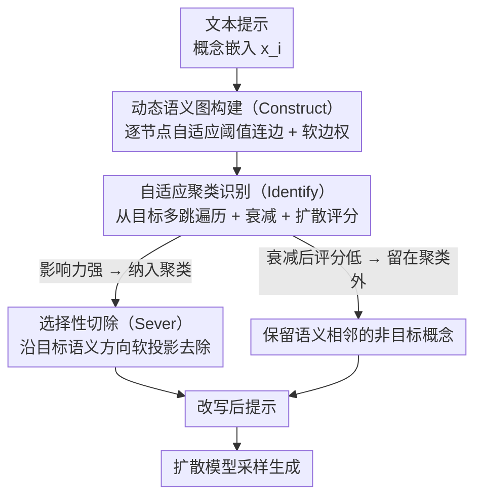

# GrOCE: Graph-Guided Online Concept Erasure for Text-to-Image Diffusion Models

**会议**: CVPR 2026 Highlight  
**arXiv**: [2511.12968](https://arxiv.org/abs/2511.12968)  
**代码**: 有  
**领域**: 图像生成  
**关键词**: 概念擦除, 扩散模型, 语义图, 免训练, 在线推理

## 一句话总结
GrOCE 提出基于动态语义图的免训练概念擦除框架，通过构建语义图→自适应聚类识别→选择性切除三个协同组件，实现对文本到图像扩散模型中目标概念的精确、上下文感知的在线移除。

## 研究背景与动机
1. **领域现状**：文本到图像扩散模型频繁产生有害、偏见或侵权内容。概念擦除旨在移除目标内容的同时保留非目标语义。
2. **现有痛点**：（i）基于微调的方法计算成本高、存在灾难性遗忘、难以适应新兴风险；（ii）推理时干预方法依赖启发式映射，无法捕捉深层语义纠缠。两类方法都将概念视为孤立实体，忽略了潜空间中丰富的关系结构。
3. **核心矛盾**：扩散模型中概念以纠缠的流形形式编码，概念之间存在模糊边界和高阶依赖。移除一个概念（如"暴力"）可能损害语义相邻概念（如"冲突""动作"）。
4. **本文目标**：设计免训练的在线概念擦除方法，能理解和利用概念间的语义关系，实现精确的目标擦除而不损害邻近概念。
5. **切入角度**：将概念擦除重新表述为图上的切割问题——识别并移除连接到目标概念的最小顶点子集。
6. **核心idea**：构建概念间的动态语义图，通过多跳遍历和扩散评分识别目标概念聚类，然后从提示嵌入中选择性切除该聚类的语义成分。

## 方法详解

### 整体框架
GrOCE 要解决的是：在不微调扩散模型、也不依赖人工写死的"敏感词→替换词"映射表的前提下，把一个目标概念（比如"暴力"）从文本提示里干净地抹掉，同时别误伤它的语义邻居（"冲突""动作"这些）。它的关键观察是——概念在潜空间里不是孤立的点，而是彼此牵连的一张网，所以擦除不该逐词处理，而应该当成"在图上切掉与目标相连的一小块顶点"这件事来做。

整条流水线在推理时一次走完，分三步：先从当前提示的上下文化嵌入**临时搭出一张语义图**（Construct），再从目标概念出发**在图上找出和它纠缠在一起的那一簇概念**（Identify），最后**从提示嵌入里把这一簇对应的语义方向投影掉**（Sever），把改写后的提示喂给扩散模型。整个过程没有任何梯度、没有重训练，对每个提示重新建图，所以叫"在线"。

### 关键设计

**1. 动态语义图构建（Construct）：为当前提示临时搭一张反映概念密度的语义网络**

擦除要"看关系"，前提是先有一张能反映关系的图。GrOCE 把提示里每个概念嵌入 $x_i$ 当成一个节点 $v_i$，两节点的余弦相似度超过阈值才连边，边权按相似度软化：

$$w_{ij} = \exp\!\big(-(\tau_i - \langle x_i, x_j\rangle)/\sigma\big)$$

关键的巧思在阈值不是全局写死的，而是逐节点自适应——$\tau_i = \tau_0 + \lambda\cdot\text{std}$，其中 std 是该节点局部邻域相似度的标准差。这样做是因为嵌入空间各处的密度并不均匀：在概念扎堆的稠密区域，方差小、阈值被抬高，连边更保守，避免把一大片无关概念糊成一团；在稀疏区域阈值放低，连边更积极，不至于漏掉真正的关联。每来一个提示就重建一次图，所以图始终贴合当前语境，而不是套用一张静态字典。

**2. 自适应聚类识别（Identify）：顺着图把和目标隐式纠缠的概念都揪出来**

光靠关键词匹配只能命中字面相同的词，抓不住"bear → grizzly → polar bear"这种隔着几跳的隐式关联。GrOCE 从目标概念节点出发做**多跳遍历**，每多走一跳就乘一个相似度衰减因子，越远的邻居影响力越弱，从而圈定目标的语义辐射范围；与此同时用一个**扩散评分**来量化每个被触及邻居对目标的语义影响力，影响力够强的才纳入。两者结合，最终收敛出一簇紧凑的、真正与目标纠缠的概念集合，而不是把整张图都算进去。

> ⚠️ 多跳衰减系数与扩散评分的具体公式以原文为准。

**3. 选择性切除（Sever）：把目标那一簇的语义方向投影掉，别动正交的部分**

找到目标聚类后，直接把这些词从提示里删掉会破坏句子的全局结构，生成质量也跟着塌。GrOCE 改用**图引导的软投影**：在提示嵌入中估计出目标聚类所张成的语义方向，把嵌入沿这些方向的分量投影去除，同时近似保留与之正交的语义方向。直观地说，就是只在"目标语义"那几个轴上做减法，其余轴原封不动，于是非目标语义和整句结构的连贯性都被保住。改写后的提示在扩散推理开始前注入模型，正常采样即可。

### 一个完整示例

以提示"a violent fight scene"、目标概念"violence"为例走一遍：

1. **Construct**：把 violent / fight / scene 等概念嵌入连成图，fight 与 violent 相似度高、落在稠密区，阈值被抬高后两者仍连上强边；scene 与 violent 关系弱，软边权很小。
2. **Identify**：从 violence 出发多跳遍历，一跳命中 fight（影响力高，纳入），再一跳触及 conflict/action 等隐式邻居——衰减后扩散评分已偏低，被判定为"语义相邻但非目标"，**留在聚类之外**；最终聚类只收紧到 {violence, fight}。
3. **Sever**：把提示嵌入沿 {violence, fight} 张成的方向投影掉，scene 所在的正交方向保留，得到一个语义上"去暴力、但仍是一个打斗动作场景结构"的提示，再交给扩散模型生成。

这条例子说明了为什么图视角重要：conflict/action 这类邻居恰恰是逐词过滤最容易误删、而 GrOCE 靠衰减+评分把它们挡在聚类外的地方。

### 损失函数 / 训练策略
完全免训练，仅在推理时操作，不需要梯度访问，也不重训练或改动模型权重。

## 实验关键数据

### 主实验

| 数据集/任务 | 指标 | GrOCE | ConAbl | AdaVD | 说明 |
|------------|------|-------|--------|------|------|
| 概念擦除 | CS↓ | SOTA | 次优 | - | 擦除更彻底 |
| 非目标保真 | FID↓ | SOTA | - | 次优 | 非目标损害更小 |
| 运行时间 | 秒 | ~0.1 | ~数十秒 | ~数秒 | 数量级加速 |

### 消融实验

| 配置 | 关键指标 | 说明 |
|------|---------|------|
| Full GrOCE | 最优 | 三组件完整 |
| w/o 图引导 | 下降 | 退化为简单关键词过滤 |
| w/o 多跳遍历 | 下降 | 无法捕捉高阶关联 |
| w/o 自适应阈值 | 下降 | 全局阈值不够精确 |

### 关键发现
- GrOCE在擦除准确性和非目标保真度上同时达到SOTA，证明图引导方法比孤立处理更优。
- 运行时间比训练方法快数量级，支持真正的在线概念移除。
- 语义图揭示了概念间的层次关系和共现模式，提供了可解释性。

## 亮点与洞察
- **图视角的引入**将概念擦除从"逐个处理"升级为"结构化推理"，是方法论层面的提升。
- **免训练+在线**的特性使其能快速适应新出现的有害概念，实际部署价值高。
- 语义图本身具有可解释性——不仅知道擦除了什么，还知道为什么。

## 局限与展望
- 仅处理文本可触达的概念，对纯视觉概念（如特定姿态-光照组合）无法处理。
- 假设概念在嵌入空间中线性可分，对非凸概念区域可能失效。
- 聚类识别的阈值和衰减参数需要调优。

## 相关工作与启发
- **vs ESD/CA**: 需要微调模型权重，计算昂贵且存在遗忘。GrOCE完全免训练。
- **vs AdaVD**: 假设线性可分性，对非凸区域失效。GrOCE通过图结构捕捉更复杂的关系。
- **vs UCE**: 推理时干预但假设稳定激活模式，重述提示时可能失效。GrOCE的图结构更鲁棒。

## 评分
- 新颖性: ⭐⭐⭐⭐⭐ 图引导的概念擦除是全新范式
- 实验充分度: ⭐⭐⭐⭐ 多任务验证（卡通概念/艺术风格），效率对比充分
- 写作质量: ⭐⭐⭐⭐⭐ 数学形式化清晰，问题定义严谨
- 价值: ⭐⭐⭐⭐⭐ AI安全领域的重要贡献，实际部署价值高

<!-- RELATED:START -->

## 相关论文

- [\[CVPR 2026\] Neighbor-Aware Localized Concept Erasure in Text-to-Image Diffusion Models](neighbor-aware_localized_concept_erasure_in_text-to-image_diffusion_models.md)
- [\[CVPR 2026\] Prototype-Guided Concept Erasure in Diffusion Models](prototype-guided_concept_erasure_in_diffusion_models.md)
- [\[CVPR 2026\] Beyond Text Prompts: Precise Concept Erasure through Text–Image Collaboration](beyond_text_prompts_precise_concept_erasure_through_text-image_collaboration.md)
- [\[AAAI 2026\] Mass Concept Erasure in Diffusion Models with Concept Hierarchy](../../AAAI2026/image_generation/mass_concept_erasure_in_diffusion_models_with_concept_hierarchy.md)
- [\[CVPR 2026\] Erasing Thousands of Concepts: Towards Scalable and Practical Concept Erasure for Text-to-Image Diffusion Models](erasing_thousands_of_concepts_towards_scalable_and_practical_concept_erasure_for.md)

<!-- RELATED:END -->
