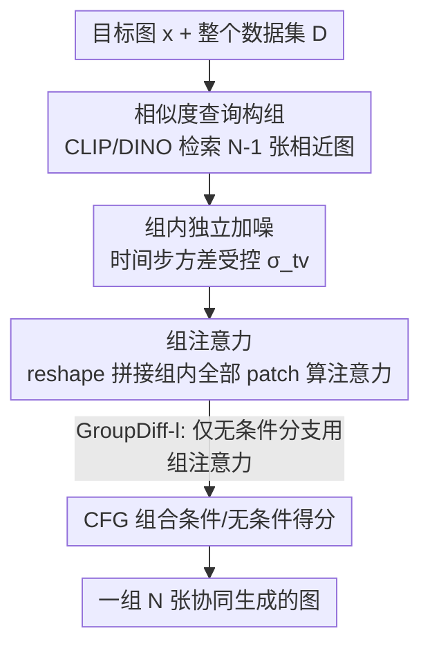

# Group Diffusion: Enhancing Image Generation by Unlocking Cross-Sample Collaboration

**会议**: CVPR 2026  
**论文**: [CVF Open Access](https://openaccess.thecvf.com/content/CVPR2026/html/Mo_Group_Diffusion_Enhancing_Image_Generation_by_Unlocking_Cross-Sample_Collaboration_CVPR_2026_paper.html)  
**代码**: [项目页](https://sichengmo.github.io/GroupDiff/)  
**领域**: 扩散模型 / 图像生成  
**关键词**: 跨样本注意力, 组扩散, 扩散 Transformer, 表示学习, FID  

## 一句话总结
扩散模型在推理时一直是逐张独立生成的，本文让一组语义相近的图像在去噪时通过**跨样本注意力**互相"参考"对方的 patch，仅靠重排 token 这一改动就在 ImageNet-256 上把 SiT-XL/2 的 FID 提升了 32.2%。

## 研究背景与动机
**领域现状**：扩散 Transformer（DiT / SiT）已是高保真图像生成的主流，注意力机制让同一张图内的 patch 相互交互、产生连贯输出。训练时网络用 batch 学分布，但**推理时图像永远是一张张独立生成的**——一个 batch 里不同图之间的 patch 各算各的，从不交流。

**现有痛点**：把生成质量往上推的近期工作大多走"表示对齐"路线（REPA 用 SSL 模型蒸馏特征、Dispersive Loss 直接在生成表示上加自监督目标），都是想给单张图一个更强的内部表示，但本质上仍把每张图当孤岛处理，忽略了 batch 内样本之间天然存在的语义关联。

**核心矛盾**：训练时模型见过"一批相关图像应该长什么样"，推理时却把这种相互参照的能力丢掉了——独立采样意味着每张图只能靠自己的 patch 找对应关系，缺了"邻居"这一路免费的监督信号。

**本文目标**：让一组样本在推理时协同去噪，使每张图能选择性地从组内其他图借鉴 patch 级的对应关系，从而整体提升生成质量。

**切入角度**：作者观察到大规模 T2I 扩散模型本身就编码了稳健的跨图语义对应（"狗耳朵"能匹配到另一张狗图的"耳朵"）。既然单图内 patch 能互相帮，那把注意力的视野从"图内 patch"扩到"组内所有图的 patch"，理应让模型学到 intra + inter 双重对应。

**核心 idea**：把扩散的"逐张去噪"改成"逐组去噪"——用双向注意力打通组内所有图像的 patch，让样本之间协作完成一次生成（cross-sample collaboration）。

## 方法详解

### 整体框架
GroupDiff 的全部改动可以浓缩成一句话：**把注意力从一张图的 patch 扩展到一组相关图的全部 patch**。训练时，对每张目标图 $x$，先用一个查询函数从数据集里捞回若干语义/视觉相近的图，凑成一个大小为 $N$ 的组 $X\in\mathbb{R}^{N\times H\times W\times3}$；这组图各自加噪（但组内时间步方差受控）后送进 DiT/SiT，在注意力层把组内 token 拼到一起算注意力，让每个 patch 都能"看到"组内别的图。推理时，用户对同一个条件 $c$ 一次生成 $N$ 张相互依赖的图，组内样本在去噪过程中彼此辅助。

关键在于这个"组注意力"实现起来极其轻量——不改网络结构、不加参数，只是在标准的多头自注意力前后各做一次 token 的 reshape：把隐状态从 $\mathbb{R}^{N\times L\times C}$ 拍平成 $\mathbb{R}^{1\times(NL)\times C}$ 再算注意力，算完 reshape 回去（$L$ 是单图 patch 序列长度，$C$ 是通道）。

### 关键设计

**1. 组注意力：把注意力视野从图内 patch 扩到组内全部 patch**

这是整个方法的心脏，针对"推理时图像各自为政、用不上 batch 内邻居"这个痛点。标准 DiT 的注意力只在单图 $L$ 个 patch 之间算；GroupDiff 把组内 $N$ 张图的隐状态 $h$ 从 $\mathbb{R}^{N\times L\times C}$ reshape 成 $\mathbb{R}^{1\times(NL)\times C}$，让 $Attention(\cdot)$ 在 $NL$ 个 patch 上做**双向**注意力，算完再 reshape 回 $\mathbb{R}^{N\times L\times C}$。这样一个"狗耳朵" patch 既能 attend 到自己图里的耳朵，也能 attend 到组内别的狗图的耳朵，模型同时学到 intra-image 和 inter-image 对应。为了让模型分得清哪个 patch 属于哪张图，作者给每张图的所有 patch 加同一个可学习的 sample embedding。这套做法的妙处在于零结构改动——仅靠 reshape 就把"协作"塞进了现成的注意力算子里。

**2. 相似度查询构组：让组内图像"真的相关"，注意力才有东西可借**

跨样本注意力要有用，前提是组里的图确实语义相关，否则注意力只是在一堆不相干的图之间瞎看。作者定义查询函数从数据集 $D$ 里挑回与 $x$ 相似度超过阈值的图：

$$q(x; D; \tau_{img}) = \{x_i \in D \mid \text{sim}(x, x_i) \geq \tau_{img}\}$$

其中 $\text{sim}(\cdot)$ 用预训练模型（CLIP / DINO）的图像嵌入余弦相似度，实验里取 $\tau_{img}=0.7$。训练时从这些候选里随机抽 $N-1$ 张和原图 $x$ 凑成组。实验证明这一步至关重要：随机构组的 FID（带 CFG）约 3.57，几乎和 baseline 持平；换成相似度构组直接降到约 2.4。而且换不同编码器（CLIP-L、DINOv2、SigLIP、I-JEPA）效果都差不多，说明收益来自"语义一致"本身，而不是某个特定编码器的风格——这也意味着方法对预训练编码器的质量不挑食。

**3. GroupDiff-l：只给无条件分支上组注意力，把计算开销压到接近 baseline**

直接对条件和无条件两个分支都跑组注意力（作者记为 GroupDiff-f）虽然有效，但训练/推理都更贵。作者注意到一个工程上的巧合：CFG 按惯例只用 10% 的数据训练无条件模型。于是 GroupDiff-l **只对无条件分支用大组**，条件分支保持组大小为 1（即标准单图），这样 90% 的训练和标准扩散完全一样，开销几乎不增。推理时两个变体的 CFG 组合方式不同——GroupDiff-f 两个得分都来自组注意力：

$$\tilde{e}_\theta(X_t; t, c) = e_\theta(X_t; t, c) + s\cdot\big(e_\theta(X_t; t, c) - e_\theta(X_t; t, \emptyset)\big)$$

GroupDiff-l 只让无条件得分走组注意力、条件得分逐张算：

$$\tilde{e}_\theta(X_t; t, c) = \{e_\theta(X_t^i; t, c)\}_{i=1}^n + s\cdot\big(\{e_\theta(X_t^i; t, c)\}_{i=1}^n - e_\theta(X_t; t, \emptyset)\big)$$

有意思的是，实验发现**只训无条件分支的组注意力，条件分支的生成能力也跟着变好**——作者推测是无条件模型学到的更强表示通过权重共享隐式增强了条件模型。GroupDiff-l 在质量和成本间取得了好的平衡，全文默认 GroupDiff 即指 GroupDiff-l。

**4. 组内噪声方差：让"干净样本"帮"含噪样本"，进一步激发跨样本注意力**

如果组里每张图都加同样强度的噪声，跨样本注意力的激励还不够强。作者借鉴"不同噪声级是有效的表示学习增强"这一观察，让组内其他样本的噪声级相对第一张图浮动一个范围（如 50 或 200 个时间步），即采样时控制组内时间步方差在阈值 $\sigma_{tv}$ 内。直觉是：含噪更重的样本会更想从组内较干净的样本里借信息，从而强化跨样本注意力。实验显示噪声方差设在 50–200 区间时 FID 和 linear probe 准确率都更好，跨样本注意力也更强。

### 损失函数 / 训练策略
训练目标就是把标准扩散的逐张去噪损失改成对整组求和：

$$\mathcal{L}_{Group} = \mathbb{E}_{X, E\sim\mathcal{N}(0,I), t}\Big[\sum_{i=1}^{N}\|\epsilon_i - e_\theta(X, t, c)_i\|_2^2\Big]$$

即组内每张图都预测自己那份噪声、各算 L2 后求和。实现上严格沿用 DiT/SiT 的架构与数据流程，AdamW、常数学习率 $1\times10^{-4}$、weight decay 0.01，全局 batch size 固定 256（调组大小时保持总 batch 不变以公平比较），用 Stable Diffusion 的 VAE 把 $256\times256$ 图编码到 $z\in\mathbb{R}^{32\times32\times4}$。

## 实验关键数据

### 主实验
在 ImageNet 256×256 上与主流生成系统对比（Table 4，FID 越低越好）。`*` 表示在预训练权重上再训 100 epoch：

| 方法 | Epoch | FID ↓ | IS ↑ | 备注 |
|------|-------|-------|------|------|
| DiT-XL/2 | 1400 | 2.27 | 278.2 | baseline |
| + GroupDiff-4 | 800 | 1.66 | 279.4 | 仅用 57% 迭代，FID 降 ~29% |
| + GroupDiff-4* | 1400+100 | 1.55 | 285.4 | 仅加 100 epoch |
| SiT-XL/2 | 1400 | 2.06 | 270.3 | baseline |
| + GroupDiff-4 | 800 | 1.63 | 283.2 | FID 降 ~30% |
| + GroupDiff-4* | 1400+100 | **1.40** | 290.7 | 无蒸馏下 SOTA |
| SiT-XL/2 + REPA-E | 800 | 1.26 | 314.9 | 带语义蒸馏 |
| + GroupDiff-4* | 800+100 | **1.14** | 315.3 | 叠加蒸馏后再降 |

从头训时 GroupDiff 用更少迭代就把 DiT/SiT 的 FID 降了约 29–30%；在带语义特征蒸馏（REPA-E）的强基线上再叠加，FID 还能从 1.26 进一步降到 1.14，说明组注意力带来的增益和表示蒸馏是**互补**的。

### 组件与构组消融
Table 1（DiT-XL/2 训 800K 步，带 CFG 的 FID）：

| 配置 | 构组方式 | 噪声方差 | FID ↓ | 跨样本注意力分 ↑ |
|------|---------|---------|-------|------------------|
| C=1, UC=1（baseline） | — | 0 | 3.50 | — |
| C=1, UC=2 | CLIP-L | 0 | 2.92 | 0.00% |
| C=1, UC=4 | CLIP-L | 0 | 2.42 | 19.95% |
| C=1, UC=8 | CLIP-L | 0 | 2.14 | 51.13% |
| C=1, UC=16 | CLIP-L | 0 | **1.86** | 56.47% |
| C=1, UC=4 | Random | 0 | 3.57 | 23.17% |
| C=1, UC=4 | Class | 0 | 2.81 | 22.51% |
| C=1, UC=4 | CLIP-L | 100 | 2.32 | 23.33% |

### 关键发现
- **组越大越好（scaling effect）**：组大小从 2→4→8→16，FID 从 2.92 一路降到 1.86，跨样本注意力分从 0% 升到 56%。作者推测大组提供了更多 patch 级匹配的选择空间。
- **构组质量决定一切**：随机构组（FID 3.57）几乎等同 baseline，相似度构组（~2.4）才有质变；类别构组（2.81）居中。值得注意的是随机构组**没有把 baseline 弄差**，说明组注意力是安全的增量。
- **跨样本注意力强度 ≈ 生成质量**：作者定义跨样本注意力分 $S_{cross} = (P_{cross\text{-}max} - P_{cross\text{-}mean})/P_{cross\text{-}max}$ 衡量注意力是否集中到最相似的那张邻居图（接近 1=聚焦单一邻居，接近 0=均匀分散）。它与 FID 的相关系数高达 **r=0.94**——越聚焦于最相似邻居，生成质量越高。
- **早期时间步 + 浅层最关键**：跨样本注意力主要发生在去噪早期（构建全局结构时）和网络浅层。中后期关掉组注意力几乎不掉点（Table 2：只在 0.0–0.4 阶段用组注意力 FID-10K 反而从 4.21 降到 3.92），但去掉浅层 1–9 层的组注意力会灾难性崩溃（FID 飙到 294.38）。这意味着 GroupDiff 可以只在早期/浅层用组注意力来**省算力**。

## 亮点与洞察
- **改动小到离谱、收益大到反常**：核心实现只是注意力前后各一次 token reshape，不加任何参数、不改网络结构，却能把强基线 FID 再降 20–32%。这种"几乎零成本"的改动是最容易迁移的工程红利。
- **GroupDiff-l 的偷懒很聪明**：抓住 CFG"只有 10% 数据训无条件分支"这个事实，把昂贵的组注意力只压在无条件分支，90% 训练保持原样，却通过权重共享让条件分支也免费变强——这是把"协作"成本降到接近零的关键。
- **把"协作"量化成可解释指标**：$S_{cross}$ 不仅能解释为什么 GroupDiff 有效（聚焦最相似邻居 = 高质量），而且 r=0.94 的相关性说明这是个可以指导设计的可靠信号，而非事后叙事。
- **连接表示学习与生成建模的新视角**：跨样本交互可被看作一种**隐式监督**，和显式的特征蒸馏（REPA）互补叠加——为"扩散模型如何学更强表示"提供了一条不依赖外部 SSL 教师的新路。

## 局限与展望
- 作者指出当组足够大时，GroupDiff 有望扩展到**跨条件/多样化输入**的协同生成（Figure 7 的换类实验已初步验证高注意力样本对生成影响更大），但目前实验主要在同条件、同类别组内，跨条件能力还只是方向性展望。
- ⚠️ 推理时一次要生成一整组、且组注意力在 $NL$ 个 patch 上算，理论上注意力复杂度随组大小增长（虽然作者用"早期/浅层才用组注意力"来缓解），大组下的显存/算力开销原文未给出完整量化，实际部署成本需谨慎评估。
- 评测集中在 ImageNet 类条件生成，未涉及文生图等更复杂条件；构组依赖训练集内能检索到足够相似样本，对长尾类别或开放域条件是否仍奏效有待验证。
- 收益依赖"同条件下用户本来就想要多张输出"这一应用假设；若用户只要一张图，是否还值得跑整组协同，存在权衡。

## 相关工作与启发
- **vs REPA / REPA-E / Dispersive Loss**：它们靠把生成表示对齐到预训练 SSL 模型（或显式加自监督目标）来增强单图表示；GroupDiff 不需要外部教师，靠组注意力**隐式**学 inter+intra 对应。且二者互补——叠在 REPA-E 上 FID 还能从 1.26 降到 1.14。
- **vs 多视角/风格化组生成/视频生成的 mutual attention**：那些工作也用跨图注意力，但目标是建模图间对应关系本身（多视角一致、风格统一）；GroupDiff 的目的是**用组内关系反过来提升每张图的单图质量**，是把跨样本对应当作生成质量的增益来源，而非最终产物。
- **vs 标准 DiT/SiT**：GroupDiff 完全沿用其架构与超参，只在注意力层加一次 reshape，因此可作为现成扩散 Transformer 的即插即用增强。

## 评分
- 新颖性: ⭐⭐⭐⭐⭐ "推理时让样本协作"是前人没碰过的信号，视角新且自洽
- 实验充分度: ⭐⭐⭐⭐ 组大小/构组/噪声/层与步的消融很扎实，但大组算力开销缺完整量化
- 写作质量: ⭐⭐⭐⭐⭐ 动机—机制—指标—验证一气呵成，$S_{cross}$ 与 FID 的相关性把"为什么有效"讲透了
- 价值: ⭐⭐⭐⭐⭐ 零结构改动即插即用、与表示蒸馏互补，工程落地性强

<!-- RELATED:START -->

## 相关论文

- [\[CVPR 2026\] Enhancing Spatial Understanding in Image Generation via Reward Modeling](enhancing_spatial_understanding_in_image_generation_via_reward_modeling.md)
- [\[CVPR 2026\] Curriculum Group Policy Optimization: Adaptive Sampling for Unleashing the Potential of Text-to-Image Generation](curriculum_group_policy_optimization_adaptive_sampling_for_unleashing_the_potent.md)
- [\[CVPR 2026\] Beyond Text Prompts: Precise Concept Erasure through Text–Image Collaboration](beyond_text_prompts_precise_concept_erasure_through_text-image_collaboration.md)
- [\[CVPR 2026\] CTCal: Rethinking Text-to-Image Diffusion Models via Cross-Timestep Self-Calibration](ctcal_rethinking_text-to-image_diffusion_models_via_cross-timestep_self-calibrat.md)
- [\[CVPR 2026\] A Style is Worth One Code: Unlocking Code-to-Style Image Generation with Discrete Style Space](a_style_is_worth_one_code_unlocking_code-to-style_image_generation_with_discrete.md)

<!-- RELATED:END -->
