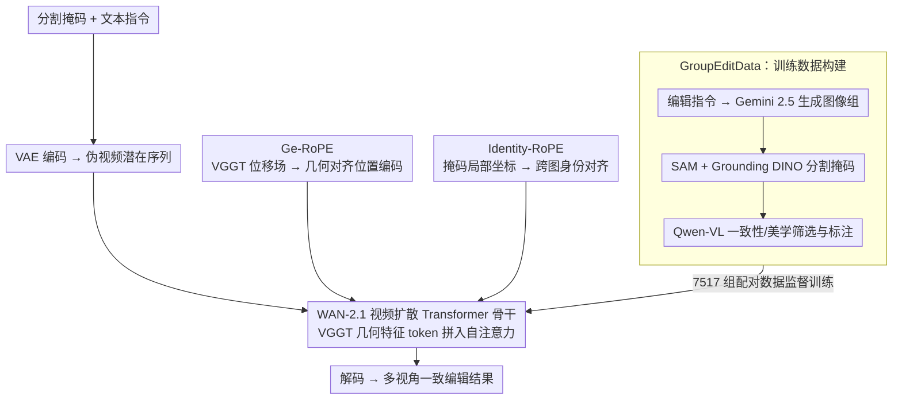

# Group Editing: Edit Multiple Images in One Go

**会议**: CVPR 2026  
**arXiv**: [2603.22883](https://arxiv.org/abs/2603.22883)  
**代码**: [https://group-editing.github.io/](https://group-editing.github.io/)  
**领域**: 扩散模型 / 图像编辑  
**关键词**: 多图一致编辑, 视频扩散先验, 几何对应, RoPE位置编码, 伪视频

## 一句话总结
本文提出 GroupEditing，将一组相关图像重构为伪视频帧，结合 VGGT 提供的显式几何对应和视频模型的隐式时序先验，通过 Ge-RoPE 和 Identity-RoPE 两种增强位置编码实现跨视角一致的群组图像编辑，在视觉质量、编辑一致性和语义对齐上显著优于现有方法。

## 研究背景与动机

1. **领域现状**：现有图像编辑方法（如 InstructPix2Pix、ControlNet 等）主要聚焦单图编辑，在虚拟内容创作、数字商务等场景中，用户经常需要对同一主体的多视角图像进行一致修改，例如将数字角色的衣服统一换色、对商品多角度图进行统一风格化。
2. **现有痛点**：逐图编辑会导致外观和结构的不一致；基于优化的传播方法（如先编辑一张再传播）泛化能力差、容易产生伪影；无优化方法（如 Edicho）依赖语义对应和跟踪工具，只能处理少量图像。
3. **核心矛盾**：在几何复杂场景（如目标发生旋转、遮挡、形变）中，仅靠注意力特征的语义匹配不够精确——"识别不同视角下的左眼"或"跟踪 T 恤上旋转 30° 的 logo"对现有方法来说非常困难。
4. **本文目标**：如何在一组几何多样的相关图像中建立可靠的跨图对应关系，实现一次指令、多图一致编辑？
5. **切入角度**：作者做了两个关键观察——(1) 隐式对应：视频模型天然具有时序一致性先验，将图像组视为"伪视频"可继承该先验；(2) 显式对应：仅靠视频模型的隐式对应在几何复杂场景下不够，需要 VGGT 提供的密集几何匹配作为补充。
6. **核心 idea**：将多图编辑问题转化为伪视频生成问题，融合显式几何对应（VGGT）与隐式时序先验（视频扩散模型），通过专门设计的位置编码注入对应信息。

## 方法详解

### 整体框架
要解决的问题是：给一组同主体、不同视角的图像加一条编辑指令（比如"把 T 恤换成红色"），要让所有图改得一致而不是各编各的。GroupEditing 的核心转换是把这组图当成一段"伪视频"——既然视频模型天生懂得让相邻帧保持一致，那把多图按时间维度排成序列，就能"白嫖"这份时序一致性先验。整条链路是：分割掩码 + 文本指令进来，先用 VAE 把每张图编码进潜在空间并按时间排成伪视频序列，送进基于 WAN-2.1 视频扩散模型的 Transformer；骨干里注入两套增强位置编码——Ge-RoPE 管跨视角的几何对齐、Identity-RoPE 管目标的身份保持；同时 VGGT 抽出的显式几何特征 token 被拼到潜在序列里一起参与自注意力。最后解码出多视角一致的编辑结果。这里的关键判断是：光靠视频模型的隐式对应在几何复杂场景（旋转、遮挡、形变）下不够稳，所以要再喂一份 VGGT 的显式几何匹配作补充。

### 关键设计

**1. GroupEditData：先把"多图编辑"这件事的训练数据从零造出来**

多图一致编辑此前根本没有大规模配对数据，这是它一直停留在零样本/传播方法的根本原因，所以论文先把数据这块基础设施补上。流水线是全自动的四步：用 Gemini 2.5 按人工写的编辑指令生成图像组（18248 组），用 SAM + Grounding DINO 对目标做分割拿到掩码，再用 Qwen-VL-Max 同时做一致性评估和美学评估筛掉低质量样本，最终留下 7517 组。每组都带齐图像、掩码、整图描述和分割区域描述，足以支撑后面的训练监督。这条"文本→生成→筛选→标注"的流水线本身也能迁到其他缺配对数据的任务上。

**2. Ge-RoPE：把 VGGT 的显式几何对应直接灌进位置编码里**

视频模型的隐式对应在几何复杂场景下不够准——它能大致知道两帧相似，却说不清"A 图里这个像素到底对应 B 图哪个像素"。Ge-RoPE 的做法是从 VGGT 取出像素级位移场 $\Delta(h,w) = (\Delta_h, \Delta_w)$，缩放到潜在空间分辨率后用高斯核平滑（$\mu=21, \sigma=11$）以优先保留高置信度的匹配，再把平滑后的位移加回原始空间网格索引，得到一张 warped 网格：

$$\tilde{h} = h + \Delta_h^{\text{smooth}}$$

然后用最近邻去索引预计算好的频率 bank，生成几何感知的 RoPE。这样位置编码本身就携带了"A 图位置 $(h,w)$ 对应 B 图哪个位置"的信息，比如 T 恤上旋转了 30° 的 logo，在不同视角里会被对齐到同一套相位上。它的巧处在于只动位置编码、不去改注意力权重，是一种轻量却直接的几何注入方式。

**3. Identity-RoPE：让同一个目标跨图共享同一套位置信号**

同一目标在不同视角里往往落在画面的不同位置，标准位置编码只看绝对坐标，于是会把"左上角的猫脸"和"右下角的猫脸"当成两个不相干的东西，身份就散了。Identity-RoPE 借分割掩码找到每张图里目标的最小外接矩形 $\mathcal{R}_t$，把矩形内像素坐标平移成相对于矩形原点的局部坐标：

$$(\tilde{h}, \tilde{w}) = (h - y_1^{(t)},\ w - x_1^{(t)})$$

这样无论目标在画面里挪到哪，"所有图中的猫脸"都会拿到同一组位置编码，模型自然把它们识别为同一身份，从而在编辑后保持外观一致。

### 损失函数 / 训练策略
在 WAN-2.1（基于 Transformer 的视频扩散模型）上训练，目标为标准的速度场预测损失。优化器 AdamW（权重衰减 0.01，学习率 $1 \times 10^{-4}$），分辨率 $528 \times 528$，batch size 8，用 8 块 A800 GPU。

## 实验关键数据

### 主实验

| 方法 | CLIP-Score↑ | Aesthetic↑ | DINO-Score↑ | 编辑一致性↑ | PSNR↑ |
|------|------------|-----------|------------|-----------|-------|
| Anydoor | 0.2728 | 4.72 | 0.7208 | 0.8697 | 0.6182 |
| OminiControl | 0.2902 | 5.10 | 0.7326 | 0.8676 | 0.6457 |
| Edicho | 0.3059 | 4.89 | 0.8080 | 0.8988 | 0.6935 |
| **GroupEditing** | **0.3122** | **5.39** | **0.8168** | **0.9239** | **0.7624** |

用户研究（1=最好，4=最差的排名）：GroupEditing 在身份一致性（1.67）、美学（1.46）、外观保真度（1.50）和综合（1.47）四个维度均排名第一。

### 消融实验

| 配置 | CLIP-Score↑ | Aesthetic↑ | DINO-Score↑ | 编辑一致性↑ |
|------|------------|-----------|------------|-----------|
| w/o VGGT | 0.2728 | 4.72 | 0.7208 | 0.8616 |
| w/o Ge-RoPE | 0.2902 | 4.89 | 0.7326 | 0.8697 |
| w/o Identity-RoPE | 0.2902 | 4.89 | 0.7326 | 0.9108 |
| Full model | **0.3122** | **5.39** | **0.8168** | **0.9239** |

### 关键发现
- VGGT 显式几何特征贡献最大：去掉后 DINO-Score 从 0.8168 降到 0.7208，编辑一致性从 0.9239 降到 0.8616
- Identity-RoPE 主要提升编辑一致性（0.9108→0.9239），对视觉质量的提升较小
- 编辑结果可直接用于 DreamBooth/LoRA 个性化和 Must3R 3D 重建，验证了跨视角一致性

## 亮点与洞察
- **伪视频重构思路非常巧妙**：将多图编辑问题转化为视频编辑问题，"免费"继承了视频模型的时序一致性先验，这是一种优雅的问题转换
- **显式+隐式对应的融合机制**：Ge-RoPE 通过位置编码注入几何信息而非修改注意力权重，是一种轻量且有效的融合方式
- **数据构建流水线的工程价值**：从文本→生成→筛选→标注的全自动流水线，可迁移到其他需要配对数据的任务中

## 局限与展望
- 训练数据来自 Gemini 生成而非真实多视角图像，可能限制在真实场景中的泛化
- 依赖 VGGT 提供的几何对应质量，当 VGGT 估计不准时编辑质量可能下降
- 分辨率固定在 528×528，对高分辨率场景的扩展未验证
- 目前需要提供分割掩码作为输入，增加了使用门槛

## 相关工作与启发
- **vs Edicho**: Edicho 用语义对应+跟踪工具做零样本一致编辑，但受限于少量图像；GroupEditing 是首个训练范式，通过数据和模型双管齐下扩展到更大规模
- **vs Frame2Frame/ChronoEdit**: 它们利用视频模型做单图编辑的时序一致性增强；GroupEditing 进一步将多图作为伪视频统一处理
- **vs ControlNet/T2I-Adapter**: 这些是通用单图条件控制方法；GroupEditing 专注于多图间的一致性约束

## 评分
- 新颖性: ⭐⭐⭐⭐ 伪视频重构+双RoPE注入的组合很有创意，但各组件并非全新
- 实验充分度: ⭐⭐⭐⭐ 定量+定性+用户研究+消融+下游应用验证，比较全面
- 写作质量: ⭐⭐⭐⭐ 逻辑清晰，图示丰富
- 价值: ⭐⭐⭐⭐ 多图一致编辑是实际需求，首个训练框架具有开创意义

<!-- RELATED:START -->

## 相关论文

- [\[CVPR 2026\] HP-Edit: A Human-Preference Post-Training Framework for Image Editing](hp-edit_a_human-preference_post-training_framework_for_image_editing.md)
- [\[CVPR 2026\] Language-Free Generative Editing from One Visual Example](language-free_generative_editing_from_one_visual_example.md)
- [\[CVPR 2026\] CARE-Edit: Condition-Aware Routing of Experts for Contextual Image Editing](care-edit_condition-aware_routing_of_experts_for_contextual_image_editing.md)
- [\[CVPR 2026\] ChordEdit: One-Step Low-Energy Transport for Image Editing](chordedit_one-step_low-energy_transport_for_image_editing.md)
- [\[CVPR 2026\] SimLBR: Learning to Detect Fake Images by Learning to Detect Real Images](simlbr_learning_to_detect_fake_images_by_learning_to_detect_real_images.md)

<!-- RELATED:END -->
