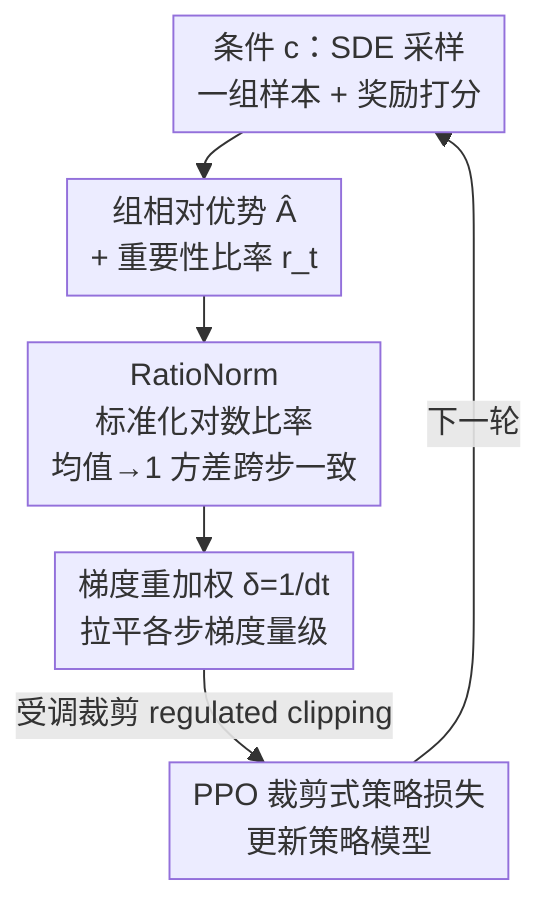

# GRPO-Guard: Mitigating Implicit Over-Optimization in Flow Matching via Regulated Clipping

**会议**: CVPR 2026  
**论文**: [CVF Open Access](https://openaccess.thecvf.com/content/CVPR2026/html/Wang_GRPO-Guard_Mitigating_Implicit_Over-Optimization_in_Flow_Matching_via_Regulated_Clipping_CVPR_2026_paper.html)  
**代码**: 未公开（论文仅提及 Project Page，无 GitHub 链接）  
**领域**: 扩散模型 / 对齐RLHF  
**关键词**: GRPO, 流匹配, 奖励过优化, 重要性比率裁剪, RLHF  

## 一句话总结
本文发现 FlowGRPO 在用 GRPO 微调流匹配模型时，重要性比率分布系统性左移且各去噪步方差不一致，导致 PPO 裁剪对"过自信的正样本"完全失效、模型陷入隐性奖励作弊；GRPO-Guard 用 RatioNorm 把比率标准化回均值 1、再用 $1/dt$ 梯度重加权均衡各步梯度，在不依赖重 KL 正则的前提下显著缓解过优化、保住生成质量。

## 研究背景与动机

**领域现状**：用 GRPO 风格的强化学习对齐扩散/流匹配模型（FlowGRPO、DanceGRPO）已成为提升美学质量、指令遵循、文字渲染的主流路线。其做法是把确定性 ODE 采样改成随机 SDE 采样引入探索噪声，对同一条件 $c$ 采一组样本，用组内相对优势 $\hat A_t^i$ 做策略更新，并靠 PPO 的"重要性比率裁剪"压住过大的策略漂移。

**现有痛点**：裁剪机制本应让比率以 1 为中心，对正负更新对称约束——比率超过 $1+\epsilon$ 时截断过自信正样本的梯度。但作者实测发现，扩散模型里比率分布并不"乖"：均值持续 **小于 1**，且方差随时间步剧烈变化。左移让正优势样本几乎进不了上裁剪区，于是过自信的正梯度被原封保留，而负样本梯度反被更狠地约束。结果就是 proxy reward（代理奖励）一路涨，但图像质量、文图一致性急剧崩坏——典型的隐性 reward hacking。

**核心矛盾**：根因是一处设计错配——扩散模型算的是高斯状态转移概率，而 GRPO 公式原本为 LLM 的离散 token 概率设计，FlowGRPO/DanceGRPO 直接照搬没做适配。高斯对数概率里的二次项给对数比率引入了一个 **与时间步相关的负偏置**，导致比率天然小于 1；而方差又被 $\sigma_t$、$dt$ 这些调度参数牵着走，高噪声步几乎不触发裁剪、低噪声步过度触发，过优化集中在某些噪声条件上。

**本文目标**：不靠"加重 KL 正则"（会同时拖慢 proxy 和 gold 分数）这种钝刀子，而是从根上修复裁剪失效，让裁剪在所有去噪步都能正常约束有害更新。

**核心 idea**：标准化对数比率 + 梯度重加权——把分布"扶正"回均值 1、方差跨步一致，再把各步梯度量级拉平，让原本失效的 PPO 裁剪重新发挥作用。

## 方法详解

### 整体框架
GRPO-Guard 不改采样、不改奖励、也不新增网络，它只是嵌在已有 GRPO 训练回路里的一个"比率与梯度调节器"。一轮训练里：先对条件 $c$ 用 SDE 采样得到一组样本并由奖励模型打分、算出组相对优势 $\hat A_t^i$；接着对每个去噪步计算重要性比率 $r_t^i(\theta)$——而 GRPO-Guard 的两处改动正是在这里介入：**RatioNorm** 先把对数比率标准化，纠正均值左移与跨步方差不一致，让 clipping 重新对正样本生效；**梯度重加权** 再用因子 $\delta=1/dt$ 把各去噪步的梯度量级拉平，避免单一噪声步主导优化。两者合起来构成论文所谓的"regulated clipping（受调裁剪）"，最后送入 PPO 裁剪式策略损失更新模型。

### 关键设计

**1. RatioNorm：把对数比率标准化，恢复裁剪对正样本的约束力**

这是全文的核心。痛点在于扩散模型里比率分布左移又跨步方差不一致，使 PPO 裁剪对过自信正样本失效。作者先把病因量化：流匹配下策略对数概率用高斯公式 $\log p_\theta(x_{t-1}|x_t,c)=-\frac{\|x_{t-1}-\mu_\theta(x_t,t)\|^2}{2\sigma_t^2 dt}-C_t$，由此推出对数比率

$$\log r_t(\theta)=-\frac{\|\Delta\mu_\theta\|^2}{2\sigma_t^2 dt}-\frac{\Delta\mu_\theta\cdot\epsilon}{\sigma_t\sqrt{dt}},\qquad \Delta\mu_\theta=\mu_{\theta_{old}}-\mu_\theta$$

对 $\epsilon\sim\mathcal N(0,I)$ 取期望得 $\mathbb E[\log r_t(\theta)]=-\frac{\|\Delta\mu_\theta\|^2}{2\sigma_t^2 dt}<0$。这个**恒为负的二次项**就是均值小于 1 的来源——和 LLM 离散 token 概率最本质的区别；而它含 $\sigma_t$、$dt$，又让方差随时间步飘。RatioNorm 的做法是对对数比率做一次标准化，乘以 $\sigma_t\sqrt{dt}$ 并补回那个负偏置项：

$$\log \hat r_t(\theta)=\sigma_t\sqrt{dt}\Big(\log r_t(\theta)+\frac{\|\Delta\mu_\theta\|^2}{2\sigma_t^2 dt}\Big)=-\Delta\mu_\theta\cdot\epsilon$$

标准化后均值趋近 0（即比率趋近 1）、且消掉了调度参数对方差的干扰，同时保留 $\Delta\mu_\theta$ 的符号与相对大小（不改变比率的语义）。这样上下裁剪界才能重新生效，正优势样本超界时能被正常截断。消融里作者把它进一步拆成两步看：仅做均值校正（Mean-revised）就已明显止住 gold 分数下滑；再叠加跨步方差对齐（完整 RatioNorm）能更彻底地压住过优化，代价是因为正向被裁的高优势比率变多、proxy 分数涨得稍慢一点。

**2. 梯度重加权（$\delta=1/dt$）：均衡各去噪步梯度，防止单步主导优化**

即便比率被扶正，策略梯度量级在各步之间仍然悬殊。作者推导 FlowGRPO 的策略梯度，其"与优势无关的梯度尺度"为 $\beta\frac{\Delta\mu_\theta+\sigma_t\sqrt{dt}\,\epsilon}{\sigma_t^2}$（其中 $\nabla_\theta\mu_\theta=(1+\tfrac{\sigma_t^2(1-t)}{2t})dt\,\nabla_\theta v_\theta$，在 FlowGRPO 的 $\sigma_t=\eta\sqrt{t/(1-t)}$ 下系数近似常数 $\beta=1+\eta^2/2$）。实测梯度量级随噪声降低单调增大，跨步差异高达约 **20×**，低噪声步梯度远大，模型于是只盯着单一噪声条件猛更新、忽略早期步的探索与多样性，把过优化逼到某一步上。施加 RatioNorm 后梯度尺度已简化到约 $\beta\,dt\,\epsilon$（接近 TempFlowGRPO 的 on-policy 重加权），但仍残留时间步系数 $dt$。本文直接补一个重加权因子 $\delta=1/dt$ 进策略损失，把尺度进一步压成约 $\beta\epsilon$，跨步差异从 20× 收到约 **2.5×**。注意 DanceGRPO 因 $\sigma_t=\eta$ 使 $\beta=1+\frac{\eta^2(1-t)}{2t}$ 不再是常数，故其重加权取 $\delta=\beta/dt$。与 TempFlowGRPO 仅加速优化、反而更早跌进过优化不同，本文的重加权目标是"均衡"而非"加速"，因此能稳住而非催熟过优化。

合并两处改动后，最终策略损失为：

$$J_{policy}(\theta)=\frac1G\sum_{i=1}^{G}\frac1T\sum_{t=0}^{T-1}\delta\,\min\!\Big(\hat r_t^i(\theta)\hat A_t^i,\ \mathrm{clip}\big(\hat r_t^i(\theta),1-\epsilon,1+\epsilon\big)\hat A_t^i\Big)$$

即把原 GRPO 损失里的 $r_t^i$ 换成标准化后的 $\hat r_t^i$、并在外层乘上 $\delta$。

### 损失函数 / 训练策略
方法不引入额外可学习参数，仅替换比率（$r_t\to\hat r_t$）并加权重因子 $\delta$，因此能直接套在 FlowGRPO/DanceGRPO 上、复用其 SDE 采样与组相对优势。作者强调这套"受调裁剪"无需依赖重 KL 正则即可缓解过优化，收敛速度可媲美 KL-free 基线。

## 实验关键数据

实验在两条基线（FlowGRPO、DanceGRPO）× 两个骨干（SD3.5-M、Flux.1-dev）上验证，覆盖 GenEval、TextRender、PickScore 三个代理任务。为度量 reward hacking，作者另构造一个仅看图像质量的复合 **gold score**（由 HPSv2、ImageReward、UnifiedReward 组成，按 base 模型归一到 1）：proxy 分数衡量"任务有没有做对"，gold 分数衡量"图还能不能看"，两者背离就是过优化的信号。

### 主实验

下表为复合 gold 分数对比（`[·]` 标注该行对应的代理任务，Average 为三项 gold 分数归一化后均值；同 step 下与基线直接对比）：

| 骨干 / 设置 | Step | 代理任务 | HPSv2 | ImageReward | UnifiedReward | Average(gold) |
|------|------|------|------|------|------|------|
| SD3.5-M（base） | - | - | 0.293 | 1.06 | 3.31 | 1.00 |
| +FlowGRPO | 1860 | GenEval [0.94] | 0.236 | 0.85 | 3.05 | 0.84 |
| **+Ours (FG)** | 1860 | GenEval [0.95] | **0.254** | **0.87** | **3.22** | **0.89** |
| +FlowGRPO | 480 | Text [0.94] | 0.274 | 0.82 | 3.07 | 0.88 |
| **+Ours (FG)** | 480 | Text [0.93] | **0.286** | **1.06** | **3.29** | **0.99** |
| Flux.1-dev（base） | - | - | 0.302 | 1.01 | 3.31 | 1.00 |
| +DanceGRPO | 1260 | PickScore [0.80] | 0.269 | 0.79 | 3.18 | 0.88 |
| **+Ours (DG)** | 1260 | PickScore [0.81] | **0.300** | **1.08** | **3.35** | **1.02** |

关键现象：基线在 proxy 分数（方括号内）几乎持平甚至略高的情况下，gold 分数普遍掉到 0.84~0.88（图崩坏）；GRPO-Guard 在保住/略升 proxy 的同时把 gold 拉回 0.89~1.02——TextRender 上从 0.88→0.99、DanceGRPO 的 PickScore 从 0.88→1.02 甚至超过 base 模型。即"分数没降、图也没崩"。

### 消融实验

在 FlowGRPO + SD3.5-M + OCR 任务、训练 480 步上逐步拆解各组件，并记录对应的对数比率形式、重加权尺度与梯度尺度：

| 配置 | log 比率形式 | 重加权 δ | 梯度尺度 | 效果 |
|------|------|------|------|------|
| Baseline | $\log r_t$ | 1 | $\beta\frac{\Delta\mu_\theta+\sigma_t\sqrt{dt}\epsilon}{\sigma_t^2}$ | 比率左移、跨步方差不一致，过优化严重 |
| Temp-Reweight | $\log r_t$ | $\sigma_t\sqrt{dt}$ | $\beta\frac{\sqrt{dt}\Delta\mu_\theta+\sigma_t dt\,\epsilon}{\sigma_t}$ | 加速优化，但更早跌进过优化、gold 骤降 |
| Mean-revised | $\log r_t+\frac{\|\Delta\mu_\theta\|^2}{2\sigma_t^2 dt}$ | 1 | $\beta\frac{\sqrt{dt}\epsilon}{\sigma_t}$ | 仅校正均值，已明显止住 gold 下滑 |
| RatioNorm | $\sigma_t\sqrt{dt}(\log r_t+\frac{\|\Delta\mu_\theta\|^2}{2\sigma_t^2 dt})$ | 1 | $\beta\,dt\,\epsilon$ | 再对齐跨步方差，更彻底压住过优化（proxy 略慢） |
| **GRPO-Guard** | 同 RatioNorm | $1/dt$ | $\beta\epsilon$ | 梯度跨步差异 20×→2.5×，最稳 |

### 关键发现
- **均值校正是止血的关键第一步**：仅做 Mean-revised 就显著缓解 gold 分数下滑，说明"比率左移导致正样本进不了裁剪区"确实是 reward hacking 的主因。
- **方差对齐与质量、收敛速度有取舍**：完整 RatioNorm 更彻底压过优化，但因正向被裁的高优势比率变多，proxy 分数涨得稍慢——稳定性换来一点收敛速度。
- **梯度重加权把跨步梯度差异从约 20× 压到约 2.5×**，避免低噪声步主导优化，从而防止过优化集中到单一噪声条件。
- **"加速"≠"变好"**：TempFlowGRPO 的重加权虽加快优化，却让模型更早进入过优化、gold 骤降，反衬出本文"均衡梯度"而非"放大梯度"的取向更安全。
- **PickScore 任务的隐蔽性**：基线在 PickScore 上 proxy 分数没明显掉，但人脸在不同种子下几乎雷同、身材比例失真——proxy 分数高不代表没作弊，凸显单一代理奖励的盲区。

## 亮点与洞察
- **把"裁剪失效"归因到高斯 vs 离散概率的根本错配**，并用一行期望推导 $\mathbb E[\log r_t]=-\frac{\|\Delta\mu_\theta\|^2}{2\sigma_t^2 dt}<0$ 解释清楚比率为何天然左移——诊断比方法本身更有启发性。
- **解法极轻**：不加网络、不加重 KL，只把 $r_t$ 换成 $\hat r_t$、损失外乘 $\delta=1/dt$，就能即插即用地套到 FlowGRPO/DanceGRPO，工程落地成本几乎为零。
- **proxy/gold 双轨度量**很值得借鉴：用一个只看质量的 gold 分数去"抓"代理奖励的作弊，是评估 RLHF 过优化的通用范式，可迁移到任何"代理奖励容易被钻空子"的对齐任务。
- **"标准化重要性比率"这一招**对其他把 PPO/GRPO 搬到连续状态空间（如视频生成、连续控制）的场景可能同样适用——只要底层是高斯转移概率，比率左移的病根就在。

## 局限与展望
- 作者自承：GRPO-Guard 缓解但**不能根除** reward hacking，因为根本瓶颈是奖励模型本身——proxy 与 gold 之间的固有差距还在。扩大奖励模型（如 RewardDance）能更逼近 gold，但算力代价大。
- ⚠️（自己观察）方差对齐会拖慢 proxy 收敛，论文未量化"稳定性—速度"取舍的最优点，实际部署时这个权衡可能需要按任务调。
- 推导基于一维高斯"without loss of generality"的简化，$\beta$ 在 FlowGRPO 下被近似成常数；不同噪声调度（如 DanceGRPO 的常数 $\sigma_t$）下系数形式不同，更复杂的调度器上是否仍稳定，论文未充分展开。
- 实验集中在文字渲染/GenEval/PickScore 等图像任务，视频生成等更长轨迹场景的有效性留待验证。

## 相关工作与启发
- **vs FlowGRPO/DanceGRPO**：它们直接照搬 LLM 的 GRPO 公式、靠重 KL 正则压 reward hacking，但 KL 会同时拖慢 proxy 和 gold；本文指出真正的病根是裁剪失效，用 RatioNorm 修复裁剪、无需重 KL，既稳又不拖慢收敛。
- **vs TempFlowGRPO**：两者都做跨步梯度重加权，但 TempFlowGRPO 的 $\sigma_t\sqrt{dt}$ 目标是加速优化，反而更早过优化；本文 $\delta=1/dt$ 目标是均衡量级（20×→2.5×），换来的是稳定而非提速。
- **vs 重 KL 正则 / 更大奖励模型 / 早停**：这些缓解过优化的传统手段要么拖慢真实分数、要么加算力、要么有欠优化风险；GRPO-Guard 走的是"修复裁剪机制本身"的轻量路线。

## 评分
- 新颖性: ⭐⭐⭐⭐⭐ 把扩散 GRPO 的 reward hacking 精确归因到高斯概率导致的比率左移，诊断深刻、解法对症
- 实验充分度: ⭐⭐⭐⭐ 两基线×两骨干×三任务 + proxy/gold 双轨 + 细致消融，但偏图像、缺视频与更多调度器验证
- 写作质量: ⭐⭐⭐⭐⭐ 公式推导清晰、分析—方法—消融逻辑闭环，图表把过优化讲得很直观
- 价值: ⭐⭐⭐⭐⭐ 即插即用、几乎零成本，对所有把 GRPO 搬到流匹配的工作都有直接借鉴意义

<!-- RELATED:START -->

## 相关论文

- [\[CVPR 2026\] Neighbor GRPO: Contrastive ODE Policy Optimization Aligns Flow Models](neighbor_grpo_contrastive_ode_policy_optimization_aligns_flow_models.md)
- [\[CVPR 2026\] DiverseGRPO: Mitigating Mode Collapse in Image Generation via Diversity-Aware GRPO](diversegrpo_mitigating_mode_collapse_in_image_generation_via_diversity-aware_grp.md)
- [\[CVPR 2026\] Stepwise-Flow-GRPO：给流匹配模型的去噪步逐步分配信用](stepwise_credit_assignment_for_grpo_on_flow-matching_models.md)
- [\[CVPR 2026\] Fine-Grained GRPO for Precise Preference Alignment in Flow Models](fine-grained_grpo_for_precise_preference_alignment_in_flow_models.md)
- [\[ICML 2026\] LithoGRPO: Fast Inverse Lithography via GRPO Reinforced Flow Matching](../../ICML2026/image_generation/lithogrpo_fast_inverse_lithography_via_grpo_reinforced_flow_matching.md)

<!-- RELATED:END -->
