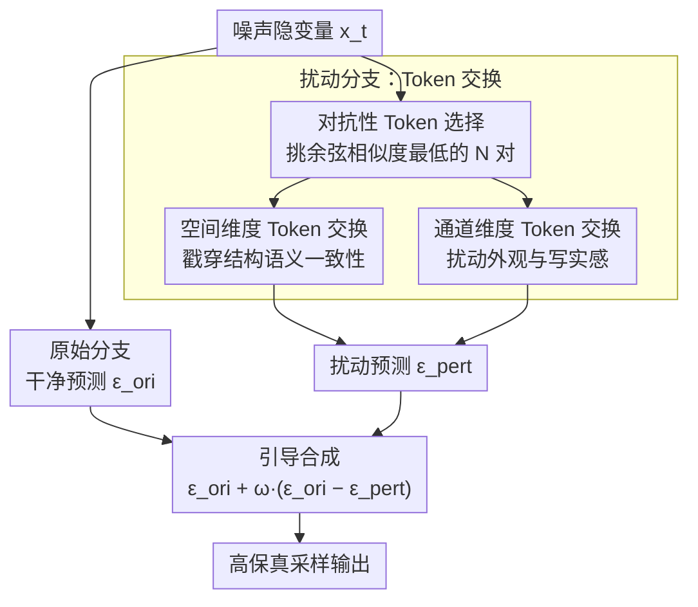

# Guiding a Diffusion Model by Swapping Its Tokens

**会议**: CVPR 2026 Oral  
**arXiv**: [2604.08048](https://arxiv.org/abs/2604.08048)  
**代码**: [https://github.com/VISION-SJTU/SSG](https://github.com/VISION-SJTU/SSG)  
**领域**: 扩散模型 / 图像生成  
**关键词**: 采样引导, 无条件引导, Token交换, 自扰动, 图像保真度

## 一句话总结
本文提出 Self-Swap Guidance (SSG)，一种无需条件信息的扩散模型采样引导方法，通过在模型中间表示空间中选择性地交换语义最不相似的 token 对来构造扰动版本，相比 SAG/PAG/SEG 等方法在更宽的引导强度范围内稳定生成高保真图像，在条件和无条件生成上均取得最优 FID。

## 研究背景与动机

1. **领域现状**：Classifier-Free Guidance (CFG) 是扩散模型生成高质量图像的关键技术，通过对比条件预测和无条件预测来引导采样方向。但 CFG 依赖文本条件，不能用于无条件生成（如逆问题求解），还容易在高引导系数下产生过饱和、多样性降低等问题。
2. **现有痛点**：近期的无条件引导方法（SAG、PAG、SEG、TSG）通过扰动模型前向过程来构造"弱化版本"，但它们都采用全局式、无差别的扰动——SAG 给输入加噪声、PAG 破坏注意力图。这种粗粒度扰动要么太弱（细节不够）、要么太强（过饱和/过简化），且对引导系数非常敏感，有效工作范围窄。
3. **核心矛盾**：需要足够强的扰动来有效引导，但又不能太强导致不可恢复的失真。现有方法缺乏对扰动粒度的精细控制。
4. **本文目标**：设计一种细粒度、可控、不引入外部噪声的扰动机制，让引导在更宽的参数范围内稳定有效。
5. **切入角度**：在 token 级别而非全局级别操作——通过交换（而非注入噪声）来扰动，这是一种保守的操作：交换只重排现有信息而不引入新信息，天然地保持全局一致性同时破坏局部结构。
6. **核心 idea**：选择性交换语义最不相似的 token 对来产生细粒度的局部扰动，替代传统的全局噪声注入式引导。

## 方法详解

### 整体框架
SSG 想解决的是：无条件引导方法靠"扰动出一个弱化版本的自己"来指方向，但现有扰动要么太粗要么太猛，引导系数稍微调大就崩。它的做法是在推理时让模型跑两个并行分支——原始分支原封不动地给出干净预测 $\epsilon_{\text{ori}}$，扰动分支在中间表示里做一次 token 交换后给出扰动预测 $\epsilon_{\text{pert}}$，然后沿两者之差把采样往"更高质量"的方向推：

$$\tilde{\epsilon}(x_t) = \epsilon_{\text{ori}}(x_t) + \omega\big(\epsilon_{\text{ori}}(x_t) - \epsilon_{\text{pert}}(x_t)\big)$$

关键就在扰动分支怎么构造。SSG 不往特征里灌噪声，而是把现有的 token 拿来"对调位置"——这是一种保守操作，只重排已有信息、不引入任何外部随机量，所以全局能量守恒、不会把图像推向不可恢复的失真。两个分支的中间预测一起前向，开销小、不需要重训。

### 关键设计

**1. 空间维度 Token 交换：在结构层面戳穿语义一致性**

针对的痛点是 SAG/PAG 那种全局扰动太钝——加噪或抹掉注意力图，破坏的是整张图而非具体结构。空间交换换个思路：给定 token 嵌入 $\mathbf{X} \in \mathbb{R}^{B \times T \times D}$，先逐 token 归一化，再算所有空间位置两两之间的余弦相似度矩阵，挑出相似度**最低**的 $N$ 个 token 对（$N$ 由交换比例 $r$ 控制），构造一个置换映射把它们成对换位，在每个 Transformer 块开头、残差相加之前执行。之所以专挑最不相似的对，是因为把"天空"和"地面"对调比把两块"天空"对调更能撕裂图像结构——同样的交换次数下破坏力更大。又因为交换是保序的、不掺外部噪声，这种破坏始终停留在"可被引导信号纠回"的范围内。

**2. 通道维度 Token 交换：补上空间交换够不到的外观属性**

空间交换动的是结构和几何关系，但颜色、纹理、材质这类全局外观它管不到。通道交换与空间交换对称实施——把相似度计算和"挑最不相似的对来换"这套操作搬到通道维度上，交换最不相似的通道嵌入，扰动的是跨通道的特征相关性，也就是整体写实感那一层。两者一个管局部结构、一个管全局外观，组合起来扰动覆盖面更全，引导信号既包含"画得对不对"也包含"画得真不真"。

**3. 对抗性 Token 选择：用最少的交换换最大的破坏**

前两点都依赖"挑最不相似的对"这个选择策略，这一点把它单独讲清楚为什么有效。灵感来自视觉 Transformer 和生成模型里的对抗性分析：在保持总信息量不变的前提下，交换语义距离最远的 token 对，等价于用最小的操作量制造最大的结构破坏。实验把三种选法摆在一起验证了这个直觉——不相似对 > 随机对 > 相似对；更说明问题的是，**连随机交换都已经大幅超过 SAG/SEG**，意味着"交换"这个动作本身就是一种独特而高效的扰动形式，对抗性选择只是在它之上再榨出一截收益。

### 损失函数 / 训练策略
SSG 是纯推理时方法，不需要任何训练。基于 PyTorch + diffusers 实现，用 Euler 离散调度器、50 步采样，在 SD1.5 和 SDXL 上验证，与 CFG 兼容，完全即插即用。

## 实验关键数据

### 主实验 — SDXL 无条件生成 (MS-COCO 2014)

| 方法 | FID↓ | IS↑ | Precision↑ | Recall↑ | AES↑ |
|------|------|-----|-----------|---------|------|
| 无引导 | 119.04 | 9.08 | 0.277 | 0.085 | 5.646 |
| SAG | 113.33 | 8.77 | 0.377 | 0.184 | 5.851 |
| SEG | 89.29 | 12.53 | 0.276 | 0.257 | 5.939 |
| PAG | 103.72 | 13.59 | 0.265 | 0.218 | 5.734 |
| **SSG** | **70.91** | **16.44** | **0.380** | **0.227** | **6.034** |

### SDXL 条件生成 (MS-COCO 2014)

| 方法 | FID↓ | CLIP↑ | IS↑ | AES↑ | PickScore↑ | IR↑ |
|------|------|-------|-----|------|-----------|-----|
| 无引导 | 45.09 | 0.281 | 21.31 | 5.671 | 20.20 | -0.847 |
| SAG | 34.14 | 0.295 | 22.95 | 5.745 | 20.64 | -0.487 |
| PAG | 26.55 | 0.306 | 29.70 | 5.820 | 21.56 | -0.003 |
| **SSG** | **21.73** | **0.313** | **34.63** | **5.902** | **22.17** | **0.276** |

### 消融实验 — Token 交换策略

| 策略 | FID↓ | CLIP↑ | IR↑ |
|------|------|-------|-----|
| SAG | 43.97 | 0.295 | -0.483 |
| PAG | 36.79 | 0.306 | 0.002 |
| 随机交换 | 32.28 | 0.312 | 0.283 |
| 相似token交换 | 28.74 | 0.309 | 0.110 |
| **不相似token交换** | 31.41 | **0.313** | **0.297** |

| 空间 | 通道 | FID↓ | IR↑ |
|------|------|------|-----|
| ✓ | ✗ | 31.96 | 0.272 |
| ✗ | ✓ | 31.30 | 0.286 |
| **✓** | **✓** | **31.41** | **0.297** |

### 关键发现
- **SSG 在无条件生成中优势最大**：FID 从 119.04 降到 70.91（降幅 40%），远超所有同类方法
- **引导系数鲁棒性**：SSG 在更宽的 $\omega$ 范围内保持良好效果，不像 SAG/PAG/SEG 那样在高引导系数下迅速退化
- **随机交换已很强**：连随机 token 交换都大幅超过 SAG/SEG，说明交换操作本身具有独特优势
- **SSG + CFG 互补**：两者操作在正交空间（token 空间 vs 条件空间），组合使用进一步提升质量

## 亮点与洞察
- **"交换而非注入"的扰动哲学**：通过重排现有信息而非注入外部噪声来构造扰动，天然保持了全局能量守恒，是一种更温和且可控的退化方式。这个idea简单而优雅
- **对抗性选择的信息论解释**：交换最不相似的 token 等价于在保持总信息量不变的前提下最大化结构破坏——用最少的操作产生最有效的引导信号
- **即插即用的工程价值**：无需训练、无需修改模型架构、兼容 CFG，直接作为插件使用。这种极低部署门槛是实际落地的关键

## 局限与展望
- 两分支并行推理仍有约 2x 的计算开销，每步需要额外的相似度计算和交换操作
- 交换比例 $r$ 和引导系数 $\omega$ 需要联合调优，虽然鲁棒性优于前人但仍有超参数
- 仅在 SD1.5 和 SDXL 上验证，未在 DiT、Flux 等新架构上测试
- 对视频扩散模型等时序生成的适用性未探索

## 相关工作与启发
- **vs CFG**: CFG 需要文本条件和训练时的 dropout；SSG 无需任何条件，可用于无条件生成，且与 CFG 互补
- **vs PAG**: PAG 用单位矩阵替换注意力图，属于全局扰动；SSG 选择性交换 token，粒度更细、更可控
- **vs SEG**: SEG 对自注意力加高斯噪声；SSG 用交换替代加噪，不引入外部随机性
- **vs SAG**: SAG 对输入图像加噪声，在高引导系数下容易引入真实噪声；SSG 的交换操作在特征空间内部闭合，不产生这个问题

## 评分
- 新颖性: ⭐⭐⭐⭐ token交换的idea简单新颖，对抗性选择策略有洞察力
- 实验充分度: ⭐⭐⭐⭐⭐ 两个模型、三个数据集、条件/无条件、丰富消融、引导模式可视化
- 写作质量: ⭐⭐⭐⭐ 逻辑清晰，可视化丰富（图2的引导模式分析特别说明问题）
- 价值: ⭐⭐⭐⭐ 即插即用的实用价值高，但属于增量式改进

<!-- RELATED:START -->

## 相关论文

- [\[CVPR 2026\] Guiding a Diffusion Transformer with the Internal Dynamics of Itself](guiding_a_diffusion_transformer_with_the_internal_dynamics_of_itself.md)
- [\[CVPR 2026\] Guiding Token-Sparse Diffusion Models](guiding_token-sparse_diffusion_models.md)
- [\[CVPR 2026\] Guiding Diffusion Models with Semantically Degraded Conditions](guiding_diffusion_models_with_semantically_degraded_conditions.md)
- [\[CVPR 2026\] Attribute-Preserving Pseudo-Labeling for Diffusion-Based Face Swapping](attribute-preserving_pseudo-labeling_for_diffusion-based_face_swapping.md)
- [\[CVPR 2026\] APPLE: Attribute-Preserving Pseudo-Labeling for Diffusion-Based Face Swapping](apple_attribute-preserving_pseudo-labeling_for_diffusion-based_face_swapping.md)

<!-- RELATED:END -->
