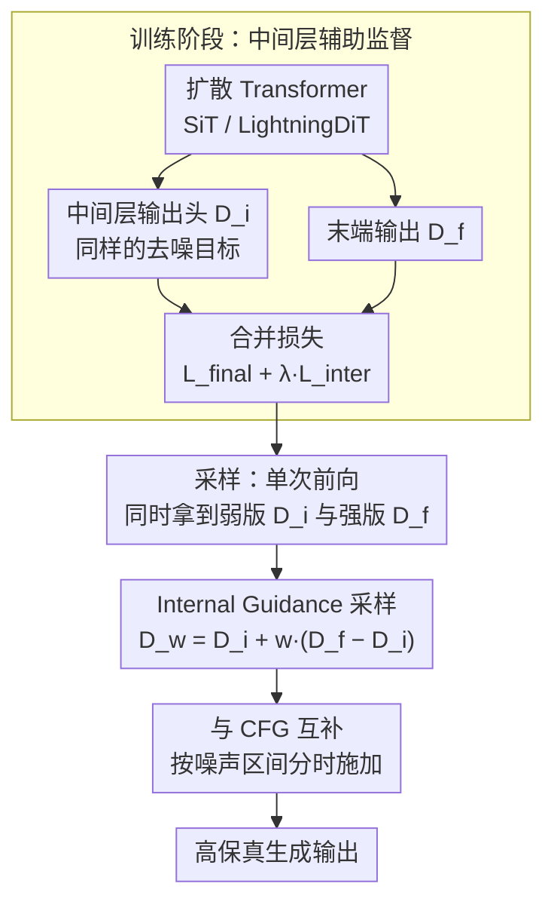

# Guiding a Diffusion Transformer with the Internal Dynamics of Itself

**会议**: CVPR 2026  
**arXiv**: [2512.24176](https://arxiv.org/abs/2512.24176)  
**代码**: [https://github.com/xy-chou/Internal-Guidance](https://github.com/xy-chou/Internal-Guidance) (项目页面)  
**领域**: 扩散模型 / 图像生成  
**关键词**: 内部引导, 中间层监督, 扩散Transformer, 采样引导, 训练加速

## 一句话总结
本文提出 Internal Guidance (IG)，通过在 Diffusion Transformer 的中间层添加辅助监督损失使其产生较弱的生成输出，然后在采样时外推中间层和深层输出的差异来实现类似 Autoguidance 的引导效果，无需额外采样步骤或外部模型训练，在 ImageNet 256×256 上将 LightningDiT-XL/1 的 FID 推至 1.34（无 CFG）和 1.19（+CFG），达到同期 SOTA。

## 研究背景与动机

1. **领域现状**：Classifier-Free Guidance (CFG) 是提升扩散模型生成质量的标准方法，通过引导样本偏向条件分布的高概率区域。但 CFG 过高时会导致过简化或失真，且会减少生成多样性。Autoguidance 等方法通过使用"模型的退化版本"做引导来维持多样性，但需要额外训练退化模型或额外采样步骤。
2. **现有痛点**：(1) CFG 在高引导系数下过度强调类条件，推向"模板图像"，降低多样性；(2) Autoguidance 需要专门训练一个更弱的模型，开销大且不灵活；(3) PAG/SEG 等方法需要精心设计退化策略且带来额外采样消耗。
3. **核心矛盾**：想要 Autoguidance 的"维持多样性同时提升质量"的效果，但不想为每种设置额外训练退化模型、也不想增加采样步骤。
4. **本文目标**：在几乎零额外开销的前提下，获得 Autoguidance 级别的生成质量和多样性提升。
5. **切入角度**：深度网络中间层的输出本身就是一个"更弱的版本"——只经过了部分 Transformer 块处理。如果在训练时让中间层也学会去噪，那采样时就天然有了"弱版本"和"强版本"的对比信号。
6. **核心 idea**：在 Diffusion Transformer 中间层加辅助监督来训练出"自带的弱模型"，采样时用中间层和最终层输出的差值做引导。

## 方法详解

### 整体框架
这篇论文想解决一个尴尬的取舍：Autoguidance 用"模型的弱版本"做引导，能在提升质量的同时保住多样性，但代价是要额外训练一个退化模型。IG 的核心观察是——深度网络本身就藏着一个现成的弱版本：只过了一半 Transformer 块的中间层输出，本来就比走完全网络的最终层输出弱。

于是训练阶段在标准扩散 Transformer（SiT、LightningDiT）的某个中间层后挂一个额外输出头，让这个中间层也学会去噪，得到一路输出 $D_i$；网络末端照常输出 $D_f$。采样阶段每一步同时拿到 $D_i$ 和 $D_f$，沿"从弱到强"的方向外推 $D_w = D_i + w(D_f - D_i)$（$w>1$ 时推离弱版本、靠向强版本），就得到了引导后的去噪结果。因为 $D_i$ 是同一次前向传播的中途产物，整套引导不需要任何额外的前向开销。

### 关键设计

**1. 中间层辅助监督：把网络中段训成一个现成的"弱模型"**

要复刻 Autoguidance 又不想多训一个模型，最省事的办法就是让网络自己长出一个弱版本。具体做法是在第 $l$ 个 Transformer 块后定义输出层 $D_i$，对它施加和最终层完全相同的去噪目标，再与主损失加权合并：

$$\mathcal{L}_{\text{inter}} = \|D_i(\mathbf{x}_t, t) - \mathbf{x}_0\|^2, \qquad \mathcal{L} = \mathcal{L}_{\text{final}} + \lambda \mathcal{L}_{\text{inter}}$$

权重 $\lambda$ 控制辅助损失强度，实验里 $\lambda \le 0.5$ 就能稳定见效。中间层只看了一半的块，去噪能力天然弱于全网络，正好充当那个"退化版本"。这一步还顺带解决了第二个问题：在网络中段插一路监督相当于给深层网络补了一道梯度，缓解了梯度消失、明显加速收敛——实验里它的提速效果甚至能和 REPA、SRA 这类复杂的自监督表征对齐方法掰手腕，而代价只是加了一行辅助损失。

**2. Internal Guidance 采样：用中间层和最终层的落差做外推**

有了弱版本 $D_i$ 和强版本 $D_f$，采样时就能直接做差值外推：

$$D_w(\mathbf{x}; \mathbf{c}) = D_i(\mathbf{x}; \mathbf{c}) + w\,\big(D_f(\mathbf{x}; \mathbf{c}) - D_i(\mathbf{x}; \mathbf{c})\big)$$

$w>1$ 时，这个式子等价于把样本从中间层那个低质量分布推开、朝最终层的高质量分布走，思路和 Autoguidance 用弱模型引导强模型如出一辙。区别在于成本：Autoguidance 的弱模型要单独训、单独前向，而 IG 的弱模型就是同一次前向中途的副产品，采样时不增加任何前向传播，几乎是白捡的引导信号。

**3. 与 CFG 互补，并按噪声区间分时施加**

IG 和 CFG 引导的是两个不同的维度，所以能叠加。CFG 是类相关的引导，把样本推向目标类别；IG 是类无关的引导，把样本推向数据流形内部、远离离群区域。论文用一个 2D 玩具实验把这层互补讲得很直观：IG 负责消除分支末端的离群点（与类别无关），CFG 负责抑制类与类之间的混淆（与类别相关），二者各管一摊。组合使用时，IG 系数压低一点、再叠上 CFG 效果最好。更关键的是两者的最佳作用时段恰好错开——IG 在高/中噪声阶段（$\sigma \in (0.3, 1)$）有效，低噪声阶段不需要；而 CFG 的甜区在中/低噪声。按噪声区间分时施加，就能让两种引导各自只在擅长的阶段发力。

### 损失函数 / 训练策略
- 训练基于 SiT 和 LightningDiT，SiT 使用标准设置，LightningDiT 改用 Muon 优化器（替代 AdamW 解决早期不稳定），EMA 权重从 0.9999 改为 0.9995
- 辅助监督放在前几层效果最好（SiT-B/2 第4层，大模型第8层）；放在后半部分反而干扰深层输出
- ImageNet-1K 256×256，VAE 编码后训练
- SDE Euler-Maruyama 250步采样（SiT/DiT）或 ODE Heun 125步（LightningDiT）

## 实验关键数据

### 主实验 — ImageNet 256×256 (无 CFG)

| 方法 | 训练轮数 | FID↓ | IS↑ |
|------|---------|------|-----|
| SiT-XL/2 | 1400 | 8.61 | 131.7 |
| REPA | 800 | 5.90 | 157.8 |
| **SiT-XL/2 + IG** | **80** | **5.31** | **147.7** |
| **SiT-XL/2 + IG** | **800** | **1.75** | **228.6** |
| LightningDiT-XL/1 | 800 | 2.17 | 205.6 |
| **LightningDiT-XL/1 + IG** | **60** | **2.42** | **173.7** |
| **LightningDiT-XL/1 + IG** | **680** | **1.34** | **229.3** |

### 加 CFG 后的 SOTA 对比

| 方法 | FID↓ | sFID↓ |
|------|------|-------|
| REPA + CFG (800ep) | 1.42 | 4.70 |
| REPA-E + CFG (800ep) | 1.26 | 4.11 |
| SiT-XL/2 + IG + CFG (800ep) | 1.46 | 4.79 |
| **LightningDiT-XL/1 + IG + CFG (680ep)** | **1.19** | **4.11** |

### 消融实验

| 消融项 | FID↓ | IS↑ | 说明 |
|--------|------|-----|------|
| SiT-B/2 基线 | 33.02 | 43.71 | 无辅助监督 |
| 辅助监督(第2层) | 30.45 | 47.97 | 前几层有效 |
| 辅助监督(第4层) | 30.60 | 47.70 | 最佳或接近最佳 |
| 辅助监督(第8层) | 38.05 | 37.97 | 后半部分反而有害 |
| +IG(第4层, w=1.5) | **19.02** | **65.06** | 引导后大幅提升 |
| +IG(w=1.9) | 17.38 | 69.12 | 无区间时最优系数 |
| +IG(w=2.3)+区间[0.3,1) | **16.19** | **72.95** | 最佳配置 |

### 关键发现
- **训练效率惊人**：SiT-XL/2 + IG 仅 80 epoch 就达到 FID=5.31，超过原版 SiT 1400 epoch 的 8.61 和 REPA 800 epoch 的 5.90
- **辅助监督位置很关键**：必须在前几层（前1/3），放在后半部分（第8/10层）反而有害
- **辅助监督本身就能加速收敛**：即使不用 IG 采样引导，仅加辅助损失的收敛效果就可媲美复杂的自监督表征对齐方法
- **IG 引导区间与 CFG 互补**：IG 应在高/中噪声施加，CFG 在中/低噪声施加，两者天然互补
- **模型越大 IG 效果越好**：相对提升随模型从 B→L→XL 增大而增大

## 亮点与洞察
- **"网络自带弱模型"的洞察极为精妙**：深度网络中间层输出天然是最终输出的弱化版本——这个观察将 Autoguidance 从"需要额外训练退化模型"简化到"加一行辅助损失"，是真正的化繁为简
- **一石二鸟的设计**：辅助监督既为采样引导提供中间输出，又缓解梯度消失加速收敛，用一个简单机制同时解决两个问题
- **引导区间的新发现**：IG 在高/中噪声有效、低噪声反而不需要，这与 CFG 的最佳区间相反。这个发现对未来组合多种引导策略很有指导意义
- **从引导到训练加速的延伸**：Section 6 展示了将 IG 的思想融入训练损失函数 $\mathbf{x}_0 + \omega \cdot \text{sg}(D_f - D_i)$ 来直接加速收敛，展示了方法的深层原理

## 局限与展望
- 辅助监督层的位置需要在不同模型上分别调优（SiT-B 用第4层、大模型用第8层）
- IG 系数 $w$、引导区间 $[\sigma_{\text{low}}, \sigma_{\text{high}}]$、辅助损失权重 $\lambda$ 三个超参数需要联合调优
- 仅在类条件 ImageNet 上验证，未在文本条件生成（如 SD、SDXL）上测试
- 中间输出头增加了少量参数（一个额外的输出层），虽然很小但对大规模分布式训练可能需要注意

## 相关工作与启发
- **vs Autoguidance**: Autoguidance 需要额外训练退化版本模型；IG 用中间层作为天然"退化版本"，零额外训练成本。两者在 2D 分布实验中效果相似
- **vs CFG**: CFG 提供类条件方向性引导（推向目标类），IG 提供类无关的流形内引导（推向数据分布高概率区）。两者互补，组合达到 SOTA
- **vs PAG/SEG/SAG**: 它们在推理时扰动注意力/输入来构造弱版本；IG 在训练时就内建了弱版本，推理时无需任何修改即可获得。更干净、更高效
- **vs REPA/SRA**: 自监督表征对齐通过复杂的预训练模型做中间层正则化；IG 的辅助监督更简单，但收敛效果可媲美这些方法

## 评分
- 新颖性: ⭐⭐⭐⭐⭐ "中间层就是弱模型"的洞察优雅而深刻，一石二鸟的设计令人赞赏
- 实验充分度: ⭐⭐⭐⭐⭐ 多模型规模、详细消融、2D可视化、训练加速延伸、SOTA结果，非常全面
- 写作质量: ⭐⭐⭐⭐ 结构清晰，2D 玩具实验的可视化解释力极强
- 价值: ⭐⭐⭐⭐⭐ FID=1.19 SOTA + 训练加速 + 即插即用，理论和实践双丰收

<!-- RELATED:START -->

## 相关论文

- [\[CVPR 2026\] Guiding a Diffusion Model by Swapping Its Tokens](guiding_a_diffusion_model_by_swapping_its_tokens.md)
- [\[CVPR 2026\] Guiding Diffusion Models with Semantically Degraded Conditions](guiding_diffusion_models_with_semantically_degraded_conditions.md)
- [\[CVPR 2026\] DiT-IC: Aligned Diffusion Transformer for Efficient Image Compression](ditic_aligned_diffusion_transformer_for_efficient.md)
- [\[CVPR 2026\] MPDiT: Multi-Patch Global-to-Local Transformer Architecture for Efficient Flow Matching](mpdit_multi-patch_global-to-local_transformer_architecture_for_efficient_flow_ma.md)
- [\[CVPR 2026\] Mixture of States: Routing Token-Level Dynamics for Multimodal Generation](mixture_of_states_routing_token-level_dynamics_for_multimodal_generation.md)

<!-- RELATED:END -->
