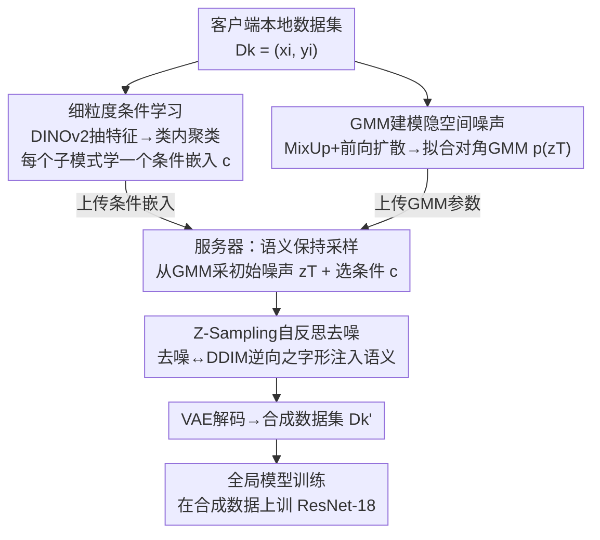

# Guiding Diffusion Models with Fine-Grained Conditions and Semantics-Preserving Sampling for One-Shot Federated Learning

**会议**: CVPR 2026  
**论文**: [CVF Open Access](https://openaccess.thecvf.com/content/CVPR2026/html/Deng_Guiding_Diffusion_Models_with_Fine-Grained_Conditions_and_Semantics-Preserving_Sampling_for_CVPR_2026_paper.html)  
**代码**: 未公开  
**领域**: 扩散模型 / 条件图像生成 / 联邦学习  
**关键词**: 单轮联邦学习, 扩散模型引导, 细粒度条件, 隐空间噪声建模, 合成数据  

## 一句话总结
针对"单轮联邦学习（OSFL）下用预训练扩散模型造数据，但条件太粗、合成数据保真度和多样性都不够"的问题，本文提出 **Espresso**：客户端先做类内聚类、为每个子模式直接学一个细粒度条件嵌入，再用 GMM 建模隐空间初始噪声分布 + Z-Sampling 自反思采样把条件语义更充分地注入生成过程，最终在 DomainNet/PACS/NICO++ 三个异构数据集上把全局模型精度刷到 SOTA。

## 研究背景与动机
**领域现状**：联邦学习（FL）让多方在不共享原始数据的前提下协同训练，但经典的 FedAvg 需要多轮模型交换、通信开销大。**单轮联邦学习（One-Shot FL, OSFL）** 把通信压到一轮：一类做法让客户端上传本地模型再做集成/蒸馏；另一类更新的做法是让客户端上传某种"引导信息"，服务器拿预训练扩散模型（Stable Diffusion）按这些信息生成一份近似客户端分布的合成数据集，再用合成数据训练全局模型。后者能借助大规模扩散先验，在服务器侧以较小信息损失重建客户端分布。

**现有痛点**：数据异构（non-IID）是 OSFL 的核心障碍——既有 label skew（客户端类别分布不同），也有 feature skew（同一类别在不同客户端长相不同，如 clipart 与 sketch）。基于扩散的 OSFL 方法（FedDEO、FedBiP 等）上传的引导信息**太简单**：通常每个类别只学一份条件，无法刻画**类内**的多种视觉模式（同是"熊"有北极熊和棕熊），导致合成数据**语义保真度低、多样性差**，全局模型自然学不好。

**核心矛盾**：一个类别内部本就有多个子分布，而"每类一份条件"的粗粒度引导把它们压成了一个，丢掉了类内差异；同时标准扩散从 $z^T\sim\mathcal N(0,I)$ 随机起步、单调去噪，没有把上传的条件信息"用足"。

**本文目标**：在不增加通信轮次的前提下，同时提升合成数据的**保真度（fidelity）** 与**多样性（diversity）**，从而提升异构场景下全局模型的泛化。

**切入角度**：作者把它拆成两件事——（1）**让引导信息更细**：在客户端做类内聚类，为每个子模式单独学一个条件嵌入；（2）**让采样过程更好地兑现这些条件**：既改"起点"（用 GMM 建模有意义的初始噪声分布），又改"路径"（用 Z-Sampling 自反思迭代注入语义）。

**核心 idea**：用"细粒度条件学习 + 语义保持采样"把客户端数据压缩成既轻量又有代表性的参数，引导冻结的扩散模型在服务器侧高保真重建各客户端分布——正如"用浓缩的 espresso 粉冲出一杯咖啡"。

## 方法详解

### 整体框架
Espresso 是一条三阶段流水线，输入是各客户端的本地数据集 $\mathcal D_k=\{(x_i,y_i)\}$，输出是训好的全局模型 $\omega$，全程只有**一轮**客户端→服务器的通信。

阶段一在**客户端本地**执行 **Fine-Grained Condition Learning**：用预训练视觉编码器（DINOv2）抽特征，对每个类别做类内聚类，为每个聚类直接优化一个条件嵌入 $c^j_{k,y}$（绕过文本编码器，直接喂进 U-Net 的 cross-attention）。同时在客户端用 **GMM 建模隐空间噪声**：把本地隐向量做 MixUp 增强、多次前向扩散到 $z^T$，再拟合一个对角协方差的高斯混合模型。客户端只上传"条件嵌入 + GMM 参数"这两份轻量信息。

阶段二在**服务器**执行 **Semantics-Preserving Sampling**：要生成客户端 $k$、类别 $y$ 的数据时，先从对应 GMM 采一个**有意义的初始噪声** $z^T$、随机选一个条件嵌入 $c^j_{k,y}$，然后在去噪过程中用 **Z-Sampling** 做"之字形"自反思迭代，把条件语义更充分地注入，最后经 VAE 解码成图像，汇成合成数据集 $\mathcal D'_k$。

阶段三是**全局模型训练**：在所有客户端的合成数据 $\{\mathcal D'_k\}$ 上训练 ResNet-18 全局模型，等价于在不接触原始数据的情况下逼近联邦目标。

### 关键设计

**1. 细粒度条件学习：用类内聚类把"每类一份条件"拆成"每个子模式一份条件"**

这一条直接针对"引导信息太粗、抹掉类内差异"的痛点。对客户端 $k$ 的每个类别 $y$，先用冻结的预训练视觉编码器 $\Phi$（DINOv2 或 CLIP image encoder）抽出特征 $f_i=\Phi(x_i)$，再对该类的特征集合做层次聚类，把数据分成 $J$ 个视觉相似的子簇 $\{\mathcal D^j_{k,y}\}_{j=1}^J$。然后**为每个子簇单独学一个条件嵌入** $c^j_{k,y}$，冻结扩散模型参数 $\theta$，只优化嵌入本身，目标与标准扩散一致：

$$\min_{c^j_{k,y}}\ \mathbb E_{t,x\sim\mathcal D^j_{k,y},\epsilon}\left[\big\|\epsilon-\epsilon_\theta\big(\sqrt{\bar\alpha_t}\,\mathcal E(x)+\sqrt{1-\bar\alpha_t}\,\epsilon,\,t,\,c^j_{k,y}\big)\big\|^2\right]$$

关键区别在于：它**不走 Textual Inversion 那条"学 token 嵌入再拼自然语言模板"的路**，而是直接学送入 cross-attention 的**整段条件嵌入**——后者表达力更强，能刻画文本难以描述的冷门风格（如 quickdraw 这种抽象涂鸦）。每个客户端最终把所有 $\bigcup_{y}\bigcup_{j}\{c^j_{k,y}\}$ 上传。代价是每类参数变多，但相比通信成本可接受，换来的是"一个类别 = 多份描述性引导"，保真度和多样性的源头就被打开了。消融里它（C）也是单独贡献最大的组件。

**2. 隐空间噪声的 GMM 建模：给去噪一个"有意义且可变"的起点**

标准扩散从 $z^T\sim\mathcal N(0,I)$ 随机起步，但近期工作发现初始噪声本身就会让生成偏向某些视觉概念。作者想直接建模客户端隐向量的初始噪声分布 $p(z^T_{k,y})$，从中采样起点。理论上可以先把 $z^0$ 建成 $M$ 个分量的 GMM，再由 $z^T=\sqrt{\bar\alpha_T}z^0+\sqrt{1-\bar\alpha_T}\epsilon$ 推出 $z^T$ 也是 GMM。但直接建模 $p(z^0)$ 维度太高、全协方差算不动，退化成对角协方差又丢掉坐标间相关性。

作者的取巧之处是：**绕过 $z^0$，直接建模 $p(z^T)$**。因为 $z^T$ 本来就被设计得接近 $\mathcal N(0,I)$、空间分布更集中，所以用**对角协方差的 GMM** 就能拟合得不错。具体做法：先对本地隐向量做 MixUp 增强得到 $z^0_{k,y,\text{mix}}$，每个再用不同的 $\epsilon$ 多次前向扩散到 $z^T_{k,y,\text{mix}}$，收集这些样本拟合 GMM，把权重/均值/协方差 $\{w^{T,m}_{k,y},\mu^{T,m}_{k,y},\Sigma^{T,m}_{k,y}\}$ 连同条件嵌入一起上传。服务器采样时就从这个分布取起点，而不是纯随机——既"有意义"（贴合客户端分布）又"可变"（提升多样性）。

**3. Z-Sampling 自反思采样：用"之字形"去噪把条件语义注得更足**

光有好起点还不够，作者还要在**去噪路径**上把条件嵌入用足。常规去噪是从 $z^T$ 到 $z^0$ 的单调路径；Z-Sampling 引入"之字形"操作：当 $t>$ 阈值 $T_z$ 时，先用**较强引导** $\gamma_1$ 把 $z^t$ 去噪到 $\tilde z^{t-1}$（往目标条件 $c^j_{k,y}$ 推），紧接着用**较弱引导** $\gamma_2<\gamma_1$ 做一步确定性 DDIM-inverse 把 $\tilde z^{t-1}$ 映回新的 $\tilde z^t$，再用 $\gamma_1$ 真正去噪到 $z^{t-1}$。其中用的就是标准 CFG：

$$\hat\epsilon_\theta(z^t,t,c^j_{k,y})=\epsilon_\theta(z^t,t,\varnothing)+\gamma\cdot\big(\epsilon_\theta(z^t,t,c^j_{k,y})-\epsilon_\theta(z^t,t,\varnothing)\big)$$

这个"去噪→逆向→再去噪"的来回利用了引导强度差 $\delta_\gamma=\gamma_1-\gamma_2$：每次往返都能在真正去噪前往 $\tilde z^t$ 里多注入一点语义，反复施加就把条件嵌入里的信息更充分地兑现到生成图上，提升语义保真度。它和设计 2 合起来构成"Semantics-Preserving Sampling"——一个管起点、一个管路径。消融显示 G 和 Z 主要通过与 C 的**协同**起效，单独加性收益不大，但叠满后达到最优。

### 损失函数 / 训练策略
- **条件嵌入学习**：冻结扩散模型，仅优化 $c^j_{k,y}$，目标即上面的 Eq.(8)（与 DDPM 训练目标同形，只是把待优化对象从 $\theta$ 换成条件 $c$）。
- **全局模型训练**：在合成数据上最小化 $\min_\omega\ \mathcal L(\omega)=\sum_{k=1}^K p_k\,\mathbb E_{\mathcal D'_k}[\mathcal L_k(\mathcal D'_k)]$，与联邦目标 Eq.(1) 同构，只是用合成集 $\mathcal D'_k$ 替代了不可见的本地集。
- **关键超参**：聚类数 $J=4$、GMM 分量数 $M=4$、Z-Sampling 阈值 $T_z=800$；扩散模型用 SD v1.5，全局模型 ResNet-18（ImageNet 预训练），每客户端生成 5× 本地数据量，16-shot 设置下本地训练 100 epoch。

## 实验关键数据

### 主实验
feature-skew 设置、16-shot、每个客户端一个 domain；全局模型为 ResNet-18，准确率（%）。Espresso 在三个数据集的平均精度上均为 SOTA。

| 数据集 | 指标 | Espresso | 之前最佳(FedBiP) | Ceiling(上界) |
|--------|------|----------|------------------|---------------|
| DomainNet | Avg Acc | **75.32** | 72.81 | 80.16 |
| Common NICO++ | Avg Acc | **82.16** | 80.54 | 86.81 |
| PACS | Avg Acc | **80.36** | 79.11 | 85.96 |

亮点 domain：DomainNet 的 quickdraw（抽象涂鸦风）上 Espresso 拿到 80.18%，远超各 baseline，说明直接学整段条件嵌入对冷门风格特别有效；但在 DomainNet 的 sketch（被 FedBiP 反超）和 PACS 的 photo（被 FedDEO 反超）上略逊，作者归因于这些常见风格扩散先验本身就强、简单引导也够用。

### 消融实验
Fig.4 的组件消融，Prompts-only 为不加任何本文组件的基线，C=细粒度条件学习、G=GMM 噪声建模、Z=Z-Sampling（数值为平均准确率 %）。

| 配置 | DomainNet | PACS | NICO++ | 说明 |
|------|-----------|------|--------|------|
| Prompts-only | 64.00 | 70.90 | 67.58 | 仅文本提示，最差 |
| C only | 73.46 | 75.30 | 80.88 | 加细粒度条件，单组件涨幅最大 |
| C + G | 73.72 | 79.86 | 81.13 | 再加 GMM 起点 |
| C + Z | 74.26 | 80.13 | 81.89 | 再加 Z-Sampling |
| Espresso (C+G+Z) | **75.32** | **80.36** | **82.16** | 三者协同最优 |

### 关键发现
- **细粒度条件学习（C）是主力**：从 Prompts-only 到仅加 C，DomainNet +9.46、NICO++ +13.30，证明"把类内子模式分开学条件"才是保真度/多样性提升的根。
- **G 和 Z 靠协同生效**：单独看 G、Z 的加性收益有限，但与 C 叠加后稳定再涨（PACS 上尤其明显），说明好起点 + 自反思路径是在"已经有细粒度条件"的前提下把语义注得更足。
- **超参敏感性**：聚类数 $J$ 越大性能越好（验证"建模类内细粒度模式有用"），$J\in[4,6]$ 是性能与嵌入数量的最佳折中；GMM 分量数 $M$ 在 2–4 后趋于平台，过少（1 个）抓不住分布、过多则分量过密低方差反而压低多样性。
- **t-SNE 分析**：FedDEO/FedBiP 的合成数据聚成过紧的簇（丢类内细节），Espresso 能把数据铺开到多个小簇，分布更贴近真实数据。

## 亮点与洞察
- **"直接建 $p(z^T)$ 而非 $p(z^0)$"很巧**：避开了高维 $z^0$ 全协方差不可算、对角协方差丢相关性的两难——因为 $z^T$ 本就贴近标准高斯、更集中，对角 GMM 即可，这是个干净的工程取巧。
- **绕过文本编码器直接学 cross-attention 条件嵌入**：相比 Textual Inversion 学 token 再拼模板，表达力更强、更能刻画 quickdraw 这类难以语言化的风格，是 OSFL 里"用足扩散先验"的关键一招。
- **把"改起点"和"改路径"解耦**：GMM 管初始噪声分布、Z-Sampling 管去噪过程的语义注入，两者正交叠加，思路可迁移到任何"用预训练扩散造代理数据"的任务（如数据蒸馏、隐私合成）。
- **类内聚类→每簇一条件**这个范式，本质是把"类级引导"升维成"子模式级引导"，对任何存在 feature skew 的生成式联邦/域泛化都有借鉴价值。

## 局限与展望
- **常见风格无优势**：在扩散先验本就很强的 sketch/photo 域上被简单方法反超，说明细粒度引导主要在"冷门/抽象风格"上吃香，收益不均匀。
- **每类参数与通信开销上升**：$J$ 个聚类 × 每簇一个条件嵌入 + GMM 参数，相比"每类一份"明显变多，作者称"可接受"但未给出与精度提升的量化权衡曲线；$J$ 越大越好也意味着上传成本随之膨胀。⚠️ 论文称开销 manageable，但缺通信量 vs 精度的明确帕累托分析。
- **依赖多个外部组件**：DINOv2 特征质量、聚类算法、SD v1.5 先验都会影响结果，迁移到与 SD 先验差距大的领域（如医学/遥感）效果存疑。
- **实验规模有限**：仅 10 类、16-shot 的小样本设置，类别数/样本量放大后聚类与 GMM 拟合是否稳定未验证；标签倾斜（label-skew）结果放在附录，正文未充分展开。

## 相关工作与启发
- **vs FedDEO**：FedDEO 让客户端上传"描述符"、去噪时部分依赖文本引导，每类一份条件，难抓类内细节与目标风格；Espresso 改为类内聚类 + 每簇直接学 cross-attention 条件嵌入，保真度与多样性都更好。
- **vs FedBiP**：FedBiP 上传"学到的概念 + 噪声隐向量"，能复现风格但常破坏物体结构、且类内差异渲染不足；Espresso 通过细粒度条件 + GMM 起点 + Z-Sampling，结构更完整、类内模式更全。
- **vs Prompts-only**：直接用 "a [domain] of a [class]" 文本提示，无法匹配目标风格也抓不住类内模式，是所有消融里的下界，反衬出客户端专属、细粒度引导的必要性。
- **vs Textual Inversion 范式**：本文不学 token 嵌入而直接学整段条件嵌入，牺牲一点参数效率换取对冷门风格的表达力——这是把通用扩散先验"对齐"到联邦本地分布的关键取舍。

## 评分
- 新颖性: ⭐⭐⭐⭐ 把"类内聚类细粒度条件 + 直接建 $p(z^T)$ 的 GMM + Z-Sampling"组合进 OSFL，单看组件多为已有技术，但针对"扩散引导太粗"的拼装与动机清晰。
- 实验充分度: ⭐⭐⭐⭐ 三数据集 + 多类 baseline + 组件/超参消融 + t-SNE/可视化齐全，但规模偏小、label-skew 与通信成本权衡未在正文充分展开。
- 写作质量: ⭐⭐⭐⭐ 动机—方法—实验链条顺畅，"espresso 冲咖啡"的比喻贴切，公式与图示清楚。
- 价值: ⭐⭐⭐⭐ 为"用预训练扩散造数据训全局模型"这条 OSFL 路线提供了可复用的细粒度引导 + 采样改进方案，对域泛化/隐私合成有迁移价值。

<!-- RELATED:START -->

## 相关论文

- [\[CVPR 2026\] Guiding Diffusion Models with Semantically Degraded Conditions](guiding_diffusion_models_with_semantically_degraded_conditions.md)
- [\[CVPR 2026\] Fine-Grained GRPO for Precise Preference Alignment in Flow Models](fine-grained_grpo_for_precise_preference_alignment_in_flow_models.md)
- [\[CVPR 2026\] Towards Fine-Grained Attribution: Instance-Aware Preference Optimization for Aligning Diffusion Models](towards_fine-grained_attribution_instance-aware_preference_optimization_for_alig.md)
- [\[CVPR 2026\] Guiding Token-Sparse Diffusion Models](guiding_token-sparse_diffusion_models.md)
- [\[CVPR 2026\] Exploring Conditions for Diffusion Models in Robotic Control](exploring_conditions_for_diffusion_models_in_robotic_control.md)

<!-- RELATED:END -->
