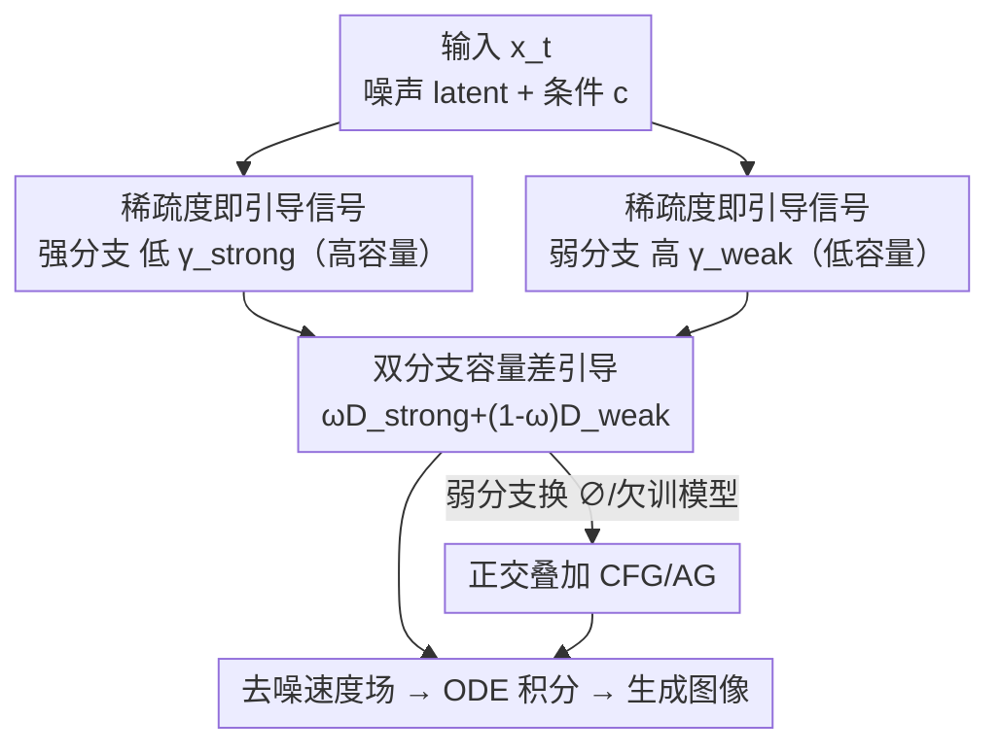

# Guiding Token-Sparse Diffusion Models

**会议**: CVPR 2026  
**论文**: [CVF Open Access](https://openaccess.thecvf.com/content/CVPR2026/html/Krause_Guiding_Token-Sparse_Diffusion_Models_CVPR_2026_paper.html)  
**代码**: https://compvis.github.io/sparse-guidance （项目页）  
**领域**: 扩散模型  
**关键词**: token稀疏, 扩散引导, 高效推理, capacity gap, 文生图  

## 一句话总结
针对"token 稀疏训练的扩散模型对 CFG 几乎不响应"这一痛点，本文提出 Sparse Guidance（SG）：在推理时用两个不同的 token 稀疏率跑出一强一弱、**都带条件**的预测，靠两者的"容量差"取代 CFG 里的无条件分支来引导生成，无需任何 dense 微调即在 ImageNet-256 上拿到 1.58 FID 并省 25% FLOPs，且在 2.5B 文生图模型上同样有效。

## 研究背景与动机
**领域现状**：扩散模型/流匹配模型在图像合成上质量很高，但训练和推理都很贵。一条降本主线是 **train-time token 稀疏**——利用视觉数据的冗余，每层只处理部分 token：要么 **masking**（丢掉一部分 token，用可学习的占位 embedding 替代，永不回填，如 MaskDiT），要么 **routing**（把一部分 token 暂时绕过若干层、之后再原样塞回，如 TREAD）。这类方法能显著提升训练吞吐、甚至收敛更快。

**现有痛点**：稀疏训练出的模型在**推理时塌方**——它们对 Classifier-free Guidance（CFG）几乎不响应。CFG 靠"条件预测 − 无条件预测"的差值来提质，但稀疏训练的模型这个差值很弱，导致生成质量上不去（见原文 Fig. 2）。社区为此不得不再加一个昂贵的 **dense 微调**阶段来"修复" CFG，这恰好抵消了稀疏训练省下的成本，也是这类方法迟迟没被广泛采用的原因。

**核心矛盾**：CFG 的引导信号来自"强预测器把弱预测器推向更低方差"。稀疏训练破坏了模型在无条件分支上的行为，于是 CFG 这个"强−弱"差值失效。但作者发现，**稀疏度本身**就是一个天然的"容量旋钮"——稀疏率越高、模型有效容量越低、条件分布越"软"。既然如此，何必去修一个被稀疏训练破坏掉的无条件分支？

**核心 idea**：不再回避稀疏训练带来的 train-test gap，而是**拥抱它**。在推理时用两个不同的 token 稀疏率 $\gamma_\text{strong} < \gamma_\text{weak}$ 跑出一强一弱两个**条件**预测，用它们之间的"容量差（capacity gap）"作为引导信号，替换掉 CFG 里那个失效的无条件分支——既恢复了强引导收益，又因为分支变稀疏而**顺带省了算力**。

## 方法详解

### 整体框架
SG 是一个 **finetune-free、即插即用的推理期调度机制**：给定一个已经用 token 稀疏训练好的扩散模型，推理时不再做"条件 vs 无条件"两次预测，而是对**同一个条件** $c$ 在**两档稀疏率**下各跑一次网络——低稀疏率得到"强（高容量）"预测、高稀疏率得到"弱（低容量）"预测——再按引导公式把弱分支朝强分支的方向放大，得到最终的去噪速度场，按 ODE 积分采样。因为弱分支处理的 token 更少，整体 FLOPs 反而比 dense CFG 低。

预备记号：流匹配下，模型 $v_\theta$ 预测从噪声到数据的速度场，沿直线插值路径 $x_t=(1-t)z+tx$ 的 oracle 速度为常量 $v^\star=x-z$；CFG 定义为 $v_\theta^\text{CFG}(c,\omega)=\omega\,v_\theta(c)+(1-\omega)\,v_\theta(\varnothing)$，对 dense 模型每步算力翻倍。SG 把其中的无条件项 $v_\theta(\varnothing)$ 换成"高稀疏率的条件预测"。

### 关键设计

**1. 把 token 稀疏度当成引导信号：用"容量差"取代失效的无条件分支**

这一设计直击"稀疏模型不响应 CFG"的根因。作者把稀疏率 $\gamma\in[0,1)$ 重新定义为一个**推理期的容量旋钮**：$\gamma$ 越大，每层处理的 token 越少、模型有效容量越低，由 $D_\theta(x_t,t,c;\gamma)$ 产生的条件分布就越"软（高方差、低锐度）"；$\gamma$ 越小则预测越锐、容量越高。关键观察是——引导最有效的场景，正是"一个高方差的预测器把一个低方差预测器推得更尖锐"。于是 SG 直接用 $\gamma$ 实例化引导：取一个高 $\gamma$ 的**弱分支**去推一个低 $\gamma$ 的**强分支**，两者的容量差就是引导信号。

注意一个陷阱：如果只是单纯在 $\omega=1$ 时把 $\gamma>0$ 加到推理里（即只稀疏、不引导），输出会随 $\gamma$ 上升而持续变差、出现视觉伪影（原文 Fig. 4）——稀疏本身是降质的。SG 的精髓是只在**引导设定下**使用这个旋钮，让稀疏带来的"降质方向"成为可被放大的、指向高质量的引导方向。具体地，测试时从二值掩码 $m\in\{0,1\}^T$、$m_k\sim\text{Bernoulli}(1-\gamma)$ 采样要处理的 token 子集。

**2. 双分支引导公式：两个预测都带条件，引导只由稀疏差驱动**

定义两档稀疏率下的预测分支（注意约束 $0\le\gamma_\text{strong}<\gamma_\text{weak}<1$）：

$$D_\theta^\text{strong}(c):=D_\theta(x_t,t,c;\gamma_\text{strong}),\quad D_\theta^\text{weak}(c):=D_\theta(x_t,t,c;\gamma_\text{weak})$$

与 CFG 最根本的区别是——**这两个预测都是条件预测**，没有无条件分支。引导信号完全来自稀疏率不同所诱导的容量差。引导公式为：

$$D_\theta^\text{SG}(c,\gamma_\text{strong},\gamma_\text{weak},\omega)=\omega\,D_\theta^\text{strong}(c)+(1-\omega)\,D_\theta^\text{weak}(c)$$

即用低容量的弱预测 $D_\theta^\text{weak}(c)$，把高容量的强预测沿 $D_\theta^\text{strong}(c)-D_\theta^\text{weak}(c)$ 方向、以幅度 $\omega$ 放大。这样既绕开了被稀疏训练破坏的无条件行为，又因为弱分支 token 数更少而省算力。原文还观察到引导尺度 $\omega$ 与稀疏度可协同：$\omega$ 越大越能容忍更高的总稀疏（$\gamma_\text{strong},\gamma_\text{weak}$），从而在保质的同时进一步提效——直觉是更高稀疏会把样本推离数据流形，而更强的 $\omega$ 恰好把这种漂移拉回来。

**3. 与 CFG / AutoGuidance 正交叠加：finetune-free 且可复利**

SG 对"条件 $c$ 怎么来"不做任何假设，因此能和已有引导技术自然叠加。把弱分支的条件置零（$\varnothing$），就得到 **CFG + SG**：

$$D_\theta^\text{CFG+SG}(c,\gamma_\text{strong},\gamma_\text{weak},\omega)=\omega\,D_\theta^\text{strong}(c)+(1-\omega)\,D_\theta^\text{weak}(\varnothing)$$

同理弱分支也可换成一个更小或欠训的 checkpoint，就接上了 **AutoGuidance（AG）**。这里 SG 额外解决了 AG 的一个老毛病：AG 需要专门多跑一段 dense checkpoint、且只有很窄的 checkpoint 窗口才好用（Karras 等建议拿出 1/16 训练步专门训辅助模型）。SG 则可以在**很宽的训练步范围**（原文测了 50k/100k/400k/800k 步，对应 2.5%/5%/20%/40%）里通过调 $\gamma_\text{strong},\gamma_\text{weak}$ 把次优 checkpoint 救回来——越早的 checkpoint 需要的 $\gamma_\text{strong}$ 越大以维持两分支分布的相对差距。整套机制**不需要任何额外微调**，只多引入 $\gamma$ 一个超参（稀疏的其它设置直接复制训练时配置）。

## 实验关键数据

### 主实验
评测主战场是 class-conditional ImageNet-256，骨干为 SiT-XL/2（在 SD VAE 的 latent 空间），Euler 采样 40 步，FID 基于 50k 样本。SG 对 masking（MaskDiT）和 routing（TREAD）两种稀疏训练都有效：

| 训练稀疏 | 引导 | #Epoch | FID↓ | sFID↓ | IS↑ | Rec.↑ |
|----------|------|--------|------|-------|-----|-------|
| masking | CFG | 160 | 5.82 | 13.00 | 227.8 | 0.45 |
| masking | **SG** | 160 | **5.73** | **11.99** | 249.0 | 0.42 |
| routing | CFG | 160 | 2.95 | 4.84 | 233.3 | 0.56 |
| routing | **SG** | 160 | **2.07** | **3.98** | 223.4 | **0.58** |

与各类引导方法横向对比（SiT-XL/2 + routing，400 epoch），SG 在 FID 和算力上同时占优——`SG_FLOPS` 比无引导 baseline 还省算力却质量更高，`SG_FID` 把 FID 压到 1.58：

| 方法 | FID↓ | GFLOPS↓ | ΔGFLOPS |
|------|------|---------|---------|
| SiT-XL/2 + routing（baseline） | 4.89 | 114.42 | 0 |
| +CFG | 2.57 | 228.84 | +114.42 |
| +AG | 2.95 | 228.84 | +114.42 |
| +APG | 2.51 | 228.84 | +114.42 |
| +ICG | 2.81 | 228.84 | +114.42 |
| **+SG_FLOPS（本文）** | 2.14 | **97.67** | **−16.75** |
| **+SG_FID（本文）** | **1.58** | 173.16 | +58.74 |

`SG_FID` 相比次优的 CFG 再降 0.99 FID（结合了 AG）；`SG_FLOPS` 在匹配质量下比 CFG 省 **58% GFLOPs**。与 SOTA 扩散模型对比时，`SG_FID` 的 1.58 FID 优于一众基线，同时比 dense guided SiT 省 24.6% 推理算力（173.16 vs 228.84 GFLOPS），且 Recall 更高（0.63），说明样本方差更大、没有塌缩。

### 消融实验

| 配置 / 现象 | 关键结果 | 说明 |
|------|---------|------|
| 只稀疏不引导（$\omega=1,\gamma>0$） | FID 随 $\gamma$ 上升持续变差 | 稀疏本身降质，必须在引导设定下用（Fig. 4） |
| 即使加 dense 微调的 CFG | 仍不及 SG | 证明 SG 是释放稀疏模型生成力的必要条件（Fig. 5） |
| routing vs masking 的可行域 | routing 更宽、更稳；masking 较窄但仍有有效走廊 | routing 保留 token 信息故对超参更鲁棒 |
| $\omega\in\{1.3,1.5,1.7,1.9\}$ | 最优 FID 基本不变，但大 $\omega$ 容忍更高稀疏 | $\omega$ 与稀疏可协同提效（Fig. 6/8） |
| AG 辅助 checkpoint（2.5%~40% 训练步） | 宽范围内都能调出近优结果 | SG 放宽了 AG 对 checkpoint 选取的苛刻要求（Fig. 7） |

### 关键发现
- **routing 比 masking 更适合做 SG 的底座**：routing 暂存并原样回填 token、保住了实例信息，使容量差更平滑可控，可行超参区间更大；masking 不可逆删 token，区间窄但仍有效。
- **稀疏率与引导尺度是协同而非对立**：更高稀疏把样本推离流形，更大 $\omega$ 把它拉回来，所以"同时调大两者"能在保质前提下进一步提速。
- **SG 抑制了 CFG 的方差塌缩**：原文用 LPIPS 显示 SG 的输出更贴近条件预测（Fig. 7 左），Recall 也更高，缓解了 CFG 把样本拉向"刻板解"的过饱和/低多样性问题。
- **规模化验证**：作者训了一个 2.5B 文生图 DiT（34 层、L2→L30 routing、50% 选择率，InternVL3-2B 当文本编码器，100M 数据两阶段训练），SG 在 HPSv3 / GenEval 上提升人类偏好与构图，同时提升吞吐——把这个 2.5B 模型的 HPSv3 提到能超过若干更大的模型（如 CogView4、PixArt-Σ 等，原文排名第 5）。

## 亮点与洞察
- **"把训练增广变成测试期引导原语"是最漂亮的一步**：别人把稀疏当训练加速的副产品、想方设法在推理时"修"它；本文反过来把稀疏度当成一个连续的"分布锐度旋钮"，让 train-test gap 从 bug 变 feature。
- **省算力是引导机制的自然副产品而非额外设计**：因为弱分支处理的 token 更少，引导的同时算力天然下降——这跟 CFG"每步翻倍"形成鲜明对比，是把"质量"和"效率"这对老冤家统一在同一个旋钮下。
- **可迁移的思路**：任何"训练时对网络做了某种容量扰动"的设定（不只 token 稀疏，也可能是 depth/width dropout、MoD 的 top-k 选择），都可能用"两档扰动强度的容量差"来构造 finetune-free 的引导信号，这个范式值得推广。

## 局限与展望
- 作者承认 masking 的可行超参区间比 routing 窄，因为不可逆删 token 会损失实例信息——对以 masking 为主的稀疏方案，SG 的收益和稳定性会打折扣。
- ⚠️ 引入了 $\gamma_\text{strong},\gamma_\text{weak}$ 两个稀疏超参，虽然作者强调可行域较宽、且只多 $\gamma$ 一个"额外"超参（其余复制训练配置），但实际部署仍需按模型/任务搜一遍 $(\gamma_\text{strong},\gamma_\text{weak},\omega)$ 三元组，文生图里还得用 HPSv3 而非 FID 来定稀疏率。
- 方法**前提是模型用 token 稀疏训练过**——对普通 dense 训练的扩散模型，没有可利用的"容量差通道"，SG 不直接适用。
- T2I 的评测主要靠 HPSv3 / GenEval 这类偏好/构图指标，缺乏 ImageNet 那样统一的 FID 横评，规模化结论的可比性需谨慎看待。

## 相关工作与启发
- **vs CFG**：CFG 用"条件 − 无条件"差值引导、每步算力翻倍，且对稀疏模型失效；SG 用"低稀疏 − 高稀疏"的容量差、两分支都带条件，绕开失效的无条件分支并顺带省算力。
- **vs AutoGuidance（AG）**：AG 用一个小/欠训模型当弱分支，但需专门多训一段 dense checkpoint、且只有很窄 checkpoint 窗口好用；SG 可叠加在 AG 上，用 $\gamma$ 把宽范围内的次优 checkpoint 救回来，放宽了 AG 的苛刻约束。
- **vs ICG（Independent Condition Guidance）**：ICG 也想免训练干预地做引导，但 SG 实测 FID 更低，作者据此论证"引入测试期稀疏来最小化 train-test gap"比 ICG 的思路更有效。
- **vs 训练期稀疏（MaskDiT / TREAD）**：这些方法只在训练用稀疏、推理时还得回到 dense 并依赖 dense 微调修 CFG；SG 把稀疏一路用到推理，既当引导信号又当提速手段，让稀疏训练真正闭环可用。

## 评分
- 新颖性: ⭐⭐⭐⭐⭐ "把训练稀疏增广重定义为推理期引导旋钮"是一个反直觉且自洽的新视角
- 实验充分度: ⭐⭐⭐⭐ ImageNet 多 baseline 横评 + 消融充分，2.5B T2I 规模化也做了，但 T2I 缺统一 FID 横评
- 写作质量: ⭐⭐⭐⭐ 动机—公式—实验链条清晰，符号统一；部分图表细节需对照原文
- 价值: ⭐⭐⭐⭐⭐ 直接打通"稀疏训练省成本但推理塌方"的最后一公里，质量与效率同向提升，实用性强

<!-- RELATED:START -->

## 相关论文

- [\[CVPR 2026\] Guiding Diffusion Models with Semantically Degraded Conditions](guiding_diffusion_models_with_semantically_degraded_conditions.md)
- [\[CVPR 2026\] Guiding a Diffusion Transformer with the Internal Dynamics of Itself](guiding_a_diffusion_transformer_with_the_internal_dynamics_of_itself.md)
- [\[CVPR 2026\] Guiding Diffusion Models with Fine-Grained Conditions and Semantics-Preserving Sampling for One-Shot Federated Learning](guiding_diffusion_models_with_fine-grained_conditions_and_semantics-preserving_s.md)
- [\[CVPR 2026\] Guiding a Diffusion Model by Swapping Its Tokens](guiding_a_diffusion_model_by_swapping_its_tokens.md)
- [\[CVPR 2026\] Interpretable and Steerable Concept Bottleneck Sparse Autoencoders](interpretable_and_steerable_concept_bottleneck_sparse_autoencoders.md)

<!-- RELATED:END -->
