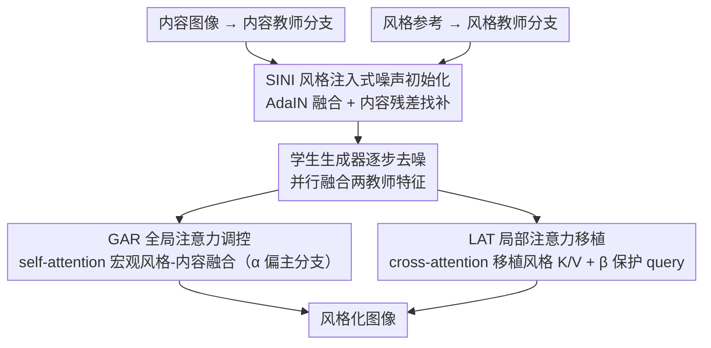

# HAM: A Training-Free Style Transfer Approach via Heterogeneous Attention Modulation for Diffusion Models

**会议**: CVPR 2026 Findings  
**arXiv**: [2603.24043](https://arxiv.org/abs/2603.24043)  
**代码**: 无  
**领域**: 扩散模型 / 图像生成  
**关键词**: 风格迁移, 注意力调制, 无训练, 扩散模型, 身份保持

## 一句话总结
提出 HAM，一种无需训练的风格迁移方法，通过对扩散模型中 self-attention 和 cross-attention 实施异构调制（GAR+LAT），并配合风格注入式噪声初始化，在不牺牲内容身份信息的前提下实现高质量风格迁移，在多项指标上达到 SOTA。

## 研究背景与动机

**领域现状**：基于扩散模型的风格迁移方法主要分为两类：微调方法（通过 LoRA/ControlNet 训练风格控制模块）和无训练方法（在推理时操纵注意力特征实现风格化）。微调方法计算成本高、鲁棒性差；无训练方法如 StyleID、DiffArtist 通过在 self-attention 中注入风格图像的 key/value 来实现风格迁移。

**现有痛点**：现有无训练方法仅依赖 self-attention 的操纵来同时注入风格和保留内容。但 self-attention 的 Q/K/V 同时编码了空间位置关系和语义表示，单一通道的操纵难以同时兼顾风格表达和内容保持，容易导致风格不足或内容变形。

**核心矛盾**：在 self-attention 中进行风格注入会不可避免地破坏内容身份信息，因为 Q/K/V 天然耦合了空间结构和语义内容。现有方法在风格与内容之间陷入 trade-off 困境。

**本文目标** 如何在无训练的设定下，同时充分捕获复杂风格参考并保持内容图像的身份信息（结构、纹理、文字等）。

**切入角度**：将风格注入和内容保护分离到不同的注意力机制中——用 self-attention 做全局的风格-内容融合调控，用 cross-attention 做精确的局部风格移植和内容保护，实现异构调制。

**核心 idea**：通过对 self-attention 和 cross-attention 施加不同策略的异构注意力调制（GAR 处理全局融合，LAT 处理局部移植），将风格迁移中的风格注入和内容保护解耦到不同注意力通道。

## 方法详解

### 整体框架
HAM 由三个核心模块组成：全局注意力调控（GAR）、局部注意力移植（LAT）和风格注入式噪声初始化（SINI）。系统使用三个并行的扩散模型分支：内容教师模型（处理内容图像）、风格教师模型（处理风格参考）和学生生成器（生成风格化图像）。首先通过 SINI 生成融合了风格和内容信息的初始噪声，然后在扩散去噪过程中，GAR 作用于 self-attention 层进行宏观风格-内容融合，LAT 作用于 cross-attention 层进行精确的风格/内容控制。该方法兼容 SD2.1（DDIM-based）和 SD3.5（DiT-based）两种架构。

### 关键设计

**1. 全局注意力调控 GAR：在 self-attention 里做宏观的风格-内容融合，而不是粗暴替换**

现有无训练方法直接把风格图像的 K/V 塞进 self-attention，问题是 self-attention 的 Q/K/V 同时编码了空间位置和语义内容，硬替换会把内容结构一起冲掉。GAR 的做法分两步缓冲这个冲击：先用 AdaIN 把内容教师的投影 $(Q^c, K^c, V^c)$ 和风格教师的投影 $(Q^s, K^s, V^s)$ 对齐融合成复合投影 $(Q^{cs}, K^{cs}, V^{cs})$——即把内容特征归一化后，再用风格特征的均值和方差重新缩放，让它带上风格的统计分布；再把这个复合投影和学生生成器自己的投影按超参数 $\alpha$ 加权混合：

$$\hat{Q} = \alpha \cdot Q^m + (1-\alpha) \cdot Q^{cs}$$

K/V 同理。这样风格统计信息进来了，主分支的空间语义结构也被 $\alpha$ 这一项保住了。消融里 $\alpha=0.75$ 最好，权重明显偏向主分支——说明 self-attention 这条通道经不起太重的风格注入，稍微多放一点风格就会伤内容。

**2. 局部注意力移植 LAT：把风格注入挪到 cross-attention，顺便保护 query 不让内容退化**

GAR 解决了"宏观别太伤内容"，但风格强度还不够，而 self-attention 又不能再加码。LAT 的关键转折是换通道：cross-attention 原本是给文本条件用的，本身不承载空间结构，所以在这里直接把风格教师的 cross-attention K/V 移植过来替换学生的 K/V，风格能注进去，又不会像在 self-attention 里那样破坏内容结构。代价是 query 这一侧仍可能让内容身份漂移，于是再对 query 做一道保护，把内容教师的 $Q^c_{cross}$ 和主分支的 $Q^m_{cross}$ 按 $\beta$ 融合：

$$\hat{Q}^m_{cross} = \beta \cdot Q^m_{cross} + (1-\beta) \cdot Q^c_{cross}$$

$\beta=0.25$ 时平衡最好，即 query 主要听内容教师的、保住身份，K/V 全权交给风格教师、负责上色。消融数据印证了它是身份保持的主力：单加 LAT 就把 DINO 从 0.609 拉到 0.712。

**3. 风格注入式噪声初始化 SINI：起跑线上就让噪声同时带风格和内容**

前两个设计都在去噪过程里调，但如果初始噪声本身只有内容信息，整个生成从一开始就缺风格底子。SINI 在扩散起点动手：先用 AdaIN 把内容初始噪声 $z^c_T$ 和风格初始噪声 $z^s_T$ 融成风格化噪声，但纯 AdaIN 融合会丢内容身份，所以再补一个内容残差项（原始内容噪声与融合噪声之差），用 $\gamma$ 控制它的权重：

$$z^m_T = \gamma \cdot \text{ContentResidual} + \text{StylizedNoise}$$

残差这一项相当于把丢掉的内容结构又找补回来，$\gamma=0.5$ 时风格统计和内容结构两边都顾上。它单独看提升不大，但和 GAR、LAT 协同时把色彩多样性和综合指标 DC/CC 顶到最高。

### 损失函数 / 训练策略
该方法完全无需训练，所有操作在推理阶段完成。SD2.1 使用 50 步 DDIM 去噪，图像尺寸 512×512。三个超参数 $\alpha=0.75, \beta=0.25, \gamma=0.5$ 通过消融实验确定。

## 实验关键数据

### 主实验

| 方法 | ArtFID↓ | LPIPS↓ | DINO↑ | CLIP-I↑ | CLIP-T↑ | DC↑ | CC↑ |
|------|---------|--------|-------|---------|---------|-----|-----|
| StyleID (CVPR'24) | 15.161 | 0.635 | 0.544 | 0.619 | 0.213 | 1.873 | 1.964 |
| DiffArtist (MM'25) | 16.174 | 0.520 | 0.629 | 0.626 | 0.220 | 1.987 | 1.984 |
| AttDistillation (CVPR'25) | 16.170 | 0.629 | 0.541 | 0.615 | 0.219 | 1.878 | 1.969 |
| **HAM (Ours)** | **15.151** | **0.479** | **0.728** | **0.682** | **0.223** | **2.113** | **2.057** |

### 消融实验

| 配置 | DINO↑ | CLIP-I↑ | CLIP-T↑ | DC↑ | CC↑ |
|------|-------|---------|---------|-----|-----|
| Baseline (无模块) | 0.609 | 0.626 | 0.220 | 1.963 | 1.984 |
| +GAR | 0.618 | 0.626 | 0.231 | 1.993 | 2.002 |
| +LAT | 0.712 | 0.696 | 0.193 | 2.042 | 2.023 |
| +GAR+LAT | 0.746 | 0.696 | 0.202 | 2.099 | 2.040 |
| +GAR+LAT+SINI (Full) | 0.728 | 0.682 | 0.223 | 2.113 | 2.057 |

### 关键发现
- LAT 对内容保持贡献最大（DINO 从 0.609 → 0.712），是身份保持的核心模块
- GAR 主要提升风格强度（CLIP-T 从 0.220 → 0.231），同时轻微提升内容指标
- SINI 增强色彩多样性和风格丰富度，与前两个模块协同时在综合指标 DC/CC 上取得最优
- 超参数 $\alpha=0.75$ 偏向保留主分支信息，过低会导致内容急剧退化

## 亮点与洞察
- 将风格迁移中的注入和保护分配到不同类型的注意力机制中（异构调制），这个思路很巧妙——利用 cross-attention 原本处理跨模态信息的特性来做风格注入，避免 self-attention 操纵带来的结构破坏
- AdaIN + 残差的噪声初始化设计优雅地解决了初始噪声的风格-内容平衡问题，比简单的噪声替换或融合都更有效
- 兼容 SD2.1 和 SD3.5 两种不同架构（DDIM vs DiT），展现了方法的通用性

## 局限与展望
- 对高度抽象或超现实主义风格的迁移效果仍有局限
- 需要同时运行三个扩散模型分支（内容教师、风格教师、学生），计算开销较大（SD2.1 上生成一张需约 16 秒）
- 三个超参数需要手动调节，不同风格可能需要不同设置
- 定量评估中 ArtFID 仅微弱领先 StyleID（15.151 vs 15.161），优势不够显著

## 相关工作与启发
- **vs StyleID**: StyleID 仅在 self-attention 中注入风格 K/V，导致内容失真。HAM 将风格注入转移到 cross-attention，显著减少内容破坏
- **vs DiffArtist**: DiffArtist 在内容保持（LPIPS）上表现不错但风格强度不如 HAM。HAM 的 LAT 模块通过 query 保护机制实现了更好的平衡
- 异构注意力调制的思路可以迁移到图像编辑、视频风格化等其他领域

## 评分
- 新颖性: ⭐⭐⭐⭐ 异构调制思路新颖，但 AdaIN 融合等组件较为常规
- 实验充分度: ⭐⭐⭐⭐ 消融实验详细，覆盖所有模块和超参数，但缺少用户研究
- 写作质量: ⭐⭐⭐⭐ 结构清晰，公式推导完整，但部分描述冗余
- 价值: ⭐⭐⭐⭐ 无训练风格迁移的实用方案，跨架构兼容性好

<!-- RELATED:START -->

## 相关论文

- [\[CVPR 2026\] StyleGallery: Training-free and Semantic-aware Personalized Style Transfer from Arbitrary Image References](stylegallery_training-free_and_semantic-aware_personalized_style_transfer_from_a.md)
- [\[AAAI 2026\] Melodia: Training-Free Music Editing Guided by Attention Probing in Diffusion Models](../../AAAI2026/image_generation/melodia_training-free_music_editing_guided_by_attention_probing_in_diffusion_mod.md)
- [\[CVPR 2026\] OrthoFuse: Training-free Riemannian Fusion of Orthogonal Style-Concept Adapters for Diffusion Models](orthofuse_training-free_riemannian_fusion_of_orthogonal_style-concept_adapters_f.md)
- [\[CVPR 2026\] A Training-Free Style-Personalization via SVD-Based Feature Decomposition](a_training-free_style-personalization_via_svd-based_feature_decomposition.md)
- [\[CVPR 2026\] Style-GRPO: Semantic-Aware Preference Optimization for Image Style Transfer Guided by Reward Modeling](style-grpo_semantic-aware_preference_optimization_for_image_style_transfer_guide.md)

<!-- RELATED:END -->
