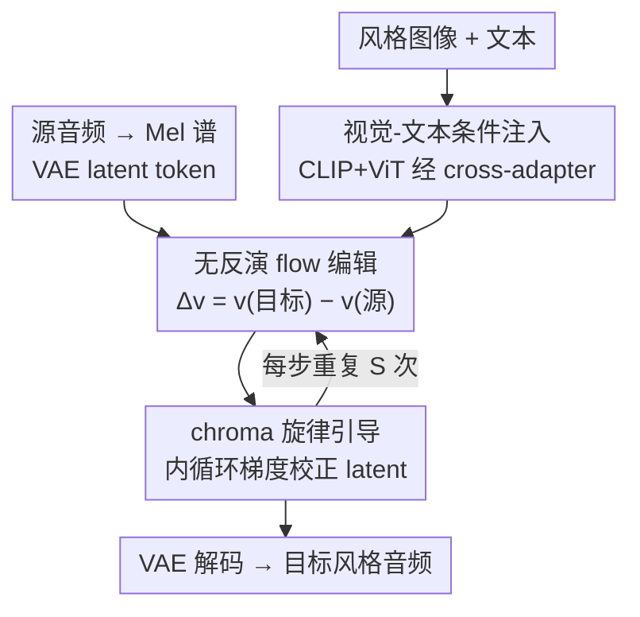

# Harmonic Canvas: Inversion-Free Editing for Visually-Guided Music Style Transfer

**会议**: CVPR 2026  
**论文**: [CVF Open Access](https://openaccess.thecvf.com/content/CVPR2026/html/Lei_Harmonic_Canvas_Inversion-Free_Editing_for_Visually-Guided_Music_Style_Transfer_CVPR_2026_paper.html)  
**代码**: 仅有在线 demo，未公开仓库  
**领域**: 跨模态生成 / 音乐风格迁移 / Flow 编辑  
**关键词**: 音乐风格迁移, 视觉引导, 无反演 flow 编辑, 跨模态融合, chroma 旋律约束

## 一句话总结
本文把"图像氛围"当作音乐风格的第三种条件，提出一个基于无反演（inversion-free）flow 编辑的多模态音乐风格迁移框架：用 CLIP+ViT 双编码器经 cross-adapter 把视觉/文本线索注入音频 DiT 骨架，再用可微的归一化 chroma 约束在 flow 轨迹上"拉回"音高结构，从而在大幅换风格的同时保住源曲旋律，FAD/IMSM 等指标全面超过现有文本/音频条件的方法。

## 研究背景与动机

**领域现状**：音乐风格迁移（MST）要把一段已有曲子重渲染成另一种风格，同时保留旋律与节奏。主流做法用**文本提示**（"明亮欢快的爵士"）或**参考音频**作为风格条件，近年多用扩散模型 + 扩散反演（diffusion inversion）来做零样本编辑。

**现有痛点**：作者点出两个具体问题。其一，**文本是有损的风格代理**——色调、光影、空间构图这些"氛围"信息很难用语言精确描述，文字只能近似情绪，抓不住细粒度的美学纹理。其二，**扩散反演又慢又不稳**：反演需要多步随机重建来还原噪声轨迹，计算贵且会累积误差，在长音频上造成时间漂移。

**核心矛盾**：音乐风格本质是**多模态**的（视觉的颜色/明暗天然对应音色/节奏/和声），但现有 MST 系统几乎不显式利用视觉线索；而能保结构的编辑范式里，**风格自由度**和**旋律保真度**之间又存在直接 trade-off——风格改得越狠，音高越容易跑偏。

**本文目标**：拆成两个子问题——(1) 如何表示并利用"超越语言"的视觉语义来指导风格；(2) 如何在无反演生成框架内，于大幅风格变换下守住音高与节奏身份。

**切入角度**：无反演 flow 编辑（FlowEdit 这类）在源、目标分布之间建立**确定性**传输路径，天然保全局一致性、又允许局部风格变化，正好契合"保旋律、换风格"的需求；视觉条件则用信息论给了硬理由——见下。

**核心 idea**：用**视觉嵌入直接注入 + chroma 旋律梯度校正**，把视觉氛围翻译成音乐表达，同时把 flow 轨迹"钉"在源曲的音高类结构上。

## 方法详解

### 整体框架
框架建立在 **Make-An-Audio 3（MAA3）** 这个基于 DiT 的音频扩散骨架上：音频先经 STFT 转 Mel 谱、再由轻量 audio VAE 编成 latent token，Flan-T5 文本编码器通过 AdaLN 注入语义、RoPE 编码时序。在此之上，整条 pipeline 在 latent 空间做无反演 flow 编辑，由三块协同：**视觉-文本条件注入**（cross-adapter 把 CLIP+ViT 视觉特征和文本一起注入每个 DiT block）、**无反演 flow 编辑**（用源/目标速度差 $\Delta v$ 直接构造源→目标映射，绕开噪声反演）、**chroma 旋律引导**（每个 flow 步内做若干次梯度内循环，把 latent 拉回源曲音高分布）。输入是源音频 + 风格图像 +（可选）文本，输出是换了风格但旋律仍在的目标音频。

### 关键设计

**1. Cross-Adapter 视觉-文本双流条件注入：用视觉嵌入替代"图转文字"以免信息损失**

作者先用信息论给"为什么要直接喂视觉特征"一个硬理由：设图像 $I$、其 caption $C=g(I)$、生成音频 $Z$，因为 $I\to C\to Z$ 构成马尔可夫链，数据处理不等式给出 $I(I;Z)\le I(I;C)$——也就是说"图像→文字→音频"这条路只会**丢失**风格信息、不会增加。所以与其把图转成文字再喂文本模型，不如把视觉特征直接注入。具体用**两个互补的视觉编码器**：CLIP 负责高层视觉-语言语义对齐，ViT 负责全局信息；二者嵌入池化、线性投影后经 cross-attention 注入。

注入方式是一个不破坏预训练结构的 cross-adapter：主流（音频隐状态 $H$）与控制流（文本 $X_{ctl}$、视觉 $Y_{ctl}$）**共享 Query 投影**，但各自保留独立的 Key/Value 投影——
$$Q_m = W_q\,\mathrm{Norm}(H),\quad K_{ctl}=W_k^{(x)}\Phi_x(X_{ctl})+W_k^{(y)}\Phi_y(Y_{ctl}),\quad V_{ctl}=W_v^{(x)}\Phi_x(X_{ctl})+W_v^{(y)}\Phi_y(Y_{ctl})$$
adapter 输出 $O_{crs}=\mathrm{softmax}\!\big((Q_m\odot R_q)(K_{ctl}\odot R_k)^\top/\sqrt{d}\big)V_{ctl}W_o$ 再加回主流（$R_q,R_k$ 是给主流/控制流分别用独立时间网格的分段 RoPE 因子）。共享 $W_q,W_o$ 保持两个表示空间对齐，独立的 K/V 让控制路径有自己的语义；训练时控制流里不参与主损失的 FFN/Norm 层冻结，避免"未用参数"问题、保证收敛稳定。这样每一层都能让音频主流去"查询"视觉分支，把氛围/色调/情绪注入而不扰乱时序与旋律。

**2. 无反演 flow 编辑骨架：用源/目标速度差直接构造确定性编辑路径**

flow 生成模型把合成定义为分布间的连续变换 $\frac{dz_t}{dt}=v_\theta(z_t,t)$，训练目标是 flow matching：$\mathcal{L}_{flow}=\mathbb{E}_{t,z_t}\big[\lVert v_\theta(z_t,t)-v_t\rVert_2^2\big]$。本文沿用无反演思路绕开扩散反演的多步随机重建——不去还原噪声轨迹，而是**直接用源、目标条件下的速度差**构造编辑映射：
$$z_t^{edit}=z_t^{src}+\Delta v_t,\qquad \Delta v_t = v_\theta(z_t^{tar},t)-v_\theta(z_t^{src},t)$$
这一步把"语义变换"表达成两个速度场之差，方向一致、不引入随机噪声累积，因此比反演方案更稳、更省，特别适合"保结构"的风格迁移。它是整条 pipeline 的外层骨架：每个时间步先做这一确定性传输，再交给下面的 chroma 内循环修正。

**3. 归一化 chroma 旋律引导：在每个 flow 步内做梯度内循环把音高"拉回"源曲**

光有多模态条件会带来副作用：模型只听语义线索时容易**音高漂移/节奏失真**，把源曲身份改没了。作者用**归一化 chroma**（十二个音高类在一个八度内的相对能量分布）作为旋律描述子——相比原始 F0 曲线，它幅度不变、对音色稳健、能容忍复音，更适合做旋律一致性约束。当前编辑 latent 解码出波形 $\hat{x}_t=G(z_t^{edit})$ 后提取 $C_t=\Phi_{chroma}(\hat{x}_t)$，与源曲乐器轨参考 $C_{ref}$ 比较，用 L1 度量旋律偏差：
$$\mathcal{L}_{chr}=\lVert C_t-C_{ref}\rVert_1$$
它惩罚音高类激活的偏离、又容忍小的时序偏移。取其对 latent 的梯度 $g=\nabla_{z_t^{edit}}\mathcal{L}_{chr}$，做近端更新 $z_t^{edit}\leftarrow z_t^{edit}-\eta\lambda_{chr}\,g$，并在每个 flow 步内**重复 $S$ 次内循环**（见下"完整示例"）。$\lambda_{chr}$ 用 cosine 衰减调度——早期强约束"锁住"旋律、后期减弱以释放风格自由度。chroma 提取器用可微 STFT + 12-bin 三角滤波器组 + 逐帧 L1 归一化实现，保证梯度能完整回传到 latent。最终效果是：**外层 flow 负责语义换风格，内层 chroma 校正把轨迹拽回源曲音高结构**，二者在每一步交替进行。

### 一个完整示例
以 Algorithm 1 走一遍（从源 latent $x_{src}$ 出发）：对每个外层时间步 $t_i$ —— ① 由 $z_{t_i}^{src}=(1-(1-\sigma_{min})t_i)x_{src}+t_i x_0^{noise}$ 取得源轨迹点；② 算速度差 $\Delta v=f_\theta(z_{t_i}^{tar},y_{tar})-f_\theta(z_{t_i}^{src},y_{src})$ 并用 $dt$ 推进编辑 latent；③ 进入**内循环 $s=1..S$**：解码当前与源 latent 得 chroma $C_{t_i},C_{ref}$，算 $\mathcal{L}_{chr}$ 的梯度 $g$，按 $z^{edit}\leftarrow z^{edit}-\eta\lambda_{chr}g$ 修正；④ 内循环结束推进到 $t_{i+1}$。论文设 $S=2$、$\eta=1\times10^{-4}$、$\lambda_{chr}=1$、推理 25 步。直观上：外层每走一步就被内层"校音"两次，越往后约束越松，于是开头死守旋律、后段放开换风格。

### 损失函数 / 训练策略
骨架 1.5B（MAA3）+ 额外 46.2M adapter 参数，在 L40S 上训练；cross-adapter 学习率 $1\times10^{-5}$、batch 16。flow matching 损失 $\mathcal{L}_{flow}$ 训练速度场；chroma 引导只在**推理时**做 latent 梯度校正（不需额外网络前向，开销几乎可忽略）。控制流中不贡献主损失的层冻结以稳收敛。

## 实验关键数据

数据集：合并扩展 MeLBench + MusicCaps 成 ⟨图像 $I$, 文本 $T$, 音乐 $M$⟩ 三元组，用 Demucs 去人声只留器乐，LLM 辅助标注成 16 个曲风、统一 caption，构成 genre-aware 的多模态语料。指标：FAD/FD（与目标风格分布对齐，越低越好）、IMSM（图-乐跨模态一致性）、F0-PCC / CCS（旋律与和声保真）、主观 OVL/REL/MOScon（15 名被试 0–100 打分）。

### 主实验
| 方法 | 模态(文/图) | FAD↓ | FD↓ | IMSM↑ | F0-PCC↑ | CCS↑ | MOScon↑ |
|------|------|------|------|------|------|------|------|
| MAA3 | 文 | 4.23 | 29.77 | - | - | - | 86.47 |
| MeLFusion | 文+图 | 3.24 | 25.73 | 0.783 | - | - | 86.93 |
| MusicTI（反演式） | 文 | 3.78 | 26.09 | - | 0.367 | 0.820 | 86.13 |
| ZETA（反演式） | 文 | 4.23 | 27.75 | - | 0.322 | 0.764 | 83.93 |
| **本文** | **文+图** | **2.43** | **24.06** | **0.828** | **0.416** | **0.878** | **89.20** |

本文在分布对齐（FAD/FD）、跨模态一致（IMSM）、旋律/和声保真（F0-PCC/CCS）和主观旋律一致性（MOScon）上全部居首。相比生成式方法（MusicLM/MusicGen/TANGO）做"从零合成"、拿不到源材料，本文是**直接变换**，因此 F0-PCC/CCS 这类结构指标可比且更优；相比反演式 MST（MusicTI/ZETA），chroma 约束带来明显更高的音高稳定与和声连贯。

### 消融实验
模态消融（Table 2）与反演策略对比（Table 3）：

| 配置 | FAD↓ | FD↓ | IMSM↑ | 说明 |
|------|------|------|------|------|
| Text only | 3.15 | 25.38 | - | 缺细粒度风格线索 |
| Image only | 4.06 | 34.13 | - | 最差，视觉需文本接地 |
| Text+Image+Caption | 2.86 | 24.57 | 0.811 | 加 BLIP caption 反而引噪 |
| **Text+Image** | **2.43** | **24.06** | **0.828** | 完整，视觉补文本之外的风格信息 |

| 编辑策略 | F0-PCC↑ | CCS↑ | FAD↓ | FD↓ | IMSM↑ |
|------|------|------|------|------|------|
| RF Inversion（反演式） | 0.323 | 0.830 | 2.57 | 26.86 | 0.812 |
| RF Edit（反演式） | 0.343 | 0.842 | 2.52 | 26.18 | 0.805 |
| FlowEdit（无反演基线） | 0.368 | 0.852 | 2.41 | 24.45 | 0.829 |
| **本文（+chroma）** | **0.416** | **0.878** | 2.43 | **24.06** | 0.828 |

### 关键发现
- **视觉特征要直接注入、且需文本接地**：image-only 最差，text+image 最好；而把图先转成 BLIP caption 再喂（Text+Image+Caption）反而掉点，印证了"图转文字有损"的信息论论证——冗长/低质 caption 会往条件空间引噪。
- **反事实测试**：只换图像、固定文本，输出明显不同，说明视觉线索**独立地**影响生成风格，不是文本的附庸。
- **无反演 > 反演**：相比 RF Inversion/RF Edit，本文 F0-PCC/CCS 大幅领先，确定性映射在保结构上更稳；相比无反演基线 FlowEdit，chroma 约束把 F0-PCC 从 0.368 提到 0.416。
- **旋律保真与风格自由度的 trade-off 真实存在**：加 chroma 引导后 F0-PCC/CCS 显著提升，但 IMSM 略降（Table 4：步数从 2 加到 20，CCS 微涨而 IMSM 从 0.828 跌到 0.815），过度校正会压制风格灵活性——作者用 cosine 衰减的 $\lambda_{chr}$ 在两者间折中。

## 亮点与洞察
- **用数据处理不等式论证"别图转文字"**：$I(I;Z)\le I(I;C)$ 把"为什么直接喂视觉特征"从经验观察升级成可证的信息瓶颈，论证干净，这个 framing 可迁移到任何"是否该把模态 A 压成模态 B 再用"的设计抉择。
- **把旋律约束做成 flow 步内的梯度内循环**：不改网络、不训新模块，纯推理期 latent 梯度校正，几乎零额外开销，却把音高保真显著提上去——一个轻量、可插拔、可调度强度的"安全带"思路。
- **chroma 而非 F0**：选幅度不变、容忍复音的归一化 chroma 当旋律描述子，比原始基频曲线对音色/复音更鲁棒，是个值得复用的旋律一致性度量选择。
- **cosine 衰减约束调度**："早锁旋律、晚放风格"把 trade-off 显式编进时间轴，比固定权重更聪明。

## 局限与展望
- 作者承认 **flow 架构偏重**，未来想做更轻量的 flow 以支持更广的多模态预训练与交互式创作。
- ⚠️ **无公开代码仓库**（仅在线 demo），CLIP+ViT 池化/投影细节、RoPE 分段时间网格的具体实现、附录里的标注流程都需以原文/demo 为准，复现存在不确定性。
- **trade-off 未根治**：旋律保真提升以 IMSM 轻降为代价，强约束下风格自由度受限；当前靠手调 cosine 调度缓解，缺一个自适应平衡机制。
- **评测偏小众**：主观打分仅 15 人、benchmark 由作者自建（重组 MeLBench+MusicCaps），16 曲风的覆盖与标注质量影响结论外推；IMSM 这类跨模态指标本身也依赖 MeLFusion 的度量定义。
- 改进思路：把 $\lambda_{chr}$ 改成按当前 chroma 偏差自适应触发；引入更强的视觉-音频对齐预训练替代后接 cross-adapter，缓解 image-only 退化。

## 相关工作与启发
- **vs MeLFusion**：同样用视觉引导音乐，但 MeLFusion 偏"从零合成"、缺乏保旋律机制，Mel 谱会出现明显结构形变；本文是**编辑**而非合成，靠无反演 flow + chroma 守住源结构，IMSM（0.828 vs 0.783）与结构指标都更优。
- **vs MusicTI / ZETA（反演式 MST）**：它们靠扩散反演做内容保持的 timbre/mood 变换，但反演多步随机、易累积误差致时间漂移；本文用确定性 $\Delta v$ 映射 + chroma 约束，F0-PCC/CCS 大幅领先。
- **vs FlowEdit**：本文的无反演骨架直接源自 FlowEdit 思路，核心增量是把它**扩到音乐域**并加上多模态视觉条件与 chroma 旋律正则，使其从"图像编辑"变成"保旋律的音乐风格迁移"。

## 评分
- 新颖性: ⭐⭐⭐⭐⭐ 首次把视觉氛围作为显式风格条件引入 MST，并用无反演 flow + chroma 的组合解决保旋律问题，task 与方法都新。
- 实验充分度: ⭐⭐⭐⭐ 客观+主观+消融+反事实+敏感性较完整，但 baseline 多为非多模态、被试仅 15 人、benchmark 自建。
- 写作质量: ⭐⭐⭐⭐⭐ 动机用信息论串得很顺，Algorithm 1 与公式清晰，图示直观。
- 价值: ⭐⭐⭐⭐ 跨模态创作有应用前景，轻量 chroma 内循环思路可复用；但无开源码、trade-off 未根治限制落地。

<!-- RELATED:START -->

## 相关论文

- [\[CVPR 2026\] Style-GRPO: Semantic-Aware Preference Optimization for Image Style Transfer Guided by Reward Modeling](style-grpo_semantic-aware_preference_optimization_for_image_style_transfer_guide.md)
- [\[CVPR 2026\] StyleGallery: Training-free and Semantic-aware Personalized Style Transfer from Arbitrary Image References](stylegallery_training-free_and_semantic-aware_personalized_style_transfer_from_a.md)
- [\[AAAI 2026\] Melodia: Training-Free Music Editing Guided by Attention Probing in Diffusion Models](../../AAAI2026/image_generation/melodia_training-free_music_editing_guided_by_attention_probing_in_diffusion_mod.md)
- [\[CVPR 2026\] HAM: A Training-Free Style Transfer Approach via Heterogeneous Attention Modulation for Diffusion Models](ham_a_training-free_style_transfer_approach_via_heterogeneous_attention_modulati.md)
- [\[CVPR 2026\] A Training-Free Style-Personalization via SVD-Based Feature Decomposition](a_training-free_style-personalization_via_svd-based_feature_decomposition.md)

<!-- RELATED:END -->
