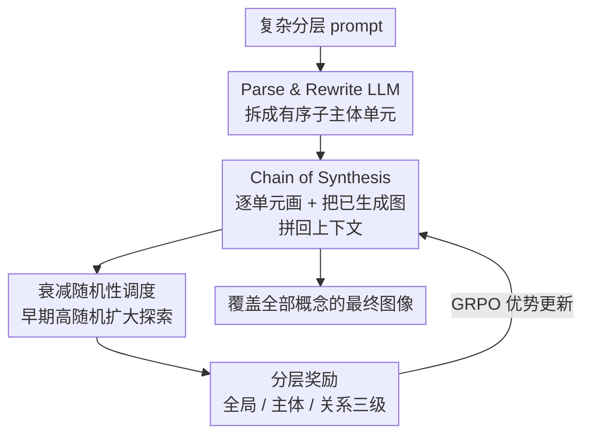

# HiCoGen: Hierarchical Compositional Text-to-Image Generation in Diffusion Models via Reinforcement Learning

**会议**: CVPR 2026  
**论文**: [CVF Open Access](https://openaccess.thecvf.com/content/CVPR2026/html/Yang_HiCoGen_Hierarchical_Compositional_Text-to-Image_Generation_in_Diffusion_Models_via_Reinforcement_CVPR_2026_paper.html)  
**代码**: 无（论文称 HiCoPrompt 数据集将开源）  
**领域**: 扩散模型 / 组合式文生图  
**关键词**: 组合式文生图, 合成链, 扩散 RL, GRPO, 分层奖励

## 一句话总结
面对"多主体 + 分层属性"的复杂 prompt，HiCoGen 不再让扩散模型一口气画完，而是用 LLM 把 prompt 拆成最小语义单元、按"合成链（Chain of Synthesis）"一个一个画并把已生成图当作下一步的视觉上下文逐步拼装，再配上分层奖励 + 衰减随机性调度的 GRPO 强化学习，把概念覆盖率（Acc$_{exist}$ 0.71）和组合准确率显著拉到现有 T2I/主体驱动模型之上。

## 研究背景与动机
**领域现状**：以 SD3、FLUX、Qwen-Image 为代表的扩散文生图模型在"短 prompt、单主体"上已经能画出高保真图像。但真实需求往往是一段长、复杂、带层级结构的描述——"一只穿着渐变毛衣、戴着玩具眼镜、爪子里举着 LED 牌的猫"。

**现有痛点**：这类复杂 prompt 一旦涉及多个主体和"主体—属性—子属性"的分层结构，单体（monolithic）一步生成就会出现三类典型失败：概念遗漏（concept omission，某个物体根本没画出来）、概念混淆（concept confusion，把"碎花上衣"的属性贴到了错的人身上）、组合性差。作者在图 1 里直接展示了 FLUX/SD3 在复杂 prompt 上漏画与张冠李戴的例子。

**核心矛盾**：根本原因是单步生成要在一次去噪里同时解决所有"概念—属性"的绑定（compositional binding），prompt 越复杂、文本与图像之间的语义鸿沟越大，绑定越容易崩。而想用强化学习去对齐这种细粒度组合，又撞上第二个矛盾：标准扩散采样器探索空间太小，采出来的样本几乎一个样，GRPO 这种靠"组内样本差异算优势"的算法拿不到有效梯度。

**本文目标**：(1) 把"一步画完复杂场景"这件难事拆成可解的子问题；(2) 给扩散 RL 提供足够的探索 + 细粒度奖励；(3) 提供一个真正带分层组合结构的评测基准。

**切入角度**：作者观察到单个 T2I 模型画"单个物体"是没问题的，崩的是"同时画很多物体并摆好关系"。那就别让它一次做全部——先画好一个语义单元，把这张中间图当作下一步生成的视觉锚点，逐步把场景搭起来。

**核心 idea**：用"合成链（Chain of Synthesis, CoS）"把单体生成换成"逐单元生成 + 上下文拼装"的链式过程，并用"分层奖励 + 衰减随机性调度"的 GRPO 把这条链调到组合最准。

## 方法详解
HiCoGen 接收一段复杂分层 prompt，输出一张覆盖全部概念的图像。整条管线分三块：先用 LLM 把 prompt 解析重写成有序的子主体集合（Parse & Rewrite），再沿合成链逐单元生成并把已生成图拼回上下文（CoS），最后用一套"全局/主体/关系"三级奖励 + 衰减随机性采样的 GRPO 把这个链式生成器 RL 微调到最优。整体框架如下图。

### 整体框架
输入复杂 prompt $O$ 后，**Parse & Rewrite LLM** 先把它分解成有序的子主体集合，每个子主体又可继续拆成多个细粒度属性，并对每一层做重写让它"可被单独画出来"；**合成链** 拿着这些拆好的单元一个个生成、并把每步生成的干净 latent 拼接进下一步的输入，逐步把所有概念堆进同一张场景图；为了把这条链调到组合最准，作者套了一层基于 GRPO 的 RL，其中 **衰减随机性调度** 负责给 RL 制造足够的样本多样性（探索），**分层奖励** 负责从全局、主体、关系三个粒度给出细粒度监督信号。整个 RL 在 FLUX + UNO LoRA 上做，三级奖励加权求和后按 GRPO 算优势、反传更新合成链策略。

### 关键设计

**1. 合成链（Chain of Synthesis）：把单体生成换成逐单元拼装**

这是 HiCoGen 对抗"概念遗漏/混淆"的核心。单体生成要在一次去噪里解决所有绑定，prompt 一复杂就崩；CoS 的做法是把这件事拆成一串"单主体生成 + 上下文组合"的小任务。在用多模态注意力的 DiT 里，输入是文本 token $c$ 与噪声 latent $z_t$ 的拼接 $z=\mathrm{concat}(c, z_t)$。CoS 在生成完一批具体内容的干净 latent $\{z_0^0, z_0^1, \cdots, z_0^m\}$ 后，不丢弃它们，而是把它们连同当前层 prompt $P^{(i)}$ 一起拼进下一步输入：

$$\hat{z} = \mathrm{concat}(P^{(i)}, \hat{z}_t, z_0^0, z_0^1, \cdots, z_0^m)$$

也就是说，已经画好的图块成了"携带特定文本信息的视觉表示"，下一步生成时不必再靠原始文字去重新描述这些细节。这个过程一路滚到把整段 prompt 覆盖完：

$$z' = \mathrm{concat}(O, z'_t, \hat{z}_0^0, \hat{z}_0^1, \cdots, \hat{z}_0^n)$$

之所以有效，是因为每一步只让模型解决"在已有视觉上下文上再加一个单元"这种它本就擅长的单主体任务，把难绑定问题分摊到链上、同时天然地把分层关系一层层搭出来。作者用 FLUX + UNO（in-context 主体驱动生成）来做这种"把参考图块装配进新场景"的拼接。

**2. 分层奖励（Hierarchical Reward）：从全局/主体/关系三级给细粒度监督**

普通 RLHF 奖励只看"整图—文本对齐 / 美学"，对"某个主体的属性对不对、两个主体的关系摆得对不对"这种内部细节是盲的。HiCoGen 把奖励拆成三级加权和：

$$R_{total} = R_{global} + R_{subject} + R_{relationship}$$

全局奖励看整图质量，用 CLIP 对齐分 $S_{clip}$ 与人偏好分 HPSv2 $S_{hps}$：$R_{global}=w_{clip}\cdot S_{clip}+w_{hps}\cdot S_{hps}$。主体奖励先用 GroundingDINO 定位每个关键主体并裁剪，再用 DINOv2 算裁剪块与参考中间图的余弦相似度 $S_{DINOv2}=\cos(\mathrm{DINOv2}(I_{cropped}), \mathrm{DINOv2}(I_{ref}))$ 衡量主体保真；颜色/姿态这类嵌入相似度抓不住的属性，再叫 VLM 当 rule-based 打分 $S_{vlm}$，$N$ 个主体取平均 $R_{subject}=\frac{1}{N}\sum_{i=1}^{N}(w_{dino}\cdot S_{DINOv2}^{(i)}+w_{vlm}\cdot S_{vlm}^{(i)})$。关系奖励专治 CoS 的副作用——独立参考图拼进来会出现"物体悬浮/贴图感、比例失调"，作者让 VLM 专门核查主体间的层级关系和相对比例 $R_{relationship}=\frac{1}{N}\sum_{i=1}^{N}S_{vlm}^{(i)}$。

三级互补：主体奖励保属性、关系奖励保交互合理，消融里去掉主体奖励属性准确率掉约 14%，去掉关系奖励关系准确率掉约 4%。

**3. 衰减随机性调度（Decaying Stochasticity Schedule）：把探索预算砸在去噪早期**

这是让扩散 RL 真正跑得动的关键。标准采样器探索空间太小，GRPO 组内样本几乎一致，优势 $A_i=\frac{r_i-\mathrm{mean}(\{r\})}{\mathrm{std}(\{r\})}$ 退化、学不到东西。作者给反向 SDE 加一个可控随机项 $\eta(t)\ge 0$，并从理论上回答"固定总随机预算 $\int_0^T\eta(t)^2 dt=C$ 下，怎么分配 $\eta(t)$ 才能让最终样本多样性 $\mathrm{Tr}(\mathrm{Cov}(z_0))$ 最大"。

定理 1 给出结论：最优 $\eta(t)$ 是关于 $t$（从 $T$ 到 $0$）单调递减的——即把随机性集中在生成早期。直觉来自去噪过程有"早期 generalization time 建全局结构、后期 collapse time 抠细节"两阶段，后期 Jacobian 越来越收缩（Assumption 2），早期扰动 $W(s)=\mathrm{Tr}(g(s)^2\Phi(0,s)\Phi(0,s)^\top)$ 对最终方差的影响更大，所以预算该砸在早期。作者在 Rectified Flow 上把它实例化成余弦衰减：

$$\eta(t)=\eta_{min}+\tfrac{1}{2}(\eta_{max}-\eta_{min})\left(1+\cos\frac{\pi(T_{max}-t)}{T_{max}}\right),\quad t\in[0,T_{max}]$$

早期高随机扩大探索、晚期低随机保细节保真，正好踩在探索—利用的最优点上，给 GRPO 喂足够分散的样本。（⚠️ 定理证明用了线性化与收缩性两条假设，理论结论以原文为准。）

### 损失函数 / 训练策略
RL 用 GRPO：对条件 $c$ 采 $n$ 个样本、用上面三级奖励算总分，按 $A_i=\frac{r_i-\mathrm{mean}}{\mathrm{std}}$ 归一化优势，再最大化带 clip 的 GRPO 目标
$$J(\theta)=\mathbb{E}\Big[\tfrac{1}{n}\sum_{i=1}^n\tfrac{1}{T}\sum_{t=1}^T\min(\rho_{t,i}A_i,\ \mathrm{clip}(\rho_{t,i},1-\epsilon,1+\epsilon)A_i)\Big]$$
其中 $\rho_{t,i}$ 是新旧策略比。实现上用 FLUX + UNO LoRA（rank/alpha 都设 512），AdamW、学习率 1e-4，组内样本数 16，$\eta_{max}=1.0$，Qwen2.5-VL-3B 同时当 parse/rewrite LLM 与奖励 VLM，8×A100-80G 训练。

## 实验关键数据

### 主实验
基准是作者自建的 HiCoPrompt（3k 测试 + 12k RL 训练 prompt，4–12 主体/prompt、带分层与组合结构，平均长度 219，远超 DrawBench/T2I-CompBench 等只有 1–4 个简单主体的旧基准）。评测用 GPT-4o 在三维度打分 Acc$_{exist}$/Acc$_{attribute}$/Acc$_{relationship}$，外加 CLIP Score 与 HPSv2。

| 方法 | Acc$_{exist}$↑ | Acc$_{attr}$↑ | Acc$_{rel}$↑ | CLIP↑ | HPSv2↑ |
|------|------|------|------|------|------|
| SDXL | 0.2672 | 0.0825 | 0.0760 | 0.2676 | 0.2379 |
| SD3 | 0.3669 | 0.2991 | 0.3026 | 0.2774 | 0.2810 |
| FLUX.1-dev | 0.4456 | 0.3805 | 0.4035 | 0.2628 | 0.2974 |
| Qwen-Image | 0.6292 | 0.6907 | 0.7829 | 0.2687 | 0.2913 |
| UNO（主体驱动） | 0.4400 | 0.6923 | 0.3697 | 0.2691 | 0.2698 |
| **HiCoGen** | **0.7127** | **0.7673** | **0.8203** | **0.3192** | **0.3357** |

HiCoGen 在全部指标上领先：相比擅长复杂 prompt 的 Qwen-Image，主体存在/属性准确率提升约 9%；HPSv2 视觉吸引力比 FLUX/Qwen-Image 高约 0.04。作者也指出主体驱动模型（如 UNO）能较好保留属性细节但仍有概念遗漏。

### 消融实验
奖励组件消融（Tab. 3）：

| 奖励配置 | Acc$_{exist}$ | Acc$_{attr}$ | Acc$_{rel}$ | 说明 |
|------|------|------|------|------|
| 全局+主体+关系（Full） | 0.7128 | 0.7672 | 0.8202 | 完整模型，整体最佳 |
| 仅全局+主体（去关系） | 0.6828 | 0.7743 | 0.7810 | 关系准确率掉约 4% |
| 仅全局+关系（去主体） | 0.6924 | 0.6206 | 0.7164 | 属性准确率掉约 14% |
| 全局+主体+关系（变体） | 0.7038 | 0.7558 | 0.7689 | — |

主体数量分解（Tab. 4，按 1/2/3 个主体看准确率）：HiCoGen 在 3 主体下 Acc$_{exist}$ 0.41、Acc$_{rel}$ 0.71，均优于 Qwen-Image（0.36/0.61）与 UNO（0.28/0.25）。

### 关键发现
- 三级奖励里主体奖励贡献最大：去掉它属性准确率掉约 14%，说明"裁主体 + DINOv2/VLM 打分"对属性绑定最关键；关系奖励主要修"悬浮/比例失调"，去掉掉约 4%。
- 主体越多越难：从 1–2 个到 3 个主体时存在准确率约掉 51%、属性约掉 33.5%，但 HiCoGen 在 3 主体仍稳压 Qwen-Image / UNO。
- 随机性策略验证：图 5 用 SSIM/PSNR/LPIPS 显示衰减随机性采出的样本之间差异更大，印证"早期高随机"确实给 GRPO 带来更有效的探索。

## 亮点与洞察
- **把"画复杂场景"转成"画单物体 + 拼装"**：CoS 用已生成图当下一步的视觉上下文，绕开了单步绑定难题，这个"链式分摊难度"的思路可迁移到任何 in-context 生成/编辑任务。
- **为扩散 RL 找到了探索的理论抓手**：定理 1 把"随机预算该砸早期"从经验直觉变成可证的最优分配，并落到一个干净的余弦衰减调度——这是论文最"啊哈"的点，对所有想在扩散上做 GRPO/DPO 的工作都有参考价值。
- **分层奖励是"组合对齐"的可复用模板**：GroundingDINO 定位 + DINOv2 测保真 + VLM 测属性/关系，把抽象的"组合准确"拆成可计算的三级信号，思路能直接搬到布局/多主体一致性任务。

## 局限与展望
- 主体数到 3 时准确率断崖式下滑（存在准确率掉约 51%），说明 CoS 也没彻底解决多主体扩展性，链越长误差越累积。
- 管线偏重：依赖 LLM 解析重写、FLUX+UNO 拼装、Qwen2.5-VL 当奖励、GPT-4o 当评测，组件多、推理与训练成本不低（8×A100），复现门槛高。
- ⚠️ 评测的三项 Acc 指标由 GPT-4o 打分，benchmark 也是 LLM 生成，存在"用 LLM 评 LLM 生成数据"的自洽性风险，绝对值需谨慎解读。
- 关系奖励完全交给 VLM 的 rule-based 判断，"悬浮/比例"这类几何问题靠语言模型判定是否稳健、可解释性如何，论文未深究。

## 相关工作与启发
- **vs 单体 T2I（SD3 / FLUX / Qwen-Image）**：它们一步画完复杂场景，HiCoGen 改成 CoS 逐单元拼装，专门修概念遗漏/混淆；代价是多步推理更慢。
- **vs 主体驱动生成（MS-Diffusion / OminiControl / UNO）**：它们做单主体注入、HiCoGen 复用 UNO 当 in-context 拼装器但叠了合成链 + RL，把"逐个注入主体"组织成一条带分层奖励监督的链。
- **vs 扩散 RL（DDPO / Diffusion-DPO / Flow-GRPO / DanceGRPO）**：同样用 RL 对齐扩散，但 HiCoGen 抓住"探索不足"这一关键瓶颈，用衰减随机性调度从理论上保证多样性，再喂给分层奖励的 GRPO，是对扩散 RL 探索问题的针对性补强。

## 评分
- 新颖性: ⭐⭐⭐⭐⭐ CoS 链式生成 + 扩散 RL 探索的理论分析（定理 1）双创新，角度新且自洽
- 实验充分度: ⭐⭐⭐⭐ 自建 benchmark + 多基线 + 奖励/主体数消融较完整，但缺真人评测、评测依赖 GPT-4o
- 写作质量: ⭐⭐⭐⭐ 动机—方法—理论链条清晰，图 1/2/3 直观；理论部分假设较多需细读
- 价值: ⭐⭐⭐⭐ 组合式 T2I 与扩散 RL 都给了可复用方法，benchmark 承诺开源后有社区价值

<!-- RELATED:START -->

## 相关论文

- [\[CVPR 2026\] Synthetic Curriculum Reinforces Compositional Text-to-Image Generation](synthetic_curriculum_reinforces_compositional_text-to-image_generation.md)
- [\[CVPR 2026\] Leveraging Verifier-Based Reinforcement Learning in Image Editing](leveraging_verifier-based_reinforcement_learning_in_image_editing.md)
- [\[ICLR 2026\] Hierarchical Entity-centric Reinforcement Learning with Factored Subgoal Diffusion](../../ICLR2026/image_generation/hierarchical_entity-centric_reinforcement_learning_with_factored_subgoal_diffusi.md)
- [\[CVPR 2026\] CSF: Black-box Fingerprinting via Compositional Semantics for Text-to-Image Models](csf_black-box_fingerprinting_via_compositional_semantics_for_text-to-image_model.md)
- [\[CVPR 2026\] Compositional Text-to-Image Generation Via Region-aware Bimodal Direct Preference Optimization](compositional_text-to-image_generation_via_region-aware_bimodal_direct_preferenc.md)

<!-- RELATED:END -->
