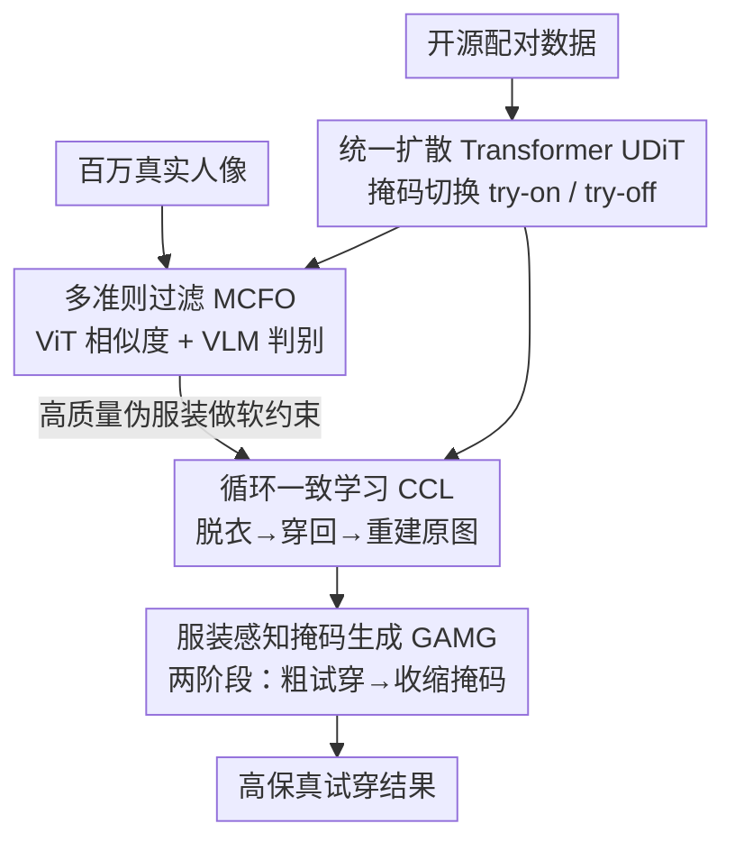

# High-Fidelity Virtual Try-On beyond Paired Data Scarcity via Diffusion-based Cycle-Consistent Learning

**会议**: CVPR 2026  
**论文**: [CVF Open Access](https://openaccess.thecvf.com/content/CVPR2026/html/Wu_High-Fidelity_Virtual_Try-On_beyond_Paired_Data_Scarcity_via_Diffusion-based_Cycle-Consistent_CVPR_2026_paper.html)  
**代码**: 待确认  
**领域**: 扩散模型 / 虚拟试穿  
**关键词**: 虚拟试穿, 循环一致性, 扩散模型, 无配对数据, 掩码生成

## 一句话总结
CCVTON 用一个统一扩散 Transformer 同时学会"脱衣"（try-off）和"穿衣"（try-on），把海量无标注的真实人像照片组织成"脱了再穿回去"的重建循环来训练，从而摆脱对稀缺配对数据的依赖，并配套一个两阶段服装感知掩码机制抑制原服装泄漏，在 VITON-HD 和 DressCode 上取得 SOTA。

## 研究背景与动机

**领域现状**：扩散模型已经成为虚拟试穿（VTON）的主流，做法是把目标服装作为条件（ReferenceNet 提服装特征、或直接把人像与服装拼接成联合输入），让扩散骨干在 in-context 注意力里完成服装到人体的迁移。

**现有痛点**：这类方法几乎都依赖**对齐的"服装-人像"配对数据**做监督。但开源数据集（VITON-HD、DressCode）只有几万对，远覆盖不了真实世界里服装/姿态/场景的多样性；真实人像照片虽多，但要把它们整理成高质量配对成本极高。一些工作用生成式数据增强来补，但合成的配对常有对应关系错位、姿态-服装组合不真实等噪声，反而拖累训练。

**核心矛盾**：VTON 的性能上限被"干净大规模配对数据"卡死——既缺数据，造数据又引噪声。除此之外还有第二个矛盾：inpainting 范式严重依赖服装掩码，**掩码太小会泄漏原服装的形状纹理，掩码太大又会覆盖掉本该保留的身体部位（手、腰带）导致比例失真**，二者难以兼得。

**本文目标**：(1) 让训练能直接吃海量"无配对"的真实人像；(2) 设计一个既能抑制服装泄漏、又能保持人体一致性的掩码机制。

**切入角度**：作者注意到，一张人像照片本身就同时含有"人"和"穿在身上的服装"两类信息——如果模型能先把服装从人身上"脱下来"（try-off），再把这件服装"穿回"同一个人（try-on），那么**原始人像本身就是天然的监督信号**，无需任何配对标注。

**核心 idea**：用一个**权重共享的统一模型**同时承担 try-off 和 try-on，构成"脱→穿→重建原图"的循环一致性训练，把无配对真实人像变成可用的训练数据。

## 方法详解

### 整体框架
CCVTON 基于 Flux.1 整流流（rectified flow）扩散骨干，整条管线分四步：先在开源配对数据上**预训练一个统一扩散 Transformer（UDiT）**，让它通过任务掩码切换、同时具备 try-on 和 try-off 能力；再用预训练好的 UDiT 在百万级真实人像上"脱衣"得到伪服装，经 **MCFO 多准则过滤**留下高质量样本；然后进入核心的 **循环一致学习（CCL）**——对一张人像先 try-off 脱出服装、再 try-on 穿回被遮挡的同一个人，用重建原图的损失端到端微调；推理时用 **GAMG 两阶段服装感知掩码** 抑制泄漏、保住身体结构。

输入是人像 $P$ 与（可选的）服装 $G$，输出是穿上目标服装后的人像。try-on / try-off 由施加在拼接输入 $I=[G\,\|\,P]$ 上的二值掩码控制：try-on 用 $M_{on}=[0\,\|\,M_p]$ 遮住人身上的服装区，try-off 用 $M_{off}=[1\,\|\,0]$ 遮住服装侧，从而**全参数共享**。

### 关键设计

**1. 统一扩散 Transformer（UDiT）：用一个模型 + 任务掩码同时干 try-on 和 try-off**

VTON 循环需要"脱"和"穿"两个能力，若用两套网络既费参数又难以共享语义。UDiT 把两者塞进**同一个 DiT**：输入永远是水平拼接的 $I=[G\,\|\,P]\in\mathbb{R}^{H\times 2W\times 3}$，靠施加的二值掩码 $M\in\{M_{on}, M_{off}\}$ 决定当前是穿还是脱，实现完全参数共享。预训练在开源配对数据上用整流流匹配损失 $\mathcal{L}^{(a)}_{\text{flow}}=\mathbb{E}\big[\|\upsilon_\theta(z_t, M, t, c)-(\epsilon-z_0)\|_2^2\big]$，并叠加一个只在掩码区计算的 DISTS 感知损失 $\mathcal{L}^{(a)}_{\text{perc}}=\mathcal{DISTS}(\hat I^{(a)}\odot(1-M), I\odot(1-M))$，总损失 $\mathcal{L}_{\text{uni}}=\mathcal{L}^{(a)}_{\text{flow}}+\lambda\mathcal{L}^{(a)}_{\text{perc}}$。这一步是后续循环的"地基"：先让模型具备基本的脱/穿手感，才能在无配对数据上自我重建。

**2. 多准则过滤（MCFO）：双重把关，挡掉脱衣产出的脏样本**

UDiT 在真实人像上"脱衣"得到的伪服装 $\hat G^{(b)}$ 质量参差，直接拿去训练会引噪声。MCFO 对每个 $\hat G^{(b)}$ 做两道独立检验：**ViT 相似度**用 CondViT 计算 $\hat G^{(b)}$ 与人像中对应服装区域的余弦相似度，分数低说明脱衣出错或有伪影，直接拒绝；**VLM 判别**用 Qwen-VL 对 $(\hat G^{(b)}, P)$ 配对输入做二值判断，专门检水印、残留肢体、形状异常等语义瑕疵。只有两关都过的样本才保留，得到高质量伪配对 $(\hat G^{(b)}, P)$。作者在 100 万真实人像上过滤后约保留 70%。

**3. 循环一致学习（CCL）：原始人像就是监督信号，软约束防"偷懒抄袭"**

这是全文核心。对一张人像，先用 try-off 分支脱出服装 $\hat G^{(c)}=\mathrm{CCL}_{\text{off}}([G^{(c)}\,\|\,P]\odot(1-M_{off}))$，再把它喂给 try-on 分支穿回被遮挡的同一个人 $\hat P^{(c)}=\mathrm{CCL}_{\text{on}}([\hat G^{(c)}\,\|\,P]\odot(1-M_{on}))$。循环一致损失只约束**人像重建**——衡量 $\hat P^{(c)}$ 与原图 $P$ 的差距（$\mathcal{L}_{cyc}=\mathcal{L}^{(c)}_{\text{flow}}+\lambda\mathcal{L}^{(c)}_{\text{perc}}$），$\hat G^{(c)}$ 只是中间表示，**原始人像 $P$ 充当通用监督**，无需任何配对标注。

但只约束重建会让 try-off 分支"作弊"：直接把服装从 $P$ 里照抄过去就能让循环闭合。为此引入一个 VGG 感知正则 $\mathcal{L}_{\text{reg}}=\|\phi(G^{(c)})-\phi(\hat G^{(c)})\|_2^2$，强制脱出的服装在语义上对齐参考服装 $G^{(c)}$（开源数据时取真值 $G$，野外数据时取 MCFO 筛过的 $\hat G^{(b)}$）。关键是**用感知正则而非像素损失**——因为 $\hat G^{(b)}$ 只是伪标签可能含伪影，感知约束故意降低对细节的敏感度，只逼 try-off 学到结构上解耦、语义上忠实的服装表示。总目标 $\mathcal{L}_{ccl}=\mathcal{L}_{cyc}+\beta\mathcal{L}_{reg}$。

**4. 服装感知掩码生成（GAMG）：两阶段先放后收，泄漏与一致性兼得**

针对掩码大小的两难，GAMG 在推理时分两步走。先构造 **cloth-bbox 掩码**（④）：取服装区最小外接框（bbox 掩码 ③）与 cloth-agnostic 掩码（①）的重叠，并在训练/推理时做随机膨胀——四个方向按 $\delta\sim U(0, 0.3)$ 的随机比例扩张，抹掉原服装的长度、宽松度等线索，逼模型依赖目标服装与姿态先验而非照抄原图。**Stage 1** 用这个膨胀的 cloth-bbox 掩码做粗试穿，大覆盖给了"短袖→长袖"这类形变足够自由度，配 DensePose 姿态先验保住身体结构，产出粗结果 $\hat P^{(c,1)}$。**Stage 2** 再解析 $\hat P^{(c,1)}$ 与原图 $P$ 定位合成服装的实际覆盖、结合 DensePose 语义身体掩码，**收缩**成一个贴合且语义明确的紧掩码，排除手脚等不该被遮挡的稳定身体部位，喂回 try-on 分支得到最终结果 $\hat P^{(c,2)}$，在保住身份一致性的同时精确生成目标服装。

### 损失函数 / 训练策略
- 预训练（UDiT）：$\mathcal{L}_{\text{uni}}=\mathcal{L}^{(a)}_{\text{flow}}+\lambda\mathcal{L}^{(a)}_{\text{perc}}$（整流流匹配 + 掩码区 DISTS 感知损失）。
- 循环微调（CCL）：$\mathcal{L}_{ccl}=\mathcal{L}_{cyc}+\beta\mathcal{L}_{reg}$（人像重建 + VGG 感知正则防塌缩）。
- 推理：35 步去噪（Stage 1 用 10 步，Stage 2 用 25 步），分辨率 $1024\times768$。

## 实验关键数据

### 主实验
在 VITON-HD（11,647/2,032 训练/测试对）和 DressCode（48,392/5,400）上评测，paired 与 unpaired 双设置；额外采集约 100 万真实人像、MCFO 后留约 70% 用于循环微调。

| 数据集 | 设置 | 指标 | 之前最好 (Leffa) | CCVTON |
|--------|------|------|------------------|--------|
| VITON-HD | Paired | FID↓ / KID↓ | 5.189 / 0.488 | **4.814 / 0.171** |
| VITON-HD | Paired | SSIM↑ / LPIPS↓ | 0.857 / 0.065 | **0.895 / 0.056** |
| VITON-HD | Unpaired | FID↓ / KID↓ | 8.534 / 0.609 | **8.521 / 0.561** |
| DressCode | Paired | FID↓ / KID↓ | 4.806 / 1.218 | **2.930 / 0.543** |
| DressCode | Paired | SSIM↑ / LPIPS↓ | 0.877 / 0.073 | **0.911 / 0.042** |
| DressCode | Unpaired | FID↓ / KID↓ | 6.610 / 1.781 | **5.820 / 1.727** |

> 注：FID/KID 衡量生成图与真实分布的距离（越低越真实），SSIM/LPIPS 衡量与真值服装的结构/感知相似度。CCVTON 在两个数据集、两种设置下几乎全部指标 SOTA，DressCode paired 的 KID 从 1.02（CatVTON）级别压到 0.543，提升最显著。

### 消融实验
在 VITON-HD 上用 Flux.1.Fill 骨干跑五个受控变体（✓ 表示启用对应组件）：

| Exp | UDiT | CCL | GAMG | Paired FID↓ | Paired KID↓ | Paired SSIM↑ | Unpaired FID↓ |
|-----|------|-----|------|-------------|-------------|--------------|---------------|
| 0 (BASE) | | | | 5.995 | 0.737 | 0.884 | 9.023 |
| 1 (仅 GAMG) | | | ✓ | 5.890 | 0.567 | 0.868 | 8.903 |
| 2 (+UDiT) | ✓ | | | 5.995 | 0.557 | 0.840 | 9.068 |
| 3 (+MCFO 伪配对) | ✓ | (typical) | ✓ | 6.439 | 0.636 | 0.861 | 9.135 |
| 4 (+CCL) | ✓ | ✓ | | 5.148 | 0.407 | 0.883 | 8.561 |
| 5 (CCVTON 全量) | ✓ | ✓ | ✓ | **4.814** | **0.171** | **0.895** | **8.521** |

### 关键发现
- **直接拿 MCFO 伪配对做常规配对训练（Exp.3）反而退步**：FID 从 Exp.2 的 5.995 升到 6.439——合成服装的非真实纹理和残留伪影会污染训练。这正是 CCL 把伪服装"踢出重建损失、只当感知正则"的动机。
- **CCL 是涨点主力（Exp.4 vs Exp.3）**：把伪配对训练换成循环一致学习后，所有指标全面变好（Paired FID 6.439→5.148），说明"用原图当监督 + 软约束防塌缩"比"硬造配对"更有效。
- **GAMG 是最后一块拼图（Exp.5 vs Exp.4）**：推理期加入两阶段掩码，Paired KID 从 0.407 骤降到 0.171，验证抑制泄漏对感知保真度的直接贡献。
- 在野外跨品类、人到人迁移、非正面视角等困难场景下，CCVTON 相比基线更少出现肢体扭曲、接缝错位、比例失真。

## 亮点与洞察
- **"脱衣即造数据"的视角很巧**：把虚拟试穿的逆操作（try-off）变成数据引擎，让一张普通人像照片自带监督信号，绕开了配对数据这个老大难——这个 self-supervision 思路可迁移到任何"正向变换有逆操作"的生成任务。
- **感知正则替代像素损失防塌缩**是点睛之笔：循环一致最怕模型走捷径照抄，作者没有用更强的像素约束（那样会把伪标签的伪影也学进去），而是用 VGG 感知约束只锁语义、放松细节，恰好契合伪标签"结构对、细节脏"的特点。
- **掩码"先放后收"两阶段**把一个静态超参（掩码大小）变成动态过程：Stage 1 大掩码换形变自由度、Stage 2 借粗结果反推紧掩码护身体，思路可复用到其他 inpainting 编辑任务。

## 局限与展望
- 依赖一个能力够强的预训练 UDiT 来产出可用的伪服装；若 try-off 本身质量差，MCFO 会过滤掉大量样本，循环训练的数据红利会缩水。
- MCFO 的 VLM 判别（Qwen-VL）和 ViT 相似度阈值是工程化筛选，论文未给出阈值敏感性分析，过滤标准的鲁棒性存疑 ⚠️。
- 两阶段推理需要 35 步去噪 + DensePose/解析两次掩码构造，推理开销高于单阶段方法，实时性受限。
- 评测仍在 VITON-HD / DressCode 这类相对规整的测试集上报指标，野外效果主要靠定性图展示，缺乏野外定量基准。

## 相关工作与启发
- **vs CatVTON**：CatVTON 直接拼接人像与服装做联合输入、靠注意力交互，但仍需配对数据监督；CCVTON 同样用拼接输入，但把它组织成 try-off/try-on 循环，从而能吃无配对数据。
- **vs 基于 ReferenceNet 的 IDM-VTON / OOTDiffusion / Leffa**：它们用额外分支提服装特征注入骨干，参数和配对依赖都更重；CCVTON 用单一权重共享 UDiT，省掉独立 ReferenceNet。
- **vs GAN 循环方法 DCTON / CycleVTON 及扩散循环变体**：这些方法虽也用重建循环，但仍依赖配对服装-人像来监督循环；CCVTON 的关键区别是**循环只约束人像重建、服装当中间量**，真正实现了用野外人像训练。
- **vs PromptDresser / TPD 的两阶段掩码**：PromptDresser 常产出过度扩张的掩码、TPD 受分割精度限制；GAMG 通过 cloth-bbox + 随机膨胀 + DensePose 收缩，在泄漏与一致性间取得更细的平衡。

## 评分
- 新颖性: ⭐⭐⭐⭐⭐ "脱衣造数据 + 循环一致"把配对数据瓶颈转成自监督问题，视角新颖
- 实验充分度: ⭐⭐⭐⭐ 两数据集双设置 + 五级消融清晰，但野外效果缺定量基准
- 写作质量: ⭐⭐⭐⭐ 动机-方法-消融逻辑顺畅，公式与图配合到位
- 价值: ⭐⭐⭐⭐ 直击 VTON 落地的核心痛点（数据稀缺），方法可复用性强

<!-- RELATED:START -->

## 相关论文

- [\[CVPR 2026\] PROMO: Promptable Outfitting for Efficient High-Fidelity Virtual Try-On](promo_promptable_virtual_tryon_efficient.md)
- [\[CVPR 2026\] Garments2Look: A Multi-Reference Dataset for High-Fidelity Outfit-Level Virtual Try-On with Clothing and Accessories](garments2look_a_multi-reference_dataset_for_high-fidelity_outfit-level_virtual_t.md)
- [\[CVPR 2026\] Cycle-Consistent Tuning for Layered Image Decomposition](cycle-consistent_tuning_for_layered_image_decomposition.md)
- [\[CVPR 2025\] Shining Yourself: High-Fidelity Ornaments Virtual Try-on with Diffusion Model](../../CVPR2025/image_generation/shining_yourself_high-fidelity_ornaments_virtual_try-on_with_diffusion_model.md)
- [\[CVPR 2026\] High-Fidelity Diffusion Face Swapping with ID-Constrained Facial Conditioning](high-fidelity_diffusion_face_swapping_with_id-constrained_facial_conditioning.md)

<!-- RELATED:END -->
