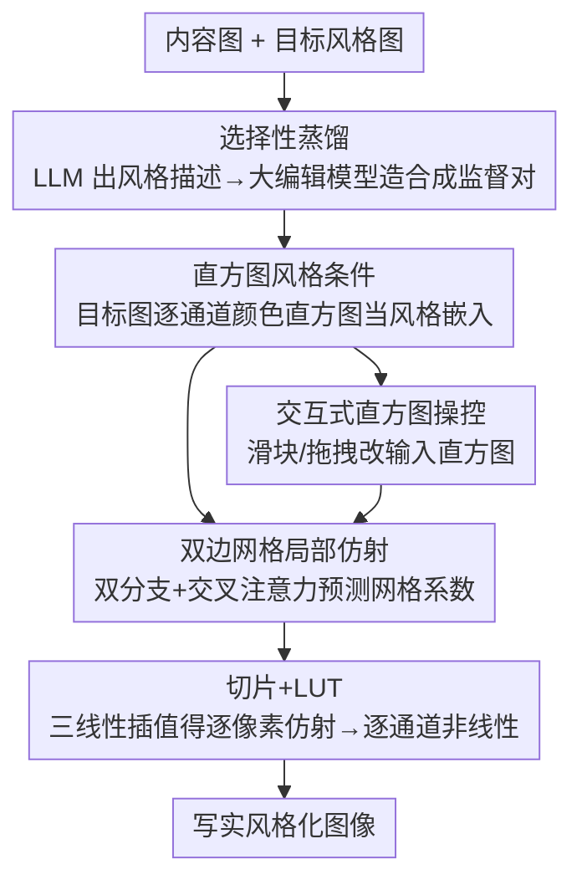

# Hist2Style: Histogram-Guided Stylization with Bilateral Grids

**会议**: CVPR 2026  
**论文**: [CVF Open Access](https://openaccess.thecvf.com/content/CVPR2026/html/Galor_Hist2Style_Histogram-Guided_Stylization_with_Bilateral_Grids_CVPR_2026_paper.html)  
**代码**: 项目页 dgalor.github.io/hist2style/（论文未给出明确仓库链接）  
**领域**: 图像生成 / 写实风格迁移  
**关键词**: 写实风格迁移、双边网格、直方图条件、模型蒸馏、实时调色

## 一句话总结
Hist2Style 把一个大型图像编辑模型蒸馏进一个仅 1.5M 参数的轻量网络，用「双边网格 + 颜色直方图条件」把风格迁移限制成局部仿射的色调/色彩变换，从而在保住内容结构、杜绝幻觉的同时，做到高分辨率实时、且用户可以直接拖动直方图交互调色。

## 研究背景与动机
**领域现状**：写实风格迁移（photorealistic style transfer）要把目标图的色彩、色调搬到输入图上，同时保住内容的结构与边缘。经典做法是全局颜色统计匹配（Reinhard、IDT 等），近年则有神经风格迁移以及把约束做成双边网格 / 局部 LUT 的写实方法（Xia et al.、PhotoWCT2、SA-LUT 等）。

**现有痛点**：作者把矛头对准了「用大型图像编辑模型（Flux Kontext、Qwen Image Edit 这类基础模型）做调色」这条新路线，指出它有三个硬伤——**性能**（为通用性牺牲效率，算力、显存、推理时间都很高）、**幻觉**（会引入身份漂移、结构扭曲等破坏写实性的伪影）、**可控性**（用文本/图像提示很难精确表达细微的色彩与色调意图）。而传统全局颜色统计法又缺乏空间与语义感知，源图与目标图差异大时会出现"颗粒感"等伪影。

**核心矛盾**：表达力（大模型的语义先验）和写实约束 / 效率 / 可控性之间存在矛盾——越通用越容易幻觉、越慢、越难控；越受约束（纯分布匹配）越没有空间感知。

**本文目标**：要一个既能借用大编辑模型语义先验、又不会幻觉、还能实时高分辨率、且让用户精确控制色彩色调的写实风格化器。

**切入角度**：把大模型「选择性蒸馏」进一个专精的小网络，并在网络结构上**用双边网格把编辑空间限制为局部仿射变换**——结构不可能被破坏（写实性"by construction"），同时把风格表征换成可解释、可编辑的颜色直方图。

**核心 idea**：用「直方图条件 + 双边网格」代替「文本提示 + 自由生成」，把写实风格迁移从条件生成退回成受约束的局部色彩变换，换来无幻觉、实时和可交互控制。

## 方法详解

### 整体框架
Hist2Style 的输入是一张内容图 $I_c$ 加一个风格嵌入（目标图的逐通道颜色直方图），输出是写实风格化后的图像。整条管线分两半：**离线选择性蒸馏**先用 LLM 程序化生成多样的写实风格描述（如"Golden Hour""1950s Film Noir"），驱动大图像编辑模型把标准照片数据集编辑成各种风格变体，构成合成的"内容图—风格化真值"监督对；**在线轻量网络**则是一个双分支结构——内容分支用 ConvNeXt 卷积编码器把降采样后的内容图编码、风格分支用 1D ConvNeXt 编码颜色直方图序列得到一个全局风格 token，两者经交叉注意力融合后送进输出头，预测一个空间自适应的**双边网格**（局部仿射系数）。网格通过三线性插值"切片"到每个像素得到逐像素仿射变换，作用在内容图上，再过一层可学习的逐通道非线性（LUT），产出风格化图像。训练时用合成真值的直方图作为条件，在 VGG 感知空间用回归损失监督。

### 关键设计

**1. 选择性蒸馏：只学大编辑模型的写实调色能力**

针对大编辑模型"慢 + 幻觉 + 难控"，作者不直接用它推理，而是把它当**老师**蒸馏出一个专精小学生。具体地，先 prompt 一个 LLM 生成大量写实风格的名字与描述，再用这些描述去指令大编辑模型，把一个标准摄影数据集（Unsplash Lite，约 25K 图）里每张图编辑成多种风格变体（平均每图约 6–7 个变体 ⚠️ 原文 OCR 为"6 7"，疑为 6–7），这些变体在不同内容图之间风格保持一致。小网络只负责模仿老师的**色彩/色调编辑**，放弃了内容生成能力，因此天然避开了老师会犯的结构幻觉。训练前还会自动过滤掉老师生成时出问题的样本（细节在补充材料）。这一步的意义在于：把基础模型的语义先验"压"进一个 1.5M 参数的网络，推理成本下降一个数量级。

**2. 双边网格做写实约束：把编辑限死成局部仿射**

针对"幻觉/结构破坏"，作者用双边网格（bilateral grid）从结构上保证写实。双边网格在每个网格单元存一个仿射变换，并用一个由 RGB 学出来的引导维度 $g:\mathbb{R}^3\to\mathbb{R}$（相当于亮度维）来编码图像边缘，从而能紧凑地表示"局部仿射、边缘保持"的图到图函数。它把变换的分辨率和图像分辨率解耦：对内容图 $I_c$（$H\times W\times 3$），网络预测一个 $(G_g,G_h,G_w)=(8,16,16)$ 的网格，每个格点存一个 $3\times4=12$ 个标量的仿射变换，外加一个 premultiplied 的 $\alpha$ 值衡量不确定性。推理时用三线性插值把网格"切片"成逐像素仿射并作用到内容图，仿射系数除以切片得到的 $\alpha$。因为变换被限制成局部仿射，内容结构不可能被改写——这就是"写实性 by construction"，也是它能直接放大到 4096² 分辨率的关键。

**3. 直方图风格条件 + 双目标损失：可解释、可控且兼顾空间**

针对"可控性差"，作者用目标图的**逐通道（边缘）颜色直方图**当风格嵌入，而不是 VGG 特征或文本嵌入。直方图来自传统修图的基本工具，天然可解释、可直接编辑；但单纯做分布匹配（不顾空间结构）会出伪影。于是作者同时优化两个目标：空间上用输出与真值之间的 MSE；分布上用一维 Wasserstein-2 距离的平方近似——按通道把像素排序后算 MSE（Algorithm 1：逐通道排序 $x_c,y_c$，取 $d_c=\lVert x_c-y_c\rVert^2$，再对通道求均值）。两个损失都放在 VGG 感知空间算，作者发现这比在像素颜色空间算泛化更好（归因于合成数据集本身有瑕疵）。这样模型同时学到了"分布对齐"和"空间一致"，既保住了直方图的可控性，又避免了纯分布匹配的伪影。

**4. 交互式直方图操控：把全局意图翻译成局部一致的编辑**

直方图条件天然支持一种交互界面：用户不直接改输出，而是去改喂给网络的输入直方图，网络再把这个全局意图翻译成对当前图像自适应的局部修改。作者在 Y'CbCr 空间实现了一组滑块——曝光 $E\in[0,1]$（亮度通道乘性因子）、对比 $C\in[0,\infty]$（在亮度峰值的 delta 函数与原亮度直方图之间插值）、U-shift / V-shift $\in[-1,1]$（水平移动 Cb/Cr 通道质量）、平滑 $S\in[0,1]$，外加一个作用在模型输出上的 amount 滑块 $A\in[-\infty,\infty]$（在恒等变换 $A=0$ 与模型预测 $A=1$ 之间插值）。除了滑块，还可"直接拖拽直方图"手动雕刻某个 luma/chroma bin 的质量，而模型会保证变换仍服从写实图像统计。这套设计复刻了摄影师熟悉的调色曲线工作流，却始终在直方图空间操作，给出可解释、精确的色彩色调控制。

### 损失函数 / 训练策略
模型用 PyTorch + PyTorch Lightning 实现，Adam（lr $3\times10^{-4}$，$\beta=(0.9,0.99)$）+ 一个 epoch 的线性 warm-up。模型 1.5M 参数，在单张 A100 上训练 1127 个 epoch（每 epoch 22.5K 图），batch 64。训练时 dataloader 对每张内容图随机采两个风格变体：一个当输入内容图，另一个同时当风格图和真值图；并配合随机水平翻转、resized crop 等增广。

## 实验关键数据

### 主实验
训练数据由 Unsplash Lite（25K 高质量图）合成，平均每图约 6–7 个风格变体，训练分辨率 256×256。评测集是从 Unsplash 另选 200 张内容图、人工精选出 136 张自然图，加 19 张未出现在训练集的风格图。作者用一项双选匿名用户研究对比 SOTA 写实风格迁移方法，并报告运行时、内存、循环一致性、配色分数等标准指标。

用户研究（3,000 次有效对比，来自 31 位摄影专家），报告 Hist2Style（H2S）对每个 baseline 的胜 / 平 / 负比例：

| 对比方法 | H2S 胜 % | 平 % | 负 % |
|--------|---------|------|------|
| SA-LUT | 82.57 | 3.56 | 13.86 |
| WCT2 | 72.58 | 5.85 | 21.57 |
| Xia et al. | 73.24 | 4.10 | 22.66 |
| IDT | 73.75 | 3.01 | 23.25 |
| D-LUT | 70.59 | 3.04 | 26.37 |
| PhotoWCT2 | 61.62 | 6.26 | 32.12 |

H2S 对任一单一方法都赢下 >61% 的对比；对最强的 PhotoWCT2，扣除约 6% 平局后，PhotoWCT2 的胜率仍 <33%。作者把每个 baseline 的 **User Score** 定义为「它对 H2S 的胜率 + 一半平局率」（即 H2S Lose % + ½·Tie %），用于和其它指标对比。SA-LUT 偏低据作者解释是因为它在 log 编码图上训练，在 RGB 上吃亏。

运行时对比（秒，跨分辨率），Hist2Style 与 Xia et al. 是新内容-风格对上最快的：

| 方法 | 256² | 512² | 1024² | 2048² | 4096² |
|------|------|------|-------|-------|-------|
| Hist2Style | 0.001 | 0.003 | 0.009 | 0.04 | 0.1 |
| Xia et al. | 0.003 | 0.003 | 0.004 | 0.008 | 0.03 |
| D-LUT | 100 | 100 | 100 | 100 | 100 |
| SA-LUT | 0.2 | 0.2 | 0.2 | 0.2 | 0.2 |
| PhotoWCT2 | 0.3 | 0.3 | 0.3 | 0.4 | 1 |
| IDT | 0.1 | 0.2 | 0.3 | 0.4 | 0.9 |
| WCT2 | 0.04 | 0.07 | 0.1 | 0.4 | OOM |
| ReHistoGAN | 0.01 | 0.08 | 0.47 | 2.22 | 8.83 |

D-LUT 对新风格图需要昂贵的摊销成本（若风格已知则很快）；WCT2 在 4096² 直接 OOM。相对 PhotoWCT2，Hist2Style 在运行时和峰值显存上都有约一个数量级的改善。

### 消融实验
论文的消融以定性图（Fig. 8）为主呈现模型组件与训练设置的影响，正文未给出完整数值消融表，下表按论文叙述整理关键结论：

| 维度 | 结论 | 说明 |
|------|------|------|
| 双边网格（局部仿射约束） | 保证写实性 + 可放大到 4096² | 结构不可被改写，分辨率与变换解耦 |
| 感知空间损失（VGG） | 优于像素颜色空间 | 对合成数据瑕疵更鲁棒，泛化更好 |
| 直方图条件 | 提供可解释、可交互控制 | 替代 VGG/文本嵌入，支持滑块与拖拽 |

### 关键发现
- 把写实约束"烤"进网络结构（双边网格局部仿射）是无幻觉 + 可放大的根本原因，而非靠后处理修补。
- 直方图当条件不只是可控性收益：因为它是可编辑的全局统计量，用户改输入直方图就能驱动模型做出对图像自适应的局部编辑。
- 损失放在 VGG 感知空间比在颜色空间更好，作者把这归因于合成训练集本身不完美——在感知空间算能容忍这些瑕疵。

## 亮点与洞察
- **"by construction" 的写实性**：与其训练后再约束，不如把约束做进结构——双边网格只能表达局部仿射，结构天然保不变。这是把"防幻觉"从损失项升级成结构先验的好例子。
- **直方图既是条件又是 UI**：同一个表征既喂网络又给用户拖拽，可解释性和可控性一次拿到，复刻了摄影师的调色曲线直觉。
- **选择性蒸馏的思路可迁移**：用 LLM 程序化造 prompt + 大编辑模型造监督对，把基础模型某一类专项能力蒸馏进小网络，这套"造数据—蒸馏—结构约束"组合拳可搬到其它需要实时、防幻觉的图像编辑子任务。

## 局限与展望
- 方法的能力上限受老师（大编辑模型）和合成数据质量约束——作者自己承认合成集有瑕疵，并靠感知空间损失和数据过滤来缓解。
- 风格被定义为"颜色 + 色调"，内容定义为"结构 + 边缘"，因此**只做写实调色**，无法做需要内容生成 / 重打光 / 物体替换这类编辑（这是有意取舍）。
- 用户研究虽然样本量大（3,000 trials / 31 专家），但本质是主观偏好；论文提出了一个 VLM 的 SQA（Stylization Quality Assessment）自动指标来辅助，但其与人类偏好的对齐程度仍依赖该 VLM 评判 ⚠️（SQA 定义细节在缓存中只给了高层描述）。

## 相关工作与启发
- **vs 大图像编辑模型（Flux Kontext / Qwen Image Edit）**：它们做通用条件生成、表达力强但慢且易幻觉、难精控；本文牺牲通用性换来无幻觉 + 实时 + 可控，把它们当老师蒸馏。
- **vs Xia et al.（双边网格写实迁移）**：同样用双边网格做局部仿射约束，本文额外引入直方图条件与交互界面、并用大模型蒸馏的合成数据训练；运行时两者都属最快一档（Xia 在超高分辨率甚至更快）。
- **vs PhotoWCT2 / SA-LUT / D-LUT**：都属"约束变换空间"的写实迁移；本文在用户偏好上领先（对 PhotoWCT2 胜率仍 >61%），并在运行时和显存上约一个数量级更优。
- **vs 经典颜色统计法（Reinhard / IDT）**：继承了"保结构"的写实精神，但补上了空间与语义感知，避免源/目标差异大时的颗粒感伪影。

## 评分
- 新颖性: ⭐⭐⭐⭐ 把双边网格 + 直方图条件 + 大模型蒸馏组合成一套写实可控管线，组件多为已有但组合与"直方图即 UI"的洞察很到位
- 实验充分度: ⭐⭐⭐⭐ 3,000 次专家用户研究 + 跨分辨率运行时对比扎实，但数值消融偏弱（以定性图为主）
- 写作质量: ⭐⭐⭐⭐ 动机—约束—收益的逻辑链清晰，方法可复述
- 价值: ⭐⭐⭐⭐ 实时、防幻觉、可交互的写实调色对生产工作流很实用，1.5M 参数易部署

<!-- RELATED:START -->

## 相关论文

- [\[CVPR 2026\] EmoStyle: Emotion-Driven Image Stylization](emostyle_emotion-driven_image_stylization.md)
- [\[CVPR 2026\] Learnability-Guided Diffusion for Dataset Distillation](learnability-guided_diffusion_for_dataset_distillation.md)
- [\[ICCV 2025\] Balanced Image Stylization with Style Matching Score](../../ICCV2025/image_generation/balanced_image_stylization_with_style_matching_score.md)
- [\[CVPR 2026\] Prototype-Guided Concept Erasure in Diffusion Models](prototype-guided_concept_erasure_in_diffusion_models.md)
- [\[CVPR 2026\] Vinedresser3D: Agentic Text-guided 3D Editing](vinedresser3d_agentic_text-guided_3d_editing.md)

<!-- RELATED:END -->
