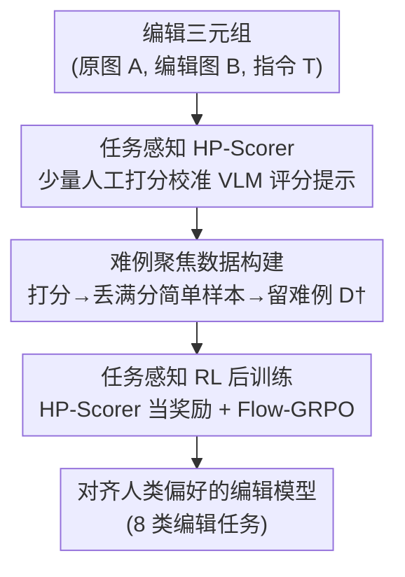

# HP-Edit: A Human-Preference Post-Training Framework for Image Editing

**会议**: CVPR 2026  
**论文**: [CVF Open Access](https://openaccess.thecvf.com/content/CVPR2026/html/Li_HP-Edit_A_Human-Preference_Post-Training_Framework_for_Image_Editing_CVPR_2026_paper.html)  
**代码**: 待确认  
**领域**: 图像生成 / 图像编辑 / 对齐RLHF  
**关键词**: 图像编辑、人类偏好对齐、RLHF、Flow-GRPO、VLM 奖励模型

## 一句话总结
本文提出 **HP-Edit**——一套面向图像编辑的人类偏好后训练框架：用少量人工打分数据微调一个基于 VLM 的自动评分器 **HP-Scorer**，再用它构建偏好数据集并充当奖励模型，通过 Flow-GRPO 在线后训练把预训练编辑模型（如 Qwen-Image-Edit-2509）对齐到人类偏好，同时配套发布 RealPref-50K 数据集与 RealPref-Bench 基准。

## 研究背景与动机
**领域现状**：图像编辑（I2I）的主流范式是在预训练 T2I 扩散骨干上做有监督微调（SFT），用大规模 I2I 数据获得编辑能力；近年 Diffusion-DPO、Flow-GRPO、Dance-GRPO 等 RL 方法在 T2I 生成质量上已展现潜力。

**现有痛点**：SFT 路线有两个硬伤——其一，SFT 数据来源混杂（卡通、合成图等），和真实世界的人类偏好对不上；其二，构建偏好对齐的编辑数据集需要昂贵的人工标注，规模化对齐几乎不可行。而把 RLHF 高效用到扩散式**编辑**上，至今基本是空白：缺可规模化的人类偏好数据集，也缺面向多样编辑子任务定制的框架。

**核心矛盾**：与开放式的 T2I 合成不同，I2I 编辑要同时满足**任务准确性**（如忠实地移除某个物体）和**偏好对齐**（结果要自然好看）。这个双目标要求一个框架既能低成本构建偏好数据，又能提供**任务感知**的奖励模型——现有工作两头都没解决，而且缺一个真实世界、物体类别均衡的编辑评测基准。

**本文目标**：搭一套后训练框架，用很少的人工打分把"自动评分器 + 高效数据构建 + 任务感知 RL"串起来，在保住编辑准确性的同时把模型对齐到人类偏好。

**切入角度**：作者观察到强预训练编辑模型（如 Qwen-Image-Edit-2509）在大多数场景下已经很好，原始数据里**大量样本都能拿满分**，RL 训练信号被这些"简单样本"稀释了。所以与其堆数据，不如聚焦**难样本**，再配一个能逼近人类判断的评分器当奖励。

**核心 idea**：用"少量人工打分 → 蒸出 VLM 评分器 HP-Scorer → 过滤掉满分简单样本只留难例 → 把 HP-Scorer 当奖励做 Flow-GRPO 后训练"，把昂贵的人类偏好对齐变成可规模化的自动闭环。

## 方法详解

### 整体框架
HP-Edit 是一条三阶段后训练流水线，核心都围绕一个 **HP-Scorer**（基于预训练 VLM、对每个编辑子任务定制评分提示的自动评分器）展开。**阶段一**用少量人工 0–5 打分把 HP-Scorer 校准到逼近人类判断；**阶段二**用 HP-Scorer 对大规模真实编辑案例打分、丢掉满分简单样本、只留难例，构建出可规模化的 RL 训练集 RealPref-50K；**阶段三**以 HP-Scorer 作奖励模型，对预训练编辑模型用在线 Flow-GRPO 后训练。输入是"原图 A + 指令 T"，预训练编辑模型 SDE 采样出一组候选编辑图，HP-Scorer 给每张打分并归一化成奖励，GRPO 用组内相对优势更新模型，让它输出更贴合高人类偏好分的结果。

### 关键设计

**1. 任务感知 HP-Scorer：用极少人工打分蒸出一个会"按任务标准评分"的 VLM**

人类偏好对齐最贵的就是标注，逐张人工评分无法规模化。HP-Edit 的破解办法是只收集每个子任务约 50–100 个编辑三元组（原图 A、编辑图 B、指令 T），由人工按统一的 **0–5 分**标准打分（0 完全不符指令、3 大体遵循但画质/美感欠佳、5 完全遵循且高质量真实），然后用一个预训练 VLM（如 Qwen3-VL、GPT-4o）配上**为每个子任务定制的评分系统提示**来逼近人类判断。评分提示从只含通用标准的基础版起步，**逐步加入任务特定的推理追问**（如物体交换任务追问"替换是否可行且明确指定？""原物体是否被完全替换？"），不断迭代直到 HP-Scorer 在收集到的三元组上与人工评分高度吻合。这样就把"人类偏好"固化进一个可无限调用的自动评分器，HP-Scorer 给出的分数也直接当作评测用的 HP-Score。

**2. 难例聚焦的数据构建：丢掉满分样本，把训练信号集中到模型真正不会的地方**

强预训练编辑模型在大部分案例上已经能拿满分，如果直接拿原始数据 $D$ 做 RL，一个训练 batch 里大量样本奖励饱和（都接近 5 分），梯度信号极弱、模型学不到东西（奖励曲线几乎不涨）。HP-Edit 的关键一步是**数据集过滤**：先采集大量真实世界编辑案例、按 MS-COCO 物体类别做均衡得到原始集 $D$，再用 HP-Scorer 打分后**丢弃满分（score 5）样本**得到最终训练集 $D^\dagger$。这一步把训练难度主动抬高、让模型聚焦低分难例，从而提供更有信息量的梯度、加快奖励提升——消融里这一步单独就把 HP-Score 从 4.391（原始数据）提到 4.577。

**3. 任务感知 Flow-GRPO 后训练：把确定性 ODE 转成 SDE，用 HP-Scorer 奖励在线对齐**

有了难例数据和评分器，第三阶段用在线 Flow-GRPO 做后训练。Flow Matching 的生成是确定性 ODE（$dx_t=v_t\,dt$）缺乏探索性，Flow-GRPO 把它转成边际概率密度等价的 SDE（在漂移项里加入 $\frac{\sigma_t^2}{2t}(x_t+(1-t)v_t)$ 并叠加 Wiener 噪声 $\sigma_t\,dw$），从而能在同一指令下采样出一组 $G$ 张图做组内比较。对每张图，HP-Scorer 打分 $s$ 经 sigmoid 归一化到 $[0,1]$ 当奖励：$r=\frac{1}{1+\exp(-\alpha s+\beta)}$（$\alpha=2,\beta=5$）；优势按组内统计归一化 $\hat A_i=\frac{R_i-\mathrm{mean}(\{R_j\})}{\mathrm{std}(\{R_j\})}$，再用带 clip 和 KL 正则的 GRPO 目标 $J=J_{\text{clip}}-\beta D_{KL}(\pi_\theta\|\pi_{\text{ref}})$ 更新。训练时冻结大部分基模参数、只训 rank=32 的轻量 LoRA，既保住预训练能力又稳。**任务感知**体现在奖励里的评分提示是按子任务定制的——同一个 GRPO 框架，奖励信号会随编辑任务类型自动切换标准。

### 损失函数 / 训练策略
后训练采用在线 Flow-GRPO，奖励来自任务定制的 HP-Scorer（训练时用 Qwen3-VL-32B-Instruct 而非 GPT-4o，因为外部 API 延迟不稳、偶发失败会干扰在线 RL）。基模 Qwen-Image-Edit-2509 大部分参数冻结，仅训练 rank 32 的 LoRA，AdamW 优化器，学习率 $3\times10^{-4}$。GRPO 目标含 clip 与对参考策略的 KL 正则以保证训练稳定。

## 实验关键数据

### 主实验
RealPref-Bench（1,638 例、8 类编辑任务、约 200 例/任务）上的 HP-Score（0–5，由 GPT-4o 基于 HP-Scorer 评分，越高越好）对比（节选）：

| 模型 | 整体 HP-Score | 人工分 | Relighting | Bokeh | Color |
|------|---------------|--------|-----------|-------|-------|
| Step1X-Edit | 4.07 | 3.89 | 3.922 | 4.696 | 4.174 |
| Qwen-Image-Edit | 3.919 | 4.005 | 4.549 | 4.539 | 4.574 |
| FLUX.1-Kontext-Dev | 3.59 | 3.345 | 3.99 | 4.23 | 4.116 |
| Qwen-Image-Edit-2509(基线) | 4.472 | 4.337 | 4.358 | 4.539 | 4.781 |
| **HP-Edit(本文)** | **4.667** | **4.554** | **4.75** | **4.733** | 4.781 |

HP-Edit 在整体 HP-Score 上从强基线 Qwen-Image-Edit-2509 的 4.472 提到 4.667，在全部 8 个子任务上均排第一；提升最明显的恰好是 color change、bokeh、relighting、background replacement 这类需要细粒度外观一致性和强真实感先验的任务——这些正是预训练模型容易翻车、偏好对齐最能补的地方。

泛化性：在 Step1X-Edit 的官方基准 GEdit-Bench-EN 上 HP-Edit 也取得 SOTA，语义一致性 G_SC、画质 G_PQ、整体 G_O 均领先，说明偏好对齐策略能迁移到既有标准基准。

### 消融实验

| 配置 | HP-Score | 说明 |
|------|----------|------|
| Baseline（预训练） | 4.472 | 未后训练 |
| BaseData + Base-Scorer | 4.391 | 原始未过滤数据 + 简单评分提示，反而掉点 |
| RealPref-50K + Base-Scorer | 4.577 | 只加难例过滤 |
| RealPref-50K + HP-Scorer（HP-Edit） | **4.667** | 难例过滤 + 任务感知评分器（完整） |

### 关键发现
- **难例过滤和评分器细化缺一不可**：用原始数据 + 简单评分器（4.391）反而比预训练基线（4.472）还低，说明原始数据里大量简单/噪声样本提供的是弱甚至误导性的 RL 信号；换上过滤后的 RealPref-50K 立刻涨到 4.577，再叠加任务感知 HP-Scorer 涨到 4.667，两个组件的贡献都被独立验证。
- **奖励曲线印证"满分样本稀释信号"假设**：原始数据（BaseData）奖励起点最高但几乎不涨（饱和），过滤后数据训练初期就有明显上升趋势，完整 HP-Edit 的曲线最稳最持续——直接坐实了"丢掉满分难例聚焦"的设计动机。
- **HP-Scorer 与人类高度一致**：5 名标注者对 1k+ 编辑对做用户研究（评指令遵循 + 画质），打分分布与 HP-Scorer 结果高度吻合，既证明 HP-Edit 有效，也反过来验证了 HP-Scorer 评分的人类对齐度。

## 亮点与洞察
- **"少量人工 → VLM 评分器 → 自动闭环"把偏好对齐规模化**：最巧的地方是只用每任务 50–100 条人工打分就蒸出一个可无限调用的任务感知奖励器，绕过了 RLHF 在编辑上最贵的标注瓶颈，这套蒸馏思路可迁移到任何"标注昂贵但有强 VLM 可借力"的对齐任务。
- **难例过滤是被低估的"免费午餐"**：仅仅丢掉满分样本就带来 +0.1 以上的提升，揭示了一个反直觉但通用的规律——当基模已经很强时，RL 数据的价值不在量而在"是否集中在模型不会的难例上"。
- **任务感知奖励**：同一个 GRPO 框架，靠子任务定制评分提示就能让奖励标准随编辑类型切换（移除任务问"是否干净移除"、换色任务问"是否串色"），把"一个奖励模型打天下"换成"按任务讲标准"，这对多子任务场景很有借鉴价值。

## 局限与展望
- HP-Scorer 是整个框架的天花板：奖励完全由 VLM 评分器决定，若它在某些子任务上和人类判断有系统性偏差，RL 会把模型对齐到"评分器偏好"而非真正的人类偏好；⚠️ 论文未给出 HP-Scorer 在各子任务上与人类的逐项一致性数值。
- 评测的"裁判"和"奖励"同源：主实验 HP-Score 由 HP-Scorer 体系给出，存在"既当运动员又当裁判"的潜在循环，虽有用户研究佐证，但跨独立评分体系的对比偏少。
- 只在 Qwen-Image-Edit-2509（及 FLUX.1-Kontext-dev）上验证，对更弱/架构差异更大的编辑骨干是否同样有效未充分展开。
- 难例过滤目前是"丢弃满分"的硬阈值策略，⚠️ 是否存在更细的难度加权方案（而非二值丢弃）值得探索。

## 相关工作与启发
- **vs Diffusion-DPO / Flow-GRPO（T2I 对齐）**：这些工作把偏好对齐用在开放式 T2I 生成上，HP-Edit 把战场搬到 I2I 编辑——编辑要同时满足任务准确性和偏好对齐的双目标，本文用任务感知评分器 + 难例数据专门应对这个 dual objective。
- **vs Qwen-Image-Edit-2509 / FLUX.1-Kontext（SFT 编辑骨干）**：它们靠大规模 SFT 获得编辑能力，但数据来源混杂、和真实人类偏好错位；HP-Edit 是在这些强骨干之上做后训练补齐"美感/真实感"这一层，二者是互补而非替代关系。
- **vs Step1X-Edit / BAGEL / X2Edit 等编辑 SOTA**：在 RealPref-Bench 和 GEdit-Bench-EN 上 HP-Edit 整体均领先，且配套发布了真实世界、物体均衡的 RealPref-50K 数据集与 RealPref-Bench 基准，补上了"缺真实世界偏好评测基准"的空白。

## 评分
- 新颖性: ⭐⭐⭐⭐ 把 RLHF 系统性地落到图像编辑、并用 VLM 评分器 + 难例过滤解决数据瓶颈，组合新颖；单个组件（GRPO、VLM 评分）非首创。
- 实验充分度: ⭐⭐⭐⭐ 8 类任务 + 两个基准 + 消融 + 奖励曲线 + 用户研究，较完整；但裁判与奖励同源、跨独立评分体系对比偏少。
- 写作质量: ⭐⭐⭐⭐ 三阶段流程清晰、动机（满分样本稀释信号）讲得透；部分数据集/评分提示细节需查补充材料。
- 价值: ⭐⭐⭐⭐⭐ 提供了可规模化的编辑偏好对齐范式 + 真实世界数据集与基准，对图像编辑社区的实用价值高。

<!-- RELATED:START -->

## 相关论文

- [\[CVPR 2026\] CARE-Edit: Condition-Aware Routing of Experts for Contextual Image Editing](care-edit_condition-aware_routing_of_experts_for_contextual_image_editing.md)
- [\[CVPR 2026\] Group Editing: Edit Multiple Images in One Go](group_editing_edit_multiple_images_in_one_go.md)
- [\[CVPR 2026\] OneHOI: Unifying Human-Object Interaction Generation and Editing](onehoi_unifying_human-object_interaction_generation_and_editing.md)
- [\[CVPR 2026\] GDRO: Group-level Reward Post-training Suitable for Diffusion Models](gdro_group-level_reward_post-training_suitable_for_diffusion_models.md)
- [\[CVPR 2026\] UniEdit-I: Training-free Image Editing for Unified VLM via Iterative Understanding, Editing and Verifying](uniedit-i_training-free_image_editing_for_unified_vlm_via_iterative_understandin.md)

<!-- RELATED:END -->
