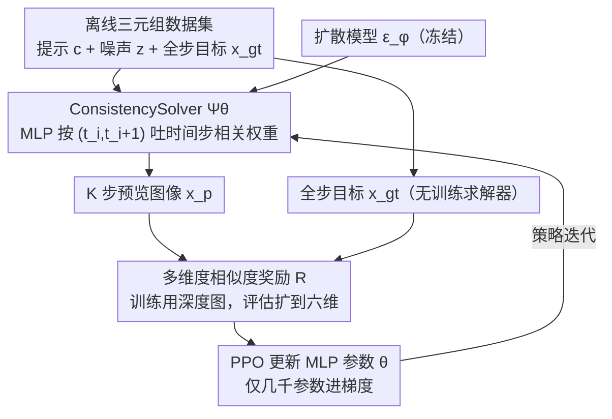

# Image Diffusion Preview with Consistency Solver

**会议**: CVPR 2026  
**arXiv**: [2512.13592](https://arxiv.org/abs/2512.13592)  
**代码**: [https://github.com/G-U-N/consolver](https://github.com/G-U-N/consolver)  
**领域**: 扩散模型 / 图像生成  
**关键词**: 扩散模型加速, ODE求解器, 强化学习, 预览-细化, 采样效率

## 一句话总结

本文提出 Diffusion Preview 范式和 ConsistencySolver——一个基于强化学习训练的轻量级高阶 ODE 求解器，在低步数采样时生成高质量预览图像并确保与全步数输出的一致性，用 47% 更少的步数达到与 Multistep DPM-Solver 相当的 FID，用户交互时间减少近 50%。

## 研究背景与动机

**领域现状**：扩散模型在高保真图像生成上表现卓越，但推理需要数值求解反向微分方程，计算量大。现有加速方法分为两类：无训练 ODE 求解器（DDIM、DPM-Solver、UniPC 等）和后训练蒸馏方法（LCM、DMD2 等）。

**现有痛点**：无训练求解器依赖理论假设，在低步数时生成质量差；蒸馏方法需要昂贵的重训练，会破坏 PF-ODE 的确定性映射（噪声空间到数据空间的对应关系），且蒸馏误差会累积导致生成质量下降。更关键的是，蒸馏模型通常失去了灵活的推理步数选择能力。

**核心矛盾**：用户在交互式生成（如设计原型）中需要快速预览多个变体来选择满意的方向，然后再做精细化。现有方法要么"快但质量差还不一致"（无训练求解器），要么"质量好但贵且破坏确定性"（蒸馏）。

**本文目标** 设计一个预览-细化（Preview-and-Refine）工作流，满足三个要求：(1) 预览保真度高（接近最终输出）；(2) 预览效率高（低步数）；(3) 预览与最终输出一致（相同随机种子产生视觉一致的结果）。

**切入角度**：不修改扩散模型本身，而是优化 ODE 求解器。将求解器的积分系数视为可学习策略，用强化学习搜索最优积分策略。

**核心 idea**：将 ODE 求解器系数参数化为轻量 MLP 并用 PPO 强化学习优化，使低步数采样最大化与全步数输出的相似度。

## 方法详解

### 整体框架

给定文本提示和噪声图，扩散模型 $\epsilon_\phi$ 预测去噪方向。可学习 ODE 求解器 $\Psi_\theta$ 用少量步数生成预览图像 $\mathbf{x}_p$，无训练求解器 $\Psi$ 用全步数生成目标图像 $\mathbf{x}_{gt}$。基于深度图、分割掩码、DINO 特征等计算相似度奖励 $\mathcal{R}$，通过 PPO 更新 $\theta$。

### 关键设计

**1. ConsistencySolver 的可学习参数化：把固定的理论系数换成时间步相关的权重**

无训练求解器在低步数时质量差，根子在于它们用的是一套**写死的积分系数**——这套系数是在"步数足够多、离散误差足够小"的理论假设下推导的，步数一压到 5～8 步假设就崩了。本文从通用线性多步法（LMM）出发，把每步更新写成 $\mathbf{y}_{t_{i+1}} = \mathbf{y}_{t_i} + (n_{t_{i+1}} - n_{t_i}) \cdot \big[\sum_{j=1}^{m} w_j(t_i, t_{i+1}) \cdot \epsilon_{i+1-j}\big]$（其中 $\mathbf{y}_t = \mathbf{x}_t / \alpha_t$ 为按噪声尺度归一化的状态），关键改动是让多步权重 $w_j$ 不再是常数，而是由一个轻量 MLP $\mathbf{f}_\theta(t_i, t_{i+1})$ 根据"当前时间步、目标时间步"两个标量动态吐出 $m$ 个权重。

这个形式的好处是它**向后兼容**整个经典求解器家族：DDIM 相当于一阶、固定权重的特例，DPM-Solver-2 相当于取中点近似的特例——它们都只是这套框架里权重取了某组固定值而已。一旦把权重打开成可学习的，求解器就能去拟合模型**实际的**采样动力学，而不是死守一套理论值，这正是它在 5～8 步区间能反超固定系数求解器的来源。

**2. 用 PPO 直接搜系数，而不是蒸馏出系数**

权重 MLP 怎么训？最一致性的目标是"低步预览要尽量贴近全步输出"，但这个一致性指标（深度图相似度等）往往**不可微**，没法直接对扩散轨迹反传。本文把求解过程当成一个序列决策问题用 PPO 来搜：先离线生成一批固定的三元组数据集 $\{(c^{(k)}, z^{(k)}, x_{gt}^{(k)})\}$（提示、噪声、全步目标）反复复用；每个 episode 抽一批三元组，让 MLP 驱动求解器展开 $K$ 步预览轨迹，每步转换中 MLP 同时输出系数和其概率；轨迹跑完后算相似度奖励 $\mathcal{R} = \text{Sim}(x_{gt}, x_p)$，再用标准 PPO 裁剪代理目标更新策略，优势用批内均值/标准差自归一化。

选 RL 而非蒸馏不是为新而新：蒸馏要么得让奖励可微、要么得穿过整条扩散轨迹回传，开销大且容易把误差累积进去；RL 则**兼容不可微奖励**、不碰扩散轨迹的梯度，而且只有那个几千参数的 MLP 进梯度计算，训练开销极低，泛化也更好（消融里 FID 20.39 vs 蒸馏版 22.91）。

**3. 多维度相似度奖励：一致性不能只看一个指标**

"预览和最终输出一致"是个多面的诉求——语义对不对、结构稳不稳、几何准不准，单一指标都盖不全。训练时默认用**深度图相似度**作为 RL 奖励（几何结构对低步采样最敏感，信号最稳）；评估时则展开成六个维度交叉验证：CLIP 语义对齐、DINO 结构一致性、Inception 感知相似度、SegFormer 分割精度、像素级 PSNR、深度一致性。这样既保证训练信号集中，又能在评估时确认预览确实在语义、结构、几何三个层面都忠实于全步结果，而不是只在某一项上刷分。

### 损失函数 / 训练策略

使用 PPO 裁剪代理目标，裁剪参数 $\epsilon \in (0,1)$。优势用批内均值和标准差归一化。训练时只更新轻量 MLP 参数（几千参数），扩散模型完全冻结。在 Stable Diffusion 上训练后，可直接迁移到 SD1.4、DreamShaper 甚至 SDXL 等不同架构和规模的模型。

## 实验关键数据

### 主实验

**Stable Diffusion 文本到图像生成（COCO 2017）**:

| 方法 | 步数 | FID↓ | CLIP↑ | DINO↑ | Depth↑ |
|------|------|------|-------|-------|--------|
| DDIM | 5 | 52.59 | 87.8 | 73.2 | 14.2 |
| Multistep DPM | 5 | 25.87 | 93.1 | 85.5 | 19.1 |
| UniPC | 5 | 23.15 | 93.2 | 85.5 | 18.7 |
| **ConsistencySolver** | **5** | **20.39** | **94.2** | **86.5** | **19.3** |
| Multistep DPM | 10 | 19.29 | 97.0 | 93.0 | 24.1 |
| **ConsistencySolver** | **8** | **18.82** | **96.4** | **91.2** | **22.2** |
| LCM (蒸馏) | 4 | 22.00 | 90.0 | 75.1 | 14.3 |
| DMD2 (蒸馏) | 1 | 19.88 | 89.3 | 73.8 | 12.6 |

**跨模型泛化（SD1.5 训练 → 直接迁移）**:

| 目标模型 | 步数 | Multistep DPM FID | ConsistencySolver FID |
|----------|------|-------------------|----------------------|
| SDXL | 10 | 26.32 | **23.32** |
| SD1.4 | 5 | 25.22 | **20.22** |

### 消融实验

| 对比维度 | 配置 | FID↓ | DINO↑ |
|----------|------|------|-------|
| 训练方法 | RL (PPO) | **20.39** | **86.5** |
| | Distillation (Ours-Distill) | 22.91 | 85.1 |
| | AMED (蒸馏) | 31.09 | 80.8 |
| 效率对比 | ConsistencySolver 8步 | 18.82 | 91.2 |
| | DPM-Solver 10步（相近质量） | 19.29 | 93.0 |

### 关键发现

- ConsistencySolver-5步的 FID（20.39）已经优于 Multistep DPM-Solver-5步（25.87），减少约 21%
- 8 步 ConsistencySolver（FID 18.82）可以匹配甚至超越 10 步 Multistep DPM-Solver（FID 19.29），实现 47% 步数节约（8 vs ~15 步达到同等质量）
- RL 训练明显优于蒸馏训练（FID 20.39 vs 22.91），而且泛化性更好
- 在 SD1.5 上训练的求解器可以直接迁移到 SDXL，说明不同扩散模型共享相似的最优采样动力学
- 用户研究表明整体交互时间减少近 50%

## 亮点与洞察

- **"优化求解器而非模型"的范式**：完全不碰扩散模型权重，只训练一个几千参数的 MLP 来做求解器，投入极低但效果显著。这种思路可以推广到任何需要加速采样的生成模型
- **跨模型泛化的发现**：在 SD1.5 上训练的求解器直接用到 SDXL 上仍然有效，暗示了不同扩散模型的最优采样策略具有共性，这是一个有价值的理论洞察
- **Preview-and-Refine 工作流的实用价值**：将扩散模型的使用分为"快速探索"和"精细化"两阶段，非常贴合设计师的真实需求

## 局限与展望

- 目前只验证了图像生成和图像编辑，未扩展到视频生成的加速
- 奖励函数的选择（默认深度图）可能不是所有任务的最优选择
- MLP 只接受 $(t_i, t_{i+1})$ 两个标量输入，未考虑当前图像状态的信息，可能限制了自适应能力
- 可以尝试将 ConsistencySolver 与蒸馏方法结合使用

## 相关工作与启发

- **vs DPM-Solver / UniPC（无训练求解器）**: 这些方法用固定理论系数，ConsistencySolver 用学习的自适应系数，在低步数时优势明显
- **vs LCM / DMD2（蒸馏方法）**: 蒸馏方法修改了模型权重，破坏 PF-ODE 映射，且需要昂贵训练。ConsistencySolver 不碰模型，保持完整的确定性映射，训练成本极低
- **vs AMED（蒸馏求解器）**: 同样训练求解器系数，但 AMED 用轨迹蒸馏，ConsistencySolver 用 RL，后者泛化性更好

## 评分

- 新颖性: ⭐⭐⭐⭐ 用 RL 训练 ODE 求解器是新颖角度，Preview-and-Refine 范式也很有实用性
- 实验充分度: ⭐⭐⭐⭐⭐ 两个模型验证、跨模型泛化、多种对比方法、用户研究、消融详尽
- 写作质量: ⭐⭐⭐⭐⭐ 理论推导清晰，与经典求解器的关系阐述到位
- 价值: ⭐⭐⭐⭐ 实用价值高，训练成本极低，即插即用

<!-- RELATED:START -->

## 相关论文

- [\[ICLR 2026\] Dual-Solver: A Generalized ODE Solver for Diffusion Models with Dual Prediction](../../ICLR2026/image_generation/dual-solver_a_generalized_ode_solver_for_diffusion_models_with_dual_prediction.md)
- [\[CVPR 2026\] PSR: Scaling Multi-Subject Personalized Image Generation with Pairwise Subject-Consistency Rewards](psr_scaling_multi-subject_personalized_image_generation_with_pairwise_subject-co.md)
- [\[ICLR 2026\] LVTINO: LAtent Video consisTency INverse sOlver for High Definition Video Restoration](../../ICLR2026/image_generation/lvtino_latent_video_consistency_inverse_solver_for_high_definition_video_restora.md)
- [\[CVPR 2026\] SpatialReward: Verifiable Spatial Reward Modeling for Fine-Grained Spatial Consistency in Text-to-Image Generation](spatialreward_verifiable_spatial_reward_modeling_for_fine-grained_spatial_consis.md)
- [\[ICCV 2025\] LATINO-PRO: LAtent consisTency INverse sOlver with PRompt Optimization](../../ICCV2025/image_generation/latino-pro_latent_consistency_inverse_solver_with_prompt_optimization.md)

<!-- RELATED:END -->
