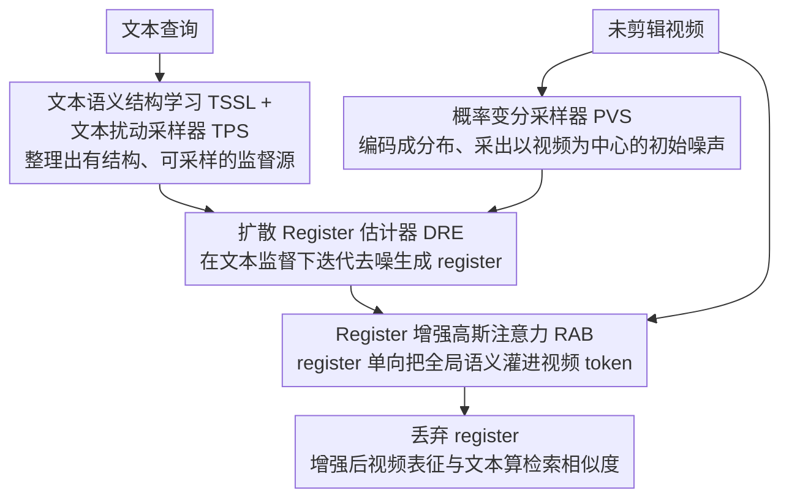

# Imagine Before Concentration: Diffusion-Guided Registers Enhance Partially Relevant Video Retrieval

**会议**: CVPR 2026  
**arXiv**: [2604.03653](https://arxiv.org/abs/2604.03653)  
**代码**: [https://github.com/lijun2005/CVPR26-DreamPRVR](https://github.com/lijun2005/CVPR26-DreamPRVR)  
**领域**: 图像生成  
**关键词**: 部分相关视频检索, 扩散模型, 注册令牌, 跨模态对齐, 全局上下文

## 一句话总结

本文提出 DreamPRVR，采用"先想象后集中"的粗到细策略：通过截断扩散模型在文本监督下生成全局语义注册令牌（registers），然后将其融合到细粒度视频表征中，有效抑制局部噪音响应，在三个 PRVR 基准上取得了 SOTA。

## 研究背景与动机

**领域现状**：部分相关视频检索（PRVR）旨在根据文本查询检索未剪辑视频，其中查询仅描述视频中的部分片段。现有方法（如 MS-SL、GMMFormer、HLFormer）主要关注片段级建模，使用滑动窗口或高斯注意力进行局部匹配。

**现有痛点**：核心问题是"查询歧义"——一个通用查询可能匹配到正确视频的对应片段，同时也意外匹配到其他视频中碰巧相似的局部片段，产生虚假的局部尖峰响应。这导致全局不相关的视频可能被错误检索到前面。此外，广泛使用的多实例学习（MIL）范式只奖励最佳匹配片段，导致其他片段得不到充分训练，缺乏上下文基础来解决歧义。

**核心矛盾**：现有方法缺乏显式的全局上下文建模。少数考虑全局信息的工作（如 HLFormer 的语义蕴含、RAL 的全局不确定性）将全局上下文视为仅训练期间的正则化，推理时视频嵌入并未得到改善。

**本文目标** (1) 如何从冗余噪声的未剪辑视频中提取可靠的全局语义表征；(2) 如何利用文本语义有效监督全局表征的生成；(3) 如何将全局语义融入局部视频表征以抑制虚假响应。

**切入角度**：受 ViT 中 register token 概念的启发，引入全局注册令牌来存储整体视频语义。但直接从噪声视频中提取可靠 registers 很困难，因此用扩散模型进行迭代精炼和生成。

**核心 idea**：用文本监督的截断扩散模型从视频中心分布出发迭代生成全局语义 registers，然后通过注意力融合增强局部表征。

## 方法详解

### 整体框架

DreamPRVR 想解决的是：未剪辑视频里塞满了与查询无关的片段，纯靠局部匹配会被"碰巧相似"的片段骗到，所以得先给视频一个可靠的全局语义锚点，再用它去压制局部的虚假尖峰。整条流水线就围绕这个锚点展开——先从查询侧学一个有结构的文本潜空间，采出监督信号；再用一个截断扩散模块以视频自身为起点，在文本引导下迭代"想象"出几枚承载整体语义的全局注册令牌（register）；然后把这些 register 拼回视频 token 序列做注意力融合，让全局上下文渗进每个局部表征；最后 register 退场，只用增强后的视频表征和文本算检索相似度。整个过程被组织成一个变分推断框架，register 被当作隐变量来建模。

### 关键设计

**1. 文本语义结构学习（TSSL）+ 文本扰动采样器（TPS）：把查询侧整理成有结构、能采样的监督源**

要让扩散去"想象"全局语义，得先有干净且多样的文本信号来监督它。现有的查询多样性损失有个毛病：它盲目地把所有查询都推开，连同属一个视频、本该互为补充的查询也被拆散了。TSSL 用两个损失修正这件事——Query Diversity Loss $L_{div}$ 负责把不同视频的查询嵌入分散开以撑大语义丰富度，而 Query Similarity Preservation Loss $L_{qsp}$ 则把同一视频的多条查询拉近，当作描述同一全局语义的互补正视图。两者合力让潜空间同时具备视频间的区分性和视频内的紧凑性。在此之上，TPS 通过对白化后的特征施加可控扰动来显式建模文本的不确定性：$\hat{q} = \alpha \cdot \bar{q} + \beta$，其中 $\alpha \sim \mathcal{N}(1, (\gamma\sigma_q)^2 I)$，整个采样不引入任何额外可训练参数，却能源源不断给扩散提供多样化的监督。

**2. 概率变分采样器（PVS）+ 扩散 Register 估计器（DRE）：从视频自身出发"想象"出纯净的全局语义**

如果直接对未剪辑视频做池化或一步映射，冗余噪声会把可靠语义淹没，根本解耦不出来。DreamPRVR 的做法是把它当成一个去噪问题。PVS 先把视频特征编码成一个概率分布 $p(r_T \mid V_v) \sim \mathcal{N}(\mu_v, \sigma_v^2 I)$，重参数化采样得到一个"以视频为中心"的初始噪声 $r_T$——这正是截断扩散的关键：起点不是随机高斯噪声，而是已经带着视频语义的分布。

$$
L_{dre} = \mathbb{E}_{t, \hat{q}_t, \epsilon}\big[\|\epsilon - \epsilon_\phi(\hat{q}_t, t, c)\|^2\big]
$$

DRE 是一个轻量 MLP 扩散模块，从 $r_T$ 出发、在文本监督 $\hat{q}$ 的引导下执行 $T$ 步迭代去噪，逐步把语义纯化成最优 registers $r_0$，训练目标就是上面这个标准的 DDPM 噪声预测。文中的 t-SNE 可视化能看到 registers 从初始的一团无序，沿着去噪步骤慢慢聚成有区分力的视频级簇——这也解释了为什么"视频中心起点 + 迭代精炼"比一步池化更能从噪声里捞出可靠语义。

**3. Register 增强高斯注意力（RAB）：把全局 register 灌进每个局部视频表征**

register 生成出来还得真正影响视频表征才有用。RAB 把视频 token 和 register 拼成一条序列 $x = [V_o, r_0]$，送进一个改进的高斯注意力：

$$
\text{GA}(x) = \text{softmax}\Big(\mathcal{M}_r + \big(\mathcal{M}_\sigma^g \odot \tfrac{x^q (x^k)^\top}{\sqrt{d_h}}\big)\Big) x^v
$$

这里的关键是非对称注意力掩码 $\mathcal{M}_r$：视频 token 既能关注其他视频 token、也能关注 register，从而吸收全局上下文；但 register 只允许关注视频 token、彼此之间不互通。这样设计是为了让 register 单向地把全局信息"喂"给局部表征，又避免 register 之间互相参照造成信息短路。$N_a$ 个 RAB 并行排列、输出经 MAIM 聚合；融合一旦完成，register 就被丢弃，不参与最终的相似度计算——它的使命只是在中途注入全局语境。

### 损失函数 / 训练策略

总损失：$L_{total} = L_{sim} + L_{tssl} + L_{pvs} + \lambda_{dre} L_{dre}$。$L_{sim}$ 是标准检索相似度损失（遵循 MS-SL），$L_{tssl} = \lambda_d L_{div} + \lambda_q L_{qsp}$，$L_{pvs} = \lambda_{kl} L_{kl}$（PVS 的高斯先验约束）。模型在单张 A100-40G GPU 上训练，Adam 优化器，batch size 128。默认扩散步数 $T=10$，register 数量 4-8 个。

## 实验关键数据

### 主实验

| 方法 | ActivityNet SumR | Charades SumR | TVR SumR |
|------|-----------------|---------------|----------|
| MS-SL | 140.1 | 68.4 | 172.4 |
| GMMFormer | 146.0 | 72.9 | 176.6 |
| HLFormer | 154.9 | 78.7 | 187.7 |
| GMMFormerV2 | 154.9 | 78.2 | 189.1 |
| **DreamPRVR** | **156.1** | **80.0** | **193.1** |

**DreamPRVR 在 Charades-STA 上的细项指标**:

| 指标 | R@1 | R@5 | R@10 | R@100 |
|------|-----|-----|------|-------|
| HLFormer | 2.6 | 8.5 | 13.7 | 54.0 |
| **DreamPRVR** | **2.6** | **8.7** | **14.5** | **54.2** |

### 消融实验

| 配置 | ActivityNet SumR | Charades SumR | TVR SumR | 说明 |
|------|-----------------|---------------|----------|------|
| Full DreamPRVR | **156.1** | **80.0** | **193.1** | 完整模型 |
| w/o registers | 153.4 | 76.8 | 187.0 | 无全局 registers |
| w/ 自适应池化 | 151.9 | 78.1 | 191.4 | 简单池化替代扩散生成 |
| w/o DRE | 150.6 | 78.3 | 190.8 | 无扩散迭代精炼 |
| w/o PVS | 154.9 | 77.6 | 190.9 | 从随机噪声初始化 |
| $L_{sim}$ only | 150.5 | 76.6 | 187.0 | 只用检索损失 |
| w/o $L_{tssl}$ | 151.3 | 76.9 | 191.1 | 无文本结构学习 |

### 关键发现

- 去掉 registers 后 Charades SumR 从 80.0 降到 76.8（-3.2），TVR SumR 从 193.1 降到 187.0（-6.1），证实全局上下文的价值
- 自适应池化（-1.9）效果远不如扩散生成，说明简单聚合不足以从噪声视频中提取可靠全局语义
- PVS 的视频中心初始化优于随机噪声初始化（Charades 80.0 vs 77.6），验证了截断扩散的必要性
- 扩散步数 $T$ 在 2-10 之间性能稳步提升，$T>10$ 后下降，表明过度精炼可能导致过拟合
- Register 数量 4-8 个最优，过多引入冗余反而有害
- t-SNE 可视化清晰显示 registers 从初始无序到最终形成紧致的视频级聚类

## 亮点与洞察

- **"先想象后集中"的认知类比**：将扩散生成类比为认知中的"想象"阶段（形成粗粒度全局感知），将细粒度匹配类比为"集中"阶段，概念设计优雅且直觉
- **截断扩散的高效使用**：不用大规模扩散模型，只用轻量 MLP 和 6-8 个 registers 配合 10 步扩散就能获得显著提升，证明扩散范式在检索任务中可以非常高效。训练和推理开销可接受
- **QSP 损失的互补设计**：将同一视频的多个查询视为正样本对而非独立分散，是对现有查询多样性损失的合理修正

## 局限与展望

- 依赖预提取的 I3D 特征，未探索端到端训练或更强的视觉编码器（如 CLIP ViT）
- Register 数量和扩散步数需要数据集特定调参（ActivityNet 4个、TVR 8个）
- 扩散模型的条件 $c$ 由简单交叉注意力从视频特征获得，可能不够丰富
- 未来可以考虑将该框架扩展到视频语料级的时刻定位（VCMR）任务

## 相关工作与启发

- **vs GMMFormer（高斯注意力 PRVR）**: DreamPRVR 在其高斯注意力的基础上引入了 register 增强，SumR 提升约 7（Charades）
- **vs HLFormer（双曲空间 + 语义蕴含）**: HLFormer 的全局上下文仅作为训练正则，DreamPRVR 的 registers 在推理时也参与特征增强
- **vs DiffusionRet / DiffDis（扩散检索）**: 这些工作将扩散用于建模查询-候选联合分布，DreamPRVR 则用扩散生成全局 registers，是生成式与判别式范式的新型融合

## 评分

- 新颖性: ⭐⭐⭐⭐ 在检索中引入扩散生成 registers 的思路新颖，概念设计优雅
- 实验充分度: ⭐⭐⭐⭐⭐ 三个数据集、12+ 基线、详尽消融、效率分析、多种可视化
- 写作质量: ⭐⭐⭐⭐ 变分推断框架推导完整，图示清晰
- 价值: ⭐⭐⭐⭐ 为 PRVR 提供了生成-判别融合的新范式，registers 思路可迁移

<!-- RELATED:START -->

## 相关论文

- [\[CVPR 2026\] OpenDPR: Open-Vocabulary Change Detection via Vision-Centric Diffusion-Guided Prototype Retrieval for Remote Sensing Imagery](opendpr_open-vocabulary_change_detection_via_vision-centric_diffusion-guided_pro.md)
- [\[CVPR 2026\] Smoothing the Score Function to Enhance Generalization in Diffusion Models](smoothing_the_score_function_to_enhance_generalization_in_diffusion_models.md)
- [\[CVPR 2026\] Align Images Before You Generate](align_images_before_you_generate.md)
- [\[CVPR 2026\] ParaUni: Enhance Generation in Unified Multimodal Model with Reinforcement-driven Hierarchical Parallel Information Interaction](parauni_enhance_generation_in_unified_multimodal_model_with_reinforcement-driven.md)
- [\[CVPR 2026\] Learnability-Guided Diffusion for Dataset Distillation](learnability-guided_diffusion_for_dataset_distillation.md)

<!-- RELATED:END -->
