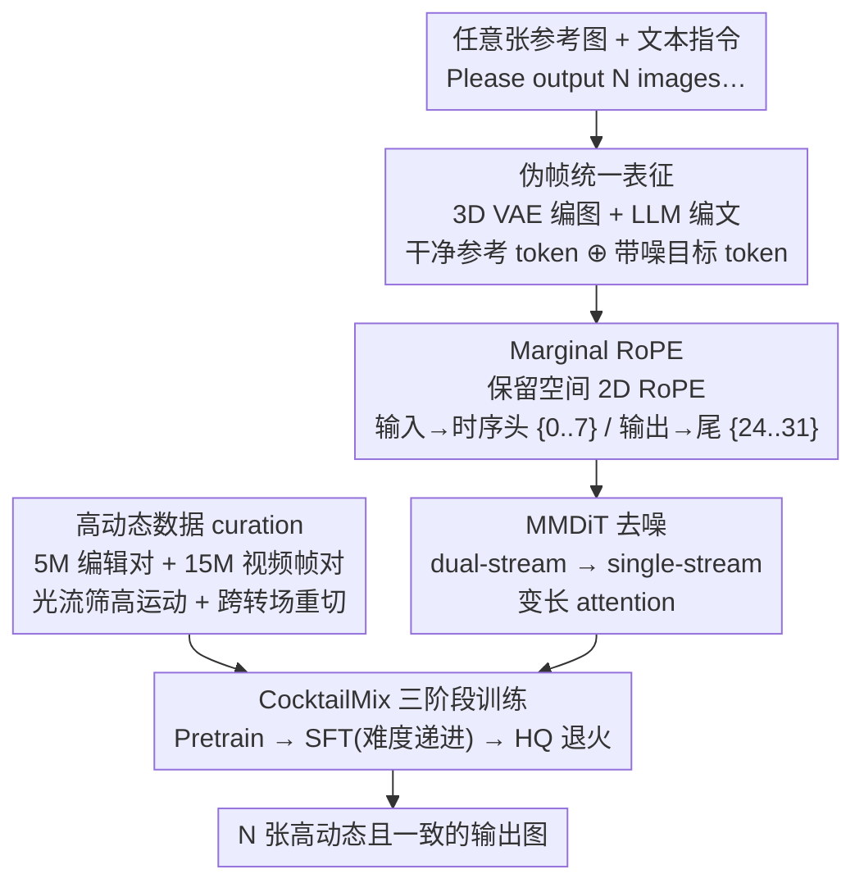

# iMontage: Unified, Versatile, Highly Dynamic Many-to-many Image Generation

**会议**: CVPR 2026  
**论文**: [CVF Open Access](https://openaccess.thecvf.com/content/CVPR2026/html/Fu_iMontage_Unified_Versatile_Highly_Dynamic_Many-to-many_Image_Generation_CVPR_2026_paper.html)  
**代码**: 项目页 https://kr1sjfu.github.io/iMontage-web/ （承诺开源代码与权重）  
**领域**: 图像生成  
**关键词**: 多对多生成, 视频扩散先验, 统一图像生成, RoPE, 数据 curation

## 一句话总结
iMontage 把预训练视频扩散模型（HunyuanVideo）改造成"接受任意张参考图、按指令吐出任意张高动态输出图"的统一生成器，靠一套几乎不动原网络的 Marginal RoPE（把输入/输出图当作视频序列两端的"伪帧"）保住运动先验、又打破连续帧的动态局限，在图像编辑、多对一生成、故事板生成上拿到开源最优。

## 研究背景与动机
**领域现状**：统一图像生成（一个模型干编辑、生成、风格迁移等多种活）正在火，但绝大多数开源模型停留在"单输入单输出"（single-in-single-out）。真正的多对多（任意张输入 → 任意张输出）只有个别闭源商业模型先行，学术界缺系统探索。多对多目前有两条路：token 流自回归（把图文都变成 token 流，质量和指令遵循偏弱）和视频扩散路线（把任务当成"不连续视频生成"，天然能吃变长输入输出帧）。

**现有痛点**：视频路线（如 UniReal）能借运动先验保时序一致，但基础视频模型几乎都训练在**连续视频片段**上，里面很少有硬切、突变转场、大幅相机/主体运动——于是模型迁移到"高动态、跨场景跳跃"的图像集时表现很差，任务多样性受限。反过来纯图像模型能产生高多样性输出，却因为缺乏对世界动态的隐式理解，时序一致性崩。

**核心矛盾**：**动态范围**与**时序/语义一致性**之间的拉扯——想要输出图之间剧烈变化（故事板、多视角），就容易丢一致性；想保一致性，就被连续视频先验拽回"准静态"。

**本文目标**：造一个统一模型，能在指令 + 任意参考图条件下，生成多张**既高动态又彼此一致**的图，且覆盖一对一编辑、多对一生成、多对多生成全谱系。

**切入角度**：作者假设"把图像数据里丰富、不受约束的内容多样性，注入到视频模型连贯的时序框架里"，就能同时拿到自然过渡 + 远超常规的动态范围。关键是改造时**绝不能破坏视频模型宝贵的原始运动先验**。

**核心 idea**：把所有输入/输出图都当作时间轴上的"伪帧"喂给视频 MMDiT，用一个极简的 head–tail 温和 RoPE 改造（Marginal RoPE）区分图像集与视频流，配上专门的高动态数据 curation 和三阶段训练，实现 many-to-many。

## 方法详解

### 整体框架
iMontage 以 HunyuanVideo 的 MMDiT + 3D VAE 为骨架：参考图各自经 3D VAE 编码并 patch 化成图像 token，文本指令经语言模型编成定长文本 token。沿用 I2V 的做法，把**干净的参考图 token** 与**带噪的目标 token** 拼成一条序列送进图像分支，序列先过若干 dual-stream 块再转 single-stream 块去噪。训练时冻结 VAE 与文本编码器，只全量微调 MMDiT，并用变长 attention map + prompt 提示来支持"任意张输入、任意张输出"。整个方法的灵魂是四件事：**统一的伪帧表征**让一个视频模型吃下变长图像集，**Marginal RoPE** 在不扰动空间几何的前提下把输入/输出分到时间轴两端，**高动态数据 curation** 喂进连续视频里稀缺的硬切/大运动，**CocktailMix 三阶段训练**把方差极大的多任务揉到一起学。

### 关键设计

**1. 伪帧统一表征：让一个视频模型吞下变长图像集**

多对多的第一个障碍是"输入输出张数不固定"。作者沿用视频路线的思路，把所有输入图和待生成的输出图**统统当成视频时间轴上的伪帧**：每张图经 3D VAE 独立编码、patch 化为 token，干净参考 token 与带噪目标 token 在序列维拼接，再用变长 attention map 覆盖这些图像 token，靠 prompt 工程提示模型"该出几张"。这样一来，"3 张输入 → 4 张输出""1 张 → 1 张"在网络里只是序列长度不同，无需为每种 cardinality 设计专门模块，把异构任务（编辑、生成、多视角、故事板）收进同一架构。文本侧用纯指令接口：系统前缀 `Please output N images according to the instruction:`，并用交错多模态格式里的 `<image n>` 文本占位符显式标出图像位置，不依赖 mask 或额外视觉 embedding。

**2. Marginal RoPE：把输入/输出钉到时间轴两端，既保运动先验又解放动态**

直接把多张图塞进视频模型，会出现"图像帧 vs 视频帧的概念混淆"，且时序位置编码会干扰空间几何。Marginal RoPE 的做法是**温和、最小侵入**：完整保留预训练的空间 2D RoPE（各图保持原生分辨率与 2D 位置编码不动），只引入一个**可分离的时序 RoPE**，给每张图一个独立时间索引偏移。受 L-RoPE 启发，输入图分到时间轴**早段**、输出图分到**晚段**——具体分配 32 个时序索引，输入占 $\{0,\dots,7\}$、输出占 $\{24,\dots,31\}$，中间留一道很宽的"时间余量"(margin，故名 Marginal)。这道 head–tail 布局有两个效果：一是降低输入与目标之间的位置干扰，二是经验上**促进输出内容更多样**（拉开时间距离 = 暗示"可以变化大"），同时因为没动空间 RoPE、时序结构也仍在，原始时序连贯能力被原样保住。这正是"既要高动态、又要一致"矛盾的核心解法。

**3. 高动态数据 curation：把连续视频里稀缺的硬切与大运动喂进来**

视频模型动态受限的根因在数据，作者就从数据下手。预训练数据分两池：**图像编辑池**（5M 对 input/edited 图，配细粒度操作指令）和**视频帧对池**（15M 对，从视频抽帧）。针对帧对池做两步增动态：① 用光流估计器算每个样本的平均运动幅度，**优先保留/上采样高运动样本**；② 把同一源视频的不同片段拼接后**不按运动/相机切换做启发式切分地重新切片**，刻意制造"跨转场帧对"，从而抵消语料里"准静态内容"的偏置。多任务 SFT 数据则按任务定制：Multi CRef 90k、Conditioned CRef 50k（用 OpenPose/Depth-Anything-V2/Lineart 给 Echo-4o 加控制图）、SRef 风格参考 35k、多轮编辑 100k、多视角 90k（MVImageNet V2 + GPT-4o 描述相邻视角相机运动）、故事板 29k（从商业模型 Seedream 4.0 蒸馏高动态多镜头序列）。

**4. CocktailMix 三阶段训练：用难度递进把高方差多任务揉到一起**

多任务联合训练时，各任务难度方差极大，简单混在一起学不稳。整体走三阶段：**Pretraining**（在预训练数据上灌入指令遵循与高动态适应，用 37 档分辨率桶 + 按序列长度动态调 batch 来均衡 token 预算）→ **SFT**（统一多任务）→ **HQ annealing**（一小批高质量数据收尾、学习率退火到 0 提升保真）。SFT 阶段作者比了三种混法：FlatMix（全任务一锅烩）、StageMix（先三个 many-to-one 再加三个 many-out 的课程式）、**CocktailMix（按难度排序微调）**——从最简单任务起步，逐步引入次难任务、同时压低已学任务的采样权重，一档档加到最难任务并给它最大训练份额。最终选 CocktailMix，并在所有混合训练里按各任务数据量配权重以平等对待各任务。全程 64 张 H800、恒定 1e-5 学习率、flow matching 训练目标。

## 实验关键数据

### 主实验
评测分三档 cardinality：一对一编辑（GEdit / ImgEdit）、多对一生成（OmniContext）、多对多故事板。表 1 为一对一编辑，G_SC=语义一致性、G_PQ=感知质量、G_O=综合分（越高越好），ImgEdit 报 Action 子任务与 Average。

| 模型 | 类型 | Motion-G_O ↑ | Edit-G_O ↑ | ImgEdit-Action ↑ | ImgEdit-Avg ↑ |
|------|------|------|------|------|------|
| GPT-4o | 闭源 | 7.81 | 8.01 | 4.83 | 4.30 |
| Seedream 4.0 | 闭源 | 5.53 | 7.81 | 4.66 | 4.32 |
| Flux-Kontext-dev | 开源 | 4.95 | 6.51 | 4.35 | 3.97 |
| Step1X-Edit v1.1 | 开源 | 4.73 | 6.97 | 3.73 | 3.90 |
| OmniGen2 | 开源 | 5.13 | 6.41 | 4.68 | 3.44 |
| **iMontage (Ours)** | 开源 | **5.53** | **6.94** | 4.48 | **4.11** |

iMontage 在开源里综合编辑分（Edit-G_O 6.94）、运动相关分（Motion-G_O 5.53）与 ImgEdit 平均分（4.11）都最优，运动子任务甚至追平了闭源 Seedream 4.0。

多对一生成在 OmniContext（按 SINGLE/MULTIPLE/SCENE 分组的上下文一致性，越高越好）：

| 模型 | 类型 | Average ↑ |
|------|------|------|
| GPT-4o | 闭源 | 8.80 |
| Gemini 2.5 | 闭源 | 7.84 |
| OmniGen2 | 开源 | 7.18 |
| BAGEL | 开源 | 5.73 |
| **iMontage (Ours)** | 开源 | **7.41** |

开源最优（7.41），逼近闭源 Gemini 2.5（7.84）。多对多故事板生成则以高质量定性结果 + 综合评测展示强指令遵循、高动态与跨图一致（默认每次推理一遍、50 步扩散）。

### 消融实验
| 配置 | 关键现象 | 说明 |
|------|---------|------|
| Marginal RoPE（head-tail，输入{0-7}/输出{24-31}） | 输出更多样且保时序一致 | 宽时间余量降低输入-目标位置干扰 |
| SFT-FlatMix | 高方差任务难收敛 | 全任务一锅烩 baseline |
| SFT-StageMix | 课程式优于 FlatMix | 先 many-to-one 再 many-out |
| **SFT-CocktailMix** | 最终选用 | 按难度递进 + 动态调采样权重 |
| HQ 退火阶段 | 末段保真度提升 | 小批高质量数据 + lr→0 |

### 关键发现
- **Marginal RoPE 是动态-一致 trade-off 的开关**：把输入/输出钉到时间轴两端、中间留宽 margin，既保住原空间几何与时序先验，又经验性地鼓励输出内容拉开差异——动态范围与一致性能同时拿到，而非二选一。
- **数据 curation 决定动态天花板**：光流上采样高运动样本 + 跨片段重切造硬切转场，是打破"连续视频先验导致准静态"的直接手段；不改数据只改架构，动态范围上不去。
- **多任务混合方式影响大**：CocktailMix（难度递进）优于 FlatMix 与 StageMix，说明高方差任务的"上菜顺序"很关键。⚠️ 论文未给三种混法的逐项数值表，仅以最终选型与文字结论呈现。

## 亮点与洞察
- **"伪帧 + head-tail RoPE"是极轻量的范式迁移**：不改空间编码、不加视觉 embedding、只动时序索引就把视频模型变成多对多图像生成器，迁移成本极低却保住了最值钱的运动先验——这套思路可复用到任何"想借视频先验做变长图像集"的任务。
- **用"宽时间余量"诱导多样性**很巧：把输出帧故意放到远离输入帧的时间位置，等于给模型一个"这里允许大变化"的隐式信号，把位置编码当成了动态范围的旋钮。
- **数据侧"反启发式重切"反直觉但有效**：别人切片都避开大运动/转场以求平滑，作者偏要不避，专门造硬切样本来补连续视频的盲区。

## 局限与展望
- 强依赖一个高质量预训练视频骨架（HunyuanVideo）与大规模私有语料（5M+15M 预训练对 + 多任务数 十万样本、64×H800），复现门槛高。
- ⚠️ 多对多故事板主要以定性结果呈现，缺乏与闭源模型在统一定量协议下的并排数值，"开源 SOTA"在多对多档的量化证据相对一对一/多对一弱一些。
- 部分监督来自蒸馏闭源模型（Seedream 4.0、GPT-4o 生成/打分），存在上游偏置与许可顾虑；时序索引硬分配（8/24 段）是否对更长图像集（>8 输入或输出）可扩展，论文未充分探讨。

## 相关工作与启发
- **vs UniReal**：同走"把多图生成当不连续视频生成"的视频路线、借运动先验吃变长帧，但 UniReal 受连续视频先验拖累、动态范围有限；iMontage 靠 Marginal RoPE + 高动态数据 curation 专门补上硬切/大运动，动态范围显著更宽。
- **vs OmniGen / BAGEL（token 流 any-to-any）**：它们用统一多模态 token 流自回归，灵活但生成质量与指令遵循偏弱；iMontage 站在扩散视频骨架上，质量与一致性更强，在 OmniContext 多对一上反超 OmniGen2/BAGEL。
- **vs Step1X-Edit / Qwen-Image（MLLM 驱动单入单出编辑）**：它们靠 MLLM 解析复杂指令引导扩散解码器，但架构本质是单输入单输出；iMontage 的伪帧表征天生支持多入多出，覆盖任务谱系更广。

## 评分
- 新颖性: ⭐⭐⭐⭐ Marginal RoPE 的 head-tail 伪帧思路简洁有效，但多对多视频路线由 UniReal 等先行，属强力工程化整合而非全新范式
- 实验充分度: ⭐⭐⭐⭐ 一对一/多对一定量扎实且开源最优，多对多档偏定性、混合训练消融缺逐项数值
- 写作质量: ⭐⭐⭐⭐ 动机与方法叙述清晰，图表完整；部分实现细节与故事板量化留在附录
- 价值: ⭐⭐⭐⭐ 承诺开源，给社区一个能用的多对多统一生成器，实用价值高

<!-- RELATED:START -->

## 相关论文

- [\[CVPR 2026\] DynaVid: Learning to Generate Highly Dynamic Videos using Synthetic Motion Data](dynavid_learning_to_generate_highly_dynamic_videos_using_synthetic_motion_data.md)
- [\[CVPR 2026\] One Model, Many Budgets: Elastic Latent Interfaces for Diffusion Transformers](one_model_many_budgets_elastic_latent_interfaces_for_diffusion_transformers.md)
- [\[CVPR 2025\] Dynamic Motion Blending for Versatile Motion Editing (MotionReFit)](../../CVPR2025/image_generation/dynamic_motion_blending_for_versatile_motion_editing.md)
- [\[CVPR 2026\] DPAR: Dynamic Patchification for Efficient Autoregressive Visual Generation](dpar_dynamic_patchification_for_efficient_autoregressive_visual_generation.md)
- [\[CVPR 2026\] CoLoGen: Progressive Learning of Concept-Localization Duality for Unified Image Generation](cologen_progressive_learning_of_concept-localization_duality_for_unified_image_g.md)

<!-- RELATED:END -->
