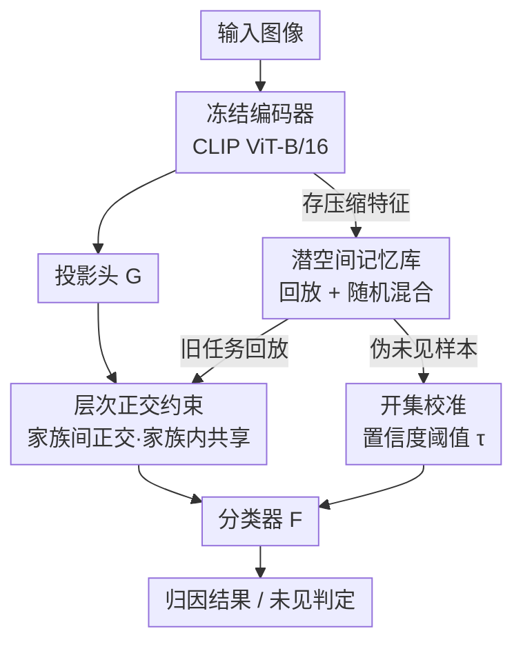

# IncreFA: Breaking the Static Wall of Generative Model Attribution

**会议**: CVPR 2026  
**arXiv**: [2604.17736](https://arxiv.org/abs/2604.17736)  
**代码**: https://github.com/Ant0ny44/IncreFA (有)  
**领域**: 图像生成 / 生成模型溯源 / 增量学习 / 开集识别  
**关键词**: 生成模型归因, 增量学习, 层次正交先验, 潜空间记忆, 开集识别

## 一句话总结
把"判断一张图由哪个生成模型产出"这个静态分类问题，重新定义成**增量归因（incremental attribution）**：用层次正交先验编码生成模型的"家族血缘"、用潜空间记忆库做回放并混合出伪未见样本，让归因系统能随新模型不断涌现持续学习而不遗忘，在覆盖 28 个生成模型的新基准 IABench 上拿到 SOTA 归因精度与 98.93% 的未见检测率。

## 研究背景与动机
**领域现状**：生成模型溯源（attribution，识别一张图出自哪个生成器）主要有三条技术路线——水印嵌入（在生成时打不可见标记）、分类器指纹（学不同生成器的视觉指纹做判别）、潜空间反演（重建 latent code 去匹配嫌疑模型）。其中分类器路线因为不依赖模型方配合、也不需要白盒访问参数，成了主流范式。

**现有痛点**：扩散、对抗、自回归生成器几乎每月都有新版本/新架构发布，而上述方法都建立在**闭集假设**上——训练时已知一组固定生成器。新模型一出现，水印需要厂商重新合作、分类器立刻过时、反演需要白盒参数。归因因此变成一个"打地鼠"式的移动靶。

**核心矛盾**：问题的根子不在"识别已知生成器"，而在"归因系统本身无法自我演化"。直接套用类增量学习（CIL）也不行：CIL 的标准基准假设类别**均衡、可分、域独立**，但生成模型恰恰相反——新扩散变体大量继承父模型的潜空间统计与风格先验，分布高度重叠。梯度更新会漂向旧模型已占据的区域，**即使用回放也会出现负迁移**；而且现有 CIL 几乎不考虑开集识别，无法检出来自未见生成器的图。

**本文目标**：(1) 在持续学新生成器的同时保留旧知识（抗遗忘）；(2) 把"家族级不变量"和"模型级特异性"分开建模，应对继承造成的分布重叠；(3) 在不断扩张的开放空间里区分"已见 vs 未见"，且尽量少误报。

**切入角度**：作者的关键观察是——生成模型不是相互独立的类别，而是**有血缘关系的层次谱系**（GAN / 扩散 / 自回归三大家族，家族内 SD1.4→1.5→2.0 又彼此继承）。既然结构上天然分层，就该让特征空间也分层：家族之间正交隔离，家族内部共享知识。

**核心 idea**：用"层次正交先验 + 潜空间记忆回放"把静态归因改造成**结构化的增量归因**，让溯源能力跟着生成模型一起进化。

## 方法详解

### 整体框架
IncreFA 跑在一个**冻结的预训练编码器**（CLIP ViT-B/16）上，只训练一个轻量投影头 $G(\cdot)$ 和分类器 $F(\cdot)$。一张图先被冻结编码器抽成稳定特征 $\mathbf{f}(x)$，再由 $G$ 投影到一个**带层次结构的潜空间** $\mathcal{Z}$；这个潜空间被显式约束成"家族子空间互相正交、家族内模型相关"的形式（公式 2：$\mathcal{Z}'=\bigoplus_{k=1}^{K}\mathcal{P}_k,\ \mathcal{P}_i\perp\mathcal{P}_j$）。分类器 $F$ 在这个空间上同时做归因和开集判定。

整个系统由两个互相增强的机制支撑：**层次正交约束**负责把潜空间塑造成上述层次几何；**潜空间记忆库**只存压缩后的编码特征（而非原图），既给旧任务做回放、又通过随机混合伪造"未见样本"喂给开集校准。当一批新生成器（一个新任务 $\mathcal{T}_t$，每任务引入 $L=4$ 个新模型）到来时，模型在新数据 + 回放样本上更新，借开集阈值 $\tau$ 把低置信度样本判为未见。

### 关键设计

**1. 层次正交约束：用可学习正交先验把"家族血缘"刻进潜空间**

针对"新版本继承旧版本统计、分布重叠导致负迁移"这个根本痛点，IncreFA 不再把每个生成器当独立类别，而是给潜空间强加一套两级层次几何。细粒度层（$\mathcal{L}_1$，公式 7）为每个模型 $\mathcal{M}_{k,j}$ 算一个单位范数原型 $\hat{\mu}_{k,j}$，让它对齐到一个**可学习的正交锚点** $\hat{p}_{k,j}$，并加正交正则 $\|Q^\top Q-I\|_F^2$ 逼所有锚点互相正交，从而保证模型间的角度分离：

$$\mathcal{L}_1=\sum_{k=1}^{K}\sum_{j=1}^{N_k}\big(1-\langle\hat{\mu}_{k,j},\hat{p}_{k,j}\rangle\big)+\|Q^\top Q-I\|_F^2$$

粗粒度层（$\mathcal{L}_2$，公式 9）把同一家族 $N_k$ 个模型原型取均值得到家族原型 $\hat{\mu}_k$，对齐到家族级锚点 $\hat{P}_k$，同样加家族间正交正则 $\|C^\top C-I\|_F^2$。两级锚点联合学习，于是"家族之间正交隔离、家族内部共享不变量"被同时编码——既不让继承关系把不同家族搅在一起，又允许同家族版本共享视觉统计，正好实现公式 2 的直和分解。这就是为什么它能在分布重叠的生成谱系上仍保持可分

**2. 潜空间记忆库与随机混合：低成本回放，并"凭空造"出未见样本**

要持续学新模型又不能存原图（隐私 + 存储），IncreFA 维护一个**潜空间记忆库** $\mathcal{B}_{t-1}$，只保留过往任务的编码特征 $\mathbf{f}(x)$，每类用 herding 选固定 150 个样本。回放时特征会**重新过当前的 $G$** 再算交叉熵（公式 10），避免投影头随任务漂移；存 latent 而非原图让内存消耗比原图回放低两个数量级。

更巧的是"随机混合（Random Mixing）"：从不同类各取一个 latent，按 $\beta\sim U(0,1)$ 线性插值（公式 11）造出伪未见样本 $z_u=\beta z_1+(1-\beta)z_2$。这些混合点**天然落在决策边界附近的低密度区**，恰好近似"已知类之间的过渡带"——也就是开放空间最该警惕的区域。于是不需要任何真实未见数据，就能源源不断生成开集校准所需的"硬负样本"

**3. 开集校准：把伪未见样本逼成低置信度，统一开集行为**

有了伪未见样本，IncreFA 用一个置信度惩罚项 $\mathcal{L}_u$（公式 12）压低分类器在这些样本上的最大 softmax 置信度：$\mathcal{L}_u=\max(0,\ \max(\mathrm{softmax}(\hat{y}_u))-\tau)$，超过阈值 $\tau$ 才罚。推理时，一张测试图若 $\max(\mathrm{softmax}(F(G(\mathbf{f}(x)))))<\tau$ 就判为未见（公式 13）。$\tau$ 在每个任务后用留出校准集重选，于是随着已知模型数不断增加，开集判定行为依然一致、误报与漏检之间保持平衡。正是这一项让未见检测率从消融的 81.94% 跳到 98.93%

### 损失函数 / 训练策略
总目标统一了分类、层次正则、回放、开集校准（公式 15）：

$$\mathcal{L}=\mathcal{L}_{cls}+\alpha_1\mathcal{L}_1+\alpha_2\mathcal{L}_2+\alpha_3\mathcal{L}_u+\alpha_4\mathcal{L}_{replay}$$

其中 $\mathcal{L}_{cls}$ 是当前任务上的交叉熵。系数固定为 $\alpha_1=0.2,\ \alpha_2=0.5,\ \alpha_3=0.5,\ \alpha_4=1.0$，阈值 $\tau=0.65$。骨干为冻结 CLIP ViT-B/16，只更新 $G$ 和 $F$；Adam，学习率 1e-3，每任务 4 epoch，batch size 512，每类保留 150 个回放样本，图像缩放到 $256\times256$，单卡 Nvidia L20。

## 实验关键数据

构建了新基准 **IABench**：28 个 2022–2025 年发布的生成模型（4 个 GAN、2 个自回归、22 个扩散），按时间顺序切分训练/测试，并刻意纳入 SD1.4/1.5/2.0 这类近版本以考验对细微痕迹差异的判别。两套协议：EP1 增量归因（每任务加 4 个模型，最新的 Nano-Banana、Imagen3 留作未见）、EP2 静态闭集归因（28 个生成器联合训练）。

### 主实验（EP1 增量归因，Table 1）
报告各任务平均归因精度与最终未见检测率（%）：

| 方法 | $\mathcal{T}_0$ | $\mathcal{T}_4$ | $\mathcal{T}_7$（末任务） | 未见检测 Un. Acc. |
|------|------|------|------|------|
| Vanilla baseline | 99.65 | 44.41 | 35.24 | 69.13 |
| ICaRL (CVPR'17) | 98.12 | 74.66 | 72.31 | 83.00 |
| DGR (CVPR'24) | 98.36 | 75.46 | 75.68 | 94.21 |
| TUNA (CVPR'25) | 99.41 | 75.31 | 63.87 | 92.10 |
| MOS (AAAI'25) | 99.93 | 75.05 | 66.84 | 91.92 |
| **IncreFA (本文)** | **99.99** | **88.09** | **78.80** | **98.93** |

末任务归因精度 78.80%，比第二名 DGR（75.68%）高 **3.12%**；未见检测 98.93% 显著领先。所有增量基线随新生成器加入都明显衰退（prompt 类的 L2P、DualPrompt 衰退最猛，末任务仅 ~29% / 35%），印证它们在重叠分布上难以兼顾可塑性与抗遗忘。

### EP2 静态闭集归因（Table 2，逐模型 + 总均值）
| 指标 | DNA-Net | RepMix | DE-FAKE | POSE | Siamese | **本文** |
|------|------|------|------|------|------|------|
| Avg. Acc.（28 类均值） | 83.75 | 71.61 | 91.16 | 73.97 | 74.69 | **95.93** |
| Auth. Acc.（真/假） | 97.66 | 95.99 | 95.65 | 90.90 | 84.22 | **99.97** |
| Un. Acc.（未见） | 70.04 | 78.40 | 82.13 | 72.23 | 98.23 | **98.78** |

静态设定下也拿到最高平均归因 95.93% 与近乎完美的 99.97% 真伪识别，在 SD-XL、SD3、FLUX 这类近期扩散模型上对其他方法的优势尤为明显。

### 消融实验（Table 3，逐项叠加）
| 配置 | $\mathcal{T}_7$ 归因 | 未见检测 | 说明 |
|------|------|------|------|
| baseline | 35.24 | 69.13 | 朴素微调，剧烈遗忘 |
| + $\mathcal{L}_{replay}$ | 52.99 | 73.98 | 潜空间回放缓解早期崩塌 |
| + $\mathcal{L}_1$ | 73.16 | 72.19 | 细粒度正交，模型级可分性大涨 |
| + $\mathcal{L}_2$ | 76.16 | 81.94 | 家族级不变量，保留更稳 |
| + $\mathcal{L}_u$ | 78.80 | **98.93** | 开集校准，未见检测暴涨 |

### 关键发现
- **开集校准 $\mathcal{L}_u$ 对未见检测贡献最大**：加上它后未见检测从 81.94% 跳到 98.93%（+17%），但对闭集归因精度几乎无损（76.16→78.80），说明随机混合造的伪未见样本确实有效逼近了开集边界。
- **层次约束是抗遗忘主力**：$\mathcal{L}_1$ 把末任务归因从 52.99% 抬到 73.16%，$\mathcal{L}_2$ 进一步到 76.16%，验证"模型级分离 + 家族级共享"两级结构对抑制负迁移都不可少。
- **越到后期越能看出差距**：所有方法在 $\mathcal{T}_0$ 都近乎满分，但 IncreFA 在 $\mathcal{T}_4$ 之后衰减最慢，说明优势来自抗遗忘与结构保持，而非单任务拟合能力。

## 亮点与洞察
- **把"溯源"从分类任务重新定义为增量任务**：这是问题层面的重构而非单纯调模型——一句"生成模型是有血缘的谱系而非独立类别"直接催生了层次正交约束的设计，是全文最"啊哈"的地方。
- **随机混合凭空造未见样本**：不需要任何真实未见数据，用类间 latent 线性插值就能落到决策边界低密度区当硬负样本，思路干净且几乎零成本，可迁移到任何"需要开集校准但拿不到 OOD 样本"的场景。
- **存 latent 不存原图**：内存降两个数量级 + 规避数据泄露，对持续学习的工程落地很友好；重新过当前 $G$ 再算 loss 这个细节避免了投影漂移，值得借鉴。
- **冻结 CLIP + 只训轻量头**：在不断扩张的类空间下，冻结骨干保证特征语义稳定，是它能稳住增量过程的隐性前提。

## 局限与展望
- **依赖冻结 CLIP/ViT 的特征语义稳定假设**：若未来生成器产生的痕迹落在 CLIP 表征盲区（如全新模态/架构），冻结骨干可能抽不出可分特征，而文中未训练骨干来适配。
- **家族划分需要先验**：层次结构（GAN/扩散/自回归三大家族）是人工定义的，新出现的"跨家族混合架构"如何归属、$K$ 与 $N_k$ 如何自适应增长，文中未充分讨论。
- **阈值 $\tau$ 与每任务校准集**：开集判定依赖留出校准集重选 $\tau$，在真实部署中"未见"恰恰最难拿到代表性校准数据，阈值的鲁棒性有待更多分布外验证。
- **每任务固定加 4 个模型、固定 150 回放样本**：现实中模型发布节奏不均、长尾家族样本稀少时，固定预算策略可能失衡，自适应记忆分配是自然的改进方向。

## 相关工作与启发
- **vs 分类器指纹方法（DNA-Net / RepMix / DE-FAKE / POSE）**：它们在闭集静态设定下学视觉指纹，新模型一出现就过时；本文把任务改成增量 + 开集，EP2 静态均值 95.93% 也超过它们（最高 91.16%），说明层次表征对静态判别同样有益。
- **vs 通用类增量学习（ICaRL / DGR / MOS / L2P / DualPrompt / TUNA）**：它们假设类别独立可分、且大多不做开集；本文指出生成模型分布重叠、版本继承会引发负迁移，用层次正交约束显式建模血缘，末任务归因 +3.12%、未见检测领先（vs DGR 94.21%），证明"归因专属"的层次结构假设确有必要。
- **启发**：当类别之间存在已知的层次/继承结构（如物种分类、软件版本、产品谱系），"给特征空间强加家族间正交 + 家族内共享"的两级正交先验是一个通用且轻量的抗遗忘手段，不必把每个类当独立目标硬记。

## 评分
- 新颖性: ⭐⭐⭐⭐⭐ 把生成模型溯源重构为增量 + 开集问题，并用层次正交先验编码模型血缘，问题定义与方法设计都新。
- 实验充分度: ⭐⭐⭐⭐ 自建 28 模型基准、两套协议、10+ 基线、逐项消融充分；但 $\tau$ 鲁棒性、跨家族新架构等极端场景验证偏少。
- 写作质量: ⭐⭐⭐⭐⭐ 动机层层递进、公式与模块一一对应、图表清晰，"静态之墙"的叙事很有说服力。
- 价值: ⭐⭐⭐⭐⭐ 生成内容溯源是版权与可信媒体的刚需，"随生成模型持续进化的归因"切中真实痛点，基准 IABench 也有社区价值。

<!-- RELATED:START -->

## 相关论文

- [\[CVPR 2026\] Attribution as Retrieval: Model-Agnostic AI-Generated Image Attribution](attribution_as_retrieval_modelagnostic_aigenerated.md)
- [\[CVPR 2026\] Breaking Semantic Boundaries: Distribution-Guided Semantic Exploration for Creative Generation](breaking_semantic_boundaries_distribution-guided_semantic_exploration_for_creati.md)
- [\[CVPR 2026\] VOSR: A Vision-Only Generative Model for Image Super-Resolution](vosr_a_vision_only_generative_model_for_image_super_resolution.md)
- [\[CVPR 2026\] Taming Generative Diffusion Model for Task-Oriented Infrared Imaging](taming_generative_diffusion_model_for_task-oriented_infrared_imaging.md)
- [\[AAAI 2026\] Breaking the Modality Barrier: Generative Modeling for Accurate Molecule Retrieval from Mass Spectra](../../AAAI2026/image_generation/breaking_the_modality_barrier_generative_modeling_for_accurate_molecule_retrieva.md)

<!-- RELATED:END -->
