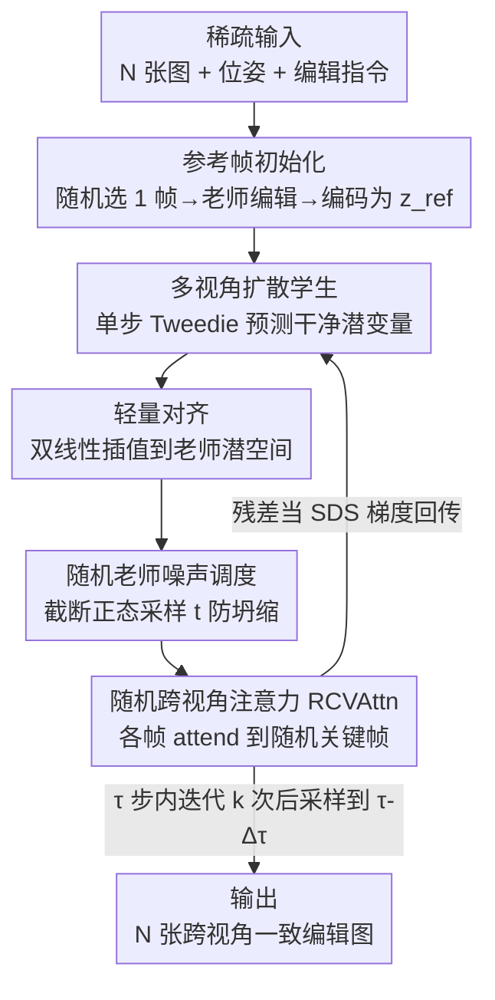

# InstructMix2Mix: Consistent Sparse-View Editing Through Multi-View Model Personalization

**会议**: CVPR 2026  
**论文**: [CVF Open Access](https://openaccess.thecvf.com/content/CVPR2026/html/Gilo_InstructMix2Mix_Consistent_Sparse-View_Editing_Through_Multi-View_Model_Personalization_CVPR_2026_paper.html)  
**代码**: 项目页（论文提及，具体地址⚠️以原文为准）  
**领域**: 扩散模型 / 图像编辑 / 多视角一致性  
**关键词**: 多视角编辑、稀疏视角、Score Distillation Sampling、模型个性化、跨视角注意力

## 一句话总结
把单图指令编辑器（InstructPix2Pix）的编辑能力通过 SDS 蒸馏进一个预训练多视角扩散模型（SEVA）里，用后者自带的数据驱动 3D 先验当"整合器"，从而在只有几张稀疏视角图的情况下也能做出跨视角一致的图像编辑。

## 研究背景与动机

**领域现状**：3D/多视角图像编辑的主流做法是"借力 2D 编辑器 + 显式 3D 表示当一致性约束"——先把场景拟合成 NeRF 或 3D Gaussian Splatting（3DGS），再用 InstructPix2Pix 这类单图编辑器迭代地（Iterative Dataset Update）或通过 Score Distillation Sampling（SDS）蒸馏地去改场景。NeRF/3DGS 的渲染方程提供物理一致性先验，把单图编辑"整合"成跨视角一致的结果。

**现有痛点**：这套范式有个隐含前提——需要**稠密**输入视角才能把 NeRF/3DGS 拟合好。可现实里用户常常只有几张随手拍的照片或商品图（稀疏视角）。视角一稀疏，3DGS 会**过拟合**那几张训练图而非真正充当跨视角聚合器，NeRF（如 Nerfacto）甚至连源视角都渲染出大量 floater 伪影，喂给 2D 编辑器就成了 out-of-distribution 输入，编辑直接崩。另一类纯靠"扩展自注意力跨帧对齐"的视频式方法，则只在视角变化小时稳，视角差一大就细节对不上。

**核心矛盾**：一致性靠的是"整合器"，而传统整合器（NeRF/3DGS）把 3D 先验放在**渲染方程**里、不放在网络权重里，所以必须靠稠密视角把这个物理先验"喂活"。稀疏视角下整合器失灵，一致性也就没了。

**本文目标**：在仅有 N 张（实验主用 N=4）稀疏输入图 + 一条文本编辑指令时，生成既忠实于指令、又跨所有视角一致的编辑结果。

**切入角度**：作者提出换一个**权重里就带 3D 先验**的整合器——多视角合成扩散模型。这类模型（如 SEVA）天生被训练成生成视角一致的场景，但它**不会编辑**。于是把"会编辑的 2D 老师"和"会保持一致的多视角学生"拼起来：让学生从老师那里蒸馏出编辑能力。

**核心 idea**：在 SDS 框架里，用一个**多视角扩散学生**替换掉传统的 NeRF/3DGS 神经场整合器，并针对这一替换重新设计 SDS 的几个关键步骤（学生查询、扰动调度、老师预测的跨视角注意力）。

## 方法详解

### 整体框架

I-Mix2Mix 建立在 SDS 之上。标准 SDS 是个五阶段迭代循环：①学生查询（Student Query，渲染出供老师评判的图）→ ②学生-老师对齐（把学生输出映射到老师输入空间）→ ③扰动（按老师前向扩散加噪）→ ④老师预测（冻结的 2D 扩散老师给出去噪/编辑方向）→ ⑤学生更新（用老师预测与采样噪声的残差当梯度回传更新学生）。传统 SDS 里学生是一个 per-scene 的神经场，①是可微渲染。

本文把学生换成多视角扩散模型 $\epsilon_\theta$（SEVA），老师是单图指令编辑器 $\epsilon_\phi$（InstructPix2Pix）。这一替换让①③④三个阶段都必须重新设计。整条流水线：先随机挑一张输入帧 $I_{ref}$ 让冻结老师编辑出参考图 $E_{ref}$、编码成参考潜变量 $z_{ref}$ 当学生的"干净输入帧"（初始化）；之后在每个学生时间步 $\tau$ 上做 $k$ 次蒸馏迭代，把多视角学生**个性化**到当前场景和指令；蒸馏完学生再走一步采样到 $\tau-\Delta\tau$，如此嵌套直到 $\tau=0$，输出 N 张一致的编辑视角 $E_i = D_T(\hat z_0^i)$。

### 关键设计

**1. 多视角扩散学生：把"权重里带 3D 先验"的整合器塞进 SDS**

针对"NeRF/3DGS 整合器在稀疏视角下失灵"这个根本痛点，作者把 SDS 学生从神经场换成预训练多视角合成扩散模型 SEVA。SEVA 基于 Stable Diffusion 2.1、为新视角合成（NVS）改造，在大量物体/场景上训练过，因此它的网络权重里**直接编码了数据驱动的 3D 一致性先验**——不像神经场那样要靠稠密视角去"激活"渲染方程里的物理先验。这样即使只有 4 张图，学生也能把老师给的逐帧编辑信号整合成几何一致的结果。

实现上有个绕不开的难题：学生不再是可微渲染，而是扩散采样轨迹。每次 SDS 迭代跑完整采样轨迹既慢又要在大量去噪步上回传。作者改为**沿学生时间步增量蒸馏**：从 $\tau=T$ 开始、用学生调度器方差采样初始潜变量 $\{\hat\tau_T^i\}\sim\mathcal N(0,\sigma_S^2 I)$，每步用 Tweedie 公式做**单步**干净潜变量预测 $\hat\tau_0(\tau)$ 当作中间学生输出交给老师评判，逐步塑造学生的反向轨迹。单步预测（相对三步）让 N=4 时峰值显存减半还多——这是该方法能跑起来的关键效率设计。

**2. 随机老师噪声调度：用截断正态采样 t 防止坍缩到平凡解**

老师扰动阶段要选老师时间步 $t$。标准 SDS 在 $[0.02,0.98]$ 均匀采 $t$，但本文场景里早期学生输出（$\tau$ 大）还在自然图像流形之外，若此时取小 $t$，加噪后的图落在老师分布之外，老师给出的引导会不稳。另一极端是让 $t$ 跟着学生时间步 $\tau$ 走，但 $\tau$ 小时强行 $t\approx\tau$ 又限制了老师提供修正梯度的能力。

作者用一个**随机化调度**：$t\sim\mathrm{TruncNorm}(\mu=b,\ \sigma=b^{-f},\ a=\tau,\ b=0.95)$，其中 $f$ 控制偏度，$f$ 越大概率越集中在高噪声端 $b$ 附近。这个随机性保证老师**每隔几次迭代就在高噪声水平上给一次强梯度**，作者发现这对避免坍缩到差的局部极小非常有效。消融里的两个替代（Uniform $t$ 与 $\tau$-matched $t$）都会坍缩成"几乎不改原图"的近恒等重建——这种输出 CLIP 一致性虚高（平凡地一致）但根本没实现编辑，CLIP Directional 分数随之很低。

**3. 随机跨视角注意力 RCVAttn：让老师在 batch 内给出更一致的编辑、还不加计算开销**

如果直接把 N 张加噪潜变量当 batch 喂给单图老师 U-Net，老师会**各帧独立**预测噪声，这些互相冲突的信号回传进学生会削弱它的多视角先验，最终编辑不一致。作者引入轻量的随机跨视角注意力：每次迭代随机选一个关键帧索引 $\kappa\sim U\{1,\dots,N\}$，让每一帧 $i$ 都去 attend 关键帧的 token：$\mathrm{RCVAttn}(Q,K,V,i)=\mathrm{softmax}\!\big(Q_i K_\kappa^\top/\sqrt d\big)V_\kappa$。所有帧对齐到同一关键帧能显著提升一致性、帮学生保住它的多视角先验。

和昂贵的 extended-attention（让每帧 attend 所有帧）相比，RCVAttn **不增加任何计算开销**；非关键帧虽可能质量略降，但随机选关键帧保证每帧偶尔都当关键帧，避免明显退化。消融显示去掉 RCVAttn 后老师独立处理各帧，学生收到冲突信号、3D 先验被打破，CLIP 一致性明显掉。

**4. 轻量对齐 + 参考帧初始化：用最省的方式打通两个潜空间、给个好起点**

学生和老师虽都是潜扩散模型，但潜空间和维度不同。最直接的做法是用学生解码器 $D_S$ 解码、再用老师编码器 $E_T$ 编码，但同时对这两者回传开销巨大。作者受"不同网络表示空间常能用简单映射桥接"启发，干脆把学生潜变量**双线性插值**到老师维度 $\hat z_0^i=\mathcal I_{bilinear}(\hat\tau_0^i; H_T,W_T)$ 就够了——消融显示换成可学习卷积映射（Learned Mapping）并无可测收益，说明学生在微调中已隐式对齐了老师潜空间；而插值比"解码+编码"省 40%+ 显存。

初始化上，SEVA 是"M 进 N 出"模型（$M\ge1$），去噪器除 N 张噪声潜变量外还需至少一张干净输入潜变量。作者随机选一张输入帧 $I_{ref}$ 先过 2D 老师编辑得到 $E_{ref}$，再用 SEVA 冻结编码器得 $z_{ref}=E_S(E_{ref})$ 当所有蒸馏迭代里的参考输入帧。消融（Source ref. Frame，即跳过编辑、直接用原图当参考）表明：不先编辑参考帧会让初始学生预测离目标更远，跨视角一致性略降。

### 损失函数 / 训练策略

核心目标就是 SDS 梯度：在学生时间步 $\tau$ 上，$\nabla_\theta\mathcal L_{SDS}=\frac1N\sum_{i=1}^N\big[\epsilon_\phi(\hat z_t^i; y, I_i, t)-\epsilon_i\big]\frac{\partial \hat z_0^i}{\partial\theta}$，即老师预测噪声与采样噪声 $\epsilon_i$ 的残差当引导方向，回传**更新学生权重**（而非更新潜变量）。作者在讨论里点出这与扩散引导的区别：把引导信号回传到学生权重、而不是激进地改潜变量本身，能避免偏离目标分布、更稳。每个 $\tau$ 上迭代 $k$ 次（个性化学生），再用学生调度器走一步采样，嵌套直到 $\tau=0$。作者还试过用 LoRA 替代全 U-Net 微调，更省参但效果更差，留作未来工作。

## 实验关键数据

评测在 I-N2N、Tanks and Temples、CO3D、Mip-NeRF 360 等场景上进行，主实验用 N=4 帧、对 I-N2N 的 3 个标准测试场景施加 20 种编辑。三个 CLIP 指标：**CLIP Sim.**（编辑图与提示的余弦相似，衡量逐帧编辑语义对齐）、**CLIP Dir.**（提示变化与图像变化方向的对齐，衡量编辑性能）、**CLIP Cons.**（跨视角一致性——比较成对原视角与对应编辑视角的相对变化，本文对所有 $\binom N2$ 对取平均以适配无序稀疏视角设定）。

### 主实验

| 方法 | CLIP Cons.↑ | CLIP Sim.↑ | CLIP Dir.↑ | 说明 |
|------|------|------|------|------|
| I-N2N | 0.034 | 0.196 | 0.105 | NeRF 拟合失败，稀疏视角下完全崩 |
| I-GS2GS | 0.314 | 0.253 | 0.169 | 3DGS 过拟合，编辑近乎逐帧独立 |
| T2VZ | 0.310 | 0.251 | 0.159 | 零样本图转视频，细节不一致 |
| DGE | 0.287 | 0.256 | 0.182 | extended-attn+3DGS，最强基线 |
| **Ours** | **0.342** | **0.258** | 0.173 | 一致性最高且不牺牲逐帧质量 |

I-Mix2Mix 在 CLIP Cons.（跨视角一致性）上最高，且没有以逐帧编辑质量为代价：CLIP Sim. 也最高、CLIP Dir. 与基线持平偏上。定性上基线常在细节出问题（骑士装的袖子/胸甲纹理对不上、Iron Man 编辑、Face Paint 颜色强度变化、Skull 的鼻子/脸颊/额头逐视角不同），熊的编辑甚至出现 Janus 多脸伪影；本文则跨视角高度一致。

人类主观评测（vs 最强基线 DGE，标注者标出不一致处）：

| 方法 | 平均不一致数↓ | 场景胜率↑ | 一致场景占比↑ | 不一致场景占比↓ |
|------|------|------|------|------|
| DGE | 2.02 | 25.0% | 34.0% | 31.0% |
| **Ours** | **1.34** | **75.0%** | **65.0%** | **13.0%** |

差异统计显著，I-Mix2Mix 平均不一致更少、胜率与一致场景占比都明显更高。

### 消融实验

在 6 个代表性编辑上做消融（红字为弱结果）：

| SDS 阶段 | 配置 | CLIP Cons. | CLIP Sim. | CLIP Dir. | 解读 |
|------|------|------|------|------|------|
| — | Student Only | 0.014 | 0.212 | 0.161 | 单用学生，忠实度极差 |
| — | Teacher Only | 0.228 | 0.252 | 0.184 | 单用老师，逐帧编辑好但跨视角散 |
| 初始化 | Source ref. Frame | 0.326 | 0.264 | 0.174 | 不先编辑参考帧，一致性略降 |
| 对齐 | Learned Mapping | 0.287 | 0.259 | 0.180 | 可学映射无收益 |
| 扰动 | Uniform t | 0.363 | 0.260 | 0.146 | 坍缩成近恒等，Dir. 低 |
| 扰动 | τ-matched t | 0.435 | 0.231 | 0.107 | 一致性虚高但编辑没实现 |
| 老师预测 | W/O RCVAttn | 0.230 | 0.260 | 0.175 | 去掉跨视角注意力，一致性掉 |
| — | **Full** | 0.337 | 0.263 | 0.178 | 完整模型，各维均衡 |

### 关键发现
- **"一致性高"不等于"好"**：Uniform $t$ / $\tau$-matched $t$ 的 CLIP Cons. 反而比 Full 还高（0.363、0.435 vs 0.337），但那是因为它们坍缩成"几乎不编辑"的近恒等输出——平凡地一致，CLIP Dir. 却只有 0.146/0.107。这说明评一致性必须和编辑性能（Dir.）联合看。
- **老师与学生缺一不可**：Student Only（CLIP Cons. 仅 0.014）说明学生没见过其他帧内容、SEVA 在单视角输入下也吃力，证明本方法是往学生里**蒸馏出新能力**而非在其已有采样分布里搜；Teacher Only 则逐帧好但跨视角散。
- **效率设计真实有效**：单步学生预测（vs 三步）N=4 时峰值显存减半还多；插值对齐（vs 解码+编码）省 40%+ 显存；RCVAttn（vs extended-attn）随帧数增多吞吐优势越明显。
- **可超越编辑任务**：原则上任何图到图扩散模型都能当老师、多视角学生当整合器，作者用预训练 ControlNet（深度/Canny→RGB）做多视角条件生成，结果一致但偏模糊（SDS 已知伪影）。

## 亮点与洞察
- **换整合器这一刀切得准**：把"3D 先验放渲染方程"的神经场，换成"3D 先验放网络权重"的多视角扩散模型，一句话点破了稀疏视角失效的根因，是很干净的 reframing。
- **RCVAttn 几乎白送的一致性**：随机选关键帧让各帧对齐，比 extended-attention 零开销、还防止单帧固定当 key 导致退化——这种"随机轮换关键帧"的 trick 可迁移到任何要跨帧/跨样本对齐又怕开销的场景。
- **随机高噪声梯度防坍缩**：截断正态把 $t$ 偏向高噪声端、保证周期性强梯度，对治"SDS 坍缩到平凡解"很巧妙；这一调度思路对其他 SDS 类优化也有借鉴价值。
- **把引导写进权重而非潜变量**：讨论里点出"更新学生权重而非激进改潜变量"能避免发散，是对 SDS 与扩散引导关系的一个清晰洞察。

## 局限与展望
- 继承两个骨干（InstructPix2Pix + SEVA）的局限：某些编辑提示会失败、或难保完美一致；作者认为换更强骨干可缓解（模块化设计）。
- **慢**：每个噪声水平要多次蒸馏迭代，整体比最强竞品 DGE 慢一倍多，作者计划减开销。
- 超出编辑的任务（如 ControlNet 条件生成）目前结果偏模糊、落后于编辑结果。
- 自己看：评测主要用 3 个 CLIP 指标 + 一次人类研究，缺少几何精度（如重投影误差）这类更硬的 3D 一致性量化；N 主要测到 4，更大 N 仅附录给出，稀疏-稠密之间的过渡行为可再系统化。

## 相关工作与启发
- **vs Instruct-NeRF2NeRF / Instruct-GS2GS（Iterative Dataset Update）**：他们用 NeRF/3DGS 当整合器并迭代更新数据集，本文用多视角扩散学生当整合器并 SDS 蒸馏；区别在一致性先验放在渲染方程里还是网络权重里，本文在稀疏视角下不崩（I-N2N 直接失败）。
- **vs DGE（extended attention + 3DGS）**：他们用扩展注意力做粗一致、3DGS 整合残余伪影，但稀疏视角下 3DGS 过拟合、退化成纯扩展注意力，继承视频编辑的细节不一致；本文用零开销 RCVAttn + 权重内 3D 先验，一致性与人类胜率都更高。
- **vs T2VZ（零样本图转视频）**：靠跨帧注意力做时序平滑，只在小视角变化时稳；本文显式针对大视角差的稀疏设定。

## 评分
- 新颖性: ⭐⭐⭐⭐⭐ "用多视角扩散学生替换 SDS 里的神经场整合器"是个干净且有效的新视角，三处 SDS 适配也都非平凡。
- 实验充分度: ⭐⭐⭐⭐ 主表+人类研究+逐阶段消融+效率分析齐全，但 3D 一致性主要靠 CLIP 类代理指标、缺更硬的几何量化。
- 写作质量: ⭐⭐⭐⭐⭐ 沿 SDS 五阶段逐步讲清每处改动与动机，消融把"一致性虚高陷阱"解释得很透。
- 价值: ⭐⭐⭐⭐ 直击稀疏视角编辑这一实际需求（随手拍照片、商品图），且框架可换骨干、可推广到其他图到图任务。

<!-- RELATED:START -->

## 相关论文

- [\[CVPR 2026\] Correspondence-Attention Alignment for Multi-View Diffusion Models](correspondence-attention_alignment_for_multi-view_diffusion_models.md)
- [\[CVPR 2026\] LaRP: Efficient Multi-View Inpainting with Latent Reprojection Priors](larp_efficient_multi-view_inpainting_with_latent_reprojection_priors.md)
- [\[CVPR 2025\] SIR-DIFF: Sparse Image Sets Restoration with Multi-View Diffusion Model](../../CVPR2025/image_generation/sir-diff_sparse_image_sets_restoration_with_multi-view_diffusion_model.md)
- [\[ICML 2026\] ViewMask-1-to-3: Multi-View Consistent Image Generation via Multimodal Discrete Diffusion Models](../../ICML2026/image_generation/viewmask-1-to-3_multi-view_consistent_image_generation_via_multimodal_discrete_d.md)
- [\[CVPR 2026\] UniVerse: A Unified Modulation Framework for Segmentation-Free, Disentangled Multi-Concept Personalization](universe_a_unified_modulation_framework_for_segmentation-free_disentangled_multi.md)

<!-- RELATED:END -->
