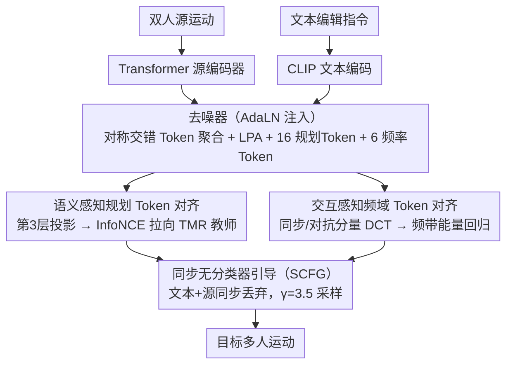

# InterEdit: Navigating Text-Guided Multi-Human 3D Motion Editing

**会议**: CVPR 2026  
**arXiv**: [2603.13082](https://arxiv.org/abs/2603.13082)  
**代码**: [github.com/YNG916/InterEdit](https://github.com/YNG916/InterEdit)  
**领域**: 3D人体运动编辑  
**关键词**: 多人运动编辑, 文本引导扩散模型, 交互感知频域对齐, 语义规划Token, TMME

## 一句话总结
首次定义文本引导的多人3D运动编辑(TMME)任务，构建含5161个源-目标-指令三元组的InterEdit3D数据集，提出InterEdit条件扩散模型——通过语义感知规划Token对齐捕捉高层编辑意图、交互感知频域Token对齐建模周期性交互动态，在指令跟随(g2t R@1 30.82%)和源保持(g2s R@1 17.08%)上全面超越4个基线。

## 研究背景与动机
**领域现状**：文本引导的3D运动编辑在单人场景已取得显著进展（MotionFix、MotionLab），但多人交互运动编辑几乎未被探索。现实中许多行为涉及多人交互——协作、竞争、身体接触等，需要多个参与者。

**现有痛点**：(1) 缺乏多人运动编辑的配对数据（源运动-目标运动-编辑指令三元组）；(2) 单人编辑方法简单拼接双人特征会破坏交互一致性（MotionFix g2t R@1仅3.86%）；(3) 多人生成方法缺乏"改什么/留什么"的显式分离机制，导致全局漂移。

**核心矛盾**：多人运动编辑需要同时满足"精确执行编辑指令"和"保持未编辑部分及时空耦合的一致性"——一个人的微小修改就可能破坏同步、空间一致性或接触时序。

**本文目标** 给定双人源运动和文本编辑指令，生成仅按指令修改相关部分、同时保持非编辑内容和人际交互一致性的目标多人运动。

**切入角度**：从语义层面（规划Token+运动教师对比学习）和频率层面（DCT频带能量描述子）两个互补维度约束编辑过程。

**核心 idea**：可学习语义规划Token指导"改什么"，DCT频域Token约束"交互节奏怎么保持"，两者协同确保编辑精度与交互一致性。

## 方法详解

### 整体框架
条件扩散模型，Start_X参数化（直接预测干净运动而非噪声）。输入双人源运动（非规范化表示，每人含全局关节位置、速度、6D旋转、脚地接触共$d_m$维）和CLIP编码的文本编辑指令。源运动经Transformer编码器得到源嵌入，与文本嵌入通过AdaLN注入去噪器。去噪器采用对称交错Token聚合——将双人运动交叉排列为 $(x^A_1, x^B_1, x^A_2, x^B_2, ...)$ 及其角色互换版本，经Transformer后合并得到全局特征，再通过LPA分支细化短程时序模式。附加16个规划Token和6个频率控制Token参与自注意力。DDIM 50步采样 + SCFG（γ=3.5）推理。

### 关键设计

**1. 语义感知规划 Token 对齐：让模型先想清楚"该改成什么"**

单人编辑方法把双人特征直接拼起来去噪，序列里没有一个显式承载"高层编辑意图"的载体，模型其实不知道编辑后整段运动在语义上应该长什么样。InterEdit 给去噪器序列额外挂上 $N_M=16$ 个可学习的规划 Token，让它们在自注意力里和运动 Token 一起流动，但不去预测具体关节，而是专门扮演"先在语义层面把意图想清楚、再落到运动上"的角色。训练时在第 3 层 Transformer 取出这些 Token，投影到语义空间得到 $\tilde{z}^{(k)}$；再用冻结的 TMR 运动教师编码目标运动，拿到语义嵌入 $\tilde{z}_{tgt}$ 作正样本，用 InfoNCE 把规划 Token 往目标语义上拉：

$$\mathcal{L}_{plan} = -\frac{1}{N_M}\sum_k \log \frac{\exp(\tilde{z}^{(k)\top}\tilde{z}_{tgt}/\tau)}{\sum_n \exp(\tilde{z}^{(k)\top}\tilde{z}_{tgt}^{(n)}/\tau)}$$

之所以用对比损失而不是 MSE/Cosine 直接回归目标嵌入，是因为 InfoNCE 会把目标和其它运动在语义空间里推开、保留判别结构，比逐维拟合更稳；而且规划 Token 只是"间接"引导运动 Token，不硬性约束每一帧的输出，给了模型把意图落地时更大的灵活度。

**2. 交互感知频域 Token 对齐：用频谱锁住两人之间的节奏**

多人运动真正难的是节拍、同步、相位这类"交互节奏"，它们在时域里很难逐帧监督。InterEdit 换了个视角，把双人运动拆成同步分量 $z_S=(x^A+x^B)/2$ 和对抗分量 $z_D=x^A-x^B$ —— 前者刻画两人一起动的部分，后者刻画此消彼长的部分 —— 再沿时间轴做 DCT 把它们搬到频域。两个信号各按低/中/高三个频带（cutoff $r_l=0.08$、$r_m=0.25$、$r_h=0.35$）算一个能量描述子：

$$E(C;b) = \sqrt{\frac{1}{|b|}\sum_{k \in b}C[k]^2 + \epsilon}$$

两信号 × 三频带共 6 个能量值，投影成 6 个频率控制 Token 进自注意力，并在第 5 层回归目标运动的频带能量。具体感受一下：两人对打时，低频能量对应整体步伐的同步、高频能量对应快速的出拳收拳；如果编辑指令只改了其中一人的动作，模型靠这 6 个 Token 就能"听出"原来的交互节奏被破坏了多少，从而在编辑时把节拍保住。高频权重特意压到 0.25，是因为高频对噪声敏感、占比太大反而把模型带偏；训练时还以 4% 概率随机丢掉频率 Token 做正则，防止模型过度依赖这条捷径。

**3. 同步无分类器引导（SCFG）：一次丢弃同时管住文本和源两个条件**

模型同时吃文本指令和源运动两个条件，标准 CFG 要么把两个条件分开丢弃（三分支、推理成本翻倍），要么不丢就失去引导空间。InterEdit 训练时以 10% 概率把文本和源**同步**丢掉 —— 同步是关键，单独丢一侧会让另一侧的条件信息泄露进本该"无条件"的分支，污染引导方向。推理时按 $\gamma=3.5$ 合并条件与无条件预测。实测这种两分支同步丢弃和三分支 CFG 质量相当，但每步只需算两次前向，更省。

### 损失函数 / 训练策略
总损失 $\mathcal{L}_{total} = \mathcal{L}_{motion} + 0.03 \cdot \mathcal{L}_{plan} + 0.01 \cdot \mathcal{L}_{freq}$。运动损失包含MSE重建 + 30×速度 + 30×脚地接触 + 10×骨骼长度 + 3×掩码距离图 + 0.01×相对朝向。1000步扩散余弦调度，DDIM 50步采样。AdamW(lr=1e-4余弦衰减, 10 epoch warmup)。5层Transformer(16头, dim=512)。模型358.8M参数(85.0M可训练)，8×RTX Pro 6000 Blackwell训练1500 epochs。

## 实验关键数据

### 主实验

| 方法 | FID↓ | g2s R@1↑ | g2s R@3↑ | g2t R@1↑ | g2t R@3↑ |
|------|------|----------|----------|----------|----------|
| MotionFix (单人编辑) | 2.547 | 2.51 | 6.76 | 3.86 | 7.73 |
| MotionLab (单人编辑) | 0.550 | 7.90 | 16.43 | 13.26 | 20.69 |
| InterGen (多人生成) | 0.624 | 9.52 | 18.91 | 18.93 | 31.64 |
| TIMotion (多人生成) | 0.445 | 12.54 | 22.33 | 24.97 | 40.68 |
| **InterEdit** | **0.371** | **17.08** | **29.32** | **30.82** | **47.65** |

### 消融实验

| 配置 | g2t R@1 | FID | 说明 |
|------|---------|-----|------|
| 无plan+freq Token | 24.97 | 0.445 | 基础扩散模型 |
| 仅plan Token | 28.72 | 0.367 | 语义引导有效 |
| 仅freq Token | 28.75 | 0.380 | 频率约束有效 |
| **plan+freq联合** | **30.82** | **0.371** | 两模块互补，最优 |
| freq dropout p=0.04 | 最优 | - | 过低过高均不利 |

### 关键发现
- 多人生成基线(InterGen/TIMotion)远优于单人编辑基线(MotionFix/MotionLab)——交互建模是多人编辑的核心
- Plan和Freq Token单独有效，联合后进一步提升（g2t R@1 28.7→30.8），证明语义和频域信号互补
- 人类评估确认优势——总体Win率75.5%，交互真实感Win率81.0%
- 频率Token dropout 4%是正则化和信号保持的最佳平衡点

## 亮点与洞察
- 开创性定义TMME任务并构建首个大规模多人运动编辑数据集（5161三元组，8人标注+交叉校验），为领域奠基
- 频域Token对齐巧妙捕捉交互动态：均值/差值分解→DCT→频带能量→可学习Token，优雅建模节奏同步
- 规划Token作为可学习语义控制信号参与自注意力是一种可复用的条件扩散设计范式
- 数据集构建pipeline具有通用性：运动检索→滑窗→TMR编码→top-2近邻→人工标注

## 局限与展望
- 作者承认手势歧义问题——混淆自我鼓掌vs与他人拍手等细粒度手势
- 长序列空间漂移——难以在长时复杂运动中维持严格人际空间关系
- 仅覆盖双人交互，3+人群组运动编辑未涉及
- 数据集基于InterHuman检索构建，运动多样性受限于源数据
- 仅支持文本控制，未结合空间约束（轨迹sketch、目标位置等）

## 相关工作与启发
- **vs MotionFix/MotionLab (单人编辑)**: 将双人拼接为单序列处理缺乏交互建模，g2t R@1仅3.86%/13.26%，远不如InterEdit的30.82%
- **vs TIMotion (最强基线)**: 多人生成模型，缺乏"改什么/留什么"机制。InterEdit在所有指标上超越（g2t +5.85, g2s +4.54, FID -16.7%）
- **vs InterGen**: 联合去噪扩散模型，无编辑功能。经改造后仍不如交互感知的InterEdit
- 频域Token正则化可迁移至视频生成/编辑中的时序一致性约束或音视频同步任务

## 评分
- 新颖性: ⭐⭐⭐⭐ 首次定义TMME问题和数据集，频域Token设计新颖，整体框架基于成熟扩散范式
- 实验充分度: ⭐⭐⭐⭐⭐ 4基线、多维消融、人类评估、失败案例分析
- 写作质量: ⭐⭐⭐⭐ 结构清晰、动机充分、公式完整
- 价值: ⭐⭐⭐⭐ 为多人运动编辑领域奠定数据集和方法基础

<!-- RELATED:START -->

## 相关论文

- [\[CVPR 2026\] Cross-Axis Feature Fusion with Joint-Wise Motion Difference Prediction for Text-Based 3D Human Motion Editing](cross-axis_feature_fusion_with_joint-wise_motion_difference_prediction_for_text-.md)
- [\[CVPR 2026\] Vinedresser3D: Agentic Text-guided 3D Editing](vinedresser3d_agentic_text-guided_3d_editing.md)
- [\[CVPR 2026\] Pico-Banana-400K: A Large-Scale Dataset for Text-Guided Image Editing](pico-banana-400k_a_large-scale_dataset_for_text-guided_image_editing.md)
- [\[CVPR 2026\] Aligning Multi-Character Narrative Image Generation with Multi-Aspect Human Preferences](aligning_multi-character_narrative_image_generation_with_multi-aspect_human_pref.md)
- [\[CVPR 2026\] BiMotion: B-spline Motion for Text-guided Dynamic 3D Character Generation](bimotion_b-spline_motion_for_text-guided_dynamic_3d_character_generation.md)

<!-- RELATED:END -->
