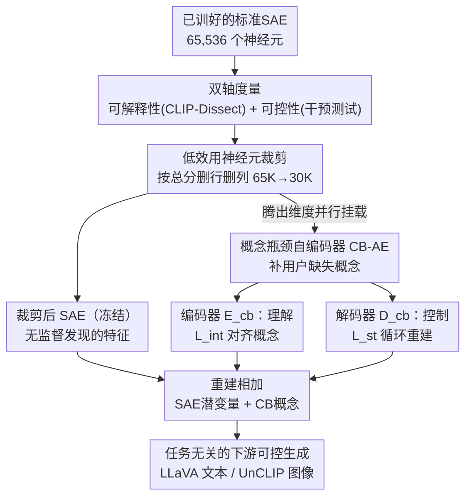

# Interpretable and Steerable Concept Bottleneck Sparse Autoencoders

**会议**: CVPR 2026  
**arXiv**: [2512.10805](https://arxiv.org/abs/2512.10805)  
**代码**: [GitHub](https://github.com/Trustworthy-ML-Lab/CB-SAE)  
**领域**: 图像生成  
**关键词**: 稀疏自编码器, 概念瓶颈, 可解释性, 可控性, 机制可解释性

## 一句话总结

揭示了SAE中大多数神经元（~81%）的可解释性或可控性不足的问题，提出CB-SAE框架——通过裁剪低效用SAE神经元并增加概念瓶颈模块，在LVLM和图像生成任务上分别提升可解释性+32.1%和可控性+14.5%。

## 研究背景与动机

稀疏自编码器（SAE）已成为机制可解释性的基础工具，用于将LLM/VLM中密集的多义激活分解为稀疏的单义潜变量。然而，要实现实际应用，SAE特征需要同时满足两个条件：**可解释**（人类可理解每个神经元的含义）和**可控**（干预神经元激活能可靠地改变模型输出）。

本文通过经验分析发现SAE的两个关键局限：
1. **大多数神经元不实用**：在65,536个SAE神经元中，仅18.84%同时具有高可解释性和高可控性；36.26%两者都低
2. **用户所需概念覆盖不足**：尽管SAE字典很大，仍有27-45%的ImageNet相关概念无法被SAE表示

而概念瓶颈模型（CBM）提供了明确的概念控制但无法发现新特征。本文核心idea：将SAE的无监督发现能力与CBM的可控性统一到一个框架中。

## 方法详解

### 整体框架

CB-SAE想解决的是"SAE字典又大又不好用"的尴尬：神经元数以万计，但真正既能被人读懂、又能被干预控制的只占少数，用户真正关心的概念还经常根本不在字典里。它的做法不是从头重训一个更好的SAE，而是在一个**已经训好的标准SAE**上做减法加加法——先逐个神经元打分，把没用的剪掉，再在剪空出来的位置旁挂一个轻量的"概念瓶颈"模块，专门补上用户指定却缺失的概念。整条流水线四步走：训练标准SAE → 对每个神经元同时量化可解释性和可控性 → 按总分裁掉底部的低效用神经元 → 在冻结的裁剪SAE旁并行训练一个概念瓶颈自编码器（CB-AE）。最终的重建由两部分相加：保留下来的SAE潜变量负责无监督发现的特征，CB-AE负责被监督对齐的指定概念。

### 关键设计

**1. 可解释性与可控性的双轴度量：把"能不能读懂"和"能不能控制"分开量化**

论文先要回答一个被以往工作含混带过的问题——一个SAE神经元到底有没有用。它的判断是：可解释和可控是两回事，必须分别打分。可解释性沿用 CLIP-Dissect，把每个神经元和一个预定义概念集里最匹配的概念对上号，取最高相似度作为分数，衡量"人能不能说清这个神经元代表什么"。可控性则要做一次实际干预测试：把目标神经元的激活强行设成高值 $\alpha=50$、其余压到零/白图像基线，让下游模型（LLaVA 或 UnCLIP）真的前向跑一遍，再算输出和 CLIP-Dissect 分配给该神经元那个概念的句子嵌入之间的余弦相似度，衡量"动这个神经元能不能真把输出推向它该有的概念"。把两轴拆开是有道理的：一个高可解释的神经元可能因果效应很弱、或和别的神经元纠缠太深，所以根本控不动；反过来一个高可控的神经元可能编码了某种抽象或组合特征，说不清它到底是什么。只有把两者同时量出来，后面的裁剪才有依据。

**2. 低效用神经元裁剪：直接删行删列，给概念瓶颈腾位置**

有了双轴分数，裁剪就很直接：把可解释性和可控性加起来当总分，从低到高排序，砍掉垫底的 $M$ 个（默认从 65K 里保留 30K）。实现上不绕弯子，就是把编码器、解码器矩阵里对应那些神经元的行和列整段删掉——$E'_{sae} = E_{sae}[[\omega]\setminus\mathcal{P},:]$，$D'_{sae} = D_{sae}[:,[\omega]\setminus\mathcal{P}]$，其中 $\mathcal{P}$ 是被裁的下标集。比起给神经元加权或上正则，硬删更简洁，也直接腾出了维度让后面的概念瓶颈来填。配套地，要补的概念集只取用户想要、但现有 SAE 又表示不了的那部分：$\mathcal{C} = \mathcal{C}_{user} \setminus \mathcal{C}_{rsae}$，避免和 SAE 已能覆盖的概念重复造轮子。

**3. 概念瓶颈自编码器：编码器管"理解"、解码器管"控制"，循环重建把可控性单独喂出来**

剪空之后，论文在冻结的裁剪 SAE 旁并行挂一个线性的概念瓶颈：编码器 $E_{cb} \in \mathbb{R}^{|\mathcal{C}| \times d}$ 把特征映射到指定概念上，解码器 $D_{cb} \in \mathbb{R}^{d \times |\mathcal{C}|}$ 再映射回特征空间。最终重建是两路相加：

$$\hat{v}' = D'_{sae}z' + b + D_{cb}\sigma_{cb}(c)$$

其中 $\sigma_{cb}$ 对概念激活做 top-k 稀疏化（$k=5$），保持瓶颈的稀疏性。关键的巧思在训练——编码器和解码器**用不同目标分头优化**，让"理解"和"控制"各管一摊。具体是三个目标交替走：重建损失 $\mathcal{L}_r$ 同时更新 $E_{cb}, D_{cb}$，把裁剪造成的重建退化补回来；可解释性损失 $\mathcal{L}_{int}$ 只更新编码器 $E_{cb}$，用 CLIP 零样本分类器生成伪标签、以 cosine-cubed 相似性损失对齐概念编码，让编码器学会"看懂"；可控性损失 $\mathcal{L}_{st}$ 只更新解码器 $D_{cb}$，做一次循环重建——把重建出来的 $\hat{v}'$ 再过一遍 $E_{cb}$ 得到 $\hat{c}$，和同样的伪标签算损失，强迫解码器把概念的修改如实反映到重建特征里。这个循环重建是任务无关的：它不绑定任何具体下游模型，所以同一个 CB-SAE 既能用来控文本生成（LLaVA）又能控图像生成（UnCLIP）。

### 损失函数 / 训练策略

三个目标交替优化，而且刻意不引入损失权重超参数，靠为各目标配独立的 Adam 优化器来自适应缩放梯度：

- $\mathcal{L}_r = \|v - \hat{v}'\|_2^2$：重建保真度，更新 $E_{cb}, D_{cb}$
- $\mathcal{L}_{int}$：cosine-cubed 相似性损失，只更新 $E_{cb}$（可解释性）
- $\mathcal{L}_{st}$：循环 cosine-cubed 相似性损失，只更新 $D_{cb}$（可控性）

## 实验关键数据

### 主实验 — LLaVA/UnCLIP可控生成

| 下游模型 | 方法 | CLIP-Dissect↑ | 单义性↑ | 单元向量↑ | 白图像↑ |
|---------|------|-------------|--------|---------|--------|
| LLaVA-1.5-7B | SAE | 0.154 | 0.517 | 0.198 | 0.203 |
| LLaVA-1.5-7B | **CB-SAE** | **0.244** | **0.556** | **0.261** | **0.250** |
| LLaVA-MORE | SAE | 0.194 | 0.553 | 0.179 | 0.177 |
| LLaVA-MORE | **CB-SAE** | **0.291** | **0.598** | **0.192** | **0.189** |
| UnCLIP | SAE | 0.058 | 0.540 | 0.642 | 0.654 |
| UnCLIP | **CB-SAE** | **0.092** | **0.594** | **0.659** | **0.664** |

平均可解释性提升+32.1%，可控性提升+14.5%

### 消融实验 — 神经元类型分析

| 神经元类型 | CLIP-Dissect | 单元向量 | 白图像 |
|-----------|-------------|---------|--------|
| 全部SAE神经元 | 0.154 | 0.198 | 0.203 |
| 被裁剪的SAE神经元 | 0.084 | 0.144 | 0.162 |
| 保留的SAE神经元 | 0.238 | 0.263 | 0.252 |
| CB神经元 | **0.323** | 0.231 | 0.219 |
| 全部CB-SAE神经元 | 0.244 | **0.261** | **0.250** |

### 关键发现

- SAE神经元的四象限分布：高解释+高可控仅18.84%，低解释+低可控36.26%，两极分化严重
- SAE概念覆盖率随概念集增大急剧下降：Broden 96.3% → 20K英语词汇仅28.0%
- CB神经元的可解释性显著高于SAE神经元（0.323 vs 0.154），验证了概念监督的必要性
- 可控性损失 $\mathcal{L}_{st}$ 贡献+2.9%可控性提升，且不影响可解释性
- 保留SAE神经元数量越少分数越高，但过少会损害重建，30K是合理平衡点

## 亮点与洞察

- 首次系统化地揭示了SAE可解释性与可控性之间的trade-off，并量化了概念覆盖不足的问题
- 将SAE（无监督发现）和CBM（监督概念对齐）统一在同一框架中是很自然且有效的设计
- 循环重建的可控性损失是巧妙的任务无关设计，使得同一CB-SAE可用于文本生成和图像生成两个不同下游任务
- 概念集选择策略（仅添加SAE中缺失的概念）避免了冗余

## 局限与展望

- 依赖CLIP-Dissect进行概念分配，CLIP-Dissect本身可能不准确
- CB神经元的可控性仍低于保留的SAE神经元，需要更好的或针对特定任务的可控性损失
- 仅在CLIP视觉编码器上验证，对其他视觉编码器（如DINOv2）的适用性需进一步探索
- SAE的"特征分裂"现象与概念覆盖不足可能存在关联，未深入研究
- 训练依赖CLIP零样本分类器的伪标签，其准确性上限受CLIP本身限制

## 相关工作与启发

- **vs 标准SAE**: SAE是纯无监督的，不保证发现用户需要的概念，且大多数神经元低效用；CB-SAE通过裁剪+增强解决了这两个问题
- **vs CBM**: CBM局限于预定义概念集，无法发现新特征；CB-SAE保留了SAE的发现能力
- **vs AlignSAE**: 并发工作，AlignSAE用正交性损失分离监督/无监督概念，CB-SAE直接裁剪低效用神经元；AlignSAE针对文本LLM，CB-SAE针对视觉模型

## 评分

- 新颖性: ⭐⭐⭐⭐ SAE+CBM的统一是自然且有效的，可解释性/可控性分析有独立价值
- 实验充分度: ⭐⭐⭐⭐ 两个下游任务、详细消融和敏感性分析，但数据集有限（仅ImageNet）
- 写作质量: ⭐⭐⭐⭐ 问题分析清晰，方法自然递进，图表直观
- 价值: ⭐⭐⭐⭐ 对SAE实用化有重要推动，特别是对需要特定概念控制的应用场景

<!-- RELATED:START -->

## 相关论文

- [\[NeurIPS 2025\] Learning Interpretable Features in Audio Latent Spaces via Sparse Autoencoders](../../NeurIPS2025/image_generation/learning_interpretable_features_in_audio_latent_spaces_via_sparse_autoencoders.md)
- [\[ICML 2026\] SAEmnesia: Erasing Concepts in Diffusion Models with Supervised Sparse Autoencoders](../../ICML2026/image_generation/saemnesia_erasing_concepts_in_diffusion_models_with_supervised_sparse_autoencode.md)
- [\[CVPR 2026\] MeanFlow Transformers with Representation Autoencoders](meanflow_transformers_with_representation_autoencoders.md)
- [\[CVPR 2026\] Guiding Token-Sparse Diffusion Models](guiding_token-sparse_diffusion_models.md)
- [\[CVPR 2026\] CREval: An Automated Interpretable Evaluation for Creative Image Manipulation under Complex Instructions](creval_an_automated_interpretable_evaluation_for_creative_image_manipulation_und.md)

<!-- RELATED:END -->
