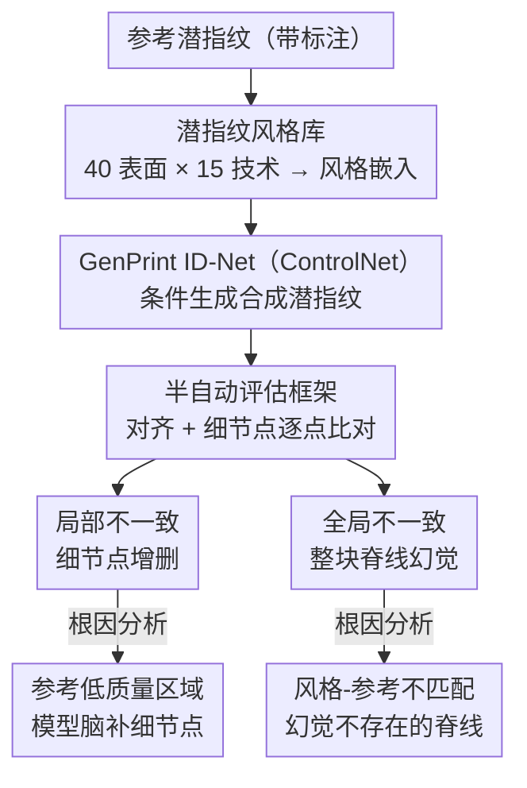

# Intra-finger Variability of Diffusion-based Latent Fingerprint Generation

**会议**: CVPR 2026  
**arXiv**: [2604.10040](https://arxiv.org/abs/2604.10040)  
**代码**: 无  
**领域**: 图像生成/生物特征  
**关键词**: 指纹合成, 扩散模型, 潜指纹, 身份一致性, 风格多样性

## 一句话总结

本文系统评估了扩散模型合成指纹的同指变异性，通过构建包含40种表面和15种处理技术的潜指纹风格库提升生成多样性，并量化了生成过程中引入的局部/全局身份不一致性。

## 研究背景与动机

**领域现状**：GenAI（GAN和DDPM）已能生成高质量合成指纹数据集。指纹合成通常分两阶段：生成唯一身份（指间变异）和生成同一身份的多种变体（指内变异）。对于潜指纹领域，第二阶段更为关键。

**现有痛点**：(1) 现有模型依赖整体或随机风格迁移，无法精确指定法医场景（如"从玻璃瓶上提取的用荧光粉显现的潜指纹"）；(2) 生成过程的随机性可能改变指纹脊线和细节点（minutiae），破坏身份真实性。

**核心矛盾**：多样性和身份保持之间存在张力——增加风格多样性的同时可能引入更多身份不一致。

**本文目标**：(1) 增强潜指纹生成的风格多样性；(2) 严格量化身份保持能力。

**切入角度**：构建包含28,000张真实潜指纹的风格库实现精确风格控制，并设计半自动化框架评估身份一致性。

**核心idea**：通过风格库实现40+种可控潜指纹风格，同时揭示扩散模型在低质量区域的局部不一致和风格-参考不匹配时的全局不一致。

## 方法详解

### 整体框架

潜指纹合成通常分两步：先造出一个唯一身份（指间变异），再围绕这个身份生成多张带不同采集风格的变体（指内变异）。法医场景里第二步更要紧——同一枚指纹可能从玻璃瓶、金属把手或纸张上提取，再用粉末、化学或光学手段显现，呈现出截然不同的外观。本文沿用 GenPrint 的第二阶段，但把它的风格控制和身份评估两端都做扎实：输入一张带标注的参考指纹，先从风格库里挑出对应法医场景的风格嵌入，喂给微调过的 ControlNet（GenPrint 的 ID-Net）生成合成潜指纹，再用一套半自动框架把生成图和参考图对齐、逐个细节点比对，量化身份到底被改动了多少、为什么被改动。

### 关键设计

**1. 潜指纹风格库：把"随机风格"换成"可指定的法医场景"**

GenPrint 原本只能套用通用或随机的潜指纹风格，没法精确生成"玻璃瓶上用荧光粉显现的潜指纹"这类具体场景。本文从 7 个数据集策划出 28,000 张真实潜指纹，按采集表面和显现技术两个维度归类——40 种表面（玻璃、金属、纸张等）× 15 种处理技术（粉末、化学、光学等），凑成 40+ 种离散风格。每种风格抽出一个嵌入向量，作为 GenPrint 的条件输入。这样生成时不再碰运气，而是直接点名要哪种法医场景的外观，多样性也从原来的几种粗粒度风格跃升到几十种可控风格。

**2. 身份一致性的半自动评估框架：从细节点级别看身份被改了多少**

光看自动匹配分数太粗，分不清身份是怎么被破坏的。本文用带人工标注的参考指纹生成合成版本，对齐后把差异拆成两类来逐点核查：局部不一致指细节点（minutiae）的增删——用自动检测器先找候选、再人工验证；全局不一致指参考里根本不存在、却被整块"画"出来的脊线幻觉。这套细节点级别的比对能定位到具体是哪根脊线、哪个细节点被动过，而不是只给一个笼统的相似度数字。

**3. 不一致性的根因分析：定位多样性与身份保持之间张力的来源**

知道哪里不一致还不够，更要知道为什么，才能反过来指导模型改进。分析发现两类不一致各有触发条件：局部不一致主要冒在参考图像质量差的区域——模型在信息不足、把握不准时倾向于"脑补"细节点；全局不一致则出现在参考图像和所选风格嵌入对不上的时候——风格和内容冲突，模型就幻觉出参考中不存在的整块脊线。两个根因正好对应"增加风格多样性反而引入身份不一致"这条核心张力，也给出了明确的改进抓手：补强低质量区域的约束、确保风格与参考匹配。

### 损失函数 / 训练策略

沿用 GenPrint 的 ID-Net（在 ControlNet 上微调），以风格嵌入和文本提示作为条件，训练流程不变。

## 实验关键数据

### 主实验

| 评估维度 | 结果 |
|---------|------|
| 风格覆盖 | 40种表面 × 15种处理技术 |
| 数据规模 | 28,000张真实潜指纹 |
| 身份保持 | 大部分保持，少量局部不一致 |
| 全局幻觉 | 风格不匹配时出现 |

### 消融实验

| 条件 | 局部不一致 | 全局不一致 | 说明 |
|------|-----------|-----------|------|
| 高质量参考 | 少 | 少 | 最佳情况 |
| 低质量参考 | 多 | 少 | 差质量区域催生细节点变化 |
| 风格不匹配 | 少 | 多 | 参考和风格嵌入不一致 |

### 关键发现

- 生成过程在大多数情况下保持了身份，但低质量区域更容易引入局部不一致
- 风格嵌入与参考图像的不匹配是全局幻觉的主要原因
- 这些发现为改进合成指纹生成器提供了明确的改进方向

## 亮点与洞察

- **系统性的身份一致性分析**：首次在细节点级别量化了扩散模型指纹生成的身份保持能力
- **法医场景可控性**：40种表面×15种处理技术的风格库使得潜指纹生成具有实际的法医训练价值
- **根因分析的实用性**：低质量区域和风格不匹配两个根因可直接指导模型改进

## 局限与展望

- 半自动化评估仍需人工参与，无法完全自动化
- 风格库的覆盖范围虽广但可能仍不完整
- 未提出解决不一致性的方法，仅做了分析

## 相关工作与启发

- **vs Wyzykowski et al.**: 仅支持3种粗粒度风格（good/bad/ugly），本文实现40+种精细风格
- **vs Joshi et al.**: 使用神经风格迁移但缺乏风格控制，本文通过风格库实现精确控制

## 评分

- 新颖性: ⭐⭐⭐ 风格库构建有价值但方法创新有限
- 实验充分度: ⭐⭐⭐⭐ 身份一致性分析深入细致
- 写作质量: ⭐⭐⭐⭐ 问题定义清晰
- 价值: ⭐⭐⭐ 对法医和指纹识别社区有直接价值

<!-- RELATED:START -->

## 相关论文

- [\[CVPR 2026\] Latent Diffusion Inversion Requires Understanding the Latent Space](latent_diffusion_inversion_requires_understanding_the_latent_space.md)
- [\[CVPR 2026\] A Temporal and Content Co-Awareness Latent Diffusion for Controllable Hand Image Generation](a_temporal_and_content_co-awareness_latent_diffusion_for_controllable_hand_image.md)
- [\[CVPR 2026\] Your Latent Mask is Wrong: Pixel-Equivalent Latent Compositing for Diffusion Models](your_latent_mask_is_wrong_pixel-equivalent_latent_compositing_for_diffusion_mode.md)
- [\[CVPR 2026\] Self-Corrected Image Generation with Explainable Latent Rewards](self-corrected_image_generation_with_explainable_latent_rewards.md)
- [\[CVPR 2026\] Unified Latent Space for Understanding and Generation via Semantic Auto-encoder](unified_latent_space_for_understanding_and_generation_via_semantic_auto-encoder.md)

<!-- RELATED:END -->
