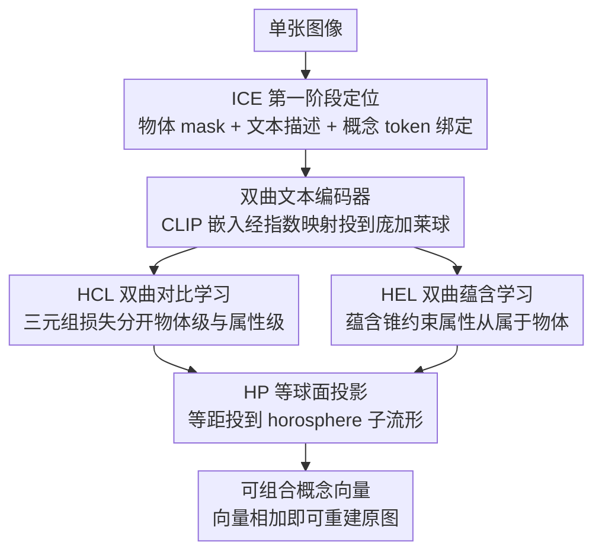

# Intrinsic Concept Extraction Based on Compositional Interpretability

**会议**: CVPR 2026  
**arXiv**: [2603.11795](https://arxiv.org/abs/2603.11795)  
**代码**: 无  
**领域**: 图像生成  
**关键词**: 概念提取, 双曲空间, 组合可解释性, 扩散模型, 概念解耦

## 一句话总结

HyperExpress 提出组合可解释本征概念提取（CI-ICE）新任务，利用双曲空间的层次建模能力和等球面投影模块，从单张图像中提取可组合的物体级和属性级概念，实现可逆的复杂视觉概念分解。

## 研究背景与动机

**领域现状**：无监督概念提取（UCE）旨在从单张图像中提取人类可理解的视觉概念。现有方法如 ConceptExpress、AutoConcept 只能提取物体级概念，ICE 虽能提取属性级概念但不考虑组合性。

**核心问题**：
   - 现有方法仅关注概念解耦（disentanglement），忽视了可组合性（composability），导致提取的概念无法可靠地重组回原始图像
   - CCE 方法虽考虑了组合性，但需要从包含相同概念的多张图像中学习
   - 欧几里得空间难以捕捉物体级和属性级概念之间的层次结构和关联关系

**本文方案**：提出 CI-ICE 任务和 HyperExpress 方法，通过双曲空间学习概念层次结构，通过等球面投影确保概念嵌入空间的组合性

## 方法详解

### 整体框架

HyperExpress 想解决的是：从一张图里既要把物体级概念（robot）和属性级概念（metal、gold）拆干净，又要保证拆出来的概念能可逆地拼回原图。它先借 ICE 的第一阶段定位主要物体、拿到 mask 和文本描述，把每个概念绑定到一个可学习的 token 上；对一张含 $N$ 个物体、每物体 $M$ 个属性的图像，总共要学 $(M{+}1)\times N$ 个概念 token 及其嵌入。学习过程不在普通欧氏空间里做，而是搬到双曲空间——因为「物体包含属性」本身是一棵层次树，双曲空间的指数级容量恰好能把这种层次自然摊开。具体地，先用双曲文本编码器把概念嵌入投进庞加莱球，再用对比（HCL）与蕴含（HEL）两个模块把概念层次学出来，最后用一次等球面投影（HP）把嵌入压到一个支持「向量相加＝概念组合」的子流形上。

### 关键设计

**1. 双曲文本编码器：把概念嵌入安放进一棵层次树**

普通 CLIP 文本嵌入活在欧氏空间，物体和属性是平铺的，看不出「金属是机器人的一个属性」这种从属关系。这里把 CLIP 文本嵌入经指数映射投到庞加莱球（Poincaré ball）上，并额外学一个权重 $W$ 来标定从标准编码器空间到切空间的映射。投上去之后层次性是几何自带的：越靠近球心的概念越抽象、对应物体级，越贴近球面边界的越具体、对应属性级。后面所有损失都建立在这个「球心抽象、边界具体」的几何先验上。

**2. 双曲对比学习模块（HCL）：用距离把物体级和属性级分开**

光有层次几何还不够，得主动把不同层级、不同属性的概念推到该在的位置。HCL 做两件事：一是物体-属性区分，用一个双曲三元组损失，逼着物体级锚点离它自己的物体嵌入比离任意属性嵌入更近，从而把「物体」这一级整体拽向球心一侧；二是不同属性区分，再加一个属性级三元组损失，让同一属性类型内（如不同颜色之间）的距离保持合理区分度。两条三元组一起作用，物体级和属性级概念在双曲空间里被自然分层落位，而不是挤成一团。

**3. 双曲蕴含学习模块（HEL）：把「物体包含属性」写成几何约束**

对比损失只管「谁离谁近」，管不住「属性必须从属于某个物体」这种有向包含关系。HEL 改在洛伦兹模型里建模蕴含（entailment）：若概念 $i$ 蕴含概念 $j$，则要求二者的空间角 $\theta(v_i, v_j)$ 小于以 $v_i$ 为顶点的蕴含锥半径 $\omega(v_i)$——直观说，就是让每个属性概念都落进它所属物体概念张开的那个「锥子」里。锥半径和空间角都通过庞加莱球到洛伦兹模型的变换来算，蕴含损失则惩罚跑出锥外的属性。这样物体与属性之间不只是「近」，而是结构化的包含，组合时才知道哪些属性该挂到哪个物体上。

**4. 等球面投影模块（HP）：把嵌入压到「能做加法」的子流形上**

前三步学出来的概念层次准了，但双曲空间本身不支持「物体向量＋属性向量＝带属性的物体」这种线性组合，概念拼不回去。HP 在锚点上训练，寻找 $n$ 个测地方向使投影后的方差最大化（思路借鉴 HoroPCA），通过一个正交矩阵完成旋转，把嵌入投到一个等球面（horosphere）子流形上。这个子流形继承了等球面的零曲率特性，于是向量加法在上面是良定义的，概念组合直接退化成加法；而投影用的是等距（isometry）变换，保证前面辛苦学出的层次结构和关联关系不被这一步破坏。举个例子，组合 "robot" ＋ "metal" ＋ "gold" 三个学好的概念向量，在子流形上相加即可重建出 "golden robot made of metal"，且仍可逆地拆回这三个分量。

### 损失函数 / 训练策略

总损失由四部分加权（$\lambda$）组成：扩散模型去噪的重建损失、HCL 的双曲三元组损失（物体级＋属性级）、Wasserstein 注意力对齐损失、HEL 的双曲蕴含损失。

## 实验关键数据

### 主实验

**UCEBench 性能对比（表1）**：

| 方法 | SIM^I (%) | SIM^C (%) | ACC^1 (%) | ACC^3 (%) |
|------|-----------|-----------|-----------|-----------|
| Break-A-Scene | 0.627 | 0.773 | 0.174 | 0.282 |
| ConceptExpress | 0.689 | 0.784 | 0.263 | 0.385 |
| AutoConcept | 0.690 | 0.770 | 0.350 | 0.520 |
| ICE | 0.738 | 0.822 | 0.325 | 0.518 |
| **HyperExpress** | **0.699** | **0.786** | **0.504** | **0.736** |

**ICBench 性能对比（表2）**：

| 方法 | SIM^T-T_obj | SIM^T-T_mat | SIM^T-T_color | SIM^T-V_obj | SIM^T-V_mat | SIM^V-T_color |
|------|------------|------------|--------------|------------|------------|--------------|
| ICE | 0.249 | 0.101 | 0.093 | 0.264 | 0.208 | 0.215 |
| **HyperExpress** | **0.280** | **0.115** | **0.098** | **0.305** | **0.211** | **0.222** |

### 消融实验

| HCL | HEL | HP | SIM^I | SIM^C | ACC^1 | ACC^3 |
|-----|-----|-----|-------|-------|-------|-------|
| Y | N | N | 0.625 | 0.769 | 0.326 | 0.509 |
| Y | Y | N | 0.688 | 0.771 | 0.330 | 0.518 |
| Y | N | Y | 0.621 | 0.765 | 0.348 | 0.522 |
| Y | Y | Y | **0.699** | **0.786** | **0.504** | **0.736** |

### 关键发现

- HyperExpress 在 ACC^1 和 ACC^3 上大幅领先（0.504 vs 0.350），代价是 SIM^I 略低于 ICE
- 三模块协同效果显著：仅 HCL 时 ACC^3=0.509，三模块完整达 0.736（+44.6%）
- HP 对组合性贡献最大，HEL 对 SIM^I 提升最大

## 亮点与洞察

1. **创新任务定义**：CI-ICE 同时要求解耦和可组合性，填补研究空白
2. **双曲几何巧妙应用**：庞加莱球天然层次建模处理概念层级
3. **等距投影理论保证**：HP 的等距性质确保不破坏已学习的概念关系
4. **可解释组合路径**：如 "robot" + "metal" + "gold" -> "golden robot made of metal"

## 局限与展望

1. 在 SIM^I 上不如 ICE，组合性约束带来保真度损失
2. 依赖 ICE 第一阶段物体定位
3. 双曲空间计算增加复杂度
4. 仅在 D1 数据集评估
5. 属性类型固定为颜色和材质

## 相关工作与启发

- **ICE**：直接前驱，单图本征概念提取但忽视组合性
- **CCE**：组合性理论框架但需多图像
- **HoroPCA**：启发等球面投影模块
- **启发**：双曲空间在视觉概念学习中值得更广泛探索

## 评分

| 维度 | 分数 (1-5) | 说明 |
|------|-----------|------|
| 创新性 | 4 | 新任务+双曲空间创新应用 |
| 技术深度 | 4 | 严谨数学框架和理论证明 |
| 实验完整性 | 3 | 数据集和基线较少 |
| 写作质量 | 4 | 逻辑清晰 |
| 实用价值 | 3 | 任务较学术化 |
| 总分 | 3.6 | |

<!-- RELATED:START -->

## 相关论文

- [\[CVPR 2025\] ICE: Intrinsic Concept Extraction from a Single Image via Diffusion Models](../../CVPR2025/image_generation/ice_intrinsic_concept_extraction_from_a_single_image_via_diffusion_models.md)
- [\[CVPR 2026\] LumiX: Structured and Coherent Text-to-Intrinsic Generation](lumix_structured_and_coherent_text-to-intrinsic_generation.md)
- [\[CVPR 2026\] Closed-Form Concept Erasure via Double Projections](closed-form_concept_erasure_via_double_projections.md)
- [\[CVPR 2026\] Neighbor-Aware Localized Concept Erasure in Text-to-Image Diffusion Models](neighbor-aware_localized_concept_erasure_in_text-to-image_diffusion_models.md)
- [\[CVPR 2026\] Beyond Text Prompts: Precise Concept Erasure through Text–Image Collaboration](beyond_text_prompts_precise_concept_erasure_through_text-image_collaboration.md)

<!-- RELATED:END -->
