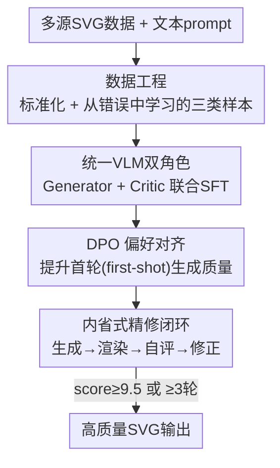

# IntroSVG: Learning from Rendering Feedback for Text-to-SVG Generation via an Introspective Generator-Critic Framework

**会议**: CVPR 2026  
**论文**: [CVF Open Access](https://openaccess.thecvf.com/content/CVPR2026/html/Wang_IntroSVG_Learning_from_Rendering_Feedback_for_Text-to-SVG_Generation_via_an_CVPR_2026_paper.html)  
**代码**: https://gitcat-404.github.io/IntroSVGProject/ （项目页）  
**领域**: 图像生成 / 矢量图生成 / 多模态VLM  
**关键词**: Text-to-SVG、视觉反馈、生成-评审-精修闭环、DPO、从错误中学习

## 一句话总结
IntroSVG 把一个统一 VLM 同时当作"生成器"和"评论家"，让它在推理时渲染自己写的 SVG 代码、用视觉反馈自评打分再修正，并配合"从错误样本中构造训练数据 + DPO 对齐"的训练流程，在多项 Text-to-SVG 指标上达到 SOTA（RSR 99.26%、FID 26.18、Aesthetic 4.89）。

## 研究背景与动机

**领域现状**：Text-to-SVG（T2S）目前两条主线：一是优化式方法（ClipDraw / VectorFusion / SVGDreamer），把 SVG 路径参数当可优化变量、渲染成位图后用 CLIP 或扩散模型打分反传；二是自回归式方法（LLM4SVG / StarVector / OmniSVG / SVGen），用大语言/视觉语言模型直接生成 SVG 代码序列。后者保留了矢量可编辑性，已逐渐成为主流。

**现有痛点**：自回归方法的训练只优化"代码序列"本身，**整个训练过程从不看渲染后的最终图像长什么样**——模型既没有"眼睛"去感知结构化的视觉反馈，也没有"脑子"去自我评估、迭代改稿。结果就是"一次成型"（one-pass）的输出范式，质量靠后续人工挑选兜底，复杂图标常常结构错乱、语义不对齐。

**核心矛盾**：自回归生成在 token 空间里逐字写代码，而质量评判发生在"代码渲染成像素"之后的视觉空间——这两个空间在现有训练里是**断开的**。模型写完代码就交差，看不到自己画出来的东西到底像不像。

**本文目标**：把"显式视觉反馈"塞进生成闭环，让同一个模型既能生成、又能感知渲染结果、还能据此迭代修正。

**切入角度**：作者注意到统一 VLM 本身就同时具备"生成代码"和"看图"两种能力，那么完全可以让它在一个模型内身兼二职——写完 SVG 后切换到评论家角色去"看"自己的渲染图，再切回生成器角色改稿，形成内省式闭环。

**核心 idea**：用一个统一 VLM 扮演生成器+评论家双角色，通过"生成→渲染→自评→精修"的闭环把视觉反馈引入生成过程；同时把训练中的失败样本系统性回收成"纠错"数据，而不是丢弃。

## 方法详解

### 整体框架
IntroSVG 的核心是一个参数化为 $\theta$ 的统一 VLM $\mathcal{M}$（基座为 Qwen2.5-VL-7B-Instruct），经过三段式演化获得"生成"和"评论"双能力。整条管线分四块：先做**数据工程**（清洗标准化 + 用早期 checkpoint 和教师 VLM 构造三类训练样本），再做 **Stage 1 SFT**（在混合数据上联合训练生成器与评论家），接着 **Stage 2 DPO**（只针对生成能力做偏好对齐，提升首轮质量），最后在推理时运行**内省式精修闭环**（生成→渲染→自评→修正，直到分数达标或到达最大轮数）。

### 关键设计

**1. 数据工程：标准化 + 从错误中学习的三类样本**

这一步同时解决两个痛点：原始 SVG 数据集语法混乱（viewBox 尺寸不一、坐标精度不一、相对/绝对路径命令混用），以及模型缺乏"纠错"和"评判"能力的训练信号。作者先做标准化——整合 LLM4SVG / OmniSVG / SVGen 三个开源库，剔除单色、不可渲染、序列长于 8000 token 的样本，把所有 viewBox 归一到 `0 0 200 200`，只保留 M/L/C/A/Z 五种命令、坐标全部取整、并强制把 `fill` 属性排在 `d`（路径数据）之前以建立一致的生成顺序，最终得到约 20 万对 (文本, SVG)。消融（Table 1）证明"绝对命令 + 整数坐标"显著降低了 VLM 的学习负担，RSR 从 68.41% 提升到 98.62%、FID 从 121.50 降到 32.15。

更关键的是"从错误中学习"：作者用在直接生成数据 $D_G^{direct}$ 上预训练的模型为 5 万条 prompt 生成草稿，再让 GPT-4o 当外部专家分析草稿及其渲染图，产出含 `score / critique / suggestions` 的 JSON 反馈。基于这些反馈构造两类数据——评论数据 $D_C$（输入=prompt+渲染图，输出=专家 JSON 评语）和纠错数据 $D_G^{correction}$（输入=prompt+草稿 SVG+专家评语，输出=高质量参考 SVG）。同一批失败样本在 SFT 阶段当"纠错"数据、在 DPO 阶段当负偏好对、在推理阶段当迭代起点，被反复榨取价值而非丢弃。

**2. 统一 VLM 双角色：一个模型同时学会生成与评论**

Stage 1 SFT 在混合数据 $D_{SFT}=D_G^{direct}\cup D_G^{correction}\cup D_C$ 上用两个并行目标训练同一模型。生成器目标在 $D_G=D_G^{direct}\cup D_G^{correction}$ 上最小化负对数似然：

$$\mathcal{L}_{\text{SFT-G}}(\theta) = -\mathbb{E}_{(X_G,S_{gold})\sim D_G}\big[\log p(S_{gold}\,|\,X_G;\theta)\big]$$

其中输入 $X_G$ 有两种形态：可以是 $D_G^{direct}$ 里的简单 prompt $P$（从零创作），也可以是 $D_G^{correction}$ 里包含 $(P, S_{fail}, C_{fail})$ 的复杂纠错 prompt（从错误中改稿）。评论家目标在 $D_C$ 上让模型根据 prompt 和渲染图 $I$ 预测专家结构化评语 $C$：

$$\mathcal{L}_{\text{SFT-C}}(\theta) = -\mathbb{E}_{(P,I,C)\sim D_C}\big[\log p(C\,|\,P,I;\theta)\big]$$

巧妙之处在于：生成和评论靠**不同的 prompt 格式**在同一套权重里被功能性地区分开，因此一个模型就能在生成器和评论家之间无缝切换，不需要额外训练一个独立的奖励模型。

**3. DPO 偏好对齐：把"首轮生成质量"顶上去**

作者认为更高质量的初始草稿是后续迭代成功的关键——草稿越好，需要的修正轮数越少。于是 Stage 2 只对"生成"能力做 DPO。构造偏好数据 $D_{pref\text{-}G}$ 的方式是：用 SFT 后的 $\mathcal{M}_{SFT}$ 对 1 万条 prompt 各生成 5 个候选（共 5 万），GPT-4o 打分后按两条规则自动配对——"可渲染优先"（能渲染的永远优于不能渲染的）、"高分优先"（两个都能渲染时分差大于 $\delta$ 的胜出）。DPO 损失为标准形式：

$$\mathcal{L}_{\text{DPO}} = -\mathbb{E}_{(P_G,S_w,S_l)}\Big[\log\sigma\Big(\beta\big(\log\tfrac{\mathcal{M}_\theta(S_w|P_G)}{\mathcal{M}_{ref}(S_w|P_G)} - \log\tfrac{\mathcal{M}_\theta(S_l|P_G)}{\mathcal{M}_{ref}(S_l|P_G)}\big)\Big)\Big]$$

参考模型 $\mathcal{M}_{ref}$ 是冻结的 $\mathcal{M}_{SFT}$ 副本。因为 DPO 只在"生成 prompt"上做，几乎不破坏 SFT 习得的评论能力，最终 $\mathcal{M}_{Final}$ 仍是单一的、能生成也能评论的统一模型。

**4. 内省式精修闭环：让模型真正"看见"自己画的东西**

推理阶段用 $\mathcal{M}_{Final}$ 跑"生成-内省-精修"循环：① **生成**——首轮喂原始 prompt $P_0$，后续轮喂上一轮构造的纠错 prompt $P_{gen}$，输出 SVG 代码 $S_n$；② **评论**——把 $S_n$ 渲染成图 $I_n$，同一模型切到评论角色、根据 $(P_0, I_n)$ 输出结构化评估 $C_n$（含分数）；③ **终止判断**——分数 $\geq\tau=9.5$ 或达到最大轮数 $N_{max}=3$ 就停；④ **精修**——否则用模板 $T(P_0,S_n,C_n)$ 构造新纠错 prompt 回到第①步。这个闭环的关键是它**完全复用模型自身的视觉能力**：模型不是凭空猜，而是真的渲染并"看"自己作品的反馈再改，用单个模型实例实现高效的内省式自我纠错。

### 损失函数 / 训练策略
SFT 用全参微调，混合数据训练 3 个 epoch，AdamW、学习率 $5\times10^{-5}$、cosine 衰减；DPO 在 $\mathcal{M}_{SFT}$ 上训 3 个 epoch，学习率 $5\times10^{-6}$、$\beta=0.1$。推理时最大迭代 $N_{max}=3$、质量阈值 $\tau=9.5$；生成温度 0.5，而修正和评论用贪婪解码（温度 0.0）保证确定性。全部基于 Qwen2.5-VL-7B-Instruct，在 8×A800 80GB 上训练。

## 实验关键数据

### 主实验
统一测试集源自 LLM4SVG、OmniSVG、SVGen 三个先前 SOTA 项目。IntroSVG（7B）在多项指标上超过专用模型和大型通用模型（GPT-5 / Gemini 2.5 Pro / Grok-4 / DeepSeek 等）。

| 方法 | Avg.Token ↓ | RSR% ↑ | FID ↓ | CLIP-T2I ↑ | Aesthetic ↑ | HPS ↑ |
|------|------|------|------|------|------|------|
| Gemini 2.5 Pro（闭源通用） | 356.00 | 100 | 30.52 | 0.2754 | 4.5854 | 0.1981 |
| GPT-4o（闭源通用） | 273.73 | 100 | 37.00 | 0.2748 | 4.4103 | 0.1941 |
| OmniSVG-3B（专用） | 2260.54 | 75.36 | 142.38 | 0.2297 | 4.7232 | 0.1877 |
| SVGen-7B（专用，前 SOTA） | 1531.42 | 84.64 | 26.27 | 0.2339 | 4.5858 | 0.1916 |
| **IntroSVG（本文，7B）** | 1707.77 | **99.26** | **26.18** | 0.2529 | **4.8894** | 0.1969 |

> 指标说明：**RSR**（Render Success Rate）= Cairosvg 能成功渲染的代码占比；**FID** 越低视觉质量越接近真实分布；**CLIP-T2I** 衡量图文语义对齐；**Aesthetic** 为预训练美学评分；**HPS** 为人类偏好评分；**Avg.Token** 是 SVG 代码经 Qwen2.5 tokenizer 后的长度（仅作复杂度参考，并非越低越好）。

值得注意的是：闭源通用模型 CLIP-T2I 偏高（语义对齐占优），但本文 7B 模型在视觉保真度（FID 26.18 vs 30.52）和美学（4.8894 vs 4.5854）上反超，说明专用训练框架在这类专门任务上的有效性。⚠️ 缓存里 GPT-5/Grok-4 等行的部分数字 OCR 较杂，以原文 Table 2 为准。

### 消融实验
从原始基座逐步叠加各组件（Table 3）：

| 配置 | 训练数据 | 迭代 | FID ↓ | CLIP-T2I ↑ | Aesthetic ↑ | HPS ↑ |
|------|---------|------|------|------|------|------|
| Qwen2.5-VL-7B（Base，零样本） | N/A | × | 71.10 | 0.2365 | 4.3240 | 0.1820 |
| $\mathcal{M}_{SFT}$ | $D_{SFT}$ | × | 30.15 | 0.2472 | 4.8069 | 0.1910 |
| $\mathcal{M}_{Final}$（仅首轮） | $D_{SFT}\cup D_{pref\text{-}G}$ | × | 29.76 | 0.2480 | 4.8372 | 0.1919 |
| $\mathcal{M}_{Final}$（迭代） | $D_{SFT}\cup D_{pref\text{-}G}$ | ✓ | **26.18** | **0.2529** | **4.8894** | **0.1969** |

迭代过程逐轮稳定提升（Table 4）：FID 从 Iter 0 的 29.76 → Iter 1 的 28.69 → Iter 2 的 27.65 → Iter 3 的 26.18，Aesthetic/HPS 同步上升。

### 关键发现
- **SFT 是性能根基**：仅 SFT 就把 FID 从 71.10 砍到 30.15、Aesthetic 从 4.32 升到 4.80，说明含纠错/评论数据的混合 SFT 集贡献最大。
- **DPO 主要提"首轮质量"**：不迭代时 FID 从 30.15 微降到 29.76，确认 DPO 让模型偏好更高质量的初始草稿。
- **迭代闭环是冲 SOTA 的临门一脚**：激活迭代后 FID 进一步降到 26.18，所有指标到达最优。
- **内省闭环可迁移**：把"生成-评论-精修"当作零样本提示策略套到 GPT-4o、Grok-4 等通用模型上，它们也涨点（如 Grok-4 的 FID 从 41.39 改善到 32.85），说明这个闭环本身就是一个有普适性的推理框架。

## 亮点与洞察
- **把"失败样本"当资产而非垃圾**：同一批模型早期失败样本，在 SFT 阶段当纠错数据、DPO 阶段当负偏好对、推理阶段当迭代起点，一鱼三吃——这种"从错误中学习"的数据闭环思路可迁移到任何"生成可被自动评分"的任务。
- **一个模型双角色，省掉独立奖励模型**：靠 prompt 格式区分生成器/评论家，避免了 RLHF 里额外训练 reward model 的开销，也让评论和生成共享同一套视觉理解。
- **视觉反馈进生成闭环**：自回归生成最大的盲点是"写完不看图"，本文用"渲染→自评→改稿"补上这只眼睛，且证明它作为纯推理策略也能给通用大模型涨点。
- **数据标准化的朴素威力**：仅"绝对命令+整数坐标"就让 RSR 从 68% 跳到 98%，提醒做代码生成任务时表征一致性比模型容量更先值得抠。

## 局限与展望
- **重度依赖外部教师**：纠错/评论/偏好数据都靠 GPT-4o 当专家打标，评论家能力的上限被教师质量锁死；教师偏见会被蒸馏进模型。
- **迭代有成本**：最多 3 轮"生成+渲染+评论"，推理延迟和算力是单次生成的数倍，Avg.Token（1707）也远高于通用模型（~300），实际部署需权衡。
- **CLIP-T2I 仍逊于闭源通用模型**：语义对齐上 0.2529 < Gemini 的 0.2754，复杂语义 prompt 下未必占优。
- **改进方向**：把外部教师换成可自举的内部评论家以减少对 GPT-4o 的依赖；用 RL（如 GRPO）替代/补充 DPO 直接优化迭代后的终态质量；自适应决定迭代轮数而非固定上限。

## 相关工作与启发
- **vs OmniSVG / SVGen（自回归专用模型）**：它们是"一次成型"、训练只看代码序列；本文加了渲染反馈闭环和从错误中学习的数据引擎，RSR（99.26 vs 84.64）和 FID（26.18 vs 26.27）更稳，尤其 RSR 大幅领先。
- **vs SVGen / Reason-SVG（用 GRPO + 规则奖励）**：它们靠奖励工程修 SFT 残留缺陷；本文改用 DPO 对齐生成策略、并把质量评判交给模型自己的视觉评论家，省去手工设计奖励。
- **vs 优化式方法（VectorFusion / SVGDreamer）**：那类方法渲染可微但算力大、代码乱、难编辑；本文自回归直接出可编辑代码，再用渲染反馈补质量。
- **vs Image-to-SVG 的反馈优化工作**：本文是文本驱动（T2S）而非图像驱动（I2S），任务设定不同。

## 评分
- 新颖性: ⭐⭐⭐⭐ 单模型双角色 + 从错误中学习的数据闭环是漂亮组合，但 DPO/SDS 式自我纠错的思路在别的领域已有先例
- 实验充分度: ⭐⭐⭐⭐⭐ 对比覆盖闭源/开源/专用三类共十余个模型，消融拆到 SFT/DPO/迭代每一级，还验证了闭环的可迁移性
- 写作质量: ⭐⭐⭐⭐ 逻辑清晰、动机到方法链条完整；公式排版在缓存里有 OCR 噪声但原文应规整
- 价值: ⭐⭐⭐⭐ 把视觉反馈引入 SVG 生成闭环很实用，"失败样本当训练资产"和"内省闭环当推理策略"两点对其他生成任务有借鉴意义

<!-- RELATED:START -->

## 相关论文

- [\[CVPR 2026\] Towards Photorealistic and Efficient Bokeh Rendering via Diffusion Framework](towards_photorealistic_and_efficient_bokeh_rendering_via_diffusion_framework.md)
- [\[CVPR 2026\] GlyphPrinter: Region-Grouped Direct Preference Optimization for Glyph-Accurate Visual Text Rendering](glyphprinter_region-grouped_direct_preference_optimization_for_glyph-accurate_vi.md)
- [\[CVPR 2026\] TextPecker: Rewarding Structural Anomaly Quantification for Enhancing Visual Text Rendering](textpecker_rewarding_structural_anomaly_quantification_for_enhancing_visual_text.md)
- [\[CVPR 2026\] DiffGraph: An Automated Agent-driven Model Merging Framework for In-the-Wild Text-to-Image Generation](diffgraph_an_automated_agent-driven_model_merging_framework_for_in-the-wild_text.md)
- [\[CVPR 2026\] Residual Decoder Adapter: ID-Preserving Tokenizer Adaption for Autoregressive Text Rendering](residual_decoder_adapter_id-preserving_tokenizer_adaption_for_autoregressive_tex.md)

<!-- RELATED:END -->
