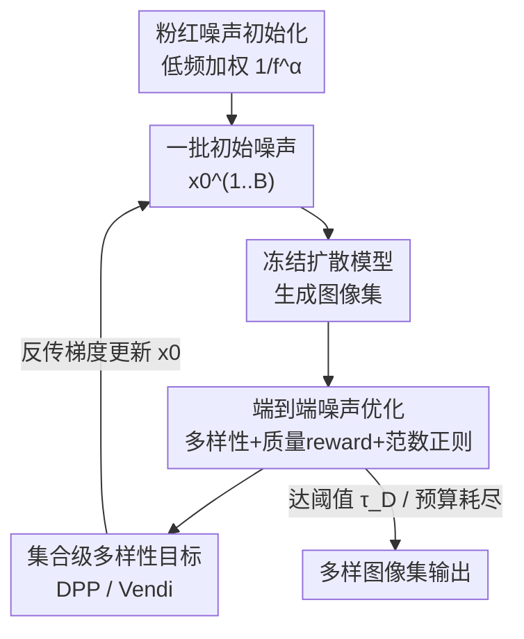

# It's Never Too Late: Noise Optimization for Collapse Recovery in Trained Diffusion Models

**会议**: CVPR 2026  
**arXiv**: [2601.00090](https://arxiv.org/abs/2601.00090)  
**代码**: https://github.com/anneharrington/divgen (有)  
**领域**: 扩散模型 / 图像生成  
**关键词**: 模式坍缩, 噪声优化, 推理时扩展, 生成多样性, 粉红噪声

## 一句话总结
针对文生图扩散模型"同一 prompt 反复采样却几乎一模一样"的模式坍缩问题，本文不改模型、不改 prompt，而是直接对初始噪声做端到端梯度优化、让一组样本互相推开，再配合一个把能量压向低频的"粉红噪声"初始化，在几乎不损失图像质量的前提下大幅提升生成多样性。

## 研究背景与动机
**领域现状**：扩散模型能生成惊艳图像，但给定一个固定 prompt、换不同随机种子多次采样时，输出往往高度雷同（论文图 1：同一句"a cat"在 SDXL-Turbo 和 Flux.1 [schnell] 上反复生成几乎一样的猫）。与此同时，推理时扩展（inference-time scaling，用额外计算换更好结果）已被广泛用于提升 prompt 遵从度和个性化。

**现有痛点**：现有提升多样性的路线主要两类——(1) 用 guidance 机制（particle guidance、DPP guidance、CFG 变体）把模型"推"向更分散的样本；(2) best-of-n / 搜索式：先生成一大池候选（如 64 张），再迭代剪枝挑出彼此最不同的几张（Parmar et al.）。前者要改采样动力学、容易牺牲质量；后者纯靠"多掷骰子"碰运气，候选池大、计算和显存开销高，而且只能在 batch 内挑、难以扩展到大集合。

**核心矛盾**：质量与多样性之间存在 trade-off——强行推开样本往往掉质量。而真正决定"这组图长什么样"的初始噪声，过去只被当成随机种子被动地"碰"，没有被当作可优化的连续变量去**主动**调。

**本文目标**：在冻结模型、prompt、目标模型的前提下，只动初始噪声，让同一 prompt 的一组输出尽量互不相同，同时不掉图像质量。

**切入角度**：既然 test-time 噪声优化已被证明能为**单张**图提升质量（最大化某 reward），那能不能把目标换成"**一组**图的多样性"，直接对噪声做梯度上升？再加一个观察——优化主要改动的是噪声的**低频**成分，自然图像本身就是 $1/f$ 频谱（低频能量大）。

**核心 idea**：用一个"多样性统计 + 质量 reward + 噪声范数正则"的端到端目标，反传到初始噪声上把一批样本推开；并用"粉红噪声"初始化把能量预先压向低频，这正是优化最想改的频段。

## 方法详解

### 整体框架
方法是一个对初始噪声做梯度优化的推理时循环：从一批 i.i.d. 高斯噪声出发，过一遍**冻结**的扩散模型得到一组图，用多样性目标（如 patch 级 DINOv2 不相似度）和可选的质量 reward（如 HPSv2 / CLIPScore）打分，再把分数反传回初始噪声、更新噪声，迭代直到多样性/质量达到阈值或算力预算耗尽。整条管线里 prompt、扩散模型、目标/奖励模型全部冻结，只有初始噪声在变。初始化既可以用普通白噪声，也可以换成把低频加权的粉红噪声。

### 关键设计

**1. 端到端噪声优化：把"一组图的多样性"做成可微目标直接反传到噪声**

痛点直击搜索式方法只能"多掷骰子碰运气"：它们生成大候选池再被动挑选，不能朝着"更分散"的方向**主动**走。本文把初始噪声当连续变量优化。给定 prompt $c$，采一批 $\mathcal{B}=\{\mathbf{x}_0^{(i)}\}_{i=1}^B$，生成 $\mathbf{x}^{(i)}=g_\theta(\mathbf{x}_0^{(i)},c)$，最小化

$$\mathcal{L}(\mathcal{B})=-\frac{\lambda_q}{B}\sum_{i=1}^B r_s(\mathbf{x}^{(i)},c)-\lambda_{\mathrm{div}}\,v_\mathcal{B}+\lambda_{\mathrm{reg}}\,\frac{1}{B}\sum_{i=1}^B \mathrm{reg}(\mathbf{x}_0^{(i)})$$

三项分别是：样本级质量 reward $r_s$（如 CLIPScore，拉高质量）、批级多样性统计 $v_\mathcal{B}$（把样本推开）、噪声范数正则 $\mathrm{reg}$（把噪声拽回先验高密度区）。多样性统计聚合 $P$ 个 patch 上两两样本的特征距离：$v_\mathcal{B}=\frac{1}{P}\sum_p \frac{2}{B(B-1)}\sum_{i<j} d(f_p(\mathbf{x}^{(i)}),f_p(\mathbf{x}^{(j)}))$，其中 $f_p$ 是 patch 嵌入、$d$ 取余弦距离。梯度通过**冻结**的采样器 $g_\theta$ 反传到 $\mathbf{x}_0$——这正是它优于 guidance 的地方：不碰模型权重、不改条件，只重排"骰子"本身就能得到想要的分布

**2. 集合级多样性目标（DPP / Vendi）：堵住"靠一张离群图刷高平均距离"的捷径**

仅用两两距离平均（pairwise）作多样性有个漏洞——把**一张**图弄得极端不同，就能把平均拉高，但其余图仍互相雷同。为此本文在 pairwise 相似度核之上叠加行列式点过程（DPP）和 Vendi Score 这类**集合级**度量：它们衡量的是整组样本张成空间的"体积/有效数目"，不会被单个离群点轻易刷高。用户研究（论文图 6）证实，用 DPP / Vendi 作优化目标得到的图集更受人偏好。实验里 Vendi 分数能被优化到饱和值 4.0，对应"4 张图近乎两两独立"

**3. 阈值控制 + 批量/序列两种模式：在不加 loss 项的前提下精确卡住质量–多样性折中**

质量和多样性天然对冲，硬加权重很难调。本文用两个阈值机制替代额外 loss：当批多样性达到目标 $v_\mathcal{B}\ge\tau_\mathcal{D}$ 就停止优化；某张图质量 reward $r_s$ 跌破 $\tau_s$ 时，把它回退到上一个在阈值之上的 latent 状态（Flux.1 [schnell] 用此机制，因其对超参更敏感），算力预算耗尽也会停。范数正则来自把噪声半径 $r=\|\bm{\epsilon}\|$ 约束到 $\chi^d$ 分布——最大化其对数密度 $K(\bm{\epsilon})=(d-1)\log\|\bm{\epsilon}\|-\frac{1}{2}\|\bm{\epsilon}\|^2$，防止噪声漂到先验里不可能的半径。框架还同时支持**批量**（一次联合优化 4 张，对标 Parmar et al.）和**序列**模式（一次生成一张、让它区别于已有输出），后者避免同时处理大量候选的显存开销，能扩展到远大于 4 张的多样集合

**4. 粉红噪声初始化：把能量预先压向"优化最想改"的低频**

频谱分析（论文图 9）发现，优化过程对噪声的改动**绝大部分集中在最低频的那 1/3 频段**，中高频几乎不动；且优化后的噪声仍是标准高斯，但不再"频谱白"了。受此启发并结合"自然图像服从 $1/f$ 功率谱"的先验，本文用粉红噪声初始化：把白噪声 $z_\text{white}$ 做 2D FFT，按 $f_{u,v}^{-\alpha/2}$ 重加权幅值（$f_{u,v}=\sqrt{u^2+v^2}$ 为径向频率），得到 $1/f^\alpha$ 功率谱，再 IFFT 回空域并归一化到单位方差。这相当于把噪声预先放到更可能覆盖不同低频区域的位置。结果：粉红噪声不仅对本文方法、对 i.i.d. 和 Parmar et al. 两个 baseline 也一致提升多样性；$\alpha$ 越大多样性越高，但 $\alpha>0.2$ 后图像质量开始下降，故主实验取 $\alpha=0.2$

## 实验关键数据

模型覆盖步蒸馏采样器 SDXL-Turbo 与 10B+ 的 Flux.1 [schnell]（均 ODE 采样），单卡 A100/H100 即可运行；benchmark 用 GenEval 与复杂长 prompt 的 DPG-Bench（平均 67 词）。每个 prompt 采 4 个噪声、生成 4 张候选。

### 主实验

GenEval 上以 DINOv2 作多样性、CLIPScore 作质量优化（SDXL-Turbo），多样性用未参与优化的 DINO/DreamSim/LPIPS 两两平均衡量：

| 初始化 | 方法 | DINO↑ | DreamSim↑ | LPIPS↑ | CLIPScore↑ |
|--------|------|-------|-----------|--------|------------|
| 白噪声 | i.i.d. | 0.588 | 0.249 | 0.642 | 0.335 |
| 白噪声 | Parmar et al. | 0.705 | 0.331 | 0.682 | 0.333 |
| 白噪声 | **本文** | **0.784** | **0.411** | **0.767** | **0.349** |
| 粉红噪声 | i.i.d. | 0.642 | 0.305 | 0.729 | 0.328 |
| 粉红噪声 | Parmar et al. | 0.749 | 0.392 | 0.757 | 0.323 |
| 粉红噪声 | **本文** | **0.786** | **0.427** | **0.811** | **0.341** |

本文在所有多样性指标上显著超越 i.i.d. 和搜索式 baseline，且 CLIPScore（图文对齐质量）不降反升；粉红噪声把每一行都进一步抬高。

### 消融 / 分析实验

用 DPP 多样性 + HPSv2 质量优化（GenEval），换更强的集合级目标：

| 模型 | 初始化 | 方法 | DreamSim↑ | Vendi↑ | HPSv2↑ |
|------|--------|------|-----------|--------|--------|
| SDXL-Turbo | 白 | i.i.d. | 0.262 | 2.000 | 0.284 |
| SDXL-Turbo | 白 | Parmar et al. | 0.336 | 2.769 | 0.273 |
| SDXL-Turbo | 白 | **本文** | **0.457** | **4.000** | **0.292** |
| SDXL-Turbo | 粉红 | **本文** | **0.474** | **4.000** | 0.288 |
| Flux.1 | 白 | i.i.d. | 0.307 | 2.013 | 0.304 |
| Flux.1 | 白 | **本文** | 0.446 | 2.753 | 0.293 |
| Flux.1 | 粉红 | **本文** | **0.495** | **3.038** | 0.279 |

SDXL-Turbo 上 Vendi 被打到饱和值 4.0、HPSv2 还略升；Flux.1 [schnell] 对超参更敏感，多样性大涨但 HPSv2 略掉（靠 latent 回退机制兜底）。

### 关键发现
- **优化只动低频**：频谱分析显示改动集中在最低 1/3 频段，这是粉红噪声初始化设计的直接依据——把先验能量放在优化最需要的地方。
- **集合级目标更受人偏好**：用户研究中 DPP / Vendi 优化的图集胜率高于 pairwise，因为它们无法被"单张离群图"刷高。
- **效率优于搜索**：粉红噪声下本文只需 6/8 次迭代即超过 Parmar et al.（候选池 64/128）；SDXL-Turbo 每次迭代 0.345 s，全程约 2.07 s，而 Parmar et al. 需 11.20 s。
- **泛化到未优化指标**：只用 DINO/CLIP 优化，DreamSim、LPIPS 等没参与优化的指标也一致提升，说明一个特征空间的多样性会迁移到其他空间。

## 亮点与洞察
- **把"随机种子"升格为"可优化变量"**：过去 best-of-n 把初始噪声当骰子被动碰，本文证明它是可微的连续旋钮，直接梯度上升即可定向得到想要的样本分布——这个视角可迁移到任何"输出由初始噪声决定"的生成任务。
- **从分析反推设计**：先做频谱分析发现"改动集中在低频"，再据此设计粉红噪声初始化，是教科书式的"观察 → 假设 → 干预"闭环；而且粉红噪声是**零成本即插即用**，对 baseline 也涨点。
- **阈值代替 loss 权重**：用"多样性达标即停 + 质量跌破阈值就回退 latent"两个阈值机制控制 trade-off，比硬调 $\lambda$ 权重更稳、也更可解释。
- **序列模式破除 batch 显存墙**：一次生成一张、让它区别于历史输出，使方法能扩展到远超 4 张的大多样集合，这是纯 batch 搜索式方法做不到的。

## 局限与展望
- **依赖外部目标/奖励模型**：多样性靠 DINOv2/DreamSim、质量靠 HPSv2/CLIPScore，最终图集的"好坏"被这些模型的偏好绑定；它们的盲区会被继承。
- **Flux.1 [schnell] 超参敏感**：大模型上质量 reward 难平衡，需 latent 回退兜底，作者自承可探索更动态的优化调度和额外质量约束。
- **推理时额外开销**：虽比搜索式快，但每个 prompt 仍需多次反传过采样器，相比一次前向的 i.i.d. 采样仍有成本，且每个 prompt 都要单独优化。
- **聚焦 ODE 蒸馏采样器**：实验只在步蒸馏 ODE 采样器上做，作者指出 SDE 采样本身就更多样，跨采样范式的表现待验证；$\alpha>0.2$ 时质量下降也限制了多样性的可推空间。

## 相关工作与启发
- **vs Parmar et al.（搜索式剪枝）**: 他们先生成大候选池（64/128）再被动挑选，本文直接对噪声做梯度优化主动推开样本；本文更快（2.07 s vs 11.20 s）、能扩展到大集合、且把质量也一并优化，而非只在固定候选里挑。
- **vs Particle Guidance / DPP guidance（引导式）**: 它们改采样动力学/条件来"推"模型，容易牺牲质量；本文不碰模型与条件，只优化初始噪声，质量（CLIPScore/HPSv2）反而能持平或略升。
- **vs SliderSpace（LoRA 编码方向）**: 它把变化方向烧进 LoRA 权重换取无推理开销的可控多样性；本文是纯推理时、不训练任何权重，灵活换多样性目标即可，但需付推理时优化成本。
- **vs 单样本 test-time 噪声优化**: 既往工作优化噪声是为**单张**图提质量（最大化某 reward），本文把目标换成**一组**图的多样性统计，是对同一框架的目标重定向。

## 评分
- 新颖性: ⭐⭐⭐⭐ 把噪声优化目标从"单图质量"重定向到"集合多样性"，并用频谱分析反推出粉红噪声初始化，视角新且自洽。
- 实验充分度: ⭐⭐⭐⭐ 覆盖两个主流蒸馏模型、多个多样性目标、GenEval+DPG-Bench、用户研究与频谱分析，附录还补 SANA-Sprint/PixArt。
- 写作质量: ⭐⭐⭐⭐ 动机—分析—设计链条清晰，公式与机制讲得透，图文对照充分。
- 价值: ⭐⭐⭐⭐ 即插即用、不改模型、对 baseline 也涨点的多样性方案，对缓解文生图模式坍缩有直接实用价值。

<!-- RELATED:START -->

## 相关论文

- [\[CVPR 2026\] Taming Preference Mode Collapse via Directional Decoupling Alignment in Diffusion Reinforcement Learning](taming_preference_mode_collapse_via_directional_decoupling_alignment_in_diffusio.md)
- [\[CVPR 2026\] Elucidating the Design Space of Arbitrary-Noise-Based Diffusion Models](eda_arbitrary_noise_diffusion_design_space.md)
- [\[ICLR 2026\] Diverse Text-to-Image Generation via Contrastive Noise Optimization](../../ICLR2026/image_generation/diverse_text-to-image_generation_via_contrastive_noise_optimization.md)
- [\[CVPR 2026\] DiverseGRPO: Mitigating Mode Collapse in Image Generation via Diversity-Aware GRPO](diversegrpo_mitigating_mode_collapse_in_image_generation_via_diversity-aware_grp.md)
- [\[CVPR 2026\] Too Vivid to Be Real? Benchmarking and Calibrating Generative Color Fidelity](too_vivid_to_be_real_benchmarking_and_calibrating_generative_color_fidelity.md)

<!-- RELATED:END -->
