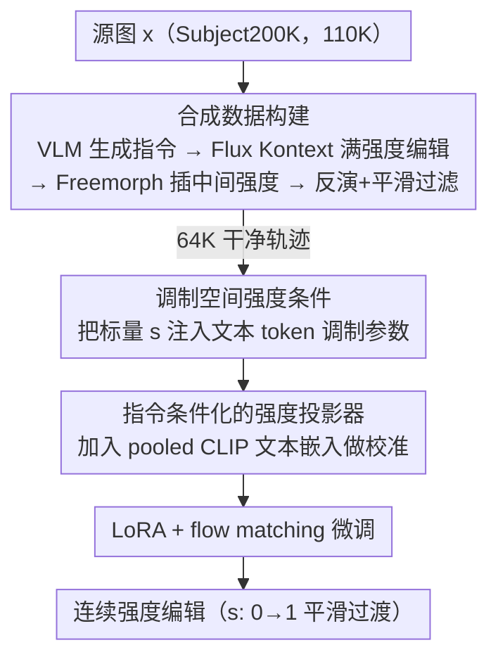

# Kontinuous Kontext: Continuous Strength Control for Instruction-based Image Editing

**会议**: CVPR 2026  
**论文**: [CVF Open Access](https://openaccess.thecvf.com/content/CVPR2026/html/Parihar_Kontinuous_Kontext_Continuous_Strength_Control_for_Instruction-based_Image_Editing_CVPR_2026_paper.html)  
**代码**: 待确认  
**领域**: 扩散模型 / 图像编辑  
**关键词**: 指令图像编辑, 编辑强度, 连续控制, 调制空间, 合成数据

## 一句话总结
给指令式图像编辑模型（Flux Kontext）额外接入一个标量「编辑强度」输入，通过一个轻量投影网络把强度+指令映射成 DiT 调制空间里的偏移量，从而在不为每种属性单独训练的前提下，让任意编辑都能从「不改」平滑过渡到「全力改」。

## 研究背景与动机
**领域现状**：基于指令的图像编辑（Instruct-Pix2Pix、Flux Kontext 等）让用户用一句自然语言就能改风格、改外观、改物体形状，已经非常通用。

**现有痛点**：文本是一种「粗粒度」接口——它说清了「改什么」，却说不清「改到什么程度」。用户想让人物「老一点点」还是「老很多」，单靠 prompt 无法精确调节编辑强度。

**核心矛盾**：已有的连续控制方法要么走 GAN/VAE 隐空间方向遍历，要么给每个属性单独训练 LoRA / adapter（如 ConceptSliders、MARBLE）。前者局限于狭窄域，后者需要「每个属性一套训练」，无法做成统一、可泛化的方案。把隐空间遍历搬到扩散模型上也很难：去噪网络没有天然的紧凑隐空间，文本嵌入空间并不平滑，LoRA 权重插值既贵又是 concept-specific。

**本文目标**：做一个统一模型，对模型本就能编辑的**任意属性**实现连续强度调节，且不需要任何 per-attribute 训练。

**切入角度**：作者观察到 DiT 的**调制空间（modulation space）高度解耦**，扰动某个词对应的调制参数就能改这个属性的呈现强度——一个简单实验里，把文本 token 的调制参数乘以标量 $v\in(0.5, 2.0)$ 就能生成不同强度的编辑，且保持身份不变。

**核心 idea**：把「编辑强度」看作指令的一个属性，用一个 strength projector 把标量强度映射成文本 token 调制参数的**偏移量**，在调制空间里注入强度信息，而不是塞进文本 token 序列。

## 方法详解

### 整体框架
方法分两大阶段。**阶段一（数据构建）**：因为真实图像没有「同一编辑、多档强度」的标注，作者用现成生成模型合成 `(源图 x, 指令 e, 强度 s, 目标编辑 ys)` 四元组——先用 LVLM 给每张源图生成指令并用 Flux Kontext 产出「满强度」编辑，再用扩散 morphing 在源图与满强度编辑之间插出中间强度，最后用一套过滤管线剔除不平滑/反演坏掉的样本。**阶段二（训练）**：在冻结的 Flux Kontext 上加一个 strength projector，把标量强度 $s$（配合指令的 CLIP 嵌入）映射成文本 token 调制参数的偏移，用 LoRA + flow matching loss 微调，使模型学会按 $s$ 连续控制编辑强度。

### 关键设计

**1. 调制空间注入强度，而非文本 token：把强度当成可平滑调的「旋钮」**

最直觉的做法是把强度当成额外的文本 token 拼进指令序列，但作者早期实验发现**文本嵌入空间并不平滑**——相邻强度之间会出现突变跳跃。于是改为在 DiT 的调制空间动手：Flux Kontext 沿用 Flux 的设计，把指令的 pooled 嵌入与 timestep 嵌入融合，预测文本/视觉 token 各自的调制参数 $[y_{shift}, y_{scale}]$（结构上等价于广泛使用的 AdaLN）。作者设计 strength projector（一个小 MLP）把标量 $s\in(0,1)$ 映射成对原调制参数的偏移 $[\Delta y_{shift}, \Delta y_{scale}]$，加回到文本 token 的调制参数上。因为调制空间高度解耦，这种偏移能平滑、定向地改变编辑强度而不破坏图像身份——这正是文本 token 方案做不到的。

**2. 指令条件化的投影器：让强度偏移随编辑类型自适应校准**

如果投影器只吃强度标量，那它会对所有编辑在同一强度下预测**相同的偏移**，忽略了编辑类型的差异。结果是不同属性（如材质 vs 颜色）共用一条强度曲线，导致「未校准」的突兀跳变（论文 Fig.7 显示材质编辑会突然跳到终态）。解决办法是把 **pooled CLIP 文本嵌入**作为投影器的额外输入，让预测的调制偏移依赖于具体指令。这样每种编辑得到「校准过」的调制曲线，跨风格化、属性、材质、背景、形状等不同类别都能平滑连续地过渡。

**3. 合成数据 + 双重过滤：用 morphing 造中间强度，再把坏样本筛掉**

训练需要「同一编辑多档强度」的监督，真实数据没有。作者从 Subject200K 采 110K 图，用 Qwen LVLM 按全局/局部子类别（配 GPT-4 生成的 in-context 示例）生成多样指令，Flux Kontext 产满强度编辑 $y^*$；再用 off-the-shelf 扩散 morphing **Freemorph** 在源图与 $y^*$ 之间生成 $N{=}6$ 档中间强度 $s_i = i/N$。但 Freemorph 隐空间不语义平滑、反演会引入重建误差，常出现物体残缺、突变。作者用两道过滤把关：① **轨迹平滑性**——定义相邻图像的距离序列 $D=\{d_{i,i+1}\}$，用它与离散均匀分布的 KL 散度衡量均匀度并阈值化（理想下变化量应随强度线性增长，即相邻距离应一致）；② **反演质量**——对编辑图与其反演重建之间、以及源图与编辑图之间的 LPIPS 距离阈值化，剔除反演崩坏或 Flux Kontext 没改动的样本。同时用重建端点替换原端点以保证一致性。最终数据从 110K 压到 64K 高质量平滑轨迹，另加 10K 通过缩放变物体尺寸的合成样本。

### 损失函数 / 训练策略
可训练参数只有 Flux Kontext 注意力投影矩阵的 LoRA + strength projector，主干冻结。训练用标准 flow matching loss：

$$L_\theta = \mathbb{E}_{t,x,e,s,y_s}\left[\left\|v_\theta(y_s^t, t, e, x, s) - (\epsilon - x)\right\|_2^2\right]$$

其中 $y_s^t = (1-t)y_s + t\epsilon$ 是 $y_s$ 与高斯噪声 $\epsilon\sim\mathcal{N}(0,1)$ 的插值隐变量，$v_\theta$ 即 Kontinuous Kontext 模型。作为正则，以 0.1 概率随机丢弃 slider 条件。

## 实验关键数据

评测基准用 PIEBench（去掉 add/remove 这类非连续编辑），540 张图、每图一条指令，指令常含 2-3 个复合编辑。两类指标：**平滑度**用 triangle deficit $\delta_{smooth}$（衡量相邻编辑的二阶一致性，越小越平滑，距离度量用 DreamSim，报每序列最大 deficit）；**指令遵循**用 CLIP directional similarity（CLIP-Dir.，跨所有强度聚合）。

### 主实验

| 对比类别 | 方法 | $\delta_{smooth}$↓ | CLIP-Dir.↑ |
|----------|------|--------------------|------------|
| 编辑+插值 | Diffmorpher | 0.371 | 0.181 |
| 编辑+插值 | Freemorph | 0.365 | 0.189 |
| 编辑+插值 | WAN-Video（视频插帧） | 0.853 | 0.269 |
| 编辑+插值 | **本文** | **0.329** | **0.241** |
| 域专用 | ConceptSliders | 0.143 | 0.186 |
| 域专用 | **本文（同设定）** | **0.098** | **0.382** |
| 域专用 | MARBLE | 2.577 | 0.157 |
| 域专用 | **本文（材质设定）** | **0.350** | 0.101 |

注：WAN-Video 的 CLIP-Dir 偏高是因为它把满强度编辑「提前」呈现在中间强度上（属于作弊式高分），但 $\delta_{smooth}$ 暴涨说明轨迹根本不平滑。⚠️ MARBLE 那组本文 CLIP-Dir 偏低，作者归因于材质域上对比设定不同，需结合 $\delta_{smooth}$ 的巨大优势看（2.577 → 0.350）。

### 消融实验

| 配置 | $\delta_{smooth}$↓ | CLIP-Dir.↑ | 说明 |
|------|--------------------|------------|------|
| text-space condn | 1.468 | 0.191 | 把强度当额外文本 token 注入 |
| w/o text projector | 1.092 | 0.141 | 投影器去掉 pooled 文本嵌入 |
| w/o filtering | 0.483 | 0.228 | 不做数据过滤 |
| **Full（本文）** | **0.329** | **0.241** | 完整模型 |

### 关键发现
- **文本 token 注入是最差的方案**（$\delta_{smooth}$ 1.468），印证了「文本嵌入空间不平滑」这一动机——把强度放进调制空间才平滑，这是全文最关键的设计选择。
- **去掉投影器的文本嵌入条件**掉得很惨（$\delta_{smooth}$ 1.092、CLIP-Dir 0.141），说明「按编辑类型校准强度曲线」对平滑过渡是刚需。
- **数据过滤**对平滑度（0.483 → 0.329）和文本对齐（0.228 → 0.241）双双有效，证明合成数据噪声必须靠过滤压住。
- 用 DINO 衡量「源图随强度的变化量 $D(x, y_s)$」时，本文的线性度最高（Pearson $|r|{=}0.973$，远超 baseline 的 0.897/0.696），说明编辑确实单调、渐进地变化。
- 即便只在 64K 中等规模过滤数据上训练，模型仍能泛化到**训练类别之外**的编辑（如面部属性、身材变化）。

## 亮点与洞察
- **把「强度」从隐空间方向问题重构成调制参数偏移问题**：绕开了「扩散模型没有平滑紧凑隐空间」这个老大难，借 DiT 调制空间天然解耦的特性，一个小 MLP 就实现了统一连续控制。这个视角可迁移到任何 AdaLN/调制式 DiT 的可控生成。
- **指令条件化投影器是点睛之笔**：同样的强度对不同编辑要走不同曲线，加 CLIP 嵌入做校准这一步看似小，却是从「能控」到「平滑可用」的关键。
- **合成数据 + 自定义平滑度过滤（KL 到均匀分布）**：用「相邻强度距离应均匀」这一物理直觉造过滤准则，是一个干净可复用的数据清洗 trick，适用于任何需要「连续插值轨迹」监督的任务。

## 局限与展望
- **强依赖合成数据质量**：中间强度全由 Freemorph 生成，其反演误差与不平滑是主要噪声源，只能靠大量过滤压住（110K → 64K，近 4 成被丢），监督信号的天花板受限于 morphing 模型。
- **几何类大形变仍是难点**：作者也提到视频插帧 baseline 在风格化等「想象类」编辑上 OOD；本文虽能做形变（身材、眼镜形状），但极端几何编辑的平滑性仍未充分验证。⚠️ 论文未给几何编辑的独立定量表。
- **绑定 Flux Kontext 与其调制空间**：方法的有效性建立在「DiT 调制空间高度解耦」之上，换到非调制式编辑模型未必适用。
- **改进思路**：用更可靠的连续编辑生成器（而非后处理式 morphing）造中间强度，或引入真实多档强度标注，可望进一步提升平滑度上限。

## 相关工作与启发
- **vs ConceptSliders**: 它给每个属性训一个 LoRA、靠权重插值实现连续控制；本文是单一统一模型、零 per-attribute 训练，且 $\delta_{smooth}$（0.098 vs 0.143）和 CLIP-Dir（0.382 vs 0.186）全面更优。
- **vs MARBLE**: 它在合成 3D 资产上训 adapter 控材质，迁到真实复杂图像时会在低强度就突跳到终态（$\delta_{smooth}$ 2.577）；本文对真实图像更稳，且开箱即用支持新属性。
- **vs Freemorph / Diffmorpher（编辑+插值）**: 这些是后处理启发式（反演插值或权重插值），对多样编辑很脆、中间帧常丢物体；本文把强度做进模型本身，省去级联多模型、更快也更平滑。

## 评分
- 新颖性: ⭐⭐⭐⭐⭐ 把连续强度控制重构为调制空间偏移，是真正统一、零属性训练的新范式
- 实验充分度: ⭐⭐⭐⭐ PIEBench + 域专用 + 消融 + 用户研究覆盖到位，但几何大形变与跨域泛化的定量评测略薄
- 写作质量: ⭐⭐⭐⭐ 动机—设计—消融逻辑清晰，部分指标对比需结合 caveat 阅读
- 价值: ⭐⭐⭐⭐⭐ 给指令编辑加了一个真正可用的「强度旋钮」，且方法对调制式 DiT 普适，落地价值高

<!-- RELATED:START -->

## 相关论文

- [\[CVPR 2026\] SliderEdit: Continuous Image Editing with Fine-Grained Instruction Control](slideredit_continuous_image_editing_with_fine-grained_instruction_control.md)
- [\[CVPR 2026\] DreamOmni2: Multimodal Instruction-based Generation and Editing](dreamomni2_multimodal_instruction-based_generation_and_editing.md)
- [\[CVPR 2026\] CompBench: Benchmarking Complex Instruction-guided Image Editing](compbench_benchmarking_complex_instruction-guided_image_editing.md)
- [\[CVPR 2026\] ReasonEdit: Towards Reasoning-Enhanced Image Editing Models](reasonedit_towards_reasoning-enhanced_image_editing_models.md)
- [\[CVPR 2026\] Towards Robust Sequential Decomposition for Complex Image Editing](towards_robust_sequential_decomposition_for_complex_image_editing.md)

<!-- RELATED:END -->
