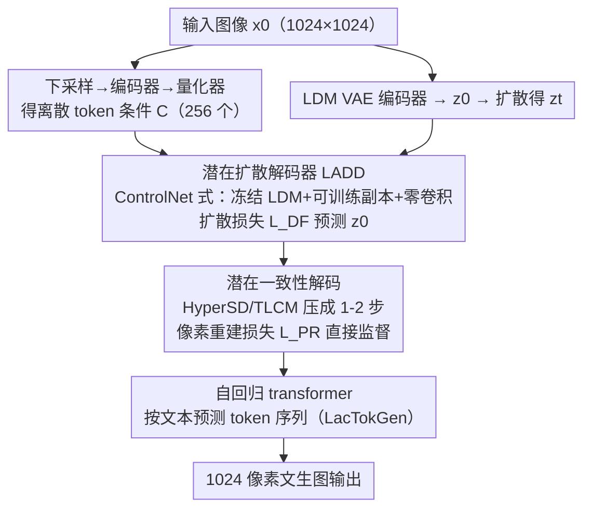

# LacTokGen: Latent Consistency Tokenizer for 1024-pixel Image Generation by 256 Tokens

**会议**: CVPR 2026  
**论文**: [CVF Open Access](https://openaccess.thecvf.com/content/CVPR2026/html/Xie_LacTokGen_Latent_Consistency_Tokenizer_for_1024-pixel_Image_Generation_by_256_CVPR_2026_paper.html)  
**代码**: 待确认  
**领域**: 图像生成 / 图像分词器  
**关键词**: 离散分词器, 潜在一致性, 自回归生成, 高分辨率, 1024像素

## 一句话总结
提出 LacTok 分词器，把离散视觉 token 对齐到预训练 LDM 的紧凑潜在空间，用一致性模型把 LDM 解码器从多步采样压成 1-2 步以做像素级监督，从而只用 256 个 token 就能重建/生成 1024×1024 图像（比 VQGAN 压缩 16×）；再接一个自回归 transformer 即得文生图模型 LacTokGen。

## 研究背景与动机
**领域现状**：图像分词器（VQGAN 系）把图像编码成离散 token，配合自回归模型或 masked transformer 做生成，还能塞进 LLM 做统一的图文理解与生成。

**现有痛点**：VQGAN 把 256×256 图压成 256 token（下采样 16×）已是标配，但要做 1024×1024 就得预测 **4096 个 token**——序列爆长，训练与推理成本高，也难塞进 LLM 做交错图文。现有的 token 压缩路线（残差码本、1D 分词如 TiTok/FlexTok）虽然能减 token，但**生成不出 1024 像素的高频细节**（如人脸）。

**核心矛盾**：高分辨率生成在「token 数量」与「细节质量」之间存在 trade-off——要么 token 太多（成本高），要么减 token 后细节崩。

**本文目标**：构造一个分词器，用**少量离散 token**就能高质量重建和生成高分辨率图像。

**切入角度**：作者注意到 LDM（SD3、FLUX）能在低维潜在空间里生成 1024×1024 高质图，于是提问：**能不能把离散 token 对齐到 LDM 的潜在空间，借它强大的解码器来重建/生成？**

**核心 idea**：让离散 token 不再在像素空间解码，而是去**预测 LDM 的潜在表示 $z_0$**——用扩散损失把 token 对齐进 LDM 潜空间，再用潜在一致性模型把多步采样压成 1-2 步以引入像素级重建监督。

## 方法详解

### 整体框架
LacTok 由三件套组成：**transformer 编码器 + 量化码本 + 潜在一致性解码器（LADD）**。输入图像走两条路：一条经下采样 + 编码器 + 量化器得到离散条件特征 $C$（token），另一条经预训练 LDM 的 VAE 编码器得到潜变量 $z_0$（再前向扩散成 $z_t$）。LADD 以 $C, z_t, t$ 为输入，**目标是预测原图的潜变量 $z_0$**（而非像素）。训练分两阶段：第一阶段用扩散损失 $L_{DF}$ 把 token 对齐进 LDM 潜空间；第二阶段引入一致性模型把采样压成 1-2 步、再用像素重建损失 $L_{PR}$ 直接监督解码出的图像。最后把一个自回归 transformer 接到 LacTok 之上、按文本预测离散 token 序列，即得文生图模型 LacTokGen。

### 关键设计

**1. 潜在扩散解码器 LADD：把离散 token 对齐到 LDM 潜空间而非像素空间**

传统分词器在像素空间编解码，重建高频细节能力有限。LacTok 反其道：解码器 $f_\theta$（即 LADD）的任务是**根据离散条件 $C$ 预测原图的 LDM 潜变量 $z_0$**。原图先经 VAE 编码器得 $z_0\in\mathbb{R}^{H/8\times W/8\times C}$，token 条件 $C$ 则由把图像先下采样到 $H'\times W'\in\{224,256,288\}^2$（这一步是压 token 数的关键）再过编码器+量化器得到。用扩散损失训练：

$$L_{DF} = \|f_\theta(z_t, C, t) - \epsilon\|_2^2$$

为了训练稳定，LADD 借鉴 ControlNet——**冻结预训练 LDM 参数，克隆部分 block 成可训练副本，用零卷积（ZC）连接**，block 输出为 $O = ZC(F_{train}(z_t, C, t)) + F(z_t, t)$，其中 $F$ 是冻结 LDM block、$F_{train}$ 是可训练副本。视觉编码器与量化器用预训练 LlamaGen 分词器初始化并冻结，只训 LADD，省资源。

**2. 像素一致性解码：用一致性模型把多步采样压成 1-2 步，做像素级监督**

只用扩散损失训出的解码器，重建图在**颜色和亮度上有明显偏差**（因为它预测的是潜变量、再经 VAE 解回像素，误差累积）。作者想直接加像素重建损失 $L_{PR}$ 逼解码图贴近原图，但扩散模型本就要多步采样、显存吃不消还易梯度爆炸。解法是引入**潜在一致性模型**把多步压成少步：用 HyperSD（一步）或 TLCM（两步，首步 stop-gradient）把 LADD 加速成从纯高斯噪声出发的 1-2 步重建出干净 $\hat z_0$，于是梯度能轻松传回解码器：

$$L_{PR} = L_P(\mathrm{Dec}(\hat z_0), x_0)$$

其中 $\mathrm{Dec}$ 是 LDM 的预训练 VAE 解码器，$L_P$ 是 LPIPS 感知损失。用 HyperSD 的记作 **LacTok-H**，用 TLCM 的记作 **LacTok-L**。

**3. 自回归文生图 LacTokGen：在紧凑 token 上做下一 token 预测**

为释放生成能力，作者把一个自回归 transformer $P_\theta$ 接到 LacTok 上，预测 LacTok 编码出的离散 token。文本经编码器得 $f_{text}$、再过 MLP 对齐维度，用交叉熵训练：

$$L_{CE} = -\sum_{i=1}^{L}\log P_\theta(Tok_{i+1}\mid Tok_{i:1}, f_{text})$$

$L$ 是表示一张图的 token 数（仅 256）。推理用 classifier-free guidance：$\ell_g = \ell_u + s(\ell_c - \ell_u)$。训练数据用 FLUX.1-dev 合成 30M 图 + LAION-Aesthetics-6.5+，用 Qwen2.5-VL-72B 重写 ≤20 词的精细 caption，并用 ImageReward>0.9、MPS>12.0 筛出 20M 高质图文对。

### 损失函数 / 训练策略
两阶段训练：阶段一冻结视觉编码器+量化器（LlamaGen 初始化），只用 $L_{DF}$ 训 LADD，并按 512→1024 渐进分辨率缩放；阶段二并入一致性模型，用 $L_{PR}$ 像素监督。LacTokGen 阶段单独用 $L_{CE}$ + CFG（训练时随机置空条件）训自回归 transformer。

## 实验关键数据

重建评测用 PSNR(P)、SSIM(S)、rFID、LPIPS(L)，在 ImageNet/MSCOCO-2017 5K/MJHQ-5K/FLUX-5K 上把图统一 resize 到 1024×1024。

### 主实验

**重建（256 token 重建 1024 像素）：**

| 方法 | ImageNet rFID↓ | MSCOCO rFID↓ | MJHQ-5K rFID↓ | MSCOCO L↓ |
|------|----------------|--------------|---------------|-----------|
| TiTok-S-128 | 2.32 | 12.31 | 14.17 | 0.51 |
| LlamaGen | 3.17 | 11.23 | 13.26 | 0.43 |
| FlexTok | 2.00 | 13.08 | 16.17 | 0.49 |
| **LacTok-H** | 2.78 | **10.80** | **11.34** | **0.41** |

LacTok-H 在物体中心的 ImageNet 上 rFID 略逊 FlexTok/TiTok，但在**复杂场景**的 MSCOCO/MJHQ 上全面领先，且 P/S/L 更好——说明对复杂图像泛化更强。在 FLUX-5K 上 LacTok-H rFID 12.45，显著优于 SeedTok(25.85)/TiTok(15.09)/FlexTok(16.14)。

**文生图（GenEval + MSCOCO-2017，1024 像素）：**

| 方法 | GenEval Overall↑ | MSCOCO HPSv2↑ | 推理时间(s)↓ |
|------|------------------|---------------|--------------|
| LlamaGen（AR） | 0.32 | 0.273 | 7.3 |
| HART（AR） | 0.56 | 0.298 | 0.8 |
| Show-o（AR） | 0.53 | 0.277 | 21.2 |
| SDXL（LDM） | 0.55 | 0.295 | 4.4 |
| SD3（LDM） | 0.62 | 0.303 | 4.5 |
| FLUX.1-dev（LDM） | 0.68 | 0.306 | 50.2 |
| **LacTokGen-L\*** | **0.73** | **0.304** | 2.4 |

LacTokGen-L* 在 GenEval 上 0.73，超 LlamaGen 0.41 分、超 SDXL 0.18 分，甚至超过 SD3(0.62) 和 FLUX.1-dev(0.68)；HPSv2 0.304 与 SD3/FLUX 相当，而推理时间仅 2.4s（FLUX 要 50.2s）。

### 消融实验

| 配置 | rFID↓ | P↑ | S↑ | L↓ | 说明 |
|------|-------|-----|-----|-----|------|
| LlamaGen（baseline） | 13.26 | 19.24 | 0.68 | 0.41 | 像素空间解码 |
| VQ-LADD | 12.72 | 16.53 | 0.63 | 0.47 | 换成 LADD（25步 DDIM）但仅扩散损失 |
| VQ-LADD+HyperSD | 14.71 | 16.64 | 0.64 | 0.47 | 直接一步加速，无像素损失 |
| VQ-LADD+TLCM | 14.40 | 16.82 | 0.65 | 0.45 | 直接三步加速，无像素损失 |
| **LacTok-H** | **11.34** | 19.16 | 0.68 | **0.38** | 完整（一致性+像素损失） |

### 关键发现
- **只用扩散损失（VQ-LADD）会有颜色/亮度偏差**：P/S/L 反而比 LlamaGen 差，证实「预测潜变量」会引入色彩失真——这正是要加像素重建损失的原因。
- **像素一致性解码是涨点主力**：从 VQ-LADD 到 LacTok-H，rFID 12.72→11.34、L 0.47→0.38，说明把采样压到 1-2 步做像素级监督才把色彩/细节补回来。
- **TLCM 比 HyperSD 更强**：LacTok-L\*/LacTokGen-L\* 普遍优于 -H\* 版本，作者归因 TLCM 多一步采样、更能还原高频细节。
- **token 数权衡**：192→256→324 token，rFID 12.35→11.34→11.01，256 是质量/成本的甜点（Table 6）。
- **ImageNet rFID 低 ≠ 生成更好**：LacTok-H\* 在 ImageNet rFID 反而高（因为重建分布贴近自建数据而非 ImageNet），但 T2I 更强——印证「重建 rFID 与生成质量不必正相关」。
- **CFG scale 不敏感**：scale 1.5→7，HPSv2 仅从 0.303 微升到 0.304，较鲁棒（Table 7）。

## 亮点与洞察
- **「token 去预测 LDM 潜变量」是核心范式转换**：把离散分词器的解码战场从像素空间搬到 LDM 潜空间，直接白嫖预训练 LDM 的高分辨率生成能力，是用 256 token 撑起 1024 像素的关键。
- **一致性模型在这里身兼两职**：既把多步采样压成 1-2 步降成本，又让「像素重建损失可微分回传」成为可能——这个把加速模型用作「可微解码桥」的思路很巧，可迁移到其他需要像素级监督的潜空间任务。
- **ControlNet 式注入条件**：冻结 LDM + 可训练副本 + 零卷积，让强大 LDM 当解码器的同时保持训练稳定，是低成本复用大模型的实用工程范式。

## 局限与展望
- **强依赖预训练 LDM**：整套方法建立在「有一个好用的预训练 LDM 当解码器」之上，解码质量的天花板被 LDM 与其 VAE 锁死，换弱 LDM 可能掉点。
- **自建数据规模巨大**：LacTokGen 训练用 30M 合成 + 筛到 20M 高质图文对，复现门槛高；性能增益里有相当部分来自数据质量而非纯架构。⚠️ 论文未拆分「架构 vs 数据」各自贡献的定量占比。
- **训练管线偏重**：两阶段重建训练 + 渐进分辨率 + 一致性模型并入，pipeline 较复杂；推理虽快但训练成本不低。
- **改进思路**：把一致性蒸馏与码本/编码器联合训练（本文编码器+量化器是冻结的 LlamaGen 初始化），或探索更优的下采样分辨率与 token 分配，有望进一步压 token 或提质。

## 相关工作与启发
- **vs VQGAN**: VQGAN 在像素空间解码、1024 像素需 4096 token；LacTok 在 LDM 潜空间解码、256 token 即可（16× 压缩），且细节（人脸）更好。
- **vs TiTok / FlexTok（1D/紧凑分词）**: 它们能压 token 但生成不出 1024 高频细节，且未在大规模 T2I 上验证；LacTok 借 LDM 解码器把高分辨率细节补齐，并直接撑起 LacTokGen 的高分辨率文生图。
- **vs SeedTok / DiVAE（扩散式分词器）**: 同样把扩散引入分词器，但 SeedTok 重建质量差（FLUX-5K rFID 25.85）；LacTok 靠扩散+像素双损失把重建拉到 SOTA。
- **vs HART（混合 token AR）**: HART 用离散+连续混合 token，难直接塞进 LLM 做统一图文；LacTok 纯离散 token，更利于与 LLM 集成。

## 评分
- 新颖性: ⭐⭐⭐⭐⭐ 「离散 token 预测 LDM 潜变量 + 一致性模型当可微解码桥」是有分量的新组合
- 实验充分度: ⭐⭐⭐⭐ 重建/生成多基准 + 充分消融，但「架构 vs 数据」贡献拆分、训练成本细节偏少
- 写作质量: ⭐⭐⭐⭐ 方法逻辑清楚、公式齐全，部分符号（H/TLCM 变体命名）稍密集
- 价值: ⭐⭐⭐⭐⭐ 用 256 token 做 1024 像素 AR 生成、推理远快于 FLUX，对高分辨率统一图文生成很有价值

<!-- RELATED:START -->

## 相关论文

- [\[CVPR 2026\] Beyond Pixel Simulation: Pathology Image Generation via Diagnostic Semantic Tokens and Prototype Control](beyond_pixel_simulation_pathology_image_generation_via_diagnostic_semantic_token.md)
- [\[CVPR 2026\] PixelDiT: Pixel Diffusion Transformers for Image Generation](pixeldit_pixel_diffusion_transformers_for_image_generation.md)
- [\[CVPR 2026\] Your Latent Mask is Wrong: Pixel-Equivalent Latent Compositing for Diffusion Models](your_latent_mask_is_wrong_pixel-equivalent_latent_compositing_for_diffusion_mode.md)
- [\[CVPR 2026\] FlashDecoder: Real-Time Latent-to-Pixel Streaming Decoder with Transformers](flashdecoder_real-time_latent-to-pixel_streaming_decoder_with_transformers.md)
- [\[CVPR 2026\] SpeeDiff: Scalable Pixel-Anchored End-to-End Latent Diffusion Model](speediff_scalable_pixel-anchored_end-to-end_latent_diffusion_model.md)

<!-- RELATED:END -->
