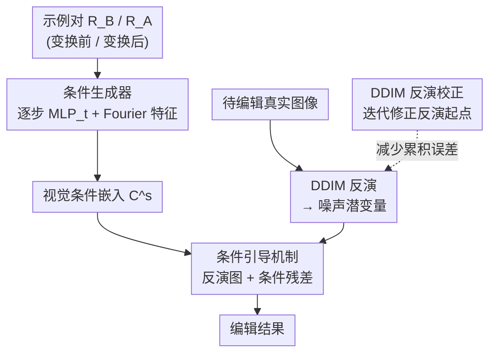

# Language-Free Generative Editing from One Visual Example

**会议**: CVPR 2026  
**arXiv**: [2603.25441](https://arxiv.org/abs/2603.25441)  
**代码**: [项目主页](https://omaralezaby.github.io/vdc/)  
**领域**: 图像生成  
**关键词**: 图像编辑, 扩散模型, 视觉条件, 无语言, 训练免

## 一句话总结

揭示文本引导扩散模型在雨、雾、模糊等简单视觉变换上存在严重的文本-视觉对齐失败，提出VDC框架——仅需一对视觉示例（变换前后）学习纯视觉条件信号来引导扩散编辑，无需文本、无需训练，在去雨/去雾/去噪等任务上超越文本和微调方法。

## 研究背景与动机

文本引导扩散模型在图像编辑上取得了巨大进展，但令人意外的是，SOTA方法**在雨、模糊、雾霾等简单日常变换上严重失败**。

根本原因：扩散模型依赖图像-标题对训练，只学到了标题中明确描述的概念。**很少被描述或模糊描述的视觉现象**（如雨滴、雾气）在文本-视觉空间中对齐极差——注意力图在文本条件"rain"下仍然是物体中心的，与降雨特征无关。

现有解决方案：
- 微调：计算成本高、数据需求大
- 更强的文本条件：仍无法超越文本-视觉对齐的根本限制

核心洞察：**扩散模型的编辑能力并未丢失，只是被文本隐藏了**。扩散模型已经编码了丰富的视觉表示，通过视觉而非语言来访问这些表示是可行的。

## 方法详解

### 整体框架

VDC（Visual Diffusion Conditioning）想做的事很直接：既然文本说不清"雨""雾"这类外观级变换，那就干脆不用文本，改用一对示例图像把"该怎么改"直接演示给扩散模型看。输入是一对配对图像——变换前 $R_B$ 和变换后 $R_A$（比如同一场景的"有雨"和"无雨"），VDC 先优化一个轻量 MLP，把这对示例里蕴含的编辑意图压成一组纯视觉的条件嵌入 $C^s$；编辑真实图像时，先用 DDIM 把它反演回噪声潜变量，再带着 $C^s$ 重新采样得到编辑结果，最后用一个反演校正步骤把累积误差补回来，保住原图细节。整条链路不碰一个文字，也不训练扩散主干。

### 关键设计

**1. 条件引导机制（Condition Steering）：把编辑写成"反演图 + 残差"，而不是凭空生成**

文本条件失效后，问题变成"拿到视觉条件 $C^s$ 后怎么真正改图"。VDC 从后验分数函数出发推导，把每一步的噪声预测重写成条件预测与无条件预测的加权混合：

$$\epsilon_\theta(z_t, -C^s) = (1-w)\cdot\epsilon_\theta(z_t, C^s) + w\cdot\epsilon_\theta(z_t, \phi)$$

对去雨、去雾这类"去除型"任务，它取负条件方向，让采样远离该退化特征的高密度区，相当于把雨、雾从图里"减"出去。关键在于编辑的对象是反演图而非新图——输出写成 $out = Z(\phi) + Z(C_\theta)$ 而不是 $out = Z(C_\theta)$，前者保留了原图的无条件分支、只在其上叠加条件带来的改变，类似 image-to-image 网络里的全局残差连接，因此能避开从零生成时常见的结构漂移和伪影。

**2. 条件生成器（Condition Generator）：用 INR 风格的 MLP 替代文本嵌入，稳定优化全部 token**

条件 $C^s$ 从哪来？只有一对示例，直接去优化文本嵌入既不稳、又通常只动得了少数几个 token。VDC 借隐式神经表示（INR）的思路，用一个 3 层 MLP 把 token 索引映射成条件嵌入，输入先过 Fourier 特征变换提升表达力，并对每个扩散步 $t$ 单独训一个 $\text{MLP}_t$。这样做完全脱离文本空间：MLP 是连续函数，能让 77 个 token 之间自然通信、整体一起被优化，而不像直接调文本嵌入那样只能局部微调几个 token，稳定性也更好。优化目标同时约束潜空间与像素空间：

$$\mathcal{L} = \|Z_0^B - Z^A\|_2^2 + \|D(Z_0^B) - R_A\|_2^2$$

**3. DDIM 反演校正：把反演的累积误差迭代补回来**

DDIM 反演本身有误差，逐步累积下来会让编辑结果偏离原图、细节失真。VDC 在反演起点上做一次迭代修正：反复跑正向-反向循环，用重建残差的梯度去调噪声潜变量，

$$Z_p \leftarrow Z_p - \text{AdamGrad}(\|\hat{Z}_0 - Z_0\|_2^2)$$

直到反演潜变量能更精确地重建原图。这一步不引入额外模块、也不增加方法复杂度，却显著改善了编辑后的感知保真度——消融里去掉它会让 LPIPS 明显恶化。

### 损失函数 / 训练策略

条件生成器以联合损失 $\mathcal{L} = \|Z_0^B - Z^A\|_2^2 + \|D(Z_0^B) - R_A\|_2^2$ 优化，潜空间项保证条件嵌入把 $R_B$ 推向 $R_A$ 的潜表示，像素空间项约束解码后的图像逼近目标。用 Adam 优化，每个扩散步保留独立的 MLP，整个过程不更新扩散主干。

## 实验关键数据

### 主实验

| 方法 | SR FID↓ | DeBlur FID↓ | DeNoise FID↓ | DeRain FID↓ | DeHaze FID↓ | Colorization FID↓ |
|------|---------|------------|-------------|------------|------------|------------------|
| P2P | 126.47 | 45.62 | 142.95 | 139.19 | 44.09 | 121.87 |
| Null-Opt | 73.48 | 51.89 | 160.88 | 167.61 | — | — |
| **VDC (Ours)** | **最优** | **最优** | **最优** | **最优** | **最优** | **最优** |

VDC在所有6个基准上设定了新SOTA，超越了训练免和全微调的文本基编辑方法。

### 消融实验

| 配置 | 效果 |
|------|------|
| 无反演校正 | LPIPS显著恶化 |
| 无Fourier特征 | 条件生成不稳定 |
| 全局统一条件（非逐步） | 精度下降 |
| 文本嵌入优化代替MLP | 不稳定，只能优化少量token |

### 关键发现

- 扩散模型的注意力图在"rain"等文本条件下完全错位——仍然是物体中心的而非退化中心的
- VDC恢复的注意力图正确关注到雨线和雾气区域
- 单一视觉示例对即可学到可泛化的编辑条件
- VDC在图像恢复任务上甚至超过了专门训练的方法

## 亮点与洞察

- 揭示了文本-视觉对齐在外观级变换上的根本失败，这一发现本身就有重要价值
- "扩散编辑能力被隐藏而非丢失"是关键insight——视觉条件可以解锁文本无法访问的能力
- INR启发的条件生成器设计优雅：连续函数+Fourier特征实现稳定全token优化
- 真正的训练免方法，计算成本远低于微调方案

## 局限与展望

- 需要一对视觉示例（变换前后），获取示例对本身可能不总是容易的
- 每次新编辑需要重新优化条件生成器（~100次迭代）
- 仅在图像恢复/退化类任务上验证，对语义级编辑（如物体替换）的适用性未知
- 依赖DDIM反演的质量，非常复杂的图像可能反演效果不佳

## 相关工作与启发

- **vs Prompt-to-Prompt/Null-Opt**: 这些方法修改文本prompt或注意力图，仍依赖文本-视觉对齐；VDC完全绕过文本
- **vs InstructPix2Pix及其变体**: 需要大规模指令微调数据集和训练；VDC零训练
- **vs 逆问题扩散方法**: 假设已知退化算子（如模糊核），无法处理复杂的空间变化退化；VDC从视觉示例学习

## 评分

- 新颖性: ⭐⭐⭐⭐⭐ 从文本到纯视觉条件的范式转换，揭示文本-视觉对齐失败有重要科学价值
- 实验充分度: ⭐⭐⭐⭐ 6个编辑基准、多种基线对比，但缺少语义级编辑实验
- 写作质量: ⭐⭐⭐⭐⭐ 动机极清晰，图2的注意力图可视化非常有说服力
- 价值: ⭐⭐⭐⭐⭐ 对扩散模型编辑和图像恢复领域有重要启发，框架简洁实用

<!-- RELATED:START -->

## 相关论文

- [\[CVPR 2026\] ChordEdit: One-Step Low-Energy Transport for Image Editing](chordedit_one-step_low-energy_transport_for_image_editing.md)
- [\[CVPR 2026\] VisionDirector: Vision-Language Guided Closed-Loop Refinement for Generative Image Synthesis](visiondirector_vision-language_guided_closed-loop_refinement_for_generative_imag.md)
- [\[CVPR 2026\] Group Editing: Edit Multiple Images in One Go](group_editing_edit_multiple_images_in_one_go.md)
- [\[CVPR 2026\] Evaluating Generative Models via One-Dimensional Code Distributions](evaluating_generative_models_via_one-dimensional_code_distributions.md)
- [\[CVPR 2026\] Quantization with Unified Adaptive Distillation to enable multi-LoRA based one-for-all Generative Vision Models on edge](quantization_with_unified_adaptive_distillation_to_enable_multi-lora_based_one-f.md)

<!-- RELATED:END -->
