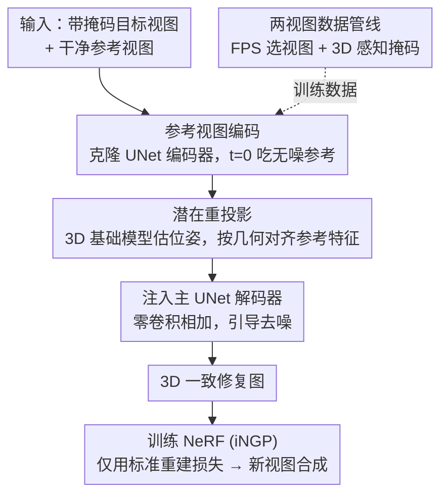

# LaRP: Efficient Multi-View Inpainting with Latent Reprojection Priors

**会议**: CVPR 2026  
**论文**: [CVF Open Access](https://openaccess.thecvf.com/content/CVPR2026/html/Zhang_LaRP_Efficient_Multi-View_Inpainting_with_Latent_Reprojection_Priors_CVPR_2026_paper.html)  
**代码**: 无  
**领域**: 图像生成 / 扩散模型 / 3D视觉  
**关键词**: 多视图修复、扩散模型、跨视图条件、3D 基础模型、潜在重投影

## 一句话总结
LaRP 把预训练的 2D 扩散修复模型改造成"天生 3D 感知"的多视图修复器——克隆一份 UNet 编码器去吃干净的参考视图、再用 3D 基础模型估计的相机位姿把参考特征几何重投影到目标视图后注入解码器，从源头就保证修复结果跨视图一致；得到的图甚至能用最朴素的重建损失训练 NeRF，做到新视图合成质量与 SOTA 相当却快约 50×。

## 研究背景与动机

**领域现状**：多视图修复（multi-view inpainting）要从一组同场景多视角图中抹掉某个物体，核心难点是"跨视图 3D 一致性"——各视图补出来的内容不仅自身要合理，还得彼此满足 3D 几何关系。主流是两阶段法：先对每个视图独立做 2D 修复，再用 NeRF/3DGS 这类神经场景表示做后处理 3D 优化，配上各种精心设计的损失（感知损失、参考外观传播、SDS 生成先验）去"对齐"那些本来就不一致的 2D 结果。

**现有痛点**：两阶段法把一致性推迟到后处理阶段，靠优化去"硬掰"独立修复出的冲突内容，既慢（SPIn-NeRF ~360 min、MVIP-NeRF ~960 min）又容易留伪影。唯一的单阶段方法 MVInpainter 把多视图当视频序列、靠光流隐式传播外观，但光流在"非视频"输入（视角稀疏、基线大）上很脆。

**核心矛盾**：一致性该在"修复时"就保证，而不该事后补救；但 2D 修复模型本身不知道视图间的几何对应关系。隐式运动线索（光流）不可靠，需要的是**显式、可靠的几何对应**。

**本文目标**：让一个预训练 2D 扩散修复模型从一开始就"看得见"参考视图、并知道参考像素该落到目标视图哪里，从而单阶段产出 3D 一致的修复，省掉昂贵的后处理优化。

**切入角度**：近年的 3D 基础模型（DUSt3R / VGGT 等）能前馈式、稳健地估计两视图间的逐像素 3D 对应与相对位姿。作者主张：与其依赖运动，不如把这种**显式几何对应**直接灌进扩散过程。

**核心 idea**：用一份克隆的 UNet 编码器去编码"干净的参考视图"，再用 3D 基础模型估的位姿把这些多尺度参考潜在特征**重投影**到目标视图坐标，然后零卷积注入主 UNet 解码器——用几何对齐的参考外观去引导去噪。

## 方法详解

### 整体框架
LaRP 解决的是"如何让 2D 扩散修复模型在修复时就具备跨视图一致性"。整条管线分两块：① **推理/架构侧**——给定带掩码的目标视图和一张干净的参考视图，先用克隆 UNet 编码器抽取参考的多尺度外观潜在特征，再用 3D 基础模型估计参考→目标的相对位姿、把参考特征几何重投影到目标视图坐标，最后零初始化卷积把对齐后的特征加到原 UNet 解码器对应尺度的特征图上，引导去噪输出 3D 一致的修复图；得到的多视图修复图直接拿去训练一个 Instant-NGP NeRF 做新视图合成。② **训练/数据侧**——LaRP 训练需要"双视图图像对"，而现成数据集大多只有单视图，作者设计了一条从视频数据集自动造对的数据管线（FPS 选视图 + 3D 感知掩码），用 Objectron 数据集批量生成带合理基线与掩码的训练对。

### 关键设计

**1. 参考视图编码：克隆 UNet 编码器 + t=0 干净输入，拿到高保真多尺度外观特征**

要把参考视图的外观传给修复模型，难点在于"怎么编码参考才既保真又落在预训练模型的特征域里"。LaRP 的做法是把扩散 UNet 的编码器**克隆一份作为可训练副本**、同时冻结原 UNet。基模型的输入是 9 通道张量 $X_t=[I,M,Z_t]\in\mathbb{R}^{H\times W\times 9}$（掩码图潜在 $I$、掩码 $M$、带噪潜在 $Z_t$）。克隆编码器吃的则是 $X_{\text{ref}}=[I_{\text{ref}},M_0,Z_0]$，其中掩码 $M_0=0$（参考是完整无洞的）、且关键一招是**把时间步固定在 $t=0$**，使带噪潜在退化成干净参考潜在 $Z_0=I_{\text{ref}}$。这样克隆编码器吃到的是无噪输入，输出确定性、高保真的多尺度特征图，作为跨视图引导的"地基"。因为副本继承了训练良好的参数，喂进无掩码参考图能自然产生有意义的激活——这是它比 ControlNet 路线干净的根因（后者得额外学怎么解读"带洞的、几何扭曲的参考像素"）。

**2. 潜在重投影：用 3D 基础模型把参考特征几何对齐到目标视图，而不是逐像素硬贴**

参考视图的激活不能直接拿来引导目标视图的修复，因为两者的对应是**几何关系而非像素对像素**。LaRP 用一个 3D 基础模型（VGGT）对每个图像对估一次 3D 属性：参考视图逐像素 3D 点图 $P_{\text{ref}}\in\mathbb{R}^{H\times W\times 3}$、共享内参 $K$、参考→目标相对位姿 $[R;t]$。据此把多尺度参考激活 $F_{\text{ref}}$ 升维成一团"3D 特征点云" $\{(P_{\text{ref}}(p),F_{\text{ref}}(p))\}$，再把每个点 $P_p$ 投影到目标视图坐标 $p'\sim K(RP_p+t)$，用 splatting 把特征摆到投影位置，得到条件特征图 $F_{\text{cond}}$（没有投影到的"洞"置 0）。$F_{\text{cond}}$ 过一个零初始化卷积后，加到原 UNet **解码器**对应尺度的特征上。两点很巧：一是**只在注入解码器前才做重投影**，保证克隆编码器始终编码的是"参考视图本身"的外观、不被几何扭曲污染；二是把重投影后的"洞"显式置 0，等于给修复模型一个明确先验——这些区域交给它自己的生成能力去补。

**3. 可扩展两视图数据管线：FPS 选视图 + 3D 感知掩码，从视频里自动造高质量训练对**

LaRP 训练要"双视图对"，但现成图像数据集基本只有单视图、合成数据又有领域差。作者从带相机与 3D 物体标注的视频数据集（Objectron）自动造对，两个组件缺一不可。**FPS 选视图**：先对相机轨迹做最远点采样（FPS，$T_{i+1}=\arg\max_{T_j}\min_{T_k\in S_i} d(T_j,T_k)$）取一批空间均匀的帧，再把所有视图对按相机距离排序、**只从第 10～30 百分位采样**，从而把基线控制在"既不太近也不太远"，并用 3D 包围盒验证两视图确为同一物体实例。**3D 感知掩码**：把目标视图的 3D 包围盒投影成 2D 掩码后，不直接整块用（面积太大、留给 3D 基础模型的可见上下文太少会降几何估计质量），而是用一条随机方向的直线把包围盒切两半、取较小那块并调整到原面积的约 30%～50%。这既给 3D 基础模型留足上下文、又保留物体一大块连续区域当外观/结构锚点。消融证明：哪怕只用单一物体类别（"椅子"）造数据，效果也几乎与全类别持平——说明几何/结构严谨度比语义多样性更关键。

### 损失函数 / 训练策略
LaRP 在 `stable-diffusion-2-inpainting` 的 UNet 上训练；冻结原 UNet、只训克隆编码器与零卷积等新增部分。训练 20k 迭代、batch size 16、单张 RTX 4090、AdamW、学习率 1e-5。VGGT 估计带逐点置信度，训练时滤掉最不可信的 5%、推理时关掉过滤。最终 NeRF 用 Instant-NGP、训 50k 步、batch 8e5 条光线，且**只用标准图像重建损失**（不需要前作那些专门设计的损失）。

## 实验关键数据

### 主实验
数据集：SPIn-NeRF（10 个真实室内外场景）+ 360-USID（宽基线 360° 场景）。指标：MEt3R（多视图一致性，分 MASt3R 与 RAFT 两种 backbone，记为 MEt3R$_M$/MEt3R$_R$，越低越好）、LPIPS/FID 及其掩码内版本 m-LPIPS/m-FID（衡量 NeRF 渲染图与真值的感知/分布相似度）。

直接修复结果的多视图一致性（SPIn-NeRF，60 张修复图所有配对平均）：

| 修复方法 | MEt3R$_M$↓ | MEt3R$_R$↓ |
|----------|------------|------------|
| LaMa | 0.1374 | 0.1449 |
| LDM（基模型） | 0.1790 | 0.1865 |
| MVInpainter-F | 0.1113 | 0.1296 |
| **LaRP（本文）** | **0.1109** | **0.1293** |

新视图合成质量与耗时（SPIn-NeRF，"时间"为每场景处理时间，不含一次性 2D 模型预训练）：

| 修复器 | NVS 方法 | 时间↓ | LPIPS↓ | m-FID↓ |
|--------|----------|-------|--------|--------|
| LaMa | SPIn-NeRF | 87 min | 0.5197 | 237.6 |
| LDM† | MALD-NeRF（前 SOTA） | 960 min | 0.2288 | 233.3 |
| MVInpainter-F | iNGP | 20 min | 0.2484 | 235.0 |
| **LaRP** | iNGP | **4 min** | 0.3006 | 232.9 |
| **LaRP** | iNGP | 20 min | **0.2458** | **226.9** |

LaRP 在 FID/m-FID 上取得 SOTA、LPIPS 高度竞争，把 MALD-NeRF 的 16 小时优化换成 20 分钟训练（约 50× 加速）；甚至**仅 4 分钟训练就已超过前 SOTA 的 FID**。宽基线 360-USID 上，LaRP 的 FID/m-FID 优于 AuraFusion360 且快 3×（27 vs 85 min）。

### 消融实验

| 变体 | MEt3R$_M$↓ | LPIPS↓ | FID↓ | 说明 |
|------|------------|--------|------|------|
| (a) 重投影像素 + ControlNet | 0.1301 | 0.2795 | 40.12 | 像素空间条件，次优 |
| (b) 交叉注意力 | 0.1735 | — | — | 几乎学不会，等同无条件 |
| (c) 解锁 UNet 解码器 | 0.1273 | 0.2650 | 37.18 | 优于 (a) 但仍逊于完整模型 |
| (d) 单视图数据集训练 | 0.1428 | 0.3081 | 44.15 | 没见过重投影"带洞"模式，差 |
| (e) d + 潜在 dropout 模拟洞 | 0.1385 | 0.2913 | 43.29 | 略好但远不及真双视图数据 |
| (f) 去 FPS 选视图 | 0.1245 | 0.2655 | 36.19 | 一致性与 NVS 双降 |
| (g) 去 3D 感知掩码 | 0.1263 | 0.2789 | 35.51 | 同上 |
| (h) 单类别数据 | 0.1174 | 0.2613 | 35.02 | 仍接近完整模型 |
| (*) 完整模型 | **0.1109** | **0.2458** | **34.84** | — |

训练效率：相比 MVInpainter-F 需 8×A100 训 3 天，LaRP 单张 4090 训 14 小时；相比标准 ControlNet 的"突然收敛"需约 7000 步/4.5 小时，LaRP 仅约 2000 步/1.2 小时（快 3.5×+）。

### 关键发现
- **潜在空间重投影 > 像素空间**：(a)→(*) 表明在潜在空间做几何对齐、并保留预训练生成先验，是拿到最佳效果的关键；交叉注意力 (b) 几乎完全失败。
- **几何/结构严谨度比语义多样性更重要**：单类别数据 (h) 仍接近完整模型，而去掉 FPS 选视图 (f) 或 3D 感知掩码 (g) 明显掉点——数据管线的几何把控才是成功主因。
- **真双视图数据不可替代**：单视图数据 (d) 即便加潜在 dropout (e) 模拟洞也远不及真双视图对，因为模型需要学会解读几何重投影产生的稀疏带洞模式。
- **一致性可"前置"**：LaRP 的修复天生足够一致，使 NeRF 能仅靠标准重建损失训练，这是约 50× 加速的根源。

## 亮点与洞察
- **t=0 这一招很妙**：把克隆编码器的时间步钉死在 0，让带噪潜在退化成干净参考潜在，从而拿到确定性、高保真的参考特征——一个极轻的改动换来稳定的跨视图引导信号。
- **"先编码后重投影"的次序设计**：只在注入解码器前才做几何重投影，保证编码阶段永远在编码"真实参考外观"，把"理解几何扭曲"的难活交给零卷积+主网络，显著降低学习难度（对比 ControlNet 需同时学解读扭曲输入与产出有效引导）。
- **把 3D 基础模型当"几何对应供应器"**：不重训、不微调，直接前馈拿位姿+点图，是一种很经济地给 2D 生成模型注入 3D 先验的范式，可迁移到其他需要跨视图一致的生成任务（如多视图编辑、风格迁移）。
- **数据管线的"切掩码"细节**：用积分几何思路随机切线、取小块当掩码，兼顾"给几何估计留上下文"与"给修复留外观锚点"，是个可复用的造数据 trick。

## 局限与展望
- 作者承认：性能受上游依赖制约——底层 LDM 的 VAE 难保留精细纹理（如密集文字），整体表现受 3D 基础模型精度与参考视图质量限制。
- 数据管线依赖"带相机与 3D 物体标注的视频数据集"，这类标注并不普遍，迁移到任意域可能受限。⚠️ 论文用 Objectron 演示，向其他场景类别/室外大场景的泛化主要靠宽基线 360-USID 间接佐证。
- 改进方向：换更强的基模型或更准的 3D 基础模型；本文也指出这是缓解上游瓶颈的直接路径。
- 自评：评测主要在物体级/前景移除场景，对超大场景、强反光/透明物体的鲁棒性未充分展开。

## 相关工作与启发
- **vs 两阶段法（SPIn-NeRF / MALD-NeRF / 3DGIC）**：它们先独立 2D 修复再后处理 3D 优化、靠定制损失硬掰一致性，慢且易留伪影；LaRP 把一致性前置到修复时，NeRF 仅需标准重建损失，约 50× 加速。
- **vs MVInpainter**：同为单阶段，但 MVInpainter 把多视图当视频、靠光流隐式传播外观，在非视频/宽基线输入上脆；LaRP 用 3D 基础模型的显式几何对应替代运动线索，更稳健。
- **vs 朴素 ControlNet 条件**：ControlNet 得吃"已重投影、带洞、几何扭曲"的参考像素，学习任务更重、收敛更慢；LaRP 复用预训练输入卷积、把重投影推迟到注入解码器前，收敛快 3.5×+ 且效果更好。

## 评分
- 新颖性: ⭐⭐⭐⭐ "t=0 干净编码 + 先编码后重投影"的架构设计巧妙，把 3D 基础模型用作几何对应供应器的思路清晰
- 实验充分度: ⭐⭐⭐⭐ 一致性/NVS/效率三维度评测 + 架构与数据双重消融，宽基线场景也有验证；缺少更大规模场景与失败案例分析
- 写作质量: ⭐⭐⭐⭐ 动机—架构—数据三段逻辑清楚，与 ControlNet 的对比讲透了设计动机
- 价值: ⭐⭐⭐⭐ 约 50× 加速且单卡可训，对 3D 内容编辑/物体移除有很强实用价值

<!-- RELATED:START -->

## 相关论文

- [\[CVPR 2026\] InstructMix2Mix: Consistent Sparse-View Editing Through Multi-View Model Personalization](instructmix2mix_consistent_sparse-view_editing_through_multi-view_model_personal.md)
- [\[CVPR 2026\] Correspondence-Attention Alignment for Multi-View Diffusion Models](correspondence-attention_alignment_for_multi-view_diffusion_models.md)
- [\[CVPR 2026\] From Inpainting to Layer Decomposition: Repurposing Generative Inpainting Models for Image Layer Decomposition](from_inpainting_to_layer_decomposition_repurposing_generative_inpainting_models_.md)
- [\[NeurIPS 2025\] A Data-Driven Prism: Multi-View Source Separation with Diffusion Model Priors](../../NeurIPS2025/image_generation/a_data-driven_prism_multi-view_source_separation_with_diffusion_model_priors.md)
- [\[ICLR 2026\] MVCustom: Multi-View Customized Diffusion via Geometric Latent Rendering and Completion](../../ICLR2026/image_generation/mvcustom_multi-view_customized_diffusion_via_geometric_latent_rendering_and_comp.md)

<!-- RELATED:END -->
