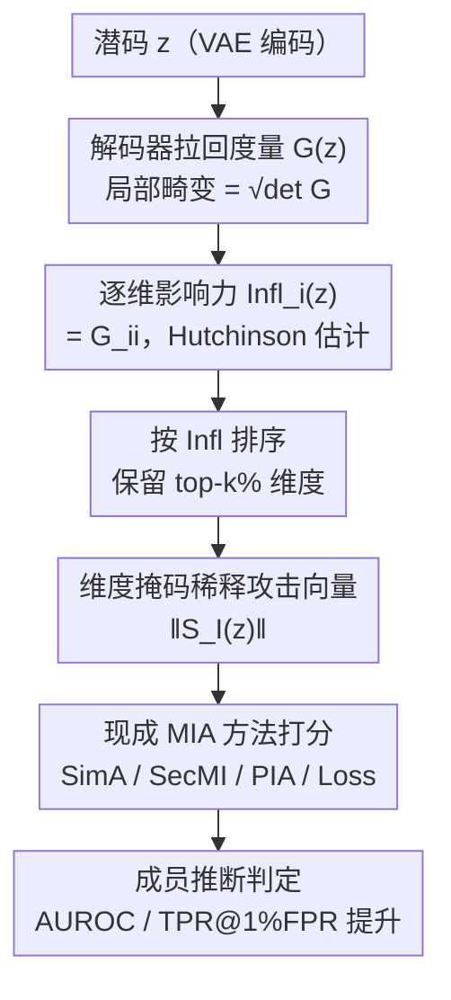

# Latent Diffusion Inversion Requires Understanding the Latent Space

**会议**: CVPR 2026  
**论文**: [CVF Open Access](https://openaccess.thecvf.com/content/CVPR2026/html/Rao_Latent_Diffusion_Inversion_Requires_Understanding_the_Latent_Space_CVPR_2026_paper.html)  
**代码**: https://github.com/mx-ethan-rao/VAE2Diffusion.git  
**领域**: 图像生成 / 扩散模型隐私  
**关键词**: 潜空间扩散, 成员推断攻击, 记忆化, 黎曼几何, VAE 解码器

## 一句话总结
本文指出潜空间扩散模型（LDM）的记忆化在隐空间里是**空间非均匀**的——VAE 解码器拉回度量（pullback metric）局部畸变越大的样本/维度被记得越牢，据此提出一个只依赖 VAE 几何的"按维度打分 + 掩掉低记忆维度"的过滤法，在六个数据集、四种成员推断攻击上一致把 AUROC 提升 1–4%、TPR@1%FPR 提升 1–32%。

## 研究背景与动机

**领域现状**：模型反演（model inversion）旨在从训练好的生成模型里恢复训练样本，其前置任务是成员推断攻击（MIA，区分某样本是否在训练集里）。对数据域扩散模型，反演/MIA 已被研究得很透，记得越牢（过拟合）的模型 MIA 越脆弱，MIA 敏感度因此被当作衡量记忆化的实用指标。

**现有痛点**：到了潜空间扩散模型（LDM，在 VAE 编码出的潜码上做扩散）这里，已有方法（1）几乎只盯着扩散过程本身做反演，**把潜空间当成固定基底、忽略了配套 VAE 的作用**；（2）反演性能相比数据域扩散显著下降，LDM 因此被认为对反演"鲁棒"。

**核心矛盾**：先前工作已观察到——改变潜空间正则强度会大幅改变 MIA 脆弱性，暗示"潜空间结构"在影响记忆化，但没人把它归因到 VAE 解码器的**几何性质**上。记忆化究竟是均匀地摊在所有样本/所有维度上，还是有结构地集中在某些位置？

**本文目标**：刻画解码器的几何属性，并验证它与记忆化/成员泄漏的因果联系，进而据此设计一个能普适提升 MIA 的过滤流程。

**切入角度**：借黎曼几何里的**拉回度量**刻画解码器映射 $D:\mathcal{Z}\to\mathcal{X}$——其行列式衡量解码器把潜空间局部体积放大/压缩的程度（称 distortion，局部畸变）。作者经验性发现：LDM 更强烈地记住落在**高畸变区域**的样本。

**核心 idea**：记忆化由解码器几何（局部畸变）调控，且这种非均匀性细到**单个维度**——畸变贡献大的潜维度泄漏更多成员信息；因此攻击前把"低记忆维度"从攻击向量里掩掉，就能普遍提升攻击效果。

## 方法详解

### 整体框架
方法围绕一条几何驱动的流水线：对每个潜码 $z$，先用 VAE 解码器的拉回度量算出**局部畸变**（揭示哪些样本被记得牢），再把畸变细分到每个维度算出**逐维影响力** $\text{Infl}_i$（哪些维度泄漏多），用 Hutchinson 估计器高效计算；然后按影响力排序、保留 top-$k\%$ 维度、掩掉其余低影响维度，得到一个"稀释后的攻击统计量"，喂给任意现成的 score-based MIA 方法（SimA/SecMI/PIA/Loss）。整条链路**只依赖 VAE**、与具体扩散攻击方法解耦——这正呼应标题"潜扩散反演需要理解潜空间"。

### 关键设计

**1. 解码器拉回度量与局部畸变：找出"被记得牢"的样本**

针对"潜空间被当固定基底、几何被忽视"的痛点，作者用黎曼几何刻画解码器。VAE 解码器在点 $z$ 的雅可比记为 $J_D(z)=\partial D(z)/\partial z$，拉回度量定义为 $G(z)=J_D(z)^\top J_D(z)$，它是一个对称半正定张量，描述潜空间局部方向被映到数据空间时如何被拉伸/压缩；对无穷小位移 $dz$，数据空间诱导距离 $\|dx\|^2=dz^\top G(z)\,dz$。**局部畸变**取体积变化因子 $\text{Distortion}(z)=\sqrt{\det(G(z))}$，数值上用对数形式 $\log\sqrt{\det G(z)}=\sum_i\log\sigma_i(J_D(z))$（$\sigma_i$ 为解码器雅可比奇异值）。高维潜空间下全部奇异值不可解，作者用**无矩阵随机 SVD** 取 top-$K$ 奇异值做截断谱估计。核心经验发现（Fig. 3）：把样本按局部畸变分四分位，**畸变越高的分位攻击 AUC 越高**；若潜空间畸变近乎均匀（如 CelebA），记忆化也随之均匀。这就把记忆化首次归因到了 encoder/decoder 架构的几何上。

**2. 逐维影响力度量：把记忆化细分到单个潜维度**

仅知道"哪些样本"被记牢还不够。作者进一步假设——给定数据点，不同潜维度对过拟合的贡献也不均等。定义**逐维影响力**为该坐标对解码器雅可比幅度的相对贡献：

$$\text{Infl}_i(z):=\left\|\frac{\partial x}{\partial z_i}\right\|_2^2=e_i^\top G(z)\,e_i=G_{ii}(z)$$

直觉上 $G_{ii}$ 大的维度，潜空间小扰动在像素空间放大更多，训练时获得更高有效信噪比、更可能携带样本特有信息；$G_{ii}$ 极小的维度传递的是弱而噪的监督。为避免显式构造完整雅可比，作者用 **Hutchinson 随机迹估计器**算 Gram 矩阵对角：$\text{diag}(J_D^\top J_D)=\mathbb{E}_{v\sim N(0,I)}[(J_D^\top v)\odot(J_D^\top v)]$，逐维影响力取 $\text{Infl}_i(z)=\tfrac{1}{2}\log(\mathbb{E}_v[(J_D^\top v)_i^2]+\epsilon)$。其中 $J_D^\top v$ 用反向模式自动微分隐式计算，复杂度 $O(n_{mc}\,T_D)$ 仅随蒙特卡洛探针数 $n_{mc}$ 线性增长、与雅可比显式尺寸无关；实测 $n_{mc}=8$ 对各分辨率图像数据集已足够。

**3. 维度掩码稀释攻击统计量：掩掉低记忆维度，普遍涨点**

有了逐维影响力，作者对任意标量攻击统计量 $\|S(z)\|$（$S(z)$ 为 score-loss、噪声预测差等潜空间攻击向量）做掩码：只保留影响力 top-$k\%$ 坐标的子集 $I$，得稀释统计量 $\|S_I(z)\|=\|S(z)\odot\mathbb{I}_I\|$，其中 $\mathbb{I}_I(i)=1$ 当 $i\in I$ 否则 0。机制解释：拉回度量 $G(z)$ 充当训练信号上的数据相关条件矩阵，$G_{ii}$ 大的坐标在训练中得到更高有效信噪比、更携带样本特有信息；$G_{ii}$ 小的坐标传递弱噪监督，纳入攻击向量只会稀释信号。所以掩掉低影响维度 = 去掉噪声方向、保留泄漏方向。论文取全局 $k=40$（即移除 top 40% 最不记忆的维度），并设了一个对照——随机丢 40% 维度，通常反而掉点；而按影响力丢则在所有方法/数据集上一致涨点。这条过滤**只依赖 VAE**，与扩散攻击实现无关，正说明"潜扩散反演需要理解潜空间"。

### 损失函数 / 训练策略
本文是分析 + 攻击增强方法，无新增训练损失。MIA 评测沿用四种现成 score-based 攻击：**Loss/Naive**（在加噪样本上评 denoising 目标 $\|\omega-\hat\omega_\varepsilon(x_t^\omega,t)\|$）；**SecMI**（用确定性 DDIM 映射测单步后验估计的 t-error）；**PIA**（用 $t{=}0$ 去噪输出作近端初始化算前后向一致性误差，查询更省）；**SimA**（$\omega=0$ 时的尺度化 Loss 点估计 $\|\hat\omega_\varepsilon(x^\omega,t)\|$，理论上对应去噪器的核加权局部均值，简单快且多数实验用它）。局部畸变随机 SVD 超参全局固定：目标秩 $k=20$、过采样 $p=30$、幂迭代 $q=2$。

## 实验关键数据

### 主实验
六个数据集（分辨率 $32^2$–$512^2$）、四种威胁模型、8×A40。过滤设置移除按本文影响力排序的 top 40% 最不记忆维度后再算范数；对照行随机丢 40%。三类指标：AUC、ASR（攻击成功率=MIA 准确率）、TPR@1%FPR。下表摘取 SimA 上从头训 LDM 三个数据集的代表结果：

| 数据集 | 方法 | AUC ↑ | ASR ↑ | TPR@1%FPR ↑ |
|--------|------|------|------|------|
| CIFAR-10 | SimA (随机丢 40%) | 86.44 | 78.80 | 15.92 |
| CIFAR-10 | SimA | 89.10 | 81.63 | 19.88 |
| CIFAR-10 | **SimA (过滤)** | **91.26** | **83.58** | **24.56** |
| CelebA | SimA | 84.66 | 77.04 | 11.09 |
| CelebA | **SimA (过滤)** | **88.18** | **80.25** | **17.03** |
| ImageNet | SimA | 69.62 | 64.92 | 3.87 |
| ImageNet | **SimA (过滤)** | **72.55** | **67.01** | **7.77** |

> 指标定义：AUC = ROC 曲线下面积；ASR = 所有阈值上的最大平衡准确率 $\max_\tau\frac{1}{2}(\text{TPR}(\tau)+1-\text{FPR}(\tau))$；TPR@1%FPR = 把 FPR 卡在略低于 0.01 的阈值处对应的真正例率（衡量低误报区的攻击强度，对隐私最敏感）。

在预训练 Stable Diffusion 微调的三个数据集上同样一致涨点，且 TPR@1%FPR 提升尤为夸张：

| 数据集 | 方法 | AUC ↑ | ASR ↑ | TPR@1%FPR ↑ |
|--------|------|------|------|------|
| Pokémon | SimA | 93.50 | 87.87 | 20.38 |
| Pokémon | **SimA (过滤)** | **94.83** | **89.68** | **52.04** |
| MS-COCO | SimA | 93.71 | 87.34 | 29.80 |
| MS-COCO | **SimA (过滤)** | **96.86** | **92.10** | **49.44** |
| Flickr | SimA | 70.04 | 65.96 | 2.59 |
| Flickr | **SimA (过滤)** | **73.61** | **68.45** | **3.49** |

跨四种攻击的平均提升：AUC 约 +1.1–3.2%、ASR 约 +1.2–3.8%、TPR@1%FPR 在不同数据集上从 +0.8% 到 +14.8%（Pokémon 上 Loss 法甚至 +1–32% 区间）。

### 消融实验
| 配置 | 关键现象 | 说明 |
|------|---------|------|
| 按影响力掩 top 40% 低记忆维 | 全指标一致↑ | 本文方法，正确去噪保信号 |
| 随机丢 40% 维度（对照） | 通常↓ | 证明涨点来自"选对维度"而非单纯降维 |
| 高/低畸变四分位分层攻击 | 高畸变分位 AUC 显著更高 | 验证样本级非均匀记忆化 |
| 高频抑制（沿用 Lian et al.） | LDM 上反而掉点 | 数据域有效的频域技巧迁不到 LDM |

畸变与频率的关系（Table 3，Pearson $r$）：CIFAR-10 上畸变与高频幅度 $r=0.7156$、与低频仅 0.0814；ImageNet 高频 $r=0.6440$；但 CelebA 反号（低频 $r=-0.8713$）——说明畸变并不能被像素域高频能量完全解释。

### 关键发现
- **记忆化是空间非均匀的、且细到维度**：样本级（高畸变分位攻击更强）和维度级（掩低影响维涨点）两层证据互相印证，"certain 维度贡献不成比例"被实证。
- **"选对维度"才是关键**：随机丢 40% 维度通常掉点，按影响力丢却一致涨点，排除了"纯降维去噪"的平凡解释。Loss 法获益最小（min Δ 最低）。
- **频域分析不可直接搬运**：非线性 VAE 编码器不把图像简单映成傅里叶模式，数据域有效的高频抑制法在 SD 上失效，必须改用解码器几何视角。

## 亮点与洞察
- **把隐私/记忆化归因到 VAE 几何，是个被忽视的新视角**：以往都盯扩散过程，本文证明 encoder/decoder 架构的局部畸变才是 LDM 记忆化非均匀性的主因，给"选什么 autoencoder"赋予了隐私意义。
- **过滤法即插即用、零成本接入**：只依赖 VAE、与具体攻击解耦，能直接套在 SimA/SecMI/PIA/Loss 上一致涨点，可复用性强。
- **Hutchinson + 反向模式 AD 让高维雅可比可算**：避免显式构造解码器雅可比，复杂度只随探针数线性增长（$n_{mc}=8$ 即够），让"算每个潜码的逐维影响力"在 $512^2$ 分辨率下变得现实可行。

## 局限与展望
- **$k=40\%$ 是全局拍的、未调优**：作者明说最优掩码比例应随数据集/样本而变，本文为简洁统一取 40%，留作未来工作——意味着报告的提升可能还偏保守。
- **是"增强攻击"而非"防御"**：方法揭示并放大隐私泄漏，如何反过来用解码器几何做防御（如几何感知的潜空间正则）只是顺带暗示，未展开。
- **截断谱/随机 SVD 是近似**：局部畸变靠 top-$K$ 奇异值截断估计，近似误差对极端样本的影响未充分量化。
- **频域联系尚不完整**：⚠️ 畸变与高频的相关性在 CelebA 上反号，作者用 Laplace-Beltrami 谱不可及来解释，但这部分仍属假设性讨论（细节在附录 F/G）。

## 相关工作与启发
- **vs VAE 黎曼几何（Arvanitidis et al. 等）**：前人用拉回度量研究插值质量、测地线、表征聚类；本文首次把同一度量用于**隐私相关**问题——揭示 LDM 在哪记得最牢、哪些维度主导成员泄漏。
- **vs 数据域扩散记忆化分析（频域/passthrough）**：数据域去噪器偏好重建高方差方向、抑制高频，对应数据协方差特征向量；但 LDM 在非线性语义潜空间上扩散，频域结论迁不过来（实验中高频抑制反掉点），必须换几何视角。
- **vs 把 VAE 当固定预处理器的 LDM 隐私研究**：那类工作在像素空间或把 autoencoder 视作固定模块；本文显式把记忆化行为归因到 encoder/decoder 对的几何，把架构选择提到 LDM 反演性质的首要因素。

## 评分
- 新颖性: ⭐⭐⭐⭐⭐ 用解码器拉回度量把 LDM 记忆化归因到几何，并细分到逐维度，视角新颖且有理论根基
- 实验充分度: ⭐⭐⭐⭐⭐ 六数据集 × 四攻击 × 全指标一致涨点，含随机丢维对照与频率相关性分析
- 写作质量: ⭐⭐⭐⭐ 几何动机讲得清楚、机制有解释；部分关键证据（频域、伪代码）甩到附录
- 价值: ⭐⭐⭐⭐ 给扩散模型隐私评估提供了即插即用的增强手段和新分析框架，对 autoencoder 设计有警示意义

<!-- RELATED:START -->

## 相关论文

- [\[CVPR 2026\] Unified Latent Space for Understanding and Generation via Semantic Auto-encoder](unified_latent_space_for_understanding_and_generation_via_semantic_auto-encoder.md)
- [\[CVPR 2026\] Your Latent Mask is Wrong: Pixel-Equivalent Latent Compositing for Diffusion Models](your_latent_mask_is_wrong_pixel-equivalent_latent_compositing_for_diffusion_mode.md)
- [\[CVPR 2026\] CAST: Context-Aware Dynamic Latent Space Transformation for Interactive Text-to-Image Retrieval](cast_context-aware_dynamic_latent_space_transformation_for_interactive_text-to-i.md)
- [\[CVPR 2025\] Latent Space Imaging](../../CVPR2025/image_generation/latent_space_imaging.md)
- [\[CVPR 2025\] Probability Density Geodesics in Image Diffusion Latent Space](../../CVPR2025/image_generation/probability_density_geodesics_in_image_diffusion_latent_space.md)

<!-- RELATED:END -->
