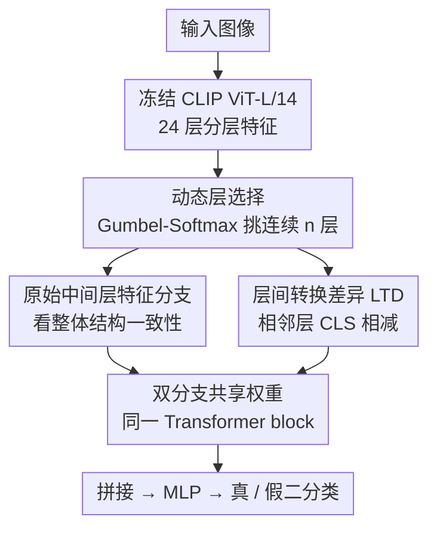

# Layer Consistency Matters: Elegant Latent Transition Discrepancy for Generalizable Synthetic Image Detection

**会议**: CVPR 2026  
**arXiv**: [2603.10598](https://arxiv.org/abs/2603.10598)  
**代码**: [https://github.com/yywencs/LTD](https://github.com/yywencs/LTD)  
**领域**: 图像生成 / AI生成图像检测  
**关键词**: 合成图像检测, 层间转换差异, CLIP-ViT, 跨域泛化, 动态层选择

## 一句话总结

发现真实图像在冻结CLIP ViT中间层的特征表示呈现稳定的层间过渡，而合成图像在中间层出现显著的注意力突变，提出Layer Transition Discrepancy (LTD) 方法建模该差异，在UFD上mean Acc达96.90%，DRCT-2M上达99.54%，GenImage上达91.62%，全面超越SOTA。

## 研究背景与动机

**领域现状**：生成模型（GAN、扩散模型）合成的图像越来越逼真，区分真假图像成为紧迫需求。现有检测方法分为三类：(1) 基于空间纹理/频率的方法（CNNSpot、NPR、FreqNet）——依赖特定模型伪影，跨域泛化差；(2) 扩散模型专用检测（DRCT、LaRE2）——对GAN生成的图像效果不佳；(3) 基于冻结CLIP的方法（UnivFD、RINE、FatFormer）——利用预训练语义特征。

**现有痛点**：低级伪影（频率、纹理）随生成模型的进化而变化，学到的是model-specific的bias；CLIP-based方法中，UnivFD仅用最后一层特征忽略低级信息，RINE等方法融合所有层特征但包含大量无关信息引入噪声。

**核心矛盾**：需要一种与具体生成模型无关的、通用的检测线索——既不依赖于特定伪影，又能捕捉真实与合成图像的本质差异。

**本文的发现**：通过分析CLIP ViT各层间特征的余弦相似度和L2距离，发现真实图像在中间层保持稳定的语义注意力一致性（层间特征平滑过渡），而合成图像在中间层出现前景/背景注意力的突然跳变（层间转换差异大）。这一现象可能源于生成模型优先优化像素级逼真度和高级语义一致性，但缺乏严格的物理约束，导致中间层整合纹理到结构时无法维持连续的空间相关性。

**核心idea**：利用Layer Transition Discrepancy (LTD)——中间层相邻层特征的差异——作为模型无关的检测信号，同时建模全局结构一致性和局部层间变化。

## 方法详解

### 整体框架

这篇论文要找一个不依赖具体生成器伪影、跨域也能用的检测线索。它的出发点是一个观察：把图像喂进冻结的 CLIP ViT-L/14，逐层看 CLS 特征怎么变，真实图像在中间层之间是平滑过渡的，合成图像却会在中间层突然跳变。于是整条 pipeline 不去学某种纹理或频谱指纹，而是直接对"层与层之间怎么变"建模。

具体地，输入图像先过冻结的 CLIP ViT 拿到 24 层分层特征；一个动态层选择模块挑出最有判别力的一段连续中间层（实验里落在 11–19 这一带）；在这段层上，一支保留原始中间层特征用来看整体结构一致，另一支对相邻层做差得到层间转换差异（LTD）用来放大那个跳变。两支特征各自加上 CLS token 和位置编码，送进**权重共享**的同一个 Transformer block 交互，最后拼起来过 MLP 做真/假二分类。CLIP 全程冻结，可训练的只有层选择参数、位置编码和这一小块双分支头。

### 关键设计

**1. 动态层选择：让模型自己挑判别力最强的那段中间层**

固定取某几层是有风险的——不同图像的"破绽"未必出现在同一层，而且 CLIP 浅层（0–7）和深层（16–23）对真假区分能力都有限，信号集中在中间。论文把"从哪一层开始取连续 $n$ 层"做成一个可学习的选择：定义一组可学习 logits $\boldsymbol{\pi} \in \mathbb{R}^C$，其中 $C = l - n + 1$ 是所有候选起始窗口的数量，再用 Gumbel-Softmax 从中采出起始层索引 $s$。关键在于 Gumbel-Softmax 把"挑哪个窗口"这个本来离散、不可导的操作变成端到端可微的，于是层选择能和后面的检测头一起训练，而不是靠人手调或网格搜索。

**2. 层间转换差异（LTD）：把检测信号从"特征本身"换成"层与层之间的变化"**

直接用原始中间层特征会混进大量与真假无关的语义内容，反而是噪声。LTD 的做法是只盯住相邻层的差。在选定的 $n$ 个连续层 $\{\mathbf{f}_s^{(k)}\}_{k=1}^n$ 上，对相邻层的 CLS token 相减 $\mathbf{d}_s^{(k)} = \mathbf{f}_s^{(k+1)} - \mathbf{f}_s^{(k)}$，得到 $n-1$ 个差异向量。这一减就把"每层各自有什么内容"消掉了，剩下"内容在层间怎么挪动"。对应前面的观察：真实图像这串差异小而稳，合成图像则在中间某处出现一个大跳变——差分特征正好把这种跳变凸显出来，同时抑掉了和真假无关的冗余。

**3. 双分支共享权重：把整体一致性和层间跳变压进同一个语义空间**

只看 LTD 会丢掉全局结构信息，只看原始特征又看不清跳变，所以两者都要。原始特征分支 $\mathbf{F}_s = [\mathbf{f}_s, \mathbf{f}_{cls}, \mathbf{f}_p]$ 负责整体结构一致性，LTD 分支 $\mathbf{D} = [\mathbf{d}, \mathbf{d}_{cls}, \mathbf{d}_p]$ 负责局部层间变化，两支各自补上 CLS token 和位置编码后，送进**同一个**可训练 Transformer block。共享权重是这里的要点：它强制两种本来分布不同的特征被映射到同一套语义空间里，特征对齐之后再拼接分类，避免两支各走各的、表示分散导致难以联合判别。消融里这一点很明显——单看原始特征或单看 LTD 的 mean Acc 都在 88–90% 一带，合到双分支才跳到 98.22%。

### 损失函数 / 训练策略

标准二分类交叉熵损失。训练只用 2 类 ProGAN 数据（chair + tvmonitor），5 个 epoch 即收敛。CLIP ViT 全部冻结，可训练参数仅层选择 logits、位置编码和双分支 Transformer + MLP，因此整套训练在单张 4090 上几分钟就能跑完。

## 实验关键数据

### 主实验

| 数据集 | 指标 | 本文LTD | ForgeLens | FatFormer | 提升 |
|--------|------|---------|-----------|-----------|------|
| UFD | Mean Acc | 96.90% | 95.56% | 95.98% | +0.92% |
| UFD | Mean AP | 99.51% | 99.11% | 99.15% | +0.36% |
| DRCT-2M | Mean Acc | 99.54% | 98.22% | - | +1.32% |
| DRCT-2M | Mean AP | 99.99% | 99.76% | - | +0.23% |
| GenImage | Mean Acc | 91.62% | 89.18% | 84.34% | +2.44% |
| GenImage | Mean AP | 97.17% | 96.76% | 95.01% | +0.41% |

### 消融实验

| 配置 | UFD Acc | DRCT-2M Acc | Mean Acc | 说明 |
|------|---------|-------------|----------|------|
| Raw ML. only | 84.92% | 92.75% | 88.84% | 仅原始中间层特征 |
| Raw ML. + Pos.Enc | 94.22% | 96.12% | 95.17% | 加位置编码 |
| LTD only | 86.42% | 93.50% | 89.96% | 仅LTD差异特征 |
| LTD + Pos.Enc | 92.43% | 94.01% | 93.22% | LTD加位置编码 |
| Full model | 96.90% | 99.54% | 98.22% | 双分支完整模型 |

### 关键发现
- 真实图像在ViT中间层（约Layer 11-19）保持稳定的注意力一致性，合成图像在同区间出现显著注意力跳变
- 浅层（Layer 0-7）和深层（Layer 16-23）对真假图像的区分能力有限，中间层（Layer 8-15）最强
- 最优窗口为5个连续层（层11起始），过多或过少都会降低性能
- 仅用2类训练数据即可泛化到16种不同GAN和DM生成器
- 对JPEG压缩（QF 60-100）和下采样（0.5x-1.0x）保持鲁棒

## 亮点与洞察
- **发现了一个此前未被注意的检测线索**：层间转换差异是模型无关的，不依赖于特定生成器的伪影，因此具有天然的跨域泛化能力
- **极高的训练效率**：仅需2类训练数据、5个epoch就能训练完成，在4090上几分钟完成
- **推理速度最快**：冻结CLIP骨干 + 轻量双分支，FPS显著高于FatFormer等方法
- **Physical prior的洞察**：生成模型重点优化像素级真实感和高级语义对齐，但中间层的结构连续性不受约束，因此成为泄露生成来源信息的"窗口"

## 局限与展望
- Midjourney在GenImage上的Acc仅62.97%，对部分高质量商业模型仍有提升空间
- 严重依赖CLIP ViT的预训练表示——如果CLIP被用于生成过程本身（如未来模型），检测效果可能下降
- 动态层选择用Gumbel-Softmax，推理时退化为固定选择，未能真正做到per-image adaptive
- 仅使用CLS token的LTD，未利用spatial token的局部层间差异信息

## 相关工作与启发
- **vs UnivFD**: UnivFD仅用CLIP最后一层做线性探测，忽略中间层信息；LTD利用中间层的层间差异，mean Acc提升11%
- **vs FatFormer/RINE**: 它们融合所有层特征但引入无关信息和噪声；LTD聚焦层间变化抑制冗余
- **vs NPR/FreqNet**: 依赖低级统计伪影（上采样指纹、频谱），对扩散模型泛化差；LTD利用层间结构一致性，对GAN和DM都有效
- **启发**：预训练大模型的中间层表示包含丰富的取证信号，层间动态比单层特征更具判别力

## 评分
- 新颖性: ⭐⭐⭐⭐ 发现层间转换差异这一新检测线索，观察深刻且启发性强
- 实验充分度: ⭐⭐⭐⭐⭐ 三大benchmark全面评测，16+生成器，鲁棒性/消融实验充分
- 写作质量: ⭐⭐⭐⭐ 动机分析清晰，可视化有说服力，但方法部分公式偏简单
- 价值: ⭐⭐⭐⭐ 高实用价值，训练简单高效，泛化性强，适合部署

<!-- RELATED:START -->

## 相关论文

- [\[CVPR 2026\] From Inpainting to Layer Decomposition: Repurposing Generative Inpainting Models for Image Layer Decomposition](from_inpainting_to_layer_decomposition_repurposing_generative_inpainting_models_.md)
- [\[CVPR 2026\] LacTokGen: Latent Consistency Tokenizer for 1024-pixel Image Generation by 256 Tokens](lactokgen_latent_consistency_tokenizer_for_1024-pixel_image_generation_by_256_to.md)
- [\[ICCV 2025\] ForgeLens: Data-Efficient Forgery Focus for Generalizable Forgery Image Detection](../../ICCV2025/image_generation/forgelens_data-efficient_forgery_focus_for_generalizable_forgery_image_detection.md)
- [\[NeurIPS 2025\] FerretNet: Efficient Synthetic Image Detection via Local Pixel Dependencies](../../NeurIPS2025/image_generation/ferretnet_efficient_synthetic_image_detection_via_local_pixel_dependencies.md)
- [\[CVPR 2026\] Transition Models: Rethinking the Generative Learning Objective](transition_models_rethinking_the_generative_learning_objective.md)

<!-- RELATED:END -->
