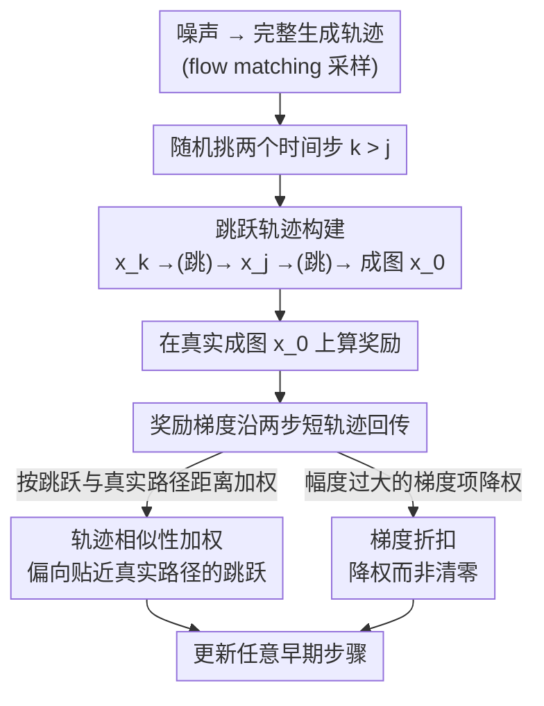

# LeapAlign: Post-Training Flow Matching Models at Any Generation Step by Building Two-Step Trajectories

**会议**: CVPR 2026  
**arXiv**: [2604.15311](https://arxiv.org/abs/2604.15311)  
**代码**: [rockeycoss.github.io/leapalign/](https://rockeycoss.github.io/leapalign/)  
**领域**: 图像生成  
**关键词**: flow matching, post-training, reward alignment, human preference, diffusion model

## 一句话总结

提出 LeapAlign，通过构建两步跳跃轨迹将长生成路径缩短为两步，使奖励梯度可直接反向传播到早期生成步骤，结合轨迹相似性加权和梯度折扣策略实现 flow matching 模型的高效后训练对齐。

## 研究背景与动机

将 flow matching 模型与人类偏好对齐是重要方向。GRPO 方法从 LLM 借鉴但引入大量随机性和方差。直接梯度法利用 flow matching 采样过程的可微性反向传播奖励梯度，收敛更快更稳定。然而长轨迹反向传播面临两大挑战：(1) 长激活链的内存消耗过大；(2) 梯度爆炸。现有方法因此仅更新靠近最终图像的单个步骤，无法更新决定图像全局结构的早期步骤。

## 方法详解

### 整体框架

LeapAlign 要解决的是「用奖励梯度对齐 flow matching 模型时，没法更新早期生成步骤」的难题——早期步骤决定图像的全局结构和构图，但完整轨迹反传既会爆显存又会梯度爆炸，所以以往方法只敢更新靠近成图的那一步。它的做法是每次迭代先采一条从噪声到图像的完整轨迹，随机挑两个时间步 $k > j$ 拼出一条「两步跳跃轨迹」：第一步从 $x_k$ 跳到 $x_j$，第二步从 $x_j$ 跳到成图 $x_0$；奖励仍在真实成图上算，但梯度只沿这条短轨迹回传，于是任意早期步骤都能被更新。

### 关键设计

**1. 跳跃轨迹构建：把长路径压成两步，让早期步骤也能被更新**

长轨迹反传的两座大山是显存和梯度爆炸，逼得以往方法只能动最后一步。LeapAlign 利用 rectified flow matching 的单步跳跃预测性质 $\hat{x}_{j|k} = x_k - (k-j) v_\theta(x_k, k)$，把完整多步轨迹直接缩成两步；再通过随机化起止时间步 $(k, j)$ 覆盖任意生成步骤，包括对全局结构至关重要的早期步。

**2. 轨迹相似性加权：偏向那些更贴近真实路径的跳跃**

跳跃轨迹毕竟是近似，和真实多步路径有近似误差，一视同仁地学会把偏差大的轨迹也学进来。作者用跳跃预测与真实中间潜码之间的距离衡量相似度，给更贴合真实路径的跳跃轨迹更高训练权重，把学习信号集中到可靠的跳跃上，提升训练效率。

**3. 梯度折扣而非截断：保留跨步依赖又不让梯度炸**

DRTune 为了防梯度爆炸干脆把嵌套梯度项整个删掉，代价是丢了跨时间步的依赖信息。LeapAlign 改成对幅度过大的梯度项降权而不是清零，既压住爆炸风险，又保住跨步的学习信号——这是它能稳定更新早期步骤的关键。

### 损失函数 / 训练策略

奖励最大化目标，通过两步跳跃轨迹反向传播。支持每条轨迹更新多个步骤。常数内存开销（仅两步反向传播）。

## 实验关键数据

### 主实验

微调 Flux 模型与 SOTA 方法对比：

| 指标 | DRTune | DanceGRPO | MixGRPO | LeapAlign |
|------|--------|-----------|---------|-----------|
| HPSv2.1 | 基线 | 中等 | 中等 | **最优** |
| HPSv3 | 基线 | 中等 | 中等 | **最优** |
| PickScore | 基线 | 中等 | 中等 | **最优** |
| GenEval | 基线 | 中等 | 中等 | **最优** |

在所有评估指标上一致超越 GRPO 和直接梯度方法。

### 消融实验

- 早期步骤更新对全局结构改善贡献大
- 梯度折扣 vs 梯度截断：前者保留更多信息且更稳定
- 轨迹相似性加权提升收敛速度和最终性能

### 关键发现

- 早期步骤微调对图像布局和构图的改善至关重要
- 两步轨迹足以捕获有效的跨步梯度信息
- 奖励提升速度明显快于 DRTune

## 亮点与洞察

- 跳跃轨迹的构建将内存开销从 $O(T)$ 降为常数
- "降权而非截断"保留梯度信号的策略简单但有效
- 首次实现了 flow matching 模型早期步骤的实用直接梯度更新

## 局限与展望

- 跳跃预测与真实路径的近似质量取决于 flow matching 模型本身的直线性
- 奖励模型的质量直接决定对齐效果
- 未验证在非图像生成的 flow matching 应用中的泛化性

## 相关工作与启发

- 跳跃轨迹技术可应用于其他长序列可微采样过程的后训练
- 梯度折扣策略对其他存在梯度爆炸风险的训练场景有参考
- 与 GRPO 方法的性能差距证实了直接梯度法在 flow matching 中的优势

## 评分

8/10 — 方法设计简洁有效，解决了直接梯度法的核心瓶颈，实验充分。

<!-- RELATED:START -->

## 相关论文

- [\[CVPR 2026\] BiFM: Bidirectional Flow Matching for Few-Step Image Editing and Generation](bifm_bidirectional_flow_matching_for_few-step_image_editing_and_generation.md)
- [\[CVPR 2026\] RenderFlow: Single-Step Neural Rendering via Flow Matching](renderflow_single-step_neural_rendering_via_flow_matching.md)
- [\[CVPR 2026\] Self-Evaluation Unlocks Any-Step Text-to-Image Generation](self-evaluation_unlocks_any-step_text-to-image_generation.md)
- [\[CVPR 2026\] FlowSteer: Guiding Few-Step Image Synthesis with Authentic Trajectories](flowsteer_guiding_few-step_image_synthesis_with_authentic_trajectories.md)
- [\[CVPR 2026\] Temporal Equilibrium MeanFlow: Bridging the Scale Gap for One-Step Generation](temporal_equilibrium_meanflow_bridging_the_scale_gap_for_one-step_generation.md)

<!-- RELATED:END -->
