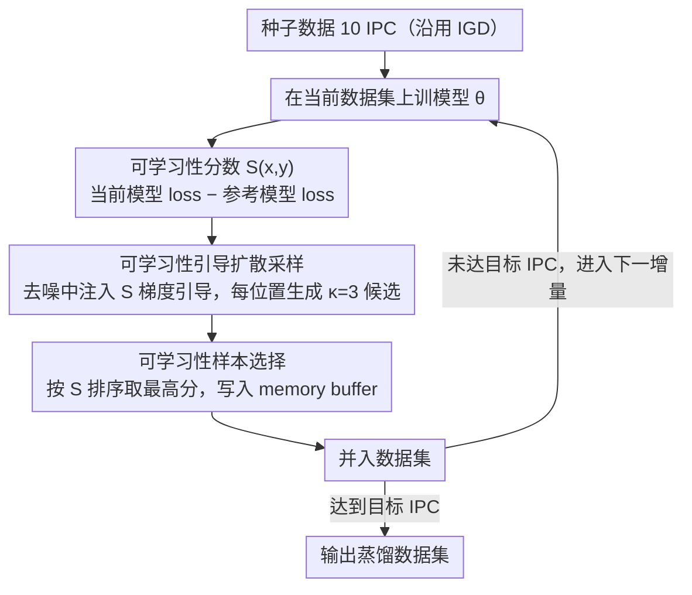

# Learnability-Guided Diffusion for Dataset Distillation

**会议**: CVPR 2026  
**arXiv**: [2604.00519](https://arxiv.org/abs/2604.00519)  
**代码**: [https://jachansantiago.github.io/learnability-guided-distillation/](https://jachansantiago.github.io/learnability-guided-distillation/)  
**领域**: 图像生成 / 数据集蒸馏  
**关键词**: 数据集蒸馏, 可学习性引导, 扩散模型, 增量式合成, 冗余分析

## 一句话总结

提出可学习性驱动的增量式数据集蒸馏框架LGD，将蒸馏数据集分阶段构建，每阶段条件化于当前模型状态生成互补而非冗余的训练样本，通过在扩散采样中注入可学习性梯度引导，将现有方法80-90%的样本间信息冗余降低39.1%，在ImageNet-1K上达60.1%（50 IPC）、ImageNette上达87.2%（100 IPC）。

## 研究背景与动机

**领域现状**：数据集蒸馏旨在从大数据集合成小型替代数据集，使在其上训练的模型达到与全量数据相当的性能。早期方法通过像素级优化匹配训练轨迹（gradient matching、trajectory matching），但在高分辨率数据集上计算不可行。近期方法（DiT、Minimax Diffusion、IGD、MGD3）利用预训练扩散模型生成蒸馏数据，大幅降低成本。

**现有痛点**：现有方法的核心问题是**严重的样本冗余**。将50 IPC的蒸馏数据集分成5个不相交的10 IPC子集，任意一个子集能捕获其他子集80-90%的训练信号。冗余来源：(1) 优化视觉多样性的方法（DiT）不考虑训练信号相似性；(2) 匹配平均训练轨迹的方法（IGD）让所有样本收敛到相似的梯度profile——产生"中等强度"的梯度，在任何训练阶段都不是最优的。

**核心矛盾**：模型训练天然分阶段——早期需要强梯度建立粗特征，后期需要精细梯度打磨细节。一个样本无法同时满足两者，但优化"平均"轨迹恰恰产生这种折中样本，而非为不同阶段专门化的样本。

**切入角度**：将蒸馏重构为**顺序学习问题**——给定已蒸馏的数据集和在其上训练好的模型，生成能最大化边际学习增益的新样本。

**核心idea**：可学习性引导——每阶段评估当前模型"能从什么样本中学到东西"（高loss但参考模型低loss = 可学习而非噪声），在扩散采样过程中注入可学习性分数的梯度引导生成过程走向这类样本。

## 方法详解

### 整体框架

这篇论文要解决的痛点很具体：现有蒸馏方法一次性生成全部样本，结果样本之间信息高度冗余——把 50 IPC 砍成 5 个 10 IPC 子集，任意一个子集就能覆盖其余子集 80-90% 的训练信号。LGD 的破局思路是把"一次生成"改成"分阶段增量生成"，让后生成的样本知道前面已经有了什么、当前模型还缺什么，从而只补互补的知识。

整个流程是一个增量循环：把目标数据集 $\mathcal{D}$ 拆成 $K$ 个增量 $\mathcal{I}_1, \dots, \mathcal{I}_K$，从一份种子数据（默认用 IGD 的 10 IPC）出发，在它上面把模型 $\theta_0$ 训到收敛；然后让扩散模型在采样时被"可学习性"梯度牵引，生成一批候选，再按可学习性排序挑出最有价值的样本并入数据集；用扩充后的数据集重新训一个模型，进入下一轮。关键在于每一轮生成都条件化于**当前模型状态**——模型先学会粗特征后，下一轮自然就被推着去补它还学不会的细节，于是整个数据集从易到难地长出来，等于自动生成了一条课程。举个具体的节奏：种子 10 IPC → 训模型 → 生成补到 20 IPC → 重训 → … → 一路扩到 100 IPC，每一步新增的样本都不是前面的"换皮重复"，而是真正的新信息。

### 关键设计

**1. 可学习性分数：用一个数衡量"这个样本现在值不值得学"**

增量生成最核心的问题是：怎么判断一个候选样本对当前模型有没有价值？直觉上想最大化当前模型在它上面的 loss（loss 高 = 模型不会 = 有得学），但只看这一项会被噪声样本和分布外样本骗到——它们 loss 也很高，却根本学不出有用东西。LGD 的办法是再减去一个参考模型的 loss 作为正则：

$$\mathcal{S}(x,y) = \mathcal{L}(\theta_{i-1}, x, y) - \omega \cdot \mathcal{L}(\theta^*, x, y)$$

这里 $\theta_{i-1}$ 是当前增量模型，$\theta^*$ 是在全量数据上训好的参考模型，$\omega$ 控制正则强度。减去 $\theta^*$ 项的意义在于：如果连见多识广的参考模型都觉得这个样本难，那它多半是噪声而非知识；只有"当前模型不会、但参考模型会"的样本才会得到高分。所以高 $\mathcal{S}$ 精确地刻画了一个**可学习的知识缺口**——既不是已经会的冗余，也不是学不动的噪声，而是恰好卡在当前模型学习边界上的内容。

**2. 可学习性引导扩散采样：把生成轨迹直接推向高分区域**

有了可学习性分数，怎么让扩散模型真的生成高分样本？LGD 借鉴分类器引导的思路，但把类别概率梯度换成可学习性分数的梯度，在每一步去噪时给噪声预测加一个牵引项：

$$\tilde{\epsilon}_\phi(x_t, t, y) = \epsilon_\phi(x_t, t, y) + \lambda \cdot \rho_t \cdot \nabla_{x_t} \mathcal{S}(x_t, y)$$

其中缩放因子 $\rho_t = \sqrt{1-\bar{\alpha}_t}\,\dfrac{\|\epsilon_\phi\|}{\|\nabla_{x_t}\mathcal{S}\|}$ 把引导幅度归一化到与当前噪声水平相称，避免在不同时间步引导力度失衡。另一个关键细节是只在中间时间步（50 步采样中的 $t \in [10, 45]$）施加引导：太早会破坏图像的全局结构，太晚又会过度干扰已成形的细节，中段才是改变"学到什么"而不破坏"长什么样"的窗口。

**3. 可学习性样本选择：再加一道排序闸门兜底**

引导采样把生成的期望推高了，但扩散本身有随机性，单次采样仍可能漏出低可学习性的样本。所以 LGD 在引导之外补一道选择：每个待填充的位置生成 $\kappa = 3$ 个候选，用可学习性分数排序，只保留最高分的那个。被选中的样本依次写入 memory buffer $\mathcal{M}^c$，后续样本的生成与打分都在"已经构建好的数据集"这一上下文里进行——这样多样性引导（与已有样本的余弦距离排斥）能自然生效，新样本不仅可学习，还和已有样本拉开距离。引导采样负责"让大多数候选落在高分区"，样本选择负责"在候选里再挑出最好的并保证彼此不重复"，两者一前一后协同保证每个增量的质量。

### 损失函数 / 训练策略

每个增量的优化目标可以写成边际学习增益的最大化：

$$\mathcal{I}_i^* = \arg\max_{\mathcal{I}} \left[ \mathcal{L}(\theta_{i-1}, \mathcal{I}) - \mathcal{L}(\theta^*, \mathcal{I}) \right]$$

即在当前模型上难、在参考模型上不难的样本最优。主要超参：引导强度 $\lambda = 15$、参考模型权重 $\omega = 0.5$、候选倍率 $\kappa = 3$、deviation guidance $\gamma = 50$。种子数据沿用 IGD 的 10 IPC，每阶段增加 10 IPC；标签上 ImageNet-1K 用 soft-label protocol，ImageNette/Woof 用 hard-label protocol。

## 实验关键数据

### 主实验

| 数据集 | IPC | 模型 | 本文LGD | IGD | MGD3 | DiT | 提升(vs IGD) |
|--------|-----|------|---------|-----|------|-----|-------------|
| ImageNette | 50 | ResNet-18 | 85.0% | 81.0% | 81.5% | 75.2% | +4.0% |
| ImageNette | 100 | ResNet-18 | 86.9% | 84.4% | 85.6% | 77.8% | +2.5% |
| ImageNette | 100 | ConvNet-6 | 87.2% | 84.5% | 86.5% | 78.2% | +2.7% |
| ImageWoof | 100 | ResNet-18 | 72.9% | 70.6% | 71.3% | 62.3% | +2.3% |
| ImageNet-1K | 50 | ResNet-18 | 60.1% | 59.8% | 60.2% | 52.9% | +0.3% |

### 消融实验（冗余分析）

| 方法 | 跨增量平均准确率 | 冗余程度 | 说明 |
|------|----------------|---------|------|
| DiT | 94.7% | 最高 | 任意子集几乎能完全替代其他 |
| IGD | 87.1% | 较高 | 略有改善但仍大量重叠 |
| LGD (Ours) | 57.65% | 显著降低 | 增量间互补，冗余减少39.1% |

### 关键发现
- 现有蒸馏方法存在严重冗余：DiT的不相交子集间交叉准确率高达91-98%
- LGD增量训练每阶段loss spike更大（平均Δ=0.20 vs DiT的0.06），说明新增数据包含真正的新信息
- 增量训练准确率递增：LGD从IPC10的64.1%持续提升到IPC100的89.1%，而DiT在IPC50后几乎停滞
- 学习动态可视化显示LGD生成的样本更"informative"（16.2%）和"harder"（2.6%），与原始训练数据分布的JS散度最低
- 跨架构泛化良好：用ResNet-AP-10蒸馏的50 IPC数据在ResNet-18上达85.0%

## 亮点与洞察
- **冗余诊断框架**：增量分区+交叉评估不仅是合成工具，更是分析任何蒸馏方法信息分布的通用诊断工具
- **将蒸馏重构为课程学习**：每阶段自动形成从易到难的课程——不是预定义难度，而是由模型演化状态定义边界
- **"可学习的知识缺口"概念精妙**：high loss for current model + low loss for reference model = 不是噪声也不是太难，而是恰好在学习边界上
- **实证发现有价值**：80-90%冗余率这个数字令人震惊，揭示了现有方法的根本瓶颈

## 局限与展望
- ImageNet-1K上LGD(60.1%)与MGD3(60.2%)基本持平，大规模数据集上增量策略的优势不明显
- 需要预训练参考模型 $\theta^*$（在全量数据训练），增加了准备开销
- 每阶段生成需要模型推理计算可学习性分数和梯度引导，比一次性生成更慢
- 种子数据依赖IGD的10 IPC，种子质量会影响后续增量
- 增量数目 $K$ 和每增量IPC数 $N_i$ 的最优配置依赖数据集，缺乏自适应确定方法

## 相关工作与启发
- **vs IGD (Influence-Guided Diffusion)**: IGD匹配平均训练轨迹的梯度，所有样本收敛到相似的梯度profile；LGD条件化于当前模型状态，每阶段生成互补样本
- **vs Minimax Diffusion**: Minimax通过多样性和代表性平衡控制生成，但不考虑训练信号冗余；LGD直接度量和优化信息互补性
- **vs MGD3**: MGD3以特征空间模式为条件引导生成，在ImageNet-1K上略优（60.2% vs 60.1%），但在小数据集上LGD更优
- **启发**：数据效率的本质不是单样本质量，而是样本间的信息互补性——评估数据集质量应关注边际增益而非平均增益

## 评分
- 新颖性: ⭐⭐⭐⭐⭐ 将蒸馏重构为增量课程学习问题，可学习性引导扩散采样的想法新颖且自然
- 实验充分度: ⭐⭐⭐⭐ 三个数据集评测，冗余分析深入，训练动态可视化有说服力；ImageNet-1K优势不显著
- 写作质量: ⭐⭐⭐⭐⭐ 动机论述清晰，问题定义精确，冗余分析可视化优秀
- 价值: ⭐⭐⭐⭐ 冗余诊断框架对整个领域有启发，但在大规模数据集上尚需进一步验证

<!-- RELATED:START -->

## 相关论文

- [\[ICCV 2025\] CaO2: Rectifying Inconsistencies in Diffusion-Based Dataset Distillation](../../ICCV2025/image_generation/cao2_rectifying_inconsistencies_in_diffusion-based_dataset_distillation.md)
- [\[ICML 2025\] Taming Diffusion for Dataset Distillation with High Representativeness (D³HR)](../../ICML2025/image_generation/taming_diffusion_for_dataset_distillation_with_high_representativeness.md)
- [\[CVPR 2026\] Pico-Banana-400K: A Large-Scale Dataset for Text-Guided Image Editing](pico-banana-400k_a_large-scale_dataset_for_text-guided_image_editing.md)
- [\[CVPR 2026\] RecTok: Reconstruction Distillation along Rectified Flow](rectok_reconstruction_distillation_along_rectified_flow.md)
- [\[CVPR 2026\] Pluggable Pruning with Contiguous Layer Distillation for Diffusion Transformers](pluggable_pruning_with_contiguous_layer_distillation_for_diffusion_transformers.md)

<!-- RELATED:END -->
