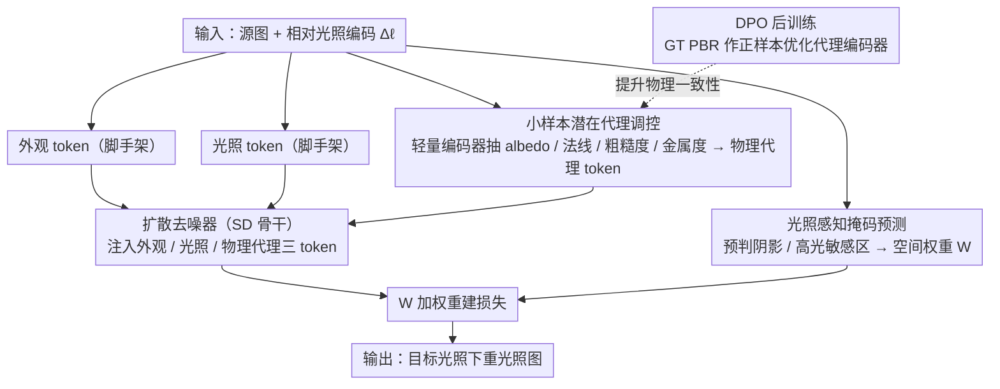

# Learning Latent Proxies for Controllable Single-Image Relighting

**会议**: CVPR 2026  
**arXiv**: [2603.15555](https://arxiv.org/abs/2603.15555)  
**代码**: 无  
**领域**: 图像重光照 / 扩散模型  
**关键词**: 单图重光照, PBR 先验, 潜在代理编码器, DPO 后训练, 光照感知掩码

## 一句话总结

提出 LightCtrl，一个基于扩散模型的单图重光照框架，通过小样本潜在代理编码器（few-shot latent proxy）提供轻量材质-几何先验、光照感知掩码引导空间选择性去噪、DPO 后训练增强物理一致性，实现对光照方向/强度/色温的精确连续控制，在合成和真实场景上均优于现有方法。

## 研究背景与动机

单图重光照是一个严重欠约束问题：阴影、高光和漫反射依赖不可观测的几何和材质，且光照的微小变化可导致外观的大幅非线性变化。现有方法存在明确的能力边界：

**Intrinsic/G-buffer 方法**（如 Neural LightRig）需要密集 PBR 监督，脆弱且成本高

**纯潜空间方法**（如 LBM）缺乏物理基础，方向/强度控制不可靠

**端到端方法**（如 IC-Light）在肖像上效果好但缺乏几何感知，难泛化到复杂场景

**关键洞察**：精确重光照不需要完整的 intrinsic 分解；稀疏但物理有意义的线索——指示**哪里**光照应变化、**材质如何**响应——就足以引导扩散模型。这催生了轻量 proxy + mask 的设计思路。

## 方法详解

### 整体框架

LightCtrl 要解决的是单图重光照里「物理信息缺失」与「可控性」之间的张力：既不想像 intrinsic 方法那样背上密集 PBR 分解的包袱，又不能像纯潜空间方法那样丢掉物理约束。它的做法是在一个 Stable Diffusion 骨干外面挂三组轻量线索，让扩散过程被「够用」的物理暗示牵引。

整体怎么转：给定源图 $x_s^{\ell_s}$ 和一个相对光照编码 $\Delta\ell$（方向/强度/色温的差异），网络要生成目标光照下的结果 $\hat{x}_s^{\ell_t} = f_\theta(x_s^{\ell_s}, \Delta\ell)$。源图先被编成 appearance token $t_{\mathrm{img}}$ 保留外观，$\Delta\ell$ 编成 lighting token $t_{\mathrm{light}}$ 指明要怎么改光，另一支轻量编码器再从源图抽出 physics proxy token $t_{\mathrm{phys}}$ 提供材质-几何先验。三个 token 一起注入去噪器，最后用一张光照敏感的空间权重图 $W$ 给重建损失加权：

$$\mathcal{L}_{\mathrm{diff}} = \|W \odot (\epsilon - \epsilon_\theta(z_t, t \mid t_{\mathrm{img}}, t_{\mathrm{light}}, t_{\mathrm{phys}}))\|_2^2$$

### 关键设计

**1. 小样本潜在代理调控（Few-shot Latent Proxy Conditioning）：用「够用」的材质-几何暗示替代密集 intrinsic 分解**

纯潜空间方法控制不住光照方向/强度，根子在于它对场景的几何和材质一无所知；但完整 intrinsic 分解又太贵太脆。这里的折中是只让一个轻量编码器-解码器 $E_\phi$ 从源图预测一组紧凑的潜在代理 $\hat{\mathcal{B}} = \{a, n, r, m\} \in \mathbb{R}^{H \times W \times 8}$（albedo、法线、粗糙度、金属度），而且只在少量带 PBR 标注的样本上监督它，损失把四种属性各自的误差加在一起：

$$\mathcal{L}_{\text{proxy}} = \lambda_a\|a-\hat{a}\|_1 + \lambda_n(1-\langle n, \hat{n}\rangle) + \lambda_r\|r-\hat{r}\|_1 + \lambda_m \mathrm{BCE}(m, \hat{m})$$

关键在于它不追求逐像素重建出精确的 PBR maps——这些 proxy maps 经空间池化加投射后被压成一个条件 token $t_{\text{proxy}} = f_{\text{proj}}(E_\phi(x_s^{\ell_s})) \in \mathbb{R}^{1 \times 768}$ 注入去噪器，提供的是「这块大概是金属、那块偏粗糙」这种暗示，用来约束去噪轨迹，而不是当成精确监督信号。这样既给了扩散模型物理抓手，又把 PBR 标注的需求降到小样本级别。

**2. 光照感知掩码预测（Lighting-Aware Mask Prediction）：把算力压到真正会变的那一小撮像素上**

改一次光，画面里其实只有阴影边界和高光这少数区域会大幅变化，大片漫反射区域基本不动。如果对所有像素一视同仁地优化，敏感区域的细节反而被淹没。作者先从源-目标对的亮度差异导出一张软标签 mask，把对数亮度差和一个鲁棒差异项加权归一化：

$$M_{\mathrm{gt}} = \mathcal{N}\left(\alpha|\log Y_t - \log Y_s| + (1-\alpha)D_{\mathrm{robust}}(Y_s, Y_t)\right)$$

但推理时拿不到目标图，所以又训练一个轻量预测器 $M_\theta = m_\theta(x_s^{\ell_s}, \Delta\ell)$，只凭源图加光照变化就能预判哪里会变（用 BCE + Dice loss 对齐上面的软标签）。预测出的 mask 转成空间权重图 $W$ 去调制噪声重建损失，等于告诉去噪器「把注意力放在阴影和高光这些光照敏感区」，方向变化下的阴影边界因此更准。

**3. 潜在编码器的 DPO 后训练（DPO Post-training）：用偏好优化补上稀疏 PBR 监督的窟窿**

Proxy 编码器只在小样本上学过 PBR，物理一致性容易飘。作者借了一招 RLHF 里的 DPO：冻住主扩散骨干，单独对 PBR 编码器 $E_\phi$ 做偏好后训练——把 GT PBR maps 当正样本 $y_{\text{pos}}$、编码器当前输出当负样本 $y_{\text{neg}}$，用一个聚合了 L1/角度/BCE 的物理奖励 $\Delta r = r(y_{\text{pos}}) - r(y_{\text{neg}})$ 来定义偏好，再用一个冻结的参考编码器提供稳定的似然基准。优化目标把高奖励预测的似然往上推，等于在没有更多标注的情况下，让编码器自己朝「更符合物理」的方向收敛，显著改善了代理的一致性。

### 损失函数 / 训练策略

- 主干在 ScaLight 上全量微调，学习可泛化的光传输先验
- Proxy 分支只做小样本训练，再靠 DPO 后训练补稳定性
- 最终扩散目标用 lighting-aware 的空间加权 $W$
- 配套构建 **ScaLight** 数据集：30 万+ 可控 3D 物体、100 万+ 渲染图像，系统变化光照方向/强度/色温，并附完整相机-灯光元数据

## 实验关键数据

### 主实验

ScaLight 测试集，三类光照变化（色温/方向/强度）：

| 方法 | 条件类型 | Temp RMSE↓/PSNR↑ | Pos RMSE↓/PSNR↑ | Energy RMSE↓/PSNR↑ |
|------|---------|-----------------|-----------------|-------------------|
| IC-Light | text | 0.397/8.21 | 0.375/8.65 | 0.380/8.63 |
| LBM | image | 0.064/27.8 | 0.084/23.1 | 0.073/25.3 |
| LumiNet | image | 0.172/15.8 | 0.146/17.8 | 0.164/16.2 |
| **Ours (full)** | **Light Info** | **0.053/30.2** | **0.074/25.6** | **0.083/27.1** |

场景级（MIIW）评测：

| 方法 | RMSE↓ | SSIM↑ | PSNR↑ |
|------|-------|-------|-------|
| IC-Light | 0.413 | 0.337 | 7.94 |
| LumiNet | 0.139 | 0.904 | 17.20 |
| **Ours** | 0.167 | 0.655 | **18.30** |

用户偏好研究（N=35）：场景级 55.73%，物体级 **81.45%**。

### 消融实验

| 配置 | Temp RMSE↓ | Pos PSNR↑ | Energy PSNR↑ |
|------|-----------|-----------|-------------|
| w/o proxy | 0.062 | 22.4 | 18.0 |
| w/o mask | 0.073 | 20.5 | 23.2 |
| w/o DPO | 0.114 | 19.8 | 17.5 |
| **Full** | **0.053** | **25.6** | **27.1** |

### 关键发现

- DPO 后训练对所有光照变化类型的提升最显著（移除后 RMSE 翻倍），是体系中最关键的组件
- Lighting-aware mask 对方向变化特别重要（阴影边界精确性）
- 用户偏好率在物体级达 81.45%，远超 IC-Light(11.45%) 和 LumiNet(4.3%)

## 亮点与洞察

- **"中间路线"哲学**：不追求完整 intrinsic 分解，也不放弃物理基础，用稀疏物理线索约束扩散
- **DPO 引入 PBR 质量优化**：将 RLHF 范式引入 intrinsic 估计是新颖的跨领域应用
- **ScaLight 大规模数据集**：30万物体+系统光照参数变化，填补了可控物体级重光照数据的空白

## 局限与展望

- 场景级性能仍与物体级有差距，复杂全局光传输（长距离阴影投射）是薄弱环节
- 高频几何和强高光区域易被过度平滑，proxy 缺少足够高频约束
- 训练主要在合成数据，真实场景泛化依赖 fine-tuning

## 相关工作与启发

- **IC-Light**：端到端扩散重光照，在肖像上强但缺物理建模，本文补充了物理先验
- **Neural LightRig**：密集 G-buffer 管线，本文用小样本 proxy 替代
- **LBM**：潜空间光照插值，物理基础弱，本文通过 proxy+mask 增强可控性

## 评分

- **新颖性**: ★★★★☆ — Latent proxy + DPO post-training 的组合新颖
- **技术深度**: ★★★★☆ — 三模块互补设计清晰，消融充分验证各组件贡献
- **实验充分度**: ★★★★★ — 合成/真实/用户研究/消融全面，ScaLight 数据集有持久价值
- **实用性**: ★★★★☆ — 连续光照控制实用性强，但复杂场景仍需改进

<!-- RELATED:START -->

## 相关论文

- [\[CVPR 2026\] SplitFlux: Learning to Decouple Content and Style from a Single Image](splitflux_learning_to_decouple_content_and_style_from_a_single_image.md)
- [\[CVPR 2026\] A Temporal and Content Co-Awareness Latent Diffusion for Controllable Hand Image Generation](a_temporal_and_content_co-awareness_latent_diffusion_for_controllable_hand_image.md)
- [\[CVPR 2026\] PhyCo: Learning Controllable Physical Priors for Generative Motion](phyco_learning_controllable_physical_priors_for_generative_motion.md)
- [\[CVPR 2025\] ScribbleLight: Single Image Indoor Relighting with Scribbles](../../CVPR2025/image_generation/scribblelight_single_image_indoor_relighting_with_scribbles.md)
- [\[CVPR 2026\] Efficient and Training-Free Single-Image Diffusion Models](efficient_and_training-free_single-image_diffusion_models.md)

<!-- RELATED:END -->
