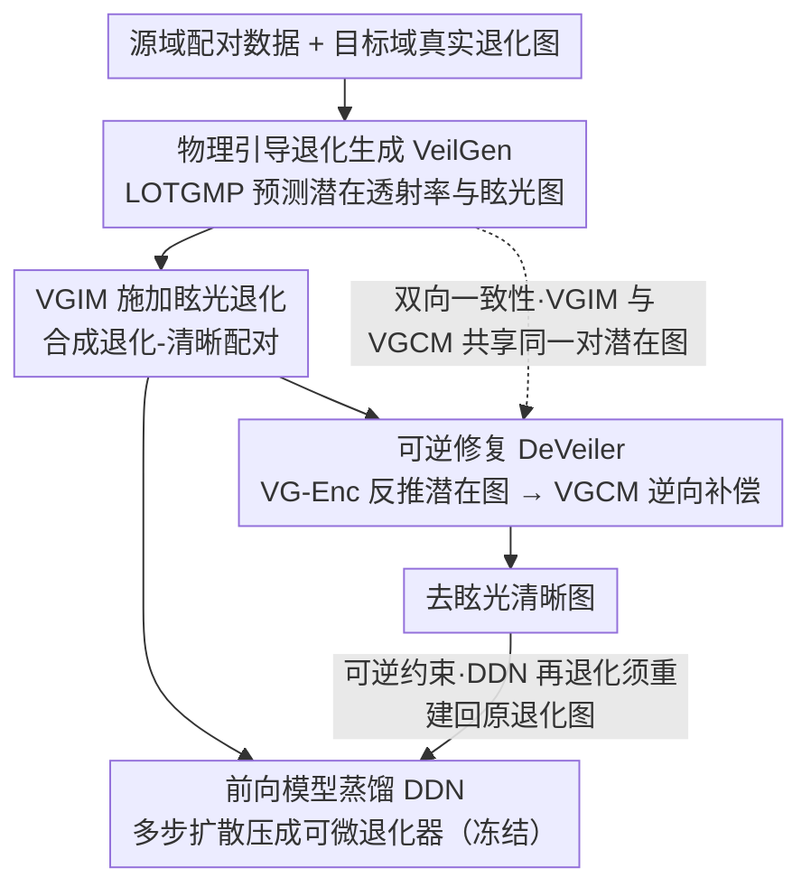

# Learning Latent Transmission and Glare Maps for Lens Veiling Glare Removal

**会议**: CVPR 2026  
**arXiv**: [2511.17353](https://arxiv.org/abs/2511.17353)  
**代码**: [GitHub](https://github.com/XiaolongQian/DeVeiler)  
**领域**: 图像生成  
**关键词**: veiling glare removal, 简化光学系统, Stable Diffusion, 物理引导生成, 可逆修复

## 一句话总结

提出 VeilGen + DeVeiler 框架，通过物理引导的 Stable Diffusion 生成模型学习潜在透射率和眩光图以合成逼真的复合退化训练数据，并用可逆约束训练修复网络，实现简化光学系统中像差与雾化眩光的联合去除。

## 背景与动机

1. **简化光学系统的复合退化**：单透镜和超表面透镜等紧凑光学系统不仅存在像差模糊，还因非理想光学表面和镀膜产生雾化眩光（veiling glare），导致全局对比度下降。现有计算像差校正（CAC）方法无法处理这种复合退化。
2. **缺乏真实配对数据**：物理精确的眩光模拟需要完整光机模型和非序列光线追踪，计算代价极高，无法大规模生成训练数据。
3. **现有方法不适用**：去雾方法基于大气散射模型（深度相关），与镜头内部散射（深度无关）不兼容；镜头光斑去除方法针对结构化伪影（亮斑/条纹），无法处理弥散性的雾化眩光。
4. **生成模型的黑箱问题**：现有基于 SD 的退化生成方法缺乏物理约束，生成质量不稳定，且难以为修复网络提供有意义的引导信号。

## 方法详解

### 整体框架

这篇论文要解决的是简化光学系统（单透镜、超表面透镜）成像里像差模糊和雾化眩光叠加的复合退化，而最大的拦路虎是拿不到真实的退化-清晰配对数据。作者的破局思路是：既然无法采集真数据，就让一个带物理约束的生成器去"造"出物理上站得住脚的退化图，再用这些合成对训练修复网络。整条管线分三步串起来——先用 VeilGen 在 Stable Diffusion 里嵌入散射物理量生成配对数据，再把它的前向退化过程蒸馏成一个轻量可微的退化器 DDN，最后训练修复网络 DeVeiler，并用冻结的 DDN 把"修复"和"退化"约束成一对互逆操作。

整个建模建立在把退化拆成像差与眩光两步的物理模型上：

$$I_{de}^{p} = \underbrace{(I_c^{p} \otimes K^{p})}_{I_{ab}^{p}} \cdot T^{p} + I_g^{p}$$

其中 $K^p$ 是局部点扩散函数（PSF），$T^p$ 是描述对比度衰减的透射率图，$I_g^p$ 是眩光图。修复目标就是从观测 $I_{de}$ 反推清晰图 $I_c$，这是一个高度病态的盲反问题——而 $T^p$ 和 $I_g^p$ 这两张图正是全篇方法围绕着学习和复用的核心物理量。

### 关键设计

**1. 物理引导的退化生成（LOTGMP + VGIM）：让扩散模型造出的退化带物理意义**

现有基于 SD 的退化生成是黑箱，质量不稳定，也给不了修复网络有意义的引导。作者的做法是把上面退化模型里的透射率和眩光显式塞进扩散过程。具体由两个模块完成：LOTGMP（潜在光学透射率与眩光图预测器）从噪声潜变量 $z_t$、目标退化潜变量 $z_{de}^{\mathcal{T}}$ 和时间步 $t$ 预测出潜在图 $c_{vg} = (z_{trans}, z_{glare})$，对应透射率和眩光在潜空间的表示；VGIM（雾化眩光施加模块）再拿这对潜在图去调制特征，模拟前向退化。训练上用混合策略：源域（有配对但无眩光的屏幕采集数据）直接固定映射为 $(\mathbf{1}, \mathbf{0})$（即不衰减、无眩光），目标域（有复合退化但无配对的真实数据）则交给 LOTGMP 去预测，两个域按比例加权，这样生成器既学到清晰-退化的像差对应关系，又把真实眩光的统计分布迁移进来。

**2. 前向模型蒸馏（DDN）：把多步扩散压成可微的轻量退化器**

VeilGen 是多步扩散采样，直接放进修复网络的训练循环里算一次前向代价太高，根本跑不动。作者把它蒸馏成一个轻量的蒸馏退化网络 DDN，让 DDN 在相同输入 $(I_c, c_{vg})$ 下逼近 VeilGen 的退化输出。蒸馏完成后 DDN 被冻结，在第三阶段充当一个便宜、可微、单次前向的退化算子——这一步是后面可逆约束能落地的前提：没有它，"再退化一次去对齐"这个监督就无法在训练中高频调用。

**3. 可逆修复（VG-Enc + VGCM + 可逆约束）：把去眩光学成退化的逆运算**

修复网络 DeVeiler 不走黑箱统计映射，而是显式学退化的逆过程。它用 VG-Enc（眩光编码器）从退化图像反推潜在图 $\hat{c}_{vg}$，再用 VGCM（眩光补偿模块）拿这对潜在图做逆向特征调制——VGCM 和生成端的 VGIM 在结构上刻意做成对称的一施一补。关键的可逆性约束是：拿修复出的清晰图 $I_c$ 和预测潜在图 $\hat{c}_{vg}$ 喂给冻结的 DDN 再退化一次，要求结果能重建回原始的观测退化图 $I_{de}$。这条循环把"修复"和"退化"锁成互逆的一对，迫使网络真正理解退化是怎么发生的，而不是记住一个从退化到清晰的统计捷径；副产物是 $\hat{c}_{vg}$ 获得了物理可解释性，低透射率区和高眩光区能在特征图里可视化验证出来。

**4. 双向一致性：潜在图必须同时走正向和逆向才有效**

这是作者从实验里挖出的一个反直觉点。LOTGMP 预测的潜在图如果只用在单边（只在修复端 VGCM 用，或只做拼接），不仅没收益反而掉点，原因是生成端和修复端存在域不匹配，单向使用让潜在图的语义对不齐。只有让同一对潜在图在生成端（VGIM）施加退化、在修复端（VGCM）补偿退化都参与，VGIM/VGCM 的对称结构才能把两端的特征语义校准到一致，物理先验才真正被用上——消融里双向相比单向带来 +0.82 dB 的提升正是这个机制的直接证据。

### 损失函数 / 训练策略

VeilGen 的生成损失按域加权：

$$\mathcal{L}_{gen} = p \, \mathcal{L}_{\mathcal{S}} + (1-p) \, \mathcal{L}_{\mathcal{T}}$$

其中 $p = 0.3$ 平衡源域 $\mathcal{S}$ 与目标域 $\mathcal{T}$ 的贡献。DDN 用 L1 蒸馏对齐 VeilGen 的退化输出 $\mathcal{L}_{distill} = \|DDN(I_c, c_{vg}) - VeilGen(I_c, c_{vg})\|_1$。修复端的可逆性约束为 $\mathcal{L}_{rev} = \|DDN(I_c, \hat{c}_{vg}) - I_{de}\|_1$，与重建损失合成总目标 $\mathcal{L}_{total} = \mathcal{L}_{rec} + \lambda_{rev} \mathcal{L}_{rev}$。DeVeiler 本身分两阶段训练：Phase I 只在源域预训练，先建立像差校正的基线能力；Phase II 在源域加 VeilGen 合成对的混合数据上微调，既引入复合退化又防止只在合成数据上过拟合。

## 实验结果

### Screen-Compound 域全参考评估

| 方法 | 类型 | Screen-SL PSNR↑ | SSIM↑ | LPIPS↓ | Screen-MRL PSNR↑ | SSIM↑ | LPIPS↓ |
|------|------|---------|-------|--------|----------|-------|--------|
| SwinIR | 单退化 | 18.18 | 0.686 | 0.298 | 19.34 | 0.722 | 0.354 |
| NAFNet | 单退化 | 18.75 | 0.684 | 0.363 | 18.91 | 0.723 | 0.377 |
| DiffBIR | 单退化 | 17.95 | 0.621 | 0.398 | 18.70 | 0.625 | 0.412 |
| SwinIR+Flare7K++ | 级联 | 21.67 | 0.723 | 0.297 | 20.74 | 0.745 | 0.336 |
| QDMR | 域适应 | 18.45 | 0.681 | 0.291 | 20.67 | 0.725 | 0.315 |
| **DeVeiler (Ours)** | **域适应** | **22.38** | **0.729** | **0.261** | **21.57** | **0.746** | **0.301** |

DeVeiler 相比最强竞争方法（SwinIR+Flare7K++）在 Screen-SL 上 PSNR 提升 +0.71 dB，LPIPS 改善 12.1%。

### Realworld-Compound 域无参考评估

| 方法 | Real-SL (CLIPIQA↑/Q-Align↑/NIQE↓) | Real-MRL (CLIPIQA↑/Q-Align↑/NIQE↓) |
|------|-------------------------------------|--------------------------------------|
| SwinIR | 0.424 / 3.518 / 5.710 | 0.374 / 3.191 / 6.696 |
| SwinIR+DiffDehaze | 0.573 / 3.679 / 6.141 | 0.437 / 3.542 / 5.230 |
| QDMR | 0.405 / 3.864 / 4.773 | 0.376 / 3.337 / 5.509 |
| **DeVeiler (Ours)** | **0.607** / **3.987** / **4.448** | **0.440** / **3.586** / **5.296** |

在无 GT 的真实场景中，DeVeiler 在大部分指标上保持领先，验证了泛化能力。

### 消融实验

| 配置 | PSNR↑ | SSIM↑ | LPIPS↓ | 说明 |
|------|-------|-------|--------|------|
| 无 LOTGMP | 20.82 | 0.708 | 0.273 | 无物理先验引导 |
| LOTGMP 无 SD 先验 | 21.39 | 0.708 | 0.268 | 缺少扩散模型上下文 |
| 完整 VeilGen | 21.56 | 0.712 | 0.264 | SD 先验对生成质量至关重要 |
| 单向 VGCM | 20.83 | 0.712 | 0.264 | 域不匹配导致无增益 |
| **双向 VGIM/VGCM** | **22.38** | **0.729** | **0.261** | 可逆约束带来 +0.82 dB |

关键发现：单向使用潜在图（Concat 或仅 VGCM）不仅无益甚至有害，只有通过 VGIM/VGCM 的双向一致性约束才能有效利用物理先验。

## 亮点

- **物理引导而非黑箱生成**：将散射模型的透射率和眩光图显式嵌入 SD 生成过程，使合成数据具有物理意义
- **可逆性约束的精巧设计**：通过 VGIM/VGCM 的结构对称和冻结 DDN 的循环一致性，将修复与退化建模统一为互逆操作
- **可解释性强**：VGCM 内部特征图可可视化验证低透射率/高眩光区域的定位与抑制
- **实用性高**：在真实单透镜和超表面混合透镜两种系统上验证，覆盖 AR/VR 和移动摄影应用场景
- **高效推理**：相比 DiffBIR (66s) 或 DiffDehaze (92s)，DeVeiler 推理延迟低一个数量级

## 局限性

- **依赖源域配对数据**：框架仍需屏幕采集的像差-清晰配对数据作为源域，完全无监督场景不适用
- **退化耦合假设**：将像差和眩光建模为顺序退化，实际物理过程可能更复杂（如光学串扰）
- **数据规模有限**：Screen-Compound 测试集仅 42/25 张图，统计显著性有待更大规模验证
- **蒸馏损失**：DDN 蒸馏 VeilGen 不可避免地引入近似误差，对极端眩光场景的覆盖度存疑

## 评分

- ⭐⭐⭐⭐ 新颖性：将物理散射模型嵌入扩散生成 + 可逆修复的双向设计思路新颖
- ⭐⭐⭐⭐ 实用性：解决 AR/VR 和移动摄影中的真实痛点，推理速度可接受
- ⭐⭐⭐ 实验充分度：两种光学系统、多类基线对比充分，但测试集规模偏小
- ⭐⭐⭐⭐ 写作质量：问题定义清晰，三阶段框架逻辑连贯，消融实验有说服力

<!-- RELATED:START -->

## 相关论文

- [\[CVPR 2026\] Learning Latent Proxies for Controllable Single-Image Relighting](learning_latent_proxies_for_controllable_single-image_relighting.md)
- [\[CVPR 2026\] Precise Object and Effect Removal with Adaptive Target-Aware Attention](precise_object_and_effect_removal_with_adaptive_target-aware_attention.md)
- [\[CVPR 2026\] Object-WIPER: Training-Free Object and Associated Effect Removal in Videos](object-wiper_training-free_object_and_associated_effect_removal_in_videos.md)
- [\[CVPR 2026\] EffectErase: Joint Video Object Removal and Insertion for High-Quality Effect Erasing](effecterase_joint_video_object_removal_and_insertion_for_high-quality_effect_era.md)
- [\[CVPR 2026\] Towards Robust Content Watermarking Against Removal and Forgery Attacks](towards_robust_content_watermarking_against_removal_and_forgery_attacks.md)

<!-- RELATED:END -->
