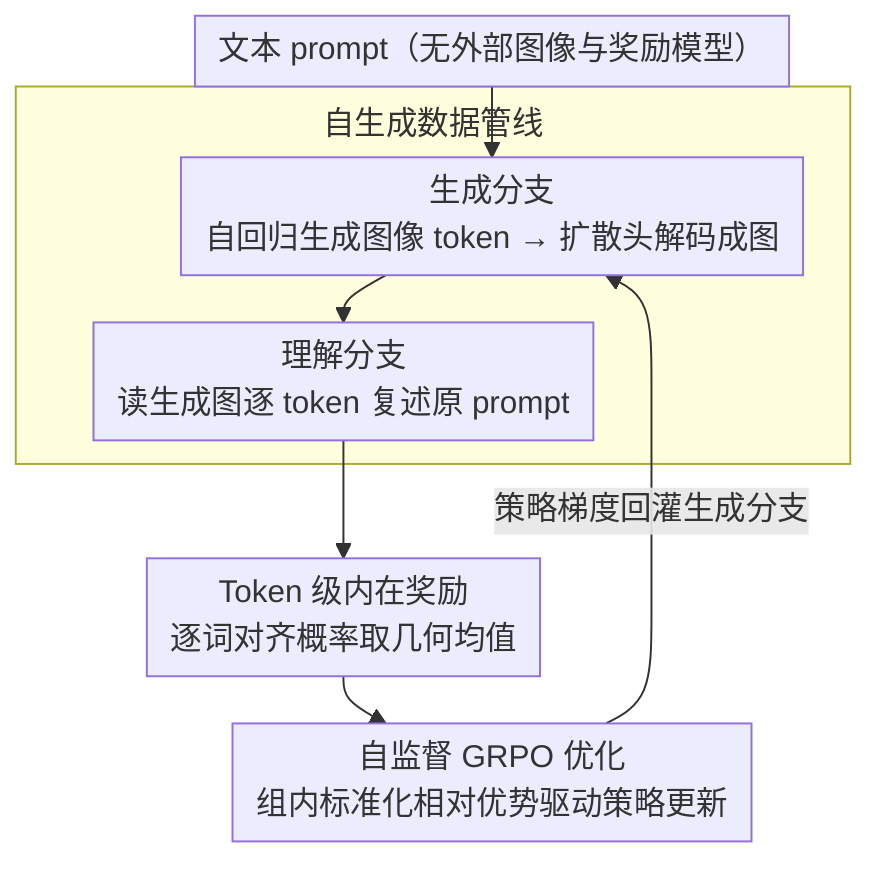

# Learning to Generate via Understanding: Understanding-Driven Intrinsic Rewarding for Unified Multimodal Models

**会议**: CVPR 2026  
**arXiv**: [2603.06043](https://arxiv.org/abs/2603.06043)  
**领域**: 图像生成 / 多模态统一模型  
**关键词**: 统一多模态模型, 自监督强化学习, 内在奖励, 文图对齐, GRPO, 理解增强生成

## 一句话总结
提出 GvU，利用统一多模态模型（UMM）自身的视觉理解分支作为内在奖励信号，通过 token 级文图对齐概率构建自监督 RL 框架（基于 GRPO），在无外部监督下迭代提升 T2I 生成质量，GenEval++ 上实现 43.3% 提升，且生成增强反过来促进细粒度理解。

## 研究背景与动机

**领域现状**：UMM 通过共享骨干整合视觉理解和生成，理论上可实现复杂指令跟随的 T2I 任务。代表模型包括 Chameleon、Emu3、Janus、BAGEL、Show-o、BLIP3-o 等。

**核心问题**：UMM 存在严重的**理解-生成能力不对称**——理解分支通常远强于生成分支。联合训练两个任务还会导致负迁移，优化一个任务损害另一个。

**现有方案不足**：传统 RL 用图像级外部奖励（如 ImageReward、PickScore），粒度太粗无法捕捉细微语义，容易 reward hacking，且依赖外部模型。

**核心洞察**：理解（图→文）和生成（文→图）是对偶任务。UMM 已有的强理解能力天然可作"老师"，评估自己生成的图像与文本的对齐度，无需外部监督。

**核心idea**：用 UMM 理解分支计算生成图像对原始 prompt 各 token 的条件概率作为细粒度内在奖励，驱动 GRPO 自监督 RL。

## 方法详解

### 整体框架
GvU 想解决的是 UMM「理解强、生成弱」的不对称：既然同一个模型已经能很好地看懂图，那就让它的理解分支来给自己的生成分支当老师。整条管线在 AR+扩散头混合架构（X-Omni）上闭环运转——只喂一批纯文本 prompt，生成分支先把 prompt 画成图，理解分支再回头读这张图、逐 token 评估它和原 prompt 对得有多齐，对齐概率直接当奖励，最后用 GRPO 把这个奖励回灌给生成分支。整个循环既不碰外部图像数据，也不调外部奖励模型，模型自产数据、自评奖励、自我提升。

### 关键设计

**1. 自生成数据管线：让模型只靠文本 prompt 就把训练闭环转起来**

传统 RL 微调 T2I 要么需要配好的真实图像，要么需要一个外挂奖励模型，数据和监督都来自外部。GvU 把这条链彻底收回模型内部：给定文本 prompt $T = T_{1:L}$，生成分支自回归吐出图像 token $I_{1:L_I}$，再经扩散头解码成像素图；这张图连同一段系统指令喂回理解分支，理解分支按自回归方式去复述原始 prompt，过程中产生的 token 条件概率就是后面要用的对齐信号。因为图像是模型自己生成、奖励也是模型自己算的，所以只要准备一批 prompt 就能跑，不依赖任何外部图像或模型。

**2. Token 级内在奖励：把"对齐"细化到每个词，给生成分支密集可分辨的反馈**

像 ImageReward、PickScore 这类图像级奖励只给整张图一个分，粒度太粗，既看不出"红色"画成了"蓝色"这种细微错误，也容易被 reward hacking 钻空子。GvU 改成在理解分支上逐 token 算条件概率：对原 prompt 里第 $j$ 个词，

$$p_\theta(T_j \mid \mathbf{X}_{j-1}) = \text{Softmax}\big(\text{Logits}_\theta(\mathbf{X}_{j-1})[T_j]\big)$$

再把整句的对齐度取几何均值，消掉句子长短带来的偏差：

$$P(T_{1:L} \mid I) = \Big(\prod_{j=1}^{L} p_\theta(T_j \mid \mathbf{X}_{j-1})\Big)^{1/L}$$

这样得到的奖励是密集的——颜色、数量、位置每个语义点都各自落在对应 token 的概率上，哪个细节没画对，哪个 token 的概率就低，反馈精确到词而不是整图。

**3. 自监督 GRPO 优化：用组内相对奖励驱动策略更新，省掉价值网络和外部奖励模型**

有了 token 级奖励还得有个不依赖外部监督的优化器。GvU 用 GRPO：对每个 prompt 采样 $G$ 条生成轨迹，每条拿到自己的对齐奖励 $R_i = P(T \mid I_i)$，然后在组内做标准化得到相对优势

$$A_i = \frac{R_i - \text{mean}(\{R_i\})}{\text{std}(\{R_i\})}$$

谁比组内平均画得齐就被强化，谁更差就被压低。这样只用一组样本的相对好坏就能估优势，既不用单独训练一个价值函数，也不用挂外部奖励模型，整套自监督闭环成立。训练侧用 LoRA 微调、50k 文本 prompt，开销可控。

### 损失函数
最终最大化带裁剪和 KL 约束的 GRPO 目标，KL 项把策略拉住、防止偏离参考模型太远：

$$\mathcal{J}_{GRPO}(\theta) = \mathbb{E}\left[\frac{1}{G}\sum_{i=1}^{G}\min\left(r_i(\theta)A_i, \text{clip}(r_i(\theta),1-\epsilon,1+\epsilon)A_i\right) - \beta D_{KL}(\pi_\theta \| \pi_{ref})\right]$$

## 实验关键数据

### 主实验：GenEval 基准

| 模型 | 单物体↑ | 双物体↑ | 计数↑ | 颜色↑ | 位置↑ | 属性绑定↑ | Overall↑ |
|------|---------|---------|-------|-------|-------|-----------|----------|
| FLUX.1-dev | 0.99 | 0.81 | 0.79 | 0.74 | 0.20 | 0.47 | 0.67 |
| Janus-Pro | 0.99 | 0.89 | 0.59 | 0.90 | 0.79 | 0.66 | 0.80 |
| BAGEL | 0.99 | 0.94 | 0.80 | 0.87 | 0.64 | 0.63 | 0.81 |
| X-Omni (base) | 1.00 | 0.94 | 0.60 | 0.85 | 0.40 | 0.26 | 0.68 |
| **GvU** | 1.00 | 0.96 | 0.74 | **0.92** | 0.61 | 0.58 | **0.81** |
| **GvU†** | **1.00** | **0.97** | 0.80 | **0.93** | 0.68 | 0.65 | **0.84** |

### 主实验：GenEval++ 基准

| 模型 | Color↑ | Count↑ | Color/Pos↑ | Pos/Count↑ | Pos/Size↑ | Multi-Count↑ | Overall↑ |
|------|--------|--------|-----------|-----------|-----------|-------------|----------|
| FLUX.1-dev | 0.350 | 0.625 | 0.275 | 0.200 | 0.375 | 0.225 | 0.314 |
| BAGEL | 0.325 | 0.600 | 0.325 | 0.250 | 0.475 | 0.375 | 0.371 |
| X-Omni (base) | 0.225 | 0.500 | 0.325 | 0.150 | 0.475 | 0.275 | 0.282 |
| **GvU** | 0.300 | 0.400 | **0.575** | **0.525** | **0.675** | 0.400 | **0.404** |

### 消融：理解能力同步提升（MMT-Bench 细粒度子任务）

| 模型 | Overall | 视觉识别↑ | 视觉幻觉↑ | 幻觉检测↑ | 常识推理↑ | 学科知识↑ |
|------|---------|----------|----------|----------|----------|----------|
| Base | 49.76 | 51.21 | 45.57 | 66.25 | 70.0 | 38.46 |
| **GvU** | **49.92** | **52.58** | **50.63** | **68.75** | **75.0** | **42.31** |

### 消融：弱基座 vs 正常基座

| 基座 | GenEval 提升 | 差距大小 |
|------|-------------|----------|
| 正常基座 | 0.68→0.81 (+19.1%) | 较小 |
| **弱基座** | **0.21→0.50 (+138.1%)** | **较大** |

### 关键发现
- GenEval++ 上 43.3% 提升（0.282→0.404），混合类别（pos/count、pos/size）提升最显著
- 内在奖励在 RL 训练中**持续稳定增长**，呈累积效应而非突变
- 增强生成**反过来促进细粒度理解**：视觉幻觉检测 +5.06，常识推理 +5.0
- 理解-生成差距越大的弱基座获益越多（+138.1% vs +19.1%），验证"理解指导生成"机制
- 移除 prompt 中的计数/颜色/区域词后奖励显著下降，验证内在奖励对细粒度语义的敏感性

## 亮点与洞察
- **自教学范式**：UMM 理解分支做"老师"、生成分支做"学生"，无需外部奖励模型
- **Token 级奖励**：比图像级奖励粒度细得多，可区分颜色/数量/位置等细微语义
- **理解-生成协同增强**：首次实证表明 UMM 中增强生成可反向改善细粒度理解
- **通用框架**：适用于任何 AR+扩散头混合架构 UMM

## 局限性
- 理解能力提升幅度仍较小（MMT-Bench 总分仅 +0.16），协同增强有待进一步探索
- 仅在 X-Omni 架构验证，需更多 UMM 架构泛化实验
- 训练需要每个 prompt 生成多个样本（GRPO 的 G 组采样），计算开销较大

## 评分
- 新颖性: ⭐⭐⭐⭐⭐ 首次提出 token 级内在奖励 + 自监督 RL 桥接 UMM 理解-生成鸿沟
- 实验充分度: ⭐⭐⭐⭐ GenEval/GenEval++/DPG-Bench + 理解基准 + 弱基座消融
- 写作质量: ⭐⭐⭐⭐ 公式推导清晰动机充分
- 实用价值: ⭐⭐⭐⭐ 开源 RL 框架 + 无需额外数据标注

<!-- RELATED:START -->

## 相关论文

- [\[NeurIPS 2025\] Co-Reinforcement Learning for Unified Multimodal Understanding and Generation](../../NeurIPS2025/image_generation/coreinforcement_learning_for_unified_multimodal_understandin.md)
- [\[CVPR 2026\] Enhancing Spatial Understanding in Image Generation via Reward Modeling](enhancing_spatial_understanding_in_image_generation_via_reward_modeling.md)
- [\[CVPR 2026\] Spatial-SSRL: Enhancing Spatial Understanding via Self-Supervised Reinforcement Learning](spatial-ssrl_enhancing_spatial_understanding_via_self-supervised_reinforcement_l.md)
- [\[CVPR 2026\] MICON-Bench: Benchmarking and Enhancing Multi-Image Context Image Generation in Unified Multimodal Models](micon-bench_benchmarking_and_enhancing_multi-image_context_image_generation_in_u.md)
- [\[CVPR 2026\] PosterIQ: A Design Perspective Benchmark for Poster Understanding and Generation](posteriq_a_design_perspective_benchmark_for_poster_understanding_and_generation.md)

<!-- RELATED:END -->
