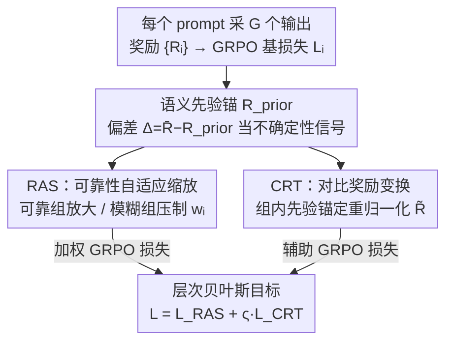

# Learning What to Trust: Bayesian Prior-Guided Optimization for Visual Generation

**会议**: CVPR 2026  
**论文**: [CVF Open Access](https://openaccess.thecvf.com/content/CVPR2026/html/Liu_Learning_What_to_Trust_Bayesian_Prior-Guided_Optimization_for_Visual_Generation_CVPR_2026_paper.html)  
**代码**: 待确认  
**领域**: 图像/视频生成 / 强化学习后训练  
**关键词**: GRPO, 奖励不确定性, 贝叶斯先验, 视觉生成, 后训练对齐

## 一句话总结
BPGO 给视觉生成的 GRPO 后训练加了一个"语义先验锚"，用观测奖励与先验的偏差当不确定性信号，在组间做贝叶斯信任分配（可靠组放大、模糊组压制）、在组内做先验锚定的奖励重归一化（拉开自信偏差、压缩模糊分数），在文/图、文/视频、图/视频生成上比标准 GRPO 和 DanceGRPO 收敛更快、语义对齐更强。

## 研究背景与动机

**领域现状**：文生图/视频近年靠扩散架构 + RL 后训练（与人类偏好/感知反馈对齐）大幅进步。其中 GRPO（Group Relative Policy Optimization）因为不需要单独的价值网络、靠"组内归一化奖励"当 baseline、省约 50% 显存，成了视觉生成后训练的轻量主力，DanceGRPO 把它推广到扩散/整流流、文图/文视频/图视频多范式。

**现有痛点**：尽管视觉质量提升了，**文本—视觉的语义对齐**仍是顽疾——模型常生成"看着合理但语义对不上"的结果。根因是文本—视觉对应**天然多对多**：同一段视频可以有多种语义等价但措辞不同的描述（"做体操旋转"/"转身"/"转两圈"），同一句 prompt 也能对应运动轨迹、风格、机位都不同却都满足描述的多个视频。

**核心矛盾**：这种多对多关系让奖励模型给出的信号**不确定、弱判别**。而现有 GRPO 方法把奖励当**一致的标量反馈**、假设所有奖励同等可靠，结果是：可靠的、更有用的奖励被**低估利用**，而噪声奖励却被**过度拟合**——好信号没吃够，坏信号反而带偏。

**本文目标**：在 GRPO 框架内显式建模奖励的不确定性，让优化"学会该信什么、该信多强"——既要在组间分配信任，又要在组内提升可判别性。

**切入角度**：与其平等信任所有 prompt 组，不如引入一个**语义先验锚** $R_{\text{prior}}$（代表"语义清晰、典型 prompt 的期望奖励"），用"观测奖励相对先验的偏差" $\Delta_i = \bar R_i - R_{\text{prior}}$ 当**先验—数据冲突**度量：正偏差=可靠、对齐好的组，负偏差=模糊或奖励模型不确定。这正是经验贝叶斯/收缩（shrinkage）的思路——偏离先验即噪声信号，据此调制每个观测的可信度，**无需额外训练一个不确定性估计器**。

**核心 idea**：用一个语义先验锚把 GRPO 改造成贝叶斯先验引导的层次优化——组级调"信任"、组内调"锐度"。

## 方法详解

### 整体框架
BPGO 是 GRPO 的一个改造版（KL 项按近期研究略去），核心是在原 GRPO 损失外，并联两个互补模块：**Reliability-Adaptive Scaling（RAS，可靠性自适应缩放）** 按组级奖励可靠性重新分配学习强度（宏观信任），**Contrastive Reward Transformation（CRT，对比奖励变换）** 在组内把奖励相对先验拉伸以增强可判别性（微观对比）。

整条流程：对每个 prompt 采 $G$ 个候选输出、算奖励 $\{R_i^j\}$ → 用标准 GRPO 算基损失 $L_i$ → RAS 算组权重 $w_i$ 把"已掌握"的可靠组梯度放大、"挣扎"的模糊组梯度衰减 → CRT 把奖励重归一化成辅助奖励 $\tilde R_i^j$、再过一遍 GRPO 算辅助损失 $L_{\text{CRT}}$ → 两者加权合成总损失。这构成一个层次化的贝叶斯后验更新：RAS 调组间后验信任、CRT 调组内后验锐度。

### 关键设计

**1. 语义先验锚与偏差信号：用"偏离先验"当不确定性，免训估计器**

痛点是 GRPO 把所有奖励当同等可靠，无法分辨哪个奖励该信。BPGO 给每个样本定义一个语义先验 $R_{\text{prior}}$，代表语义清晰典型 prompt 的期望奖励（可用校准数据或训练中的移动平均估计，不同任务用不同先验）。对观测奖励 $\bar R_i$，偏差 $\Delta_i = \bar R_i - R_{\text{prior}}$ 量化"观测质量相对先验的偏离"：正偏差→可靠、对齐好；负偏差→模糊或奖励模型不确定。关键巧思是**不另设不确定性估计器**，直接把这个"先验—数据冲突量"当作经验贝叶斯/收缩意义下的可信度信号——偏离先验即噪声，据此调制后续更新。它在组级做位置偏置校正（对应贝叶斯后验均值调整），在个体级做精度调制（奖励离先验越远越被强化区分）。

**2. Reliability-Adaptive Scaling（RAS）：组间贝叶斯信任分配**

针对"可靠组吃不够、噪声组带偏"的痛点，RAS 用一个平滑可微的信任函数按组级偏差重分配学习强度，而非离散分段规则：

$$w_i = f(\bar R_i - R_{\text{prior}}) = 1 + \alpha\left[2\sigma\big(k(\bar R_i - R_{\text{prior}})\big) - 1\right]$$

其中 $\sigma(\cdot)$ 是 sigmoid，$\alpha$ 控缩放幅度、$k$ 控转变锐度。当 $\bar R_i > R_{\text{prior}}$ 时 $w_i>1$ 放大高置信组的梯度；当 $\bar R_i < R_{\text{prior}}$ 时 $w_i<1$ 软性削弱不确定组。重加权损失 $L_{\text{RAS}}^{(i)} = w_i^{\text{group}}\cdot L_{\text{GRPO}}^{(i)}$。这个连续公式行为上像一次**贝叶斯更新增益**——动态决定后验策略该多大程度依赖当前组的证据，并自然连到课程学习：从"已掌握"组拿放大梯度、从"挣扎"组拿衰减梯度，从而把学习容量集中到可信的语义区域、避免过拟合噪声/模糊 prompt，提升样本效率。

**3. Contrastive Reward Transformation（CRT）：组内先验锚定的奖励重归一化**

痛点是组内原始奖励差异往往很小，而 GRPO 算优势时的标准化（在高斯假设下）会把这些相对差异压平、反映不出真实信号。CRT 在组内把奖励相对先验**几何拉伸**，放大自信偏离先验的样本、压缩模糊的：

$$\tilde R_i^j = g(R_i^j - R_{\text{prior}}) = \left(\alpha\,(R_i^j - R_{\text{prior}}) + \mathbb 1\{R_i^j > R_{\text{prior}}\}\right)\exp(R_i^j)$$

其中 $\alpha>0$ 是对比因子，指示函数 $\mathbb 1\{\cdot\}$ 给超过先验的样本额外加权。用变换后的辅助奖励 $\{\tilde R_i^j\}$ 再过一遍 GRPO 得到辅助损失 $L_{\text{CRT}}^{(i)} = L_{\text{GRPO}}(\{\tilde R_i^j\})$，加进原损失 $L_{\text{sample}}^{(i)} = L_{\text{GRPO}}(\{R_i^j\}) + \varsigma\cdot L_{\text{CRT}}^{(i)}$。这样在不改变排序的前提下锐化了组内可判别性，让策略梯度信号更强。⚠️ 公式 (4) 中符号在缓存里被 OCR 干扰（如 $\alpha$/$\lambda$ 混用、$\varsigma$ 等），具体形式以原文为准。

**4. 层次化总目标：宏观信任 + 微观锐度的合一**

把 RAS 与 CRT 合起来，在 $N$ 个 prompt 组上的完整目标为：

$$L_{\text{BPGO}} = \frac{1}{N}\sum_{i=1}^{N} w_i^{\text{group}}\big[L_{\text{GRPO}}(\{R_i^j\})\big] + \varsigma\,L_{\text{CRT}}^{(i)}$$

这构成层次贝叶斯先验引导的策略更新：RAS 调跨组后验信任（宏观可靠性）、CRT 调组内后验锐度（微观对比）。直观说，模型先决定"哪些组值得多学"，再在值得学的组里"把好坏样本的区分拉开"——既减少组统计的不确定性，又增强策略梯度的信号强度。

### 损失函数 / 训练策略
基于 GRPO（略去 KL 项）。视频生成组大小 $G=8$、图像生成 $G=12$。先验按任务取：T2V 用 SFT 模型生成的奖励当先验做稳定锚定；I2V（大模型 Wan2.2-14B）用首帧的文本对齐度当自然 baseline；T2I 用组奖励的移动平均当先验、累积历史并平滑波动。完整流程见原文 Algorithm 1（BRPO）。

## 实验关键数据

### 主实验
在三类生成任务上评测：T2V（Wan2.1-1.3B）、I2V（Wan2.2-14B MoE）、T2I（FLUX），均从各自 SFT 检查点初始化。T2V/I2V 用 VideoCLIP-XL 当奖励，VideoAlign（VA）和 Qwen3-VL-Embedding 当指标；T2I 用 HPSv2 当奖励，PickScore、ImageReward 当附加指标。

| 任务 | 方法 | VideoClipXL ↑ | VA-TA ↑ | VA-overall ↑ | Qwen3-VL-Emb ↑ |
|------|------|---------------|---------|--------------|----------------|
| T2V | Wan2.1（base） | 2.6563 | 1.0638 | 0.0939 | 0.6741 |
| T2V | GRPO† | 2.6714 | 0.8984 | -0.5411 | 0.6722 |
| T2V | BPGO（Ours） | 2.6788 | 1.1193 | -0.0478 | 0.6754 |
| I2V | Wan2.2（base） | 2.6726 | 1.0633 | -0.7623 | 0.6741 |
| I2V | GRPO† | ⚠️ 2.0713 | 0.2307 | -1.8932 | 0.6885 |
| I2V | BPGO（Ours） | 2.6855 | 1.0589 | -1.0491 | 0.6890 |

注：†为作者自实现的 DanceGRPO/GRPO。VA = VideoAlign，VA-TA 为文本对齐分项、VA-overall 为综合分（含模糊奖励惩罚）。⚠️ I2V 行 GRPO† 的 VideoClipXL=2.0713 明显低于 base，疑似实现/OCR 异常，具体以原文为准。

| 任务 | 方法 | HPSv2 ↑ | PickScore ↑ | ImageReward ↑ |
|------|------|---------|-------------|---------------|
| T2I | FLUX（base） | 0.2398 | 0.2270 | 1.1482 |
| T2I | GRPO† | 0.2564 | 0.2242 | 1.0607 |
| T2I | BPGO（Ours） | 0.2434 | 0.2288 | 1.2136 |

T2V 上 VA-TA 从 0.8984 升到 1.1193（+24.6%），VA-overall 从 -0.5411 升到 -0.0478；T2I 上 PickScore（0.2242→0.2288）与 ImageReward（1.0607→1.2136）双升。

### 消融实验

**RAS / CRT 拆解（Tab. 3）**：

| 任务 | 配置 | VideoClipXL ↑ | VA-TA ↑ | VA-overall ↑ |
|------|------|---------------|---------|--------------|
| T2V | 仅 RAS | 2.7042 | 1.2327 | -0.4838 |
| T2V | 仅 CRT | 2.6844 | 1.1751 | 0.0876 |
| T2V | RAS+CRT | 2.6788 | 1.1193 | -0.0478 |
| I2V | 仅 RAS | 2.6681 | 1.0361 | -0.8429 |
| I2V | 仅 CRT | ⚠️ 2.0682 | 0.2162 | -1.6573 |
| I2V | RAS+CRT | 2.6855 | 1.0589 | -1.0491 |

**缩放幅度 $\alpha$ 敏感性（T2V，Tab. 4）**：

| $\alpha$ | VideoClipXL ↑ | VA-TA ↑ | VA-overall ↑ |
|------|---------------|---------|--------------|
| 0.1 | 2.6834 | 1.1866 | 0.0386 |
| 0.5 | 2.7042 | 1.2327 | -0.4838 |
| 0.7 | 2.6678 | 1.1161 | 0.0979 |
| 0.9 | 2.6583 | 1.0334 | -0.0120 |

### 关键发现
- **BPGO 全面优于 base 与 GRPO 后训练**：在文本—视觉对应不确定的场景里有效增强奖励可判别性，T2V 的 VA-TA 提升尤其明显（+24.6%）。
- **I2V 更难但仍稳**：图视频生成里奖励噪声因复杂运动和长时序被放大，GRPO† 出现明显崩坏（VideoClipXL 掉到 2.07 量级），BPGO 仍能维持稳定的 VA-TA（1.0589），说明它有效阻止了模糊样本主导学习动态。
- **RAS 与 CRT 各有侧重、合用更稳**：单独 RAS 在部分指标上数值更高（如 T2V RAS 的 VideoClipXL=2.7042），但 RAS+CRT 在 I2V 这类高噪声场景下更稳健；$\alpha\approx0.5$ 时综合表现最佳。
- **收敛更快、震荡更小**：奖励曲线显示 GRPO 在噪声连续奖励下收敛慢、震荡大，BPGO 通过放大自信偏差让更新更一致。
- **人类偏好指标受益最大**：T2I 上 ImageReward（人类偏好对齐）涨幅最显著，而 HPSv2 因高质量区饱和涨幅温和——印证 BPGO 主要在"放大可靠信号、抑制细微噪声"上发力。

## 亮点与洞察
- **用"偏离先验"白嫖不确定性**：不额外训练不确定性估计器，直接拿"观测奖励 − 语义先验"当经验贝叶斯收缩信号，工程上极轻、理论上对齐 shrinkage/empirical Bayes——这个思路可迁到任何"奖励噪声大、需要分辨该信什么"的 RLHF 场景。
- **层次化"宏观信任 + 微观对比"分工干净**：RAS 管组间该不该信、CRT 管组内能不能分清，分别对应后验均值校正与精度调制，两层正交且都只是对奖励/损失的轻量变换，几乎零额外算力。
- **针对视觉生成的"多对多歧义"对症下药**：把文本—视觉对齐固有的多对多歧义识别为 GRPO 失效根因，并给出可落地的修法，比单纯换奖励模型更本质。

## 局限与展望
- **先验选取依赖任务先验知识**：T2V/I2V/T2I 各用不同先验（SFT 奖励 / 首帧对齐 / 移动平均），先验质量直接影响信任分配；先验选错可能把可靠组误判为模糊组。
- **超参敏感**：$\alpha$（缩放幅度）、$k$（锐度）、$\varsigma$（CRT 权重）等需调，Tab. 4 显示 $\alpha$ 对 VA-overall 影响不小，鲁棒区间未充分刻画。
- **指标内卷**：评测高度依赖 VideoCLIP-XL / VideoAlign / HPSv2 等奖励/偏好模型，而这些模型本身就是被批评"不确定"的来源；部分指标（如 VA-overall 为负）解读门槛高。
- ⚠️ 缓存中多处公式与表格数值受 OCR 干扰（如 I2V GRPO† 的异常值、CRT 公式符号），结论方向可信但精确数字以原文为准。

## 相关工作与启发
- **vs 标准 GRPO / DanceGRPO**: 它们把组内归一化奖励当一致可靠的标量反馈、平等对待所有样本；BPGO 引入语义先验锚显式建模奖励不确定性，组间重加权 + 组内重归一化，专治多对多歧义下的"好信号吃不够、噪声学过头"。
- **vs DDPO / DPOK（早期扩散 RL）**: 它们把去噪过程当 MDP 用策略梯度/带 KL 约束优化，但在大规模多样 prompt 集上扩展性差；BPGO 站在 GRPO 的高效后训练之上，专攻奖励可靠性而非采样过程建模。
- **vs LLM 侧的样本重加权 GRPO**: LLM 训练中已发现按组难度/奖励可靠性重加权有效；BPGO 把这一洞见迁到视觉生成，并补上组内对比变换，形成层次化的贝叶斯框架。

## 评分
- 新颖性: ⭐⭐⭐⭐ 把"偏离先验当不确定性 + 层次贝叶斯信任/锐度调制"引入视觉生成 GRPO，角度清晰、免训估计器很巧。
- 实验充分度: ⭐⭐⭐⭐ 覆盖 T2V/I2V/T2I 三任务、RAS/CRT 消融与超参扫描；但缺更多奖励模型/人评的主表呈现，部分数值异常。
- 写作质量: ⭐⭐⭐ 动机与机制讲清，但开放版公式/表格 OCR 噪声重、I2V 异常值未解释，可读性打折。
- 价值: ⭐⭐⭐⭐ 几乎零额外算力即可插进现有 GRPO 后训练，对奖励噪声大的视觉生成对齐有实用价值。

<!-- RELATED:START -->

## 相关论文

- [\[CVPR 2026\] Seeing What Matters: Visual Preference Policy Optimization for Visual Generation](seeing_what_matters_visual_preference_policy_optimization_for_visual_generation.md)
- [\[CVPR 2026\] LoFA: Learning to Predict Personalized Prior for Fast Adaptation of Visual Generative Models](lofa_learning_to_predict_personalized_prior_for_fast_adaptation_of_visual_genera.md)
- [\[ICML 2026\] Bayesian Tensor Decomposition with Diffusion Model Prior](../../ICML2026/image_generation/bayesian_tensor_decomposition_with_diffusion_model_prior.md)
- [\[CVPR 2026\] ThinkGen: Generalized Thinking for Visual Generation](thinkgen_generalized_thinking_for_visual_generation.md)
- [\[CVPR 2026\] Style-GRPO: Semantic-Aware Preference Optimization for Image Style Transfer Guided by Reward Modeling](style-grpo_semantic-aware_preference_optimization_for_image_style_transfer_guide.md)

<!-- RELATED:END -->
