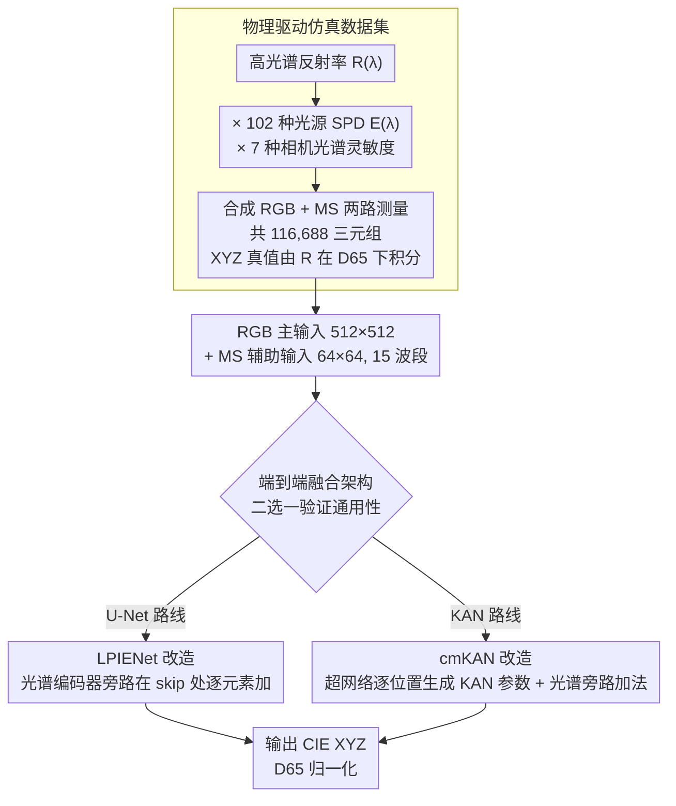

# Leveraging Multispectral Sensors for Color Correction in Mobile Cameras

**会议**: CVPR 2026  
**arXiv**: [2512.08441](https://arxiv.org/abs/2512.08441)  
**代码**: [项目页面](https://lucacogo.github.io/Mobile-Spectral-CC/)  
**领域**: 图像生成/图像处理  
**关键词**: 多光谱传感器, 色彩校正, 自动白平衡, 传感器融合, 移动相机

## 一句话总结

提出一个统一的端到端色彩校正框架，联合融合高分辨率RGB传感器和辅助低分辨率多光谱(MS)传感器的数据，将光源估计、光源补偿和色彩空间转换整合在单一模型中，色彩误差($\Delta E_{00}$)相比纯RGB和MS基线降低高达50%。

## 研究背景与动机

色彩校正是相机成像管线的基础组件，负责将原始传感器测量值转换到设备无关的标准色彩空间（如CIE XYZ）。传统管线采用模块化设计：先进行自动白平衡(AWB，含光源估计+光源补偿)，再进行色彩空间转换(CST)——但各步骤独立处理导致误差逐级传播。

核心矛盾：RGB传感器仅有三个宽波段通道，提供的光谱信息非常有限，无法可靠地解耦表面反射率$R(\lambda)$和光源功率分布$E(\lambda)$——这是一个欠定问题。虽然最近纳米光子学进展使得紧凑型快照式多光谱(MS)传感器成为可能（如15个窄波段通道），但现有方法通常只在光源估计阶段使用MS数据，之后便丢弃，浪费了宝贵的光谱信息。

本文的切入角度：将多光谱信息贯穿整个色彩校正管线的所有阶段（光源估计、光源补偿、CST），而不仅仅用于第一步。核心idea：端到端联合建模RGB+MS双输入，在统一框架中隐式完成全部校正步骤，充分利用光谱信息的约束来提高色彩精度。

## 方法详解

### 整体框架

传统相机管线把色彩校正拆成三步串联——先做自动白平衡（光源估计＋光源补偿），再做色彩空间转换——每一步独立处理，误差会逐级累积；而且即便手机里装了多光谱传感器，现有方案也只用它来估光源，估完就丢，浪费了窄波段里的光谱信息。这篇论文把整条管线压成一个端到端模型：高分辨率RGB图像（$512 \times 512$）作为主输入，低分辨率MS图像（$64 \times 64$，15个窄波段通道）作为辅助输入，两路各自过编码器提特征后融合，直接吐出CIE XYZ色彩空间下、以D65为光源归一化的结果。中间不再有显式的"估光源→补光源→转色彩"分界，全部隐式地学进网络里。为了证明这套融合思路不依赖某个特定网络，作者把它分别嫁接到两种轻量图像到图像架构（LPIENet 和 cmKAN）上验证通用性。

### 关键设计

**1. LPIENet 改造：给 U-Net 接一条光谱旁路，在 skip connection 处汇流**

原始 LPIENet 是一个 3 编码器-2 解码器的 U-Net 风格恢复网络，本身擅长需要空间一致性的逐像素变换。要让它吃进 MS 信息，作者额外加了一条光谱编码器分支：3 个 IRA 块、不做下采样（因为 MS 本来就只有 $64 \times 64$，再降就没东西了），把 MS 特征对齐到 RGB 主干各层的尺度后，在 skip connection 处用逐元素加法注入。之所以选 IRA 块来搭这条旁路，是因为它把 MobileNet 风格的深度可分离卷积和并行的通道/空间注意力捏在一起，能在很低的参数预算下抓住光谱通道间的相关性——标准版只有 220K 参数，小版本压到 60K，仍然适合塞进手机。

**2. cmKAN 改造：用超网络生成空间变化的 KAN 参数，把色彩映射建成平滑曲线**

cmKAN 的思路和 U-Net 不同：它用一个超网络（hypernetwork）逐位置生成 KAN 层的参数，从而对图像不同区域施加不同的非线性色彩变换。KAN 层这里用的是 3 阶 B-spline、网格大小 5——B-spline 天生是分段平滑曲线，刚好契合色彩校正"输入到输出应当连续平滑、不该有跳变"的物理直觉。融合 MS 的方式仍是加法旁路：在生成器里加一条 3 层卷积的光谱编码器，把它的输出在两个特征层级上与光源估计器（IE）的输出逐元素相加。整套 cmKAN 改造下来只有 18K 参数，是全文最紧凑的配置，却拿到了最好的色彩精度。

**3. 物理驱动的仿真数据集：现实里没有 RGB+MS+GT 三元组，就用光谱物理把它造出来**

这套方法要训练，必须有"同一场景下的 RGB 图、MS 图、以及设备无关的 XYZ 真值"三件套，而现实中不存在这样的配对数据——真值要求逐像素的高光谱反射率，普通拍摄拿不到。作者于是从两个公开高光谱数据集的反射率光谱 $R(\lambda)$ 出发，乘上 102 种光源的功率分布 $E(\lambda)$ 和 7 种相机的光谱灵敏度（既有手机也有无反相机），按成像方程合成出 RGB 与 MS 两路测量，共得到 116,688 个三元组；XYZ 真值则直接从反射率在 D65 下积分得到。为了贴近实拍，合成时保留了真实采集噪声；此外还专门做了一个 RGB 与 MS 之间带空间错位的版本，用来检验框架对几何失配的鲁棒性。

### 损失函数 / 训练策略

端到端训练，直接以输出与 D65 下 XYZ 真值之间的 $\Delta E_{00}$ 色差作为优化目标。数据按场景级划分（80% 训练 / 20% 测试，训练集中再留 20% 作验证），避免同一场景的相邻像素同时落进训练和测试造成泄露。对于带空间错位的数据集版本，不必从头重训——只微调那条光谱编码器旁路就能适配新的失配模式。

## 实验关键数据

### 主实验

| 数据集 | 指标 | 本文(最佳cmKAN-light) | 最佳传统方法(FC4) | 提升 |
|--------|------|------|----------|------|
| 对齐-无反相机 | $\Delta E_{00}$ Mean | 1.60 | 3.28 | 减少51.2% |
| 对齐-无反相机 | $\Delta E_{00}$ Median | 1.30 | 2.86 | 减少54.5% |
| 对齐-手机传感器 | $\Delta E_{00}$ Mean | 1.47 | 3.16 | 减少53.5% |
| 对齐-手机传感器 | $\Delta E_{00}$ Median | 1.19 | 2.75 | 减少56.7% |
| 错位-无反相机 | $\Delta E_{00}$ Mean | 1.76 | 3.25 (SpectralFC4) | 减少45.8% |
| 错位-手机传感器 | $\Delta E_{00}$ Mean | 1.62 | 3.19 (SpectralFC4) | 减少49.2% |

### 消融实验

| 配置 | 关键指标($\Delta E_{00}$ Mean) | 说明 |
|------|---------|------|
| cmKAN-light (RGB+MS) | 1.60 | 最佳性能，仅18K参数 |
| LPIENet (RGB+MS) | 1.74 | 220K参数，稍逊cmKAN |
| LPIENet-small (RGB+MS) | 2.09 | 60K参数 |
| SpectralFC4 (传统管线+MS) | 3.25 | 仅用MS估计光源 |
| FC4 (传统管线+RGB) | 3.28 | 纯RGB方法 |
| GW灰度世界假设 | 7.80 | 统计方法，误差最大 |

### 关键发现

- 端到端方法相比传统模块化管线在色彩精度上有质的飞跃：$\Delta E_{00}$从3+降到1.5左右
- cmKAN-light以仅18K参数取得最佳性能，证明了KAN结构在色彩映射任务上的天然优势
- 在错位版本数据集上，仅微调光谱编码器即可保持高性能，显示了框架对几何失配的鲁棒性
- MS数据贯穿全管线的收益远大于仅用于光源估计的方案（SpectralFC4 vs 本文方法）

## 亮点与洞察

- "端到端联合建模取代模块化管线"的思路直接有效，避免了各阶段误差传播
- 极小的模型规模（18K-220K参数）非常适合移动端部署，这恰恰是MS传感器最可能的应用场景
- 通过改造两种不同架构(U-Net和KAN)来展示框架通用性，增强了方法的说服力
- 物理仿真数据集构建方法合理：利用真实高光谱数据+真实相机光谱灵敏度+真实光源SPD

## 局限与展望

- 数据集完全基于仿真，模拟的RGB和MS虽物理驱动但与真实传感器对仍有domain gap
- 仅评估了静态场景，未考虑视频模式下的时序一致性
- MS传感器的空间分辨率（64×64）较低，在精细纹理区域的色彩校正质量可能受限
- 当前仅验证了单一光源场景，多光源混合场景（如室内人工+自然光）未被覆盖
- KAN模型虽然参数少，但推理延迟表现未在论文中充分讨论

## 相关工作与启发

- **vs FC4/ConvMean (传统管线)**: 传统方法将色彩校正分步处理且仅用RGB，误差约$\Delta E_{00}$ 3.2-3.5；本文端到端+MS融合降至1.5左右
- **vs SpectralFC4/SpectralConvMean**: 这些方法虽也使用MS数据但仅用于光源估计阶段，之后丢弃MS信息；本文贯穿全管线利用MS，误差进一步降低约50%
- **vs QU**: 跨相机适配方法，需要微调且性能有限（$\Delta E_{00}$ 5.3-6.4）
- **启发**: 多光谱传感器的成本和体积已能嵌入移动设备，端到端利用其信息比传统分步方法更有前景

## 评分

- 新颖性: ⭐⭐⭐⭐ 端到端RGB+MS融合色彩校正的思路新颖，双架构验证增强说服力
- 实验充分度: ⭐⭐⭐⭐ 多种相机灵敏度、对齐和错位两种设置、大量统计指标
- 写作质量: ⭐⭐⭐⭐ 物理建模清晰，相关工作梳理全面
- 价值: ⭐⭐⭐⭐ 对移动计算摄影中多光谱传感器的应用有实际指导意义

<!-- RELATED:START -->

## 相关论文

- [\[CVPR 2026\] Leveraging Verifier-Based Reinforcement Learning in Image Editing](leveraging_verifier-based_reinforcement_learning_in_image_editing.md)
- [\[CVPR 2026\] GenColorBench: A Color Evaluation Benchmark for Text-to-Image Generation](gencolorbench_a_color_evaluation_benchmark_for_text-to-image_generation.md)
- [\[CVPR 2026\] Too Vivid to Be Real? Benchmarking and Calibrating Generative Color Fidelity](too_vivid_to_be_real_benchmarking_and_calibrating_generative_color_fidelity.md)
- [\[CVPR 2026\] Ar2Can: An Architect and an Artist Leveraging a Canvas for Multi-Human Generation](ar2can_an_architect_and_an_artist_leveraging_a_canvas_for_multi-human_generation.md)
- [\[CVPR 2025\] GCC: Generative Color Constancy via Diffusing a Color Checker](../../CVPR2025/image_generation/gcc_generative_color_constancy_via_diffusing_a_color_checker.md)

<!-- RELATED:END -->
