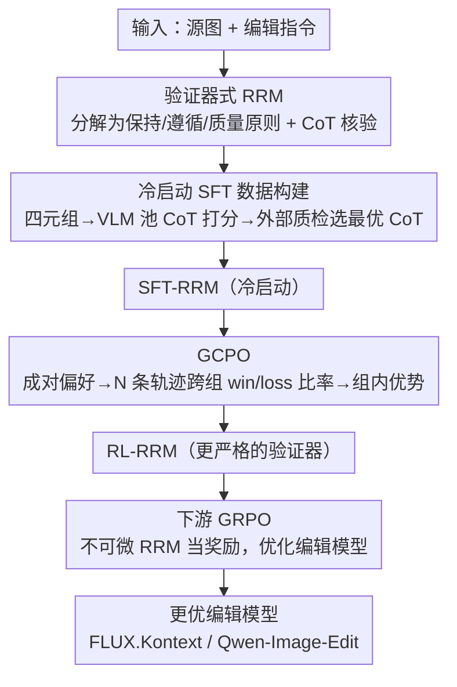

# Leveraging Verifier-Based Reinforcement Learning in Image Editing

**会议**: CVPR 2026  
**论文**: [CVF Open Access](https://openaccess.thecvf.com/content/CVPR2026/html/Guo_Leveraging_Verifier-Based_Reinforcement_Learning_in_Image_Editing_CVPR_2026_paper.html)  
**代码**: 无  
**领域**: 图像生成 / 对齐RLHF / 多模态VLM  
**关键词**: 图像编辑、奖励模型、强化学习、思维链验证器、GRPO

## 一句话总结
Edit-R1 提出"验证器式推理奖励模型"（RRM）来替代图像编辑里粗糙的整体打分——把编辑指令拆成可验证的"保持/遵循/质量"原则、用思维链逐条核验再聚合成细粒度分数；再配上一套能用成对偏好数据优化"点式推理奖励"的新 RL 算法 GCPO，把 7B RRM 提到 82.2% 偏好预测精度，最后当作 GRPO 的奖励信号去优化 FLUX.Kontext / Qwen-Image-Edit 等编辑模型，带来一致的质量提升。

## 研究背景与动机

**领域现状**：在文生图（T2I）里，RLHF 已是核心后训练步骤，靠强大的奖励模型 + GRPO 这类优化算法把模型对齐人类偏好。但在图像**编辑**上，RLHF 的应用还很有限，研究仍停在预训练和 SFT 阶段。

**现有痛点**：编辑的评估比 T2I 更细——要同时看指令保真（该改的改了没）、未编辑区域保持（不该动的别动）、整体质量。现有奖励模型大多把 RM 当"整体打分器"，让通用 VLM 直接吐一个标量分（如 EditScore），既不区分不同指令的具体要求、又难平衡这些复杂维度，导致**有偏甚至幻觉的反馈**。

**核心矛盾**：编辑质量本质是"多个子要求的合取"，但一个标量分把它们压成了一个数，无法定位"哪条要求没满足"。出路是从"打分器（scorer）"转向"推理验证器（reasoning verifier）"——显式分解指令、逐子任务核验、再聚合。

**本文目标**：① 造一个能按结构化推理流程走、且对齐人类偏好的可靠验证器；② 因为这个验证器通过离散 token 采样产生多步推理再出分、**本质不可微**，得设计一套能用它去优化下游编辑模型的 RL 框架。

**切入角度**：DeepSeek-R1 的成功关键之一是"可验证奖励"。作者把这个思路搬到视觉：让奖励模型先做原则分解 + CoT 核验，提供结构化、有原则依据的反馈。

**核心 idea**：构建 verifier-based RRM（指令分解成原则 → CoT 逐条核验 → 聚合细粒度分），并用两阶段训练（冷启动 SFT + 新算法 GCPO）把它对齐人类偏好，最后用 GRPO 把这个不可微 RRM 当奖励去优化编辑模型。

## 方法详解

### 整体框架
Edit-R1 围绕"验证器式推理奖励模型（RRM）"展开，分三段串行。**第一段（冷启动 SFT）**：构建大规模、编辑专用的 SFT 数据——把指令分解成"保持/遵循/质量"三类可验证原则，用多个编辑模型造大量编辑候选组成四元组，让 VLM 池对每个候选做 CoT 逐原则核验并出分、对每个四元组采多条"思考+打分"轨迹，再用一个外部 VLM 当"质检员"挑出核验准确率最高的那条 CoT 作为 SFT 监督，冷启动出 SFT-RRM。**第二段（GCPO）**：用约 1 万条人工成对偏好（赢家 $x_w$ / 输家 $x_l$）进一步对齐——但标准 GRPO/DPO 不适配"点式推理输出 vs 成对偏好"，作者提出 GCPO，让 RRM 对每张图各采 $N$ 条推理-打分轨迹、做跨组成对比较算 win/loss 比率当奖励、组内算优势，把 SFT-RRM 精炼成更严格的 RL-RRM。**第三段（下游 GRPO）**：把训练好的不可微 RL-RRM 当奖励信号，用 Flow-GRPO 优化下游编辑模型（FLUX.Kontext / Qwen-Image-Edit）。

### 关键设计

**1. 验证器式推理奖励模型（RRM）：把指令拆成可验证原则，CoT 逐条核验再聚合**

针对"整体打分器无法定位哪条要求没满足、易有偏/幻觉"这个痛点，RRM 不再直接吐一个数，而是先用 VLM 把编辑任务**分解成一组可验证原则** $P=\{p_k\}_{k=1}^K$，覆盖三个核心面：(a) **Keep**——该保持不变的元素；(b) **Follow**——指令要求的修改；(c) **Quality**——通用视觉完整性与保真度。这种逐样本分解把编辑任务"因式分解"，让模型显式区分"该保留什么 vs 该修改什么"。随后 RRM 用 CoT 对编辑图逐原则核验、再把各原则的核验结果加权聚合成最终标量分。这是一个**生成式、点式**的验证器，且同时具备"原则（as verifier）+ 思维链（thinks）+ RL 学习"三要素——论文 Tab.1 中是首个在视觉编辑任务里集齐这三者的 RM。

**2. 冷启动 SFT 数据构建：四步管线 + 外部质检，挑出最可信的"思考+打分"轨迹**

RRM 的本事建立在一份精挑的 SFT 数据上，作者用四步造它。**① 指令分解原则**：从 Imgedit 基准取 20 万样本（10 万随机 + 10 万用 GPT-4o 筛出的"难样本"，要求多步/细粒度/隐式语义/精确空间控制），用 Seed-1.5-VL 把每条指令分解成上面三类原则。**② 大规模四元组生成**：每个 (源图, 指令) 用 Flux-Kontext / Bagel / SeedEdit3.0 等多个编辑模型产出多样编辑候选，与源图、指令、原则集组成四元组 $(x_{\text{edit}},x_{\text{ref}},q,P)$，共约 200 万条。**③ VLM CoT 点式打分**：VLM 池对每个四元组做 CoT、逐原则核验后按加权聚合出标量分，并通过变换系统提示/温度/VLM 变体对每个四元组采**多条**"思考+打分"候选（核验用 JSON、分数放在 `<score></score>` 内）。**④ 外部验证选 CoT**：用 SeedVLM-1.5 当点式验证器对每条推理轨迹重新核验每条原则、算核验准确率，**只选准确率最高的那条 CoT** 进 SFT 集。消融显示 "Think+Verify" 比只 "Think" 把 Qwen-7B 从 68.9% 提到 75.4%，证明原则分解 + 严格过滤都关键。

**3. GCPO：用成对偏好优化"点式推理奖励"，跨组算 win/loss 比率、组内算优势**

冷启动后的 RRM 仍会幻觉或误判编辑幅度（如把"只动了一点点"误判成"成功移到左边"）。难点是：RRM 是**点式**输出（一段推理 + 一个分），而人类偏好是**成对**的（A 比 B 好），标准 GRPO/DPO 不适配。GCPO 把 RRM $R_\phi$ 本身当被优化的策略，"动作"是生成的推理轨迹与最终分。对每个偏好对 $(x_w,x_l)$，RRM 各随机采 $N$ 条轨迹得分数集 $\{\tau^w_j\}$、$\{\tau^l_j\}$，再做**跨组穷举成对比较**算比率：赢家候选的 win 比率 $r^w_j=\frac{1}{N}\sum_k \mathbb{1}\{\tau^w_j>\tau^l_k\}$ = 它打分高于多少比例的输家候选；输家候选的 loss 比率 $r^l_j=\frac{1}{N}\sum_k \mathbb{1}\{\tau^l_j<\tau^w_k\}$。然后**丢弃原始配对**，在各 rollout 组（赢家组/输家组）内独立算优势 $A^w_j=r^w_j-\bar r^w$、$A^l_j=r^l_j-\bar r^l$，目标是两组裁剪代理损失之和（省去 KL 项）。妙处在于：奖励来自成对比较（贴合人类标注形式），但优化用组内优势（贴合 GRPO 范式），从而把"成对监督"灌进"点式打分器"。仅用 1 万对偏好（不到 SFT 规模的 1%）就显著提分，说明增益主要来自更好的人类对齐而非数据量。

**4. 下游 GRPO：把不可微 RRM 当奖励，优化编辑模型**

REFL 这类方法要求奖励可微，而 RRM 经离散 token 采样产生推理轨迹再出分、本质不可微，所以不适用。作者改用 GRPO：编辑模型 $\pi_\theta(\cdot,c)$ 当策略，对每个上下文 $c=(x_{\text{ref}},q)$ 采一组 $G$ 张编辑图，RRM 给每张图核验出整体奖励 $\tau_i=\Phi(R_\phi(x^i_0,c,P))$，组内归一化算优势 $A_i=\frac{\tau_i-\text{mean}}{\text{std}+\epsilon}$，配裁剪目标与 KL 正则更新。具体用 Flow-GRPO、组大小 $G=24$、KL 系数 $\beta=0.04$。这样编辑模型直接对"人类感知质量 + 指令保真"（由 RRM 捕捉）做优化。

### 损失函数 / 训练策略
RRM 基座为开源 Qwen-VL-2.5（3B/7B）。GCPO 损失 $L_{\text{GCPO}}(\phi)$ 是赢家组与输家组各自的 PPO 式裁剪代理损失之和、省去 KL；优势按式 (3) 组内中心化。下游编辑用 Flow-GRPO（$G=24$、$\beta=0.04$），对 FLUX.Kontext 与 Qwen-Image-Edit 各做后训练。GCPO 阶段仅用 10k 人工偏好对（<1% SFT 规模），故增益主要归因于人类对齐而非数据量。

## 实验关键数据

### 主实验
奖励模型评测：内部基准（5000 张参考图+指令，多模型产出编辑图后人工成对标注，"same"对排除）+ 公开 EditRewardBench；指标为对人类偏好的预测准确率。编辑模型评测：GEdit-Bench-EN，报 SC（语义一致性）、PQ（感知质量）、O（总分，SC 与 PQ 的几何平均），均由 GPT-4.1 评。

奖励模型在内部基准的准确率（T/V/T+V = Think/Verify/Think+Verify）：

| 模型 | T | V | T+V | +GCPO |
|------|------|------|------|-------|
| Seed-1.5-VL（API） | 72.2% | — | 79.3% | — |
| Seed-1.6-VL（API） | 71.2% | 69.4% | 77.2% | — |
| Qwen-3B（本文） | 64.1% | 66.1% | 69.3% | 72.0% |
| **Qwen-7B（本文）** | 68.9% | 70.9% | 75.4% | **82.2%** |

7B RL-RRM 达 82.2%，超过闭源 Seed-1.5-VL（79.3%），且 3B→7B 有清晰的规模增益。公开 EditRewardBench 上（均为 7B）：

| 方法 | 准确率 |
|------|--------|
| EditScore-7B | 65.9% |
| EditScore-7B + 推理放大 | 72.7% |
| 本文 RRM（仅 SFT） | 73.3% |
| **本文 RRM（SFT+GCPO）** | **78.2%** |

下游编辑（GEdit-Bench-EN，越高越好）：

| 模型 | SC↑ | PQ↑ | O↑ |
|------|-----|-----|-----|
| FLUX.Kontext | 6.27 | 7.25 | 5.77 |
| FLUX.Kontext + RL-RRM(7B) | **6.86** | 7.20 | **6.24** |
| Qwen-Edit | 7.94 | 7.78 | 7.45 |
| Qwen-Edit + RL-RRM(7B) | 7.99 | 7.76 | 7.50 |

优化 FLUX.Kontext 把总分 O 从 5.77 提到 6.24、SC 从 6.27 提到 6.86；在已高度优化的 Qwen-Edit 上提升温和（7.45→7.50），但在最难的"Motion Change（运动变化）"类别上拿到 15.2% 相对增益（4.01→4.62）。

### 消融实验

| 配置 | 关键指标 | 说明 |
|------|---------|------|
| Think only（Qwen-7B） | 68.9% | 只 CoT 推理 |
| Think+Verify（Qwen-7B） | 75.4% | 加外部核验过滤，提 6.5 个点 |
| + GCPO | 82.2% | 成对偏好对齐再提 6.8 个点 |
| VIESCORE 提示 SFT | 68.3% | 参考基线，弱于完整 SFT |
| 去 Verify 步 | 显著下降⚠️ | 严格数据过滤至关重要（原文未给具体数值） |
| SFT-RRM（无 GCPO） | 73.3%（EditRewardBench） | GCPO 前 |
| RL-RRM（有 GCPO） | 78.2%（EditRewardBench） | GCPO 后 +4.9 点 |

### 关键发现
- **GCPO 把 RM 变"更严格的评判者"**：训练曲线显示 RL-RRM 给出更低的训练奖励、却带来更高的评测奖励，说明 GCPO 让 RM 变得更严格更可靠，从而逼编辑模型更贴合人类偏好。
- **"Verify"过滤不可省**：去掉外部核验步会显著掉点，证明严格的数据过滤是冷启动质量的关键。
- **跨基准泛化**：EditRewardBench 与内部管线独立构建，本文仍稳超 EditScore，说明增益不是内部基准偏置带来的。
- **对"短板类别"提升最明显**：Motion Change 这类难类别拿到 15.2% 相对增益，说明框架尤其擅长补齐模型的特定弱点。

## 亮点与洞察
- **"打分器→验证器"的范式转变**：把单标量分换成"原则分解 + CoT 逐条核验 + 聚合"，反馈更结构化、可解释、可定位失败点——这对编辑这种"多子要求合取"的任务特别合适，思路可迁移到视频编辑、可控生成等。
- **GCPO 解决了一个真问题**：如何用"成对偏好数据"去优化"点式推理奖励模型"。跨组比较算 win/loss 比率当奖励、组内算优势的设计，巧妙地把人类标注的成对形式接进 GRPO 范式，且仅 1% 数据量就显著见效。
- **不可微奖励也能驱动 GRPO**：明确指出 REFL 因需可微而不适用，转而用 GRPO 把推理式 RM 当黑盒奖励，是 LLM RLVR 经验向视觉编辑迁移的干净落地。
- **可解释性副产物**：RRM 的 CoT 给出"为什么这张编辑差"的逐原则解释，对调试编辑模型很有用。

## 局限与展望
- 在已高度优化的强基线（Qwen-Edit）上整体提升温和（7.45→7.50），作者归因为基线已难从 Best-of-N 获益；说明 RRM 的红利在较弱/有明显短板的模型上更大。
- 评测的"总分 O = SC 与 PQ 的几何平均"由 GPT-4.1 自动评，⚠️ 存在评测模型自身偏置；虽有附录人工 GSB 佐证，主表仍依赖自动指标。
- 数据管线重度依赖多个强 VLM（Seed-1.5-VL、GPT-4o、SeedVLM-1.5）做分解/打分/质检，复现成本高、且 RRM 质量受这些上游 VLM 能力上限制约。
- 自评：原则分解的质量直接决定 RRM 天花板，但分解本身由 VLM 完成、缺少对"分解错误如何传播"的系统分析；GCPO 的 $N$、组大小等超参敏感性在主文也未充分展开。

## 相关工作与启发
- **vs EditScore（整体打分器）**：EditScore 让 VLM 直接出单分、不做细粒度核验；本文用原则分解 + CoT 验证器，在 EditRewardBench 上 73.3%/78.2% 超过 EditScore-7B 的 65.9%（甚至超过其推理放大版 72.7%）。
- **vs REFL 类对齐**：REFL 要求奖励可微、易奖励黑客；本文 RRM 经离散采样不可微，改用 GRPO 把它当黑盒奖励，更稳健。
- **vs DPO（如 DreamFuse）**：DPO 直接在偏好集上优化、限制策略探索、易次优收敛；本文 GCPO 保留 rollout 探索，并把成对偏好转成组内优势驱动 RL。
- **vs DeepSeek-GRM（原则式 CoT 奖励）**：DeepSeek-GRM 面向非视觉任务；本文是首个把原则分解式 CoT + 两阶段训练专门用于视觉编辑的生成式点式验证器。

## 评分
- 新颖性: ⭐⭐⭐⭐ "验证器式 RRM + GCPO（成对偏好优化点式推理奖励）"组合在编辑 RLHF 里是清晰的新范式
- 实验充分度: ⭐⭐⭐⭐ 内部+公开双基准、两编辑模型家族、分阶段消融齐全；自动评测偏置与超参敏感性披露不足
- 写作质量: ⭐⭐⭐⭐ 动机—两阶段训练—下游应用逻辑顺，公式与 Tab.1 能力对照表清楚；个别表述略重复
- 价值: ⭐⭐⭐⭐ 给编辑 RLHF 提供了可复用的奖励建模与对齐范式，对补齐编辑模型短板类别效果明显

<!-- RELATED:START -->

## 相关论文

- [\[CVPR 2025\] Trust Your Critic: Robust Reward Modeling and Reinforcement Learning for Faithful Image Editing and Generation](../../CVPR2025/image_generation/trust_your_critic_robust_reward_modeling_and_reinforcement_learning_for_faithful.md)
- [\[CVPR 2026\] Ar2Can: An Architect and an Artist Leveraging a Canvas for Multi-Human Generation](ar2can_an_architect_and_an_artist_leveraging_a_canvas_for_multi-human_generation.md)
- [\[CVPR 2026\] HiCoGen: Hierarchical Compositional Text-to-Image Generation in Diffusion Models via Reinforcement Learning](hicogen_hierarchical_compositional_text-to-image_generation_in_diffusion_models_.md)
- [\[ICML 2026\] CoCoEdit: Content-Consistent Image Editing via Region Regularized Reinforcement Learning](../../ICML2026/image_generation/cocoedit_content-consistent_image_editing_via_region_regularized_reinforcement_l.md)
- [\[CVPR 2026\] Spatial-SSRL: Enhancing Spatial Understanding via Self-Supervised Reinforcement Learning](spatial-ssrl_enhancing_spatial_understanding_via_self-supervised_reinforcement_l.md)

<!-- RELATED:END -->
