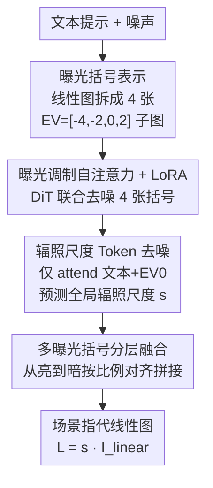

# Linear Image Generation by Synthesizing Exposure Brackets

**会议**: CVPR 2026  
**论文**: [CVF Open Access](https://openaccess.thecvf.com/content/CVPR2026/html/Dai_Linear_Image_Generation_by_Synthesizing_Exposure_Brackets_CVPR_2026_paper.html)  
**代码**: 项目页 https://ykdai.github.io/projects/raw_gen  
**领域**: 扩散模型 / 图像生成  
**关键词**: 线性图像生成, 曝光括号, 流匹配, DiT, 高动态范围

## 一句话总结
针对"现有生成模型只能产出被 ISP 压缩过的 sRGB 显示图、缺乏后期编辑空间"的痛点，本文提出文本到线性图像生成任务，把一张高动态范围线性图拆成 4 张不同曝光的"曝光括号"子图、用基于 Flux 的流匹配 DiT 联合生成括号序列与辐照尺度，再融合成场景指代的线性图，FID 28.29 全面超过各类改造基线。

## 研究背景与动机
**领域现状**：我们日常看到的几乎都是 display-referred（显示指代）图像——光子打到传感器后经过一整套 ISP 流水线（色调映射、风格化、动态范围压缩），每个像素编码的是"显示出来好不好看"而非"场景真实有多亮"。与之相对的是 linear/scene-referred（线性 / 场景指代）图像：它记录成像平面上各像素的真实辐照度，未经非线性色调映射，因此动态范围和位深都更高，给后期曝光、白平衡、创意调整留下大得多的空间（见论文 Fig. 1/2）。

**现有痛点**：现代生成模型（Flux、SD 系列）几乎只在 LAION-5B 这类显示指代数据上训练，产出的图虽然好看但亮度/对比度被显示动态范围卡死，遇到"既有强高光又有深阴影"的场景就拍平成色调映射图，后期一拉曝光高光就溢出、暗部就死黑。用户想编辑线性图只能先转成 sRGB，转换过程把动态范围信息永久丢掉。

**核心矛盾**：直接训一个线性图生成模型有两道硬墙。其一是**数据稀缺**——场景指代图通常是摄影师私藏，公开的只有色调映射后的版本，无法像训普通扩散模型那样堆海量数据。其二、也是更根本的，**预训练 VAE 装不下线性图**：潜在扩散里的 VAE 是在有限值域的显示图上训练的，面对高位深、宽动态范围的线性数据时无法同时保住高光和暗部细节，编码-解码后暗区严重信息丢失（论文 Fig. 3），结果像被一个动态范围不足的传感器拍出来的——极亮极暗处都被截断或压扁。

**本文目标**：把任务分解为——(1) 绕过 VAE 的动态范围瓶颈，可靠合成高位深内容；(2) 在数据有限的前提下高效适配到线性域；(3) 让生成的线性图能直接接入专业后期与下游条件生成（编辑、ControlNet）。

**切入角度**：作者从摄影里的**曝光括号（exposure bracketing）**得到灵感——既然 VAE 装不下一整张高动态范围帧，那就别让它装整张，而是把线性图拆成若干"各自只覆盖一段动态范围"的曝光子图，每张都落在 VAE 擅长的 [0,1] 值域里。

**核心 idea**：用"合成一组曝光括号再融合"替代"直接生成一张高动态范围线性图"——基于 Flux 的流匹配 DiT 联合生成 4 张曝光括号 + 一个全局辐照尺度 token，再用分层融合把它们拼成最终的场景指代线性图。

## 方法详解

### 整体框架
方法要解决的是"文本 → 场景指代线性图"，但因为 VAE 无法直接重建高动态范围线性图，整条管线绕了一圈：先把线性图用预设曝光值 $EV=[-4,-2,0,2]$ 拆成 $K=4$ 张曝光括号子图 $I_k=\mathrm{clip}(I_{linear}\cdot 2^{ev_k},0,1)$，每张都落进 VAE 的舒适值域；这 4 张共享同一个 VAE 编码器、沿序列维拼成统一潜在 $z_{all}\in\mathbb{R}^{KL\times C}$。生成侧从两组高斯噪声出发——一组是 4 个括号的潜在 $z_t$，另一组是一个 $1\times C$ 的辐照尺度 token $R$；它们一起过 $N_1$ 个 MM-DiT 块（带 LoRA）再过 $N_2$ 个 Single-DiT 块（带 LoRA + 曝光调制自注意力），流匹配去噪后，括号 token 经 VAE 解码成 4 张曝光括号、辐照尺度 token 经线性层投影回标量 $s$。最后由"多曝光括号融合"模块把 4 张括号分层拼成最终线性图 $\hat I_{linear}$，再用 $s$ 还原物理辐照 $L=s\cdot\hat I_{linear}$。

### 关键设计

**1. 曝光括号表示：把 VAE 装不下的高动态范围拆成 4 段它装得下的子图**

这是绕过 VAE 瓶颈的根本手段，直接针对"VAE 无法同时保住高光和暗部"的痛点。给定归一化线性图 $I_{linear}$ 和一组曝光值 $EV=[-4,-2,0,2]$，每张括号 $I_k=\mathrm{clip}(I_{linear}\cdot 2^{ev_k},0,1)$ 相当于"用不同快门拍同一场景"：$ev_{-4}$ 那张把暗部拉亮看清阴影、$ev_{2}$ 那张压暗高光保住亮区细节。每张都被 clip 到 $[0,1]$，正好是预训练 VAE 擅长的值域，于是 4 张子图各自都能被无损编码-解码。它们沿 batch 维过共享 VAE 编码器、再沿序列维拼成 $z_{all}$，让一次去噪同时生成 4 张括号——本质是用"多张窄动态范围图的并集"去表达"一张宽动态范围图"，把超出 VAE 表征能力的内容拆成它能处理的若干份。

**2. 曝光调制自注意力 + 3D-RoPE：让 4 张括号既能各自调亮度又保持结构对齐**

4 张括号必须是"同一场景的不同曝光"，否则没法融合。曝光调制自注意力（Exposure Modulation Self-Attention）跨所有括号联合做注意力，允许模型为每张括号灵活调整亮度，同时保住跨曝光的结构对齐与细节一致。为了让模型分得清"这个 token 属于哪张括号"，作者把 Flux 原本的 2D 位置坐标 $(i,j)$ 扩成 3D 元组 $(index,i,j)$，其中 $index=k\in\{0,\dots,K-1\}$ 是括号编号（3D-RoPE）。这样同一空间位置在不同曝光下的 token 既共享 $(i,j)$ 的空间语义、又靠 $index$ 解耦不同亮度级，避免 4 张括号在联合注意力里互相串味。LoRA 微调（rank 64、$\alpha$=128）则让预训练 Flux 骨干在"括号间快速变化的曝光分布"下不至于训崩。

**3. 辐照尺度 Token 去噪：在生成图像内容的同时显式预测全局物理亮度**

光有归一化的线性图还不够——要还原真实物理辐照 $L=s\cdot I_{linear}$ 还需要全局辐照尺度 $s$。作者不另起一个回归头，而是把 $s$ 也做成一个参与去噪的 token。具体把对数辐照 $s_l=\log_{10}(s)$ 在 $[-6,4]$ 上离散成 20 个 bin、编码成 one-hot $s_d$ 后经共享线性投影 $t_s=Ws_d$ 进入扩散 token 空间，和图像 token 一起在自注意力里更新；推理时把更新后的 token 投回 bin 空间 $\hat s_d=\mathrm{softmax}(\hat t_sW^\top)$、对 20 个 bin 中心 $\mu_i$ 取期望得 $\hat s_l=\sum_i \hat s_d[i]\mu_i$。关键巧思在**注意力掩码**：辐照尺度 token 只允许 attend 文本 token 和 EV0（基准曝光）那张括号的 token，让它主要从"曝光正常的参考帧"推全局亮度，避免被过曝/欠曝的括号带偏；反过来其他图像 token 不 attend 这个尺度 token，以免污染图像保真度。消融显示该 token 去噪策略（MAE 0.737）优于各种全局池化 + MLP 的方案（Text-MLP 0.782 / Image-MLP 1.213 / Merge-MLP 0.792），因为它能在去噪中同时利用文本语义和图像空间亮度线索。

**4. 多曝光括号分层融合：把 4 张曝光括号无缝拼回一张高动态范围线性图**

生成出 4 张括号后还要融成一张。融合从最亮的括号起、逐步并入较暗括号。对每对相邻括号 $\hat I_k,\hat I_{k+1}$，在非饱和区按通道算均值、得三通道比例向量 $r_k$（用 $\hat I_{k+1}$ 各通道均值除以 $\hat I_k$ 对应均值），用来对齐亮度过渡。每一步 $k$ 构造软掩码 $M_k\in[0,1]^{H\times W\times 3}$ 标出"当前括号在此处提供未饱和、高保真信息"的区域并做平滑以避免拼接伪影，融合按加权组合 $\hat I_{fused}\leftarrow \hat I_{fused}\cdot(1-M_k)+(\hat I_k\cdot r_k)\cdot M_k$ 递归更新（初值为最亮括号 $\hat I_K$）。三通道比例对齐 + 软掩码保证了亮度过渡平滑、辐射一致，从而从多张曝光偏置的生成结果里重建出高动态范围线性图的高光与暗部细节。

### 损失函数 / 训练策略
模型在流匹配框架下训练，总损失 $L=L_{img}+\lambda_{rad}L_{rad}+\lambda_{bracket}L_{bracket}$（$\lambda_{rad}=1.0$，$\lambda_{bracket}=0.5$）：

- **图像流匹配损失** $L_{img}=\mathbb{E}\big[\lVert u_t(z_t)-u_\theta(z_t,c,t)\rVert_2^2\big]$，学习把噪声映回干净括号潜在的速度场。
- **辐照尺度损失** $L_{rad}=\lVert u_t(t_{s,t})-u_\theta(\hat t_{s,t})\rVert_2^2$，在同一速度空间监督辐照 token。
- **括号一致性损失** $L_{bracket}=\sum_k\lVert \hat I_k/2^{ev_k}-\hat I_{k0}\rVert_1$，在像素空间强制各曝光帧与 EV0 参考帧满足物理上应有的乘性辐照比，保证曝光顺序物理自洽（$k0$ 为 $ev_k=0$ 的索引）。

训练数据用 RAISE + 自采 RAW 图，经"去马赛克 → CCM/LUT 转相机无关 RGB → 白平衡统一到 5000K → 转 CIE-XYZ 去噪再转回线性 RGB"四步预处理得线性传感信号，辐照尺度 $s=\max(s_{med},s_{hi})$ 由 0.5/0.9 分位数稳健估计（$s_{med}=m/0.18$，$s_{hi}=h/0.8$），过滤美学分 <4.5 后留 25k 张；文本标注用 Qwen2.5-VL 7B 对 EV0 帧生成简洁描述。骨干为 Flux-dev，4×A100 80GB、每卡 batch 4、共 10000 步、bf16。

## 实验关键数据

评测集为 MIT-Adobe FiveK。自定义指标含 **LS**（动态范围相关分数，越高表示能跨越的动态范围越广 ⚠️ 论文未给精确定义，以原文为准）、**AS**（美学分）、**NIQE**（无参考画质，越低越好）、**CLIP Sim.**（文图一致性）。

### 主实验
由于此前没有"直接线性图生成"的方法，作者把已有架构改造成三类基线对比：

| 类型 / 模型 | FID ↓ | AS ↑ | NIQE ↓ | CLIP Sim. ↑ | LS ↑ |
|------|------|------|------|------|------|
| T2I 微调 Flux | 32.12 | 4.712 | 5.304 | 25.90 | / |
| T2V 微调 Wan 2.1 | / | 4.537 | 5.412 | 24.79 | 1.12 |
| T2I 膨胀 CameraCtrl (w/ F) | 37.25 | 5.230 | 4.131 | **26.89** | 8.97 |
| T2I 膨胀 Gen. Photography (w/ F) | 40.17 | 4.619 | 4.514 | 23.71 | 7.11 |
| T2I 膨胀 Gen. Photography (w/o F) | 43.83 | 3.909 | 4.870 | 20.51 | 5.56 |
| **本文 Ours** | **28.29** | **5.700** | **3.658** | 26.02 | **23.06** |

LS 上本文 23.06 相对最强基线 CameraCtrl 的 8.97 几乎翻倍多，说明曝光括号方案真正把动态范围撑了开；FID/AS/NIQE 也全面领先。"/"表示指标无法有意义地计算：Wan 2.1 的 4× 时间下采样把 4 张括号纠缠进单个潜在，产不出 HDR 融合所需的一致括号（故无 LS）；T2I 微调 Flux 没有时间维容量去跨越完整动态范围（故无 LS）。

### 消融实验：辐照尺度估计方式

| 配置 | MAE ↓ | 说明 |
|------|------|------|
| Text-MLP | 0.782 | 仅文本 token 池化 + MLP |
| Image-MLP | 1.213 | 仅图像 token 池化 + MLP |
| Merge-MLP | 0.792 | 文本 + 图像拼接池化 + MLP |
| **Ours（token 去噪）** | **0.737** | 辐照 token 参与联合去噪 |

### 关键发现
- **曝光括号表示是动态范围的命门**：LS 指标上本文几乎是次优基线的 2.6 倍，直接验证"拆括号绕开 VAE"比"硬塞高动态范围进 VAE/时间维"有效得多。
- **T2V 路线（Wan 2.1）行不通**：其 4× 时间下采样把 4 张曝光括号压进单一潜在，造成严重分布失配，微调也救不回来——说明曝光括号不能被当成普通视频帧压缩。
- **辐照尺度 token 去噪优于全局池化**：MAE 0.737 < 0.782/0.792/1.213，且仅图像池化（1.213）远差，说明全局亮度既需要文本语义也需要图像空间线索，token 去噪能在注意力里同时吸收两者。
- 论文还展示了 ControlNet 条件生成、线性图 inpainting、文本引导线性图编辑等下游应用（细节在补充材料 ⚠️ 正文未给定量数）。

## 亮点与洞察
- **"把模型装不下的东西拆成它装得下的若干份"是可复用的范式**：曝光括号本质是用多张窄动态范围图表达一张宽动态范围图，绕开 VAE 的表征上限——这个思路可迁移到任何"目标信号超出预训练编码器值域"的生成任务（如高位深医学图、HDR 全景）。
- **把标量物理量做成参与去噪的 token + 定向注意力掩码**很巧妙：辐照尺度只 attend 文本和 EV0 帧、其他 token 不 attend 它，既让全局亮度从"曝光正常的参考帧"稳健推出、又不污染图像保真度，比另起回归头更契合扩散框架。
- **用现成 Flux + LoRA + 少量数据就把生成域从 sRGB 搬到线性空间**：仅 25k 张、1 万步训练，说明大规模 T2I 先验可以低成本迁到新的物理表征域。

## 局限与展望
- **曝光值和括号数是写死的**：$EV=[-4,-2,0,2]$、$K=4$ 是预设超参，对极端动态范围场景（如直视太阳 + 深阴影）这 4 档够不够、能否自适应选档，正文未讨论。
- **依赖私有/自采 RAW 数据**：训练集靠 RAISE + 自采 RAW，规模仅 25k，受限于线性数据稀缺，泛化到训练分布外的内容类别（动物仅占 1%）可能不稳。
- **融合是启发式后处理**：分层融合的软掩码、三通道比例对齐是手工设计的非学习模块，可能在饱和区边界或复杂高光处产生拼接伪影；端到端可学融合是潜在改进方向。
- **下游应用只有定性展示**：ControlNet、编辑、inpainting 等都放在补充材料且无定量评测，实际可用性待考。

## 相关工作与启发
- **vs Bracket Diffusion**: 都用"多曝光括号"思路做高动态范围，但 Bracket Diffusion 靠 DDPM 测试时优化模拟括号成像、生成一张 256×256 HDR 要几分钟；本文是前馈流匹配 DiT、直接联合生成括号 + 辐照尺度，快且产出真·场景指代线性图而非色调映射 HDR。
- **vs GlowGAN**: GlowGAN 用高斯曝光建模做无监督 HDR 合成，但只能针对特定图像类别、产的是 HDR 而非线性图；本文是文本条件、通用类别、直接线性域生成。
- **vs sRGB-to-RAW 重建（CycleISP / InvISP / RAWDiffusion）**: 这些方法假设 RAW↔sRGB 遵循某种可逆 ISP 模式来规避病态性、且需要 sRGB 输入或元数据；本文不做重建而是从文本直接建立"线性图生成先验"，填补了此前无人涉足的直接 RAW/线性图生成空白。
- **vs T2I 膨胀法（CameraCtrl / Generative Photography）**: 它们给图像扩散加时间模块生成多帧序列，但非为线性图设计，即便在本文数据上微调，动态范围（LS 8.97/7.11）和 FID 仍明显逊于本文（LS 23.06、FID 28.29）。

## 评分
- 新颖性: ⭐⭐⭐⭐⭐ 首个文本到线性图生成框架，"曝光括号绕开 VAE"的切入角度新且根因清晰
- 实验充分度: ⭐⭐⭐⭐ 主实验 + 辐照估计消融扎实，但缺直接竞品、下游应用只有定性、更多消融压在补充材料
- 写作质量: ⭐⭐⭐⭐ 动机推导清楚、图示到位，部分自定义指标（LS）定义未在正文给全
- 价值: ⭐⭐⭐⭐ 打通生成模型与专业摄影后期，曝光括号范式对高位深生成有迁移价值

<!-- RELATED:START -->

## 相关论文

- [\[ICCV 2025\] LiT: Delving into a Simple Linear Diffusion Transformer for Image Generation](../../ICCV2025/image_generation/lit_delving_into_a_simple_linear_diffusion_transformer_for_image_generation.md)
- [\[CVPR 2025\] LEDiff: Latent Exposure Diffusion for HDR Generation](../../CVPR2025/image_generation/lediff_latent_exposure_diffusion_for_hdr_generation.md)
- [\[CVPR 2026\] Gated Condition Injection without Multimodal Attention: Towards Controllable Linear-Attention Transformers](gated_condition_injection_without_multimodal_attention_towards_controllable_line.md)
- [\[CVPR 2026\] Beyond Fixed Formulas: Data-Driven Linear Predictor for Efficient Diffusion Models](beyond_fixed_formulas_data-driven_linear_predictor_for_efficient_diffusion_model.md)
- [\[CVPR 2026\] Frequency-Aware Flow Matching for High-Quality Image Generation](freqflow_frequency_aware_flow_matching.md)

<!-- RELATED:END -->
