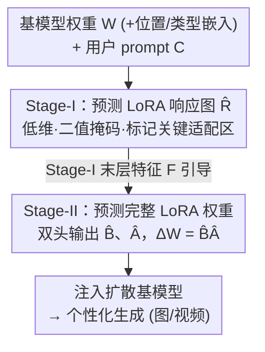

# LoFA: Learning to Predict Personalized Prior for Fast Adaptation of Visual Generative Models

**会议**: CVPR 2026  
**论文**: [CVF Open Access](https://openaccess.thecvf.com/content/CVPR2026/html/Hao_LoFA_Learning_to_Predict_Personalized_Prior_for_Fast_Adaptation_of_CVPR_2026_paper.html)  
**代码**: 项目页 https://jaeger416.github.io/lofa （代码与预训练模型作者承诺开源）  
**领域**: 扩散模型 / 图像生成 / 个性化  
**关键词**: 超网络, LoRA 预测, 快速适配, 个性化生成, 视频生成

## 一句话总结
LoFA 用一个超网络在几秒内直接预测出"完整不压缩"的个性化 LoRA 权重——它先发现 LoRA 相对基模型权重的变化存在结构化的「响应图」模式，再用两阶段超网络先预测响应图、再用响应图引导预测最终 LoRA，从而在文本/姿态/风格/人脸等多种条件下达到甚至超过需要数小时逐例微调的传统 LoRA。

## 研究背景与动机
**领域现状**：把视觉生成大模型（文/图/视频）个性化到具体用户需求，主流做法是为每个需求单独训练一个 LoRA（Low-Rank Adaptation）适配器，把残差权重 $\Delta W$ 分解成两个低秩矩阵 $B\in\mathbb{R}^{m\times r}$、$A\in\mathbb{R}^{r\times n}$，最终权重 $W' = W + BA$。

**现有痛点**：逐例 LoRA 微调既要收集任务专属数据、又要数小时的优化时间，对"用户希望对新需求快速响应"的真实场景几乎不可用。少数超网络（hypernetwork）方法试图在测试时直接预测适配权重以求快，但它们要学一个从低维细粒度 prompt 到高维复杂 LoRA 分布的映射，难度极大；为了简化学习，它们普遍把 LoRA 权重用自编码器/矩阵分解压缩到低维空间作为超网络输出，这必然带来信息损失、限制模型容量，因此只在"图像里的主体身份个性化"这种受限场景里被验证过。

**核心矛盾**：要快就得直接预测 LoRA，但直接预测又面临"低维 prompt → 高维 LoRA"的暴力映射难题；而绕开难题去压缩 LoRA，又会丢表达力。快速 + 不压缩 + 处理细粒度 prompt，三者难以兼得。

**本文目标**：造一个通用框架，能从多样/细粒度的用户 prompt 直接预测出**完整、不压缩**的个性化 LoRA 权重，并支持图像与视频的多种个性化任务。

**切入角度**：作者没有去硬学"prompt→LoRA"的暴力映射，而是先观察 LoRA 本身的结构——既然 LoRA 是基模型权重上的残差 $\Delta$，那就盯住 $\Delta W$ 与 $W$ 的相对变化（ratio map）。他们发现这种相对变化里浮现出清晰的结构化模式，且这个模式比 LoRA 本身低维得多、简单得多。

**核心 idea**：把"先预测一张低维的 LoRA 响应图、再用它引导预测完整 LoRA 权重"的归纳偏置嵌进超网络，用结构化引导代替暴力映射，从而既保留完整表达力又稳定了学习。

## 方法详解

### 整体框架
训练时给定三元组（用户条件 $C$、目标 LoRA 权重 $\Delta W$、基模型权重 $W$），LoFA 学一个两阶段的 Transformer 超网络 $f$，目标是从 $C$ 和 $W$ 预测 $\Delta W$，即 $f(C, W)\to\Delta W$。关键在于把这个预测拆成两步：**第一阶段**只预测一张低维、简单的「响应图」（response map），刻画"基模型的哪些参数被这条 prompt 显著改写"；**第二阶段**继承第一阶段的网络与学到的响应知识，去预测完整的 LoRA 矩阵 $B$、$A$。推理时来一条新 prompt，超网络几秒内直接吐出对应 $\Delta W$，注入基模型即得到个性化版本。

整条管线自上而下是：基模型权重 $W$（叠加位置/类型嵌入）+ 用户 prompt $C$ 作为输入 → Stage-I 预测响应图 $\hat{R}$ → Stage-II 借 Stage-I 的特征引导、预测完整 LoRA 权重 → 注入扩散模型完成个性化生成。两阶段都以"基模型权重为输入、prompt 经交叉注意力注入"为共享架构。

### 关键设计

**1. LoRA 响应图：发现并利用 LoRA 相对变化里的结构化模式**

这是整篇论文的地基。直接预测完整 LoRA 太难，已有方法只能压缩，本文换个角度：盯住 LoRA 残差相对基模型的"相对变化"。对某层第 $i$ 个参数，定义归一化响应幅度 $m_i = |\Delta w_i / w_i|$。作者统计发现，约 50%–80% 的参数响应低于 2%，于是用 2% 阈值得到二值掩码响应图 $R = \{r_i \mid r_i = 1 \text{ if } m_i > 2\% \text{ else } 0\}$，$r_i=1$ 标记"有用参数"、$r_i=0$ 标记"可忽略参数"。可视化显示，不同任务的 $R$ 呈现明显不同但结构化的分布，且会随网络深度、模块功能类型（query/key 投影等）而变。这张图揭示了"基模型的哪些区域被某类任务条件显著适配"，把它软性注入超网络，就能引导网络识别并优先处理关键适配区，从而简化、稳定学习——而且因为响应图只是"引导"，最终输出仍保留完整 LoRA 参数量，不损表达力。

**2. Stage-I 响应图预测：用低维监督先学会"改哪里"**

第一阶段是一个 Transformer 超网络 $f_\theta$，以基模型原始参数 $W$ 为输入、预测响应图 $R$。Transformer 内部用自注意力捕捉参数间的隐式关联，用交叉注意力把用户条件 $C$ 注入。由于 $R$ 随深度与模块类型变化，作者把每个深度/模块的 $R$ 视作一个样本，并引入两个可学习嵌入：blockwise 位置嵌入 $E_{pos}$ 编码层深索引、block-type 嵌入 $E_{type}$ 表示模块功能角色，于是学习写成 $f_\theta(W + E_{pos} + E_{type}, C)\to\hat{R}$，$\hat{R}$ 经 Sigmoid 激活。训练用标准交叉熵 $L_{stage1} = -R\log\hat{R}$。因为响应图远比 LoRA 低维简单，这一步好学、收敛稳，为第二阶段提供可靠先验。

**3. Stage-II 响应引导的完整 LoRA 预测：保留表达力地输出不压缩权重**

第二阶段 $f_\phi$ 复用第一阶段的 Transformer 骨干（并用 Stage-I 模型初始化以继承响应先验与参数依赖），把 MLP 头换成两个独立的参数预测头分别预测 $B$、$A$，再 $\Delta W = BA$。关键是它在特定 block 里额外加交叉注意力，去注意 Stage-I 模型的末层特征表示 $F_{stage1}$，从而把"改哪里"的知识接力进来：$f_\phi(W + E_{pos} + E_{type}, C, F_{stage1})\to(\hat{B}, \hat{A})$。训练用两个互补目标联合优化：重建损失 $L_{recon} = \|A-\hat{A}\|_1 + \|B-\hat{B}\|_1$ 保证权重结构合理；扩散损失把预测 LoRA 注入基去噪模型，在 Flow Matching 范式下做任务级监督 $L_{diff} = \mathbb{E}_{x_0,t,\epsilon}[\|\epsilon - \epsilon_\theta(x_t, t; \hat{A}, \hat{B})\|_2^2]$，保证生成行为对齐目标。总目标 $L_{stage2} = \lambda_{recon}L_{recon} + \lambda_{diff}L_{diff}$。这样输出的是**完整、不压缩**的 LoRA，避免了已有方法因压缩造成的信息损失。

**4. 以基模型权重为输入、prompt 经交叉注意力注入的架构**

与"把 prompt 当输入硬学 prompt→LoRA"的暴力路线相反，LoFA 始终把基模型权重 $W$ 当输入、用户 prompt $C$ 仅通过交叉注意力作为条件信号注入。其直觉是：LoRA 本质是 $W$ 上的相对适配，让网络在"已知 $W$"的前提下学相对变化，比凭空从低维 prompt 生成高维权重要容易得多。消融里把这一项换成"prompt 直接作输入"（Tab. 4 "prompt input"）会明显掉点，验证了这个架构选择的有效性。

### 损失函数 / 训练策略
- Stage-I：交叉熵 $L_{stage1} = -R\log\hat{R}$，仅学响应图。
- Stage-II：$L_{stage2} = \lambda_{recon}L_{recon} + \lambda_{diff}L_{diff}$，其中 $L_{recon}$ 为 $A$、$B$ 的 L1 重建，$L_{diff}$ 在 Flow Matching 下做扩散级任务监督。
- Stage-II 的 Transformer 由 Stage-I 初始化，并通过交叉注意力读取 Stage-I 末层特征 $F_{stage1}$ 作引导。
- 视频任务用 WAN2.1-1.3B 作基模型，图像任务用 Stable Diffusion XL；姿态条件用多层 3D 卷积作 pose encoder，风格/人脸条件用 CLIP-ViT-L 特征经 MLP 投影注入。

## 实验关键数据

### 主实验
任务一：文本/姿态条件的个性化人体动作视频生成（基模型 WAN2.1-1.3B）。训练 2,630 个 LoRA 构成文本–LoRA 数据集，留出 60 类未见动作（877 对）做验证。指标：FVD（分布相似度，↓）、CLIP-T（文–视频对齐，↑）、Dynamic Degree（来自 VBench 的动态质量，↑）。

| 方法 | FVD ↓ | CLIP-T ↑ | Dynamic Degree ↑ |
|------|-------|----------|------------------|
| LoRA [16]（逐例优化） | 609.5 | 0.3662 | 0.2269 |
| Text-to-LoRA [4]（直接预测） | 907.5 | 0.3541 | 0.0745 |
| **LoFA-Text（本文）** | **589.8** | **0.3719** | 0.2283 |
| **LoFA-Pose（本文）** | 610.7 | 0.3687 | **0.2297** |

LoFA 全面超越直接预测基线 Text-to-LoRA，且 FVD/CLIP-T 优于需要数小时逐例优化的 LoRA。作者解释：逐例 LoRA 在单一子任务上微调易轻度过拟合，而 LoFA 跨多子任务训练、学到更泛化的运动先验。

任务三：身份个性化图像生成（基模型 SDXL，3,100 个 DreamBooth LoRA 训练）。这是已有工作唯一支持的场景。

| 方法 | Face Sim ↑ | DINO ↑ | CLIP-I ↑ | Face Div ↑ | Time ↓ |
|------|-----------|--------|----------|-----------|--------|
| DreamBooth [37]（逐例） | 0.488 | 0.460 | 0.544 | 47.3 | 1h |
| DiffLoRA [53]（直接预测） | 0.461 | 0.427 | 0.517 | 46.8 | 20s |
| HyperDreamBooth [38]（需后优化） | 0.527 | 0.462 | 0.565 | 46.1 | 274s |
| **LoFA（本文）** | **0.548** | **0.497** | **0.600** | **50.3** | **3.7s** |

LoFA 在所有指标上领先，且推理仅 3.7 秒（HyperDreamBooth 因要后优化需 274s，DreamBooth 逐例需 1 小时）。文本到视频风格化任务（Tab. 2）上 LoFA 的 CSD-Score 0.427 / CLIP-T 0.2943 / Dynamic Degree 2.394 / Motion Smoothness 0.9940 也全面优于逐例 LoRA。

### 消融实验
Tab. 4 在三个任务上同时消融关键组件（视频用 FVD/D.D.，风格化用 CSD/CLIP-T，人脸用 Face Sim/DINO）：

| 配置 | FVD ↓ | D.D. ↑ | CSD ↑ | Face Sim ↑ | 说明 |
|------|-------|--------|-------|-----------|------|
| 完整模型 | 589.8 | 0.2283 | 0.427 | 0.548 | 两阶段 + 响应引导 |
| w/o res.（去 Stage-I 响应预测，单阶段直接预测 LoRA） | 665.4 | 0.2117 | 0.394 | 0.497 | 全任务显著掉点，视频尤甚 |
| lightweight（用轻量超网络隐式学低层特征替代响应监督） | 655.1 | 0.2090 | 0.408 | 0.527 | 有改善但远不及响应图监督 |
| prompt input（用 prompt 作输入而非基权重） | 653.7 | 0.2058 | 0.411 | 0.529 | 暴力映射路线掉点 |

### 关键发现
- **响应图预测（Stage-I）是最关键设计**：去掉它退化为单阶段直接预测，所有任务都明显掉点，越难（视频）掉得越多——证明响应分布为最终 LoRA 预测提供了关键引导。
- **响应图确实在起引导作用**：验证集上 Stage-I 预测响应图与真值余弦相似度 0.77；Stage-II 预测的 LoRA 反算出的响应图与 Stage-I 输出相似度 0.91、与真值 0.83，说明响应信息有效引导 Stage-II 聚焦高响应区。
- **可扩展性好**：随训练 LoRA 对数增多，LoFA 持续受益（Fig. 8），而 Text-to-LoRA 与"单阶段"基线则因容量不足难以随数据增长而提升。
- **姿态条件略逊文本条件**：文本模型用 T5-XXL 编码器语义更强，故 CLIP-T/整体质量更高；但姿态条件凭显式运动先验仍有有竞争力的 Dynamic Degree。

## 亮点与洞察
- **换视角避开暴力映射**：不去硬学"低维 prompt → 高维 LoRA"，而是发现 LoRA 相对基权重的结构化"响应图"，先学一张低维易学的图、再用它引导高维预测。这个"先粗后细、用结构化中间量降难度"的思路可迁移到任何"低维条件→高维参数/权重"的预测任务。
- **不压缩还能快**：以往直接预测都靠压缩 LoRA 来简化学习，代价是丢表达力；LoFA 用"基权重为输入 + 响应引导"的归纳偏置，把学习难度降下来的同时输出完整 LoRA，3.7 秒就能匹敌/超越逐例微调。
- **响应图的可验证性很巧**：作者用余弦相似度同时验证 Stage-I 预测准、Stage-II 真的在用它，把"引导是否生效"做成了可量化的中间量，而非只看最终生成质量。

## 局限与展望
- 训练阶段仍需为每类任务预先训练大量逐例 LoRA（如视频 2,630 个、人脸 3,100 个）作监督数据，前期数据构建成本不低——快的是推理，不是整套系统的端到端成本。⚠️ 这点论文未充分强调。
- 视频实验基模型为相对小的 WAN2.1-1.3B，能否扩展到更大视频生成模型未验证。
- 姿态条件质量逊于文本条件，跨模态条件的统一表达仍有提升空间。
- 响应图 2% 阈值为经验设定（消融在补充材料），对不同模型/任务的鲁棒性需更多验证。

## 相关工作与启发
- **vs HyperDreamBooth [38]**：同为超网络预测 LoRA，但 HyperDreamBooth 仍需额外后优化（274s）且把 LoRA 压缩到低维，只在身份个性化验证；LoFA 无后优化、不压缩、几秒出权重，且覆盖文/姿态/风格/人脸多任务。
- **vs DiffLoRA [53]**：DiffLoRA 去掉了后优化但同样靠自编码器压缩 LoRA，受信息损失限制；LoFA 用响应引导保留完整表达力，Face Sim 0.548 vs 0.461。
- **vs Text-to-LoRA [4]**：原为 LLM 设计的文本条件 LoRA 超网络，迁到视频生成时因暴力映射容量不足，FVD 高达 907.5；LoFA 用两阶段结构化引导把 FVD 降到 589.8，并能随数据扩展。

## 评分
- 新颖性: ⭐⭐⭐⭐⭐ "LoRA 响应图"这一发现 + 两阶段响应引导是真正新颖、且能迁移的思路。
- 实验充分度: ⭐⭐⭐⭐ 覆盖文/姿态/风格/人脸四类条件、图像与视频两类生成，消融到位；但视频基模型偏小、训练侧成本未充分讨论。
- 写作质量: ⭐⭐⭐⭐ 动机—发现—方法链条清晰，响应图可视化与可验证性出彩；个别符号（如 $f_\theta/f_\phi$ 与各损失）需对照原文图理解。
- 价值: ⭐⭐⭐⭐⭐ 把个性化适配从"数小时"压到"几秒"且不损质量，对实时个性化应用有直接落地价值。

<!-- RELATED:START -->

## 相关论文

- [\[CVPR 2026\] Learning What to Trust: Bayesian Prior-Guided Optimization for Visual Generation](learning_what_to_trust_bayesian_prior-guided_optimization_for_visual_generation.md)
- [\[CVPR 2026\] Transition Models: Rethinking the Generative Learning Objective](transition_models_rethinking_the_generative_learning_objective.md)
- [\[ICML 2026\] Compression as Adaptation: Implicit Visual Representation with Diffusion Foundation Models](../../ICML2026/image_generation/compression_as_adaptation_implicit_visual_representation_with_diffusion_foundati.md)
- [\[CVPR 2026\] Language-Free Generative Editing from One Visual Example](language-free_generative_editing_from_one_visual_example.md)
- [\[CVPR 2026\] PhyCo: Learning Controllable Physical Priors for Generative Motion](phyco_learning_controllable_physical_priors_for_generative_motion.md)

<!-- RELATED:END -->
