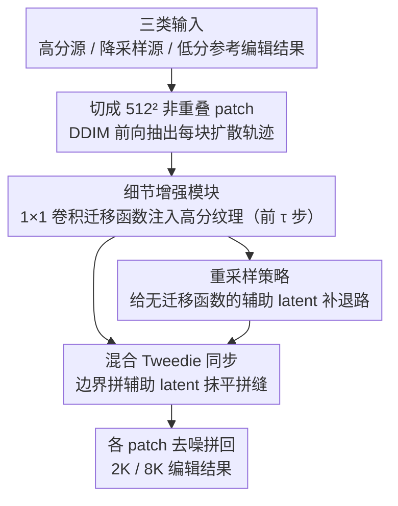

# Low-Resolution Editing is All You Need for High-Resolution Editing

**会议**: CVPR 2026  
**arXiv**: [2511.19945](https://arxiv.org/abs/2511.19945)  
**代码**: 无  
**领域**: 扩散模型 / 图像编辑  
**关键词**: 高分辨率图像编辑, 测试时优化, 细节迁移函数, 分块同步, 扩散模型

## 一句话总结
ScaleEdit 首次提出高分辨率图像编辑任务，通过在预训练生成模型的中间特征空间学习 1×1 卷积迁移函数来注入源图像的精细纹理细节，配合基于 Blended-Tweedie 的分块同步策略保证全局一致性，以测试时优化方式实现 2K 甚至 8K 分辨率的高质量编辑。

## 研究背景与动机

1. **领域现状**：文本驱动的图像编辑方法（如 Step1X-Edit、ICEdit、KV-Edit、Nano Banana）在低分辨率（≤1K）下取得了出色效果，但受限于预训练模型的输入分辨率，无法直接处理更大尺寸的图像。

2. **现有痛点**：朴素方案是先低分辨率编辑再超分辨率，但超分方法无法恢复源图像中的微观纹理细节，因为编辑过程中未以高分辨率源图为条件——细节信息在降分辨率时已丢失且无法从低分编辑结果中重建。

3. **核心矛盾**：高分辨率编辑需要同时保持语义正确性和精细纹理保真度，但预训练生成模型的分辨率固定（通常 512²），直接在高分辨率上操作不可行。

4. **本文目标** 如何利用低分辨率编辑方法的强先验，同时忠实保留高分辨率源图像中的精细细节？

5. **切入角度**：核心观察——低分辨率轨迹和高分辨率轨迹在扩散过程的中间特征空间中有可学习的映射关系。通过一个轻量的特征迁移函数学习这种映射，就可以将高分辨率细节注入到低分辨率编辑结果中。

6. **核心 idea**：用可学习的 1×1 卷积作为特征迁移函数，在逆扩散过程中将高分辨率源图像的精细细节注入到低分辨率编辑结果的生成轨迹中，配合非重叠分块同步消除边界伪影。

## 方法详解

### 整体框架
ScaleEdit 要解决的是一个看似简单却很别扭的问题：预训练编辑模型只吃得下 512² 这种小图，可我们手里是 2K、8K 的大图，还想保住大图里那些一降采样就消失的微观纹理。它的破题点是把大图切成一格格、每格都正好等于模型原生分辨率的非重叠 patch，让每个 patch 都能被原模型正常处理，再想办法把"细节"和"块间一致性"补回来。

整条流水线拿三类输入起步：高分辨率源图 $I_{\text{src}}^{\text{high}}$、它的降采样版 $I_{\text{src}}^{\text{low}}$，以及一张已经用 Nano Banana 之类标准方法编好的低分辨率参考 $I_{\text{ref}}^{\text{low}}$。处理时分三步走：先把每张图切成 $N\times M$ 个 patch，用 DDIM 前向过程把每个 patch 的扩散轨迹抽出来；再对每个 patch 学一个特征迁移函数，把高分源里的细节"灌"进编辑结果的生成轨迹；最后用 Blended-Tweedie 加重采样把相邻 patch 拼缝抹平。整个过程不训练任何网络，全靠每张图自己做测试时优化。

### 关键设计

**1. 细节增强模块：把高分源的纹理灌进低分编辑结果**

低分辨率编辑给了我们正确的语义，却丢光了源图的微观纹理——这正是"先编辑再超分"治不好的病，因为细节在降采样那一步就没了，超分网络只能凭空脑补。ScaleEdit 的做法是在预训练模型的中间特征空间里挂一个时步相关的迁移函数 $\Delta\mathbf{h}_t[i]=\phi_\theta(\mathbf{h}_t[i],t)$，用一个轻量的 1×1 卷积实现。它的优化目标是让低分源的生成轨迹尽量贴近高分源的轨迹：

$$\mathcal{L}=\big\|\mathbf{x}_{t-1}^{high}[i]-f^{rev}(\tilde{\mathbf{x}}_t[i],t;\Delta\mathbf{h}_t[i])\big\|_2^2$$

学好的迁移函数再挂到参考图的反向去噪过程上，细节就被注入进去了。这里特意不用一个常量向量去整体平移特征——因为像猫→狗这种语义改动大的编辑，图像不同区域要调的幅度根本不一样，全局偏移会顾此失彼；1×1 卷积按通道自适应地混合特征，既保住了空间布局又能做精细的逐区域调整。另外引入一个控制参数 $\tau$，让迁移函数只在前 $\tau$ 个时步生效，在"多注入细节"和"别破坏内容"之间找平衡。

**2. 混合 Tweedie 同步：让独立去噪的相邻块在拼缝处对得上**

每个 patch 各自反向去噪，到了块与块的边界就会露出明显的接缝。ScaleEdit 的招数是临时拼一个辅助 latent $\tilde{\mathbf{A}}_t[i,i+1]$——把当前块的下半部和相邻块的上半部接起来，让它正好横跨边界区域。由于这块辅助 latent 是"骑"在缝上去噪的，它的 Tweedie 单步估计 $\hat{\mathbf{x}}_{t\to 0}^{aux}$ 天然给出了一个更平滑的过渡。再把它和原始块各自的 Tweedie 估计做线性插值混合，混合权重

$$\mathbf{M}(v,t)=\frac{2v}{H_p}\cdot\Big(1-\frac{t}{\tau}\Big)$$

随着像素位置 $v$ 从块中心走向边界而线性增大，也随时步推进（$t$ 变小）整体加强——也就是越靠边、越到去噪后期，越听辅助 latent 的，于是边界被逐渐"焊"平而中心区域基本不受干扰。

**3. 重采样策略：给没有迁移函数的辅助 latent 补一条退路**

上面那个辅助 latent 是临时拼出来的，它并没有对应的迁移函数 $\Delta\mathbf{h}_t$，而单独为它再优化一个迁移函数又太贵。ScaleEdit 用重采样绕开这个矛盾：先把已经注入过细节的 latent $\tilde{\mathbf{y}}_{t-1}[i]$ 做一步不带迁移函数的前向 $\tilde{\mathbf{y}}_t^{rsp}[i]=f^{fwd}(\tilde{\mathbf{y}}_{t-1}[i],t-1)$，得到一个"细节还在、但不再依赖 $\Delta\mathbf{h}_t$"的重采样 latent。同步时就用这个重采样 latent 去拼辅助 latent，最后再用混合 Tweedie 与重采样 latent 的噪声预测一起完成真正的反向步。这样同步和细节注入被解耦开，只额外付出一次前向加反向的代价。

### 一个完整示例
拿一张 2K 源图走一遍：先按 512² 把它切成约 $4\times4=16$ 个非重叠 patch，每个 patch 单独跑 DDIM 前向拿到自己的扩散轨迹（总时步 $T=50$）。在前 $\tau=15$ 步里，每个 patch 都在线优化自己的 1×1 卷积迁移函数，把高分源的纹理往编辑结果上灌；与此同时，每对水平/垂直相邻的 patch 在边界处拼出辅助 latent，用混合 Tweedie 把缝抹平，权重在 $t\to0$ 时拉满。15 步之后迁移函数停用，剩下 35 步就是常规去噪收尾。16 个 patch 各自去噪完拼回去，得到一张既带上了源图微观纹理、拼缝又看不出来的 2K 编辑结果——同样的流程不改任何东西就能扩到 8K。

### 损失函数 / 训练策略

纯测试时优化，无需训练。迁移函数对每个分块、每个时步独立优化。使用 Stable Diffusion v2.1-base 或 FLUX.1-dev，总时步 $T=50$，$\tau=15$，空 prompt。配合 Null-text inversion 实现准确重建。低分辨率编辑用 Nano Banana 方法完成。

## 实验关键数据

### 主实验

| 方法 | HaarPSI↑ | M-MSE↓ | M-SSIM↑ | M-PSNR↑ | LPIPS↓ |
|------|---------|--------|---------|---------|--------|
| **1K-editing** | | | | | |
| DiT-SR | 0.335 | 0.058 | 0.695 | 21.53 | 0.477 |
| PiSA-SR | 0.328 | 0.058 | 0.668 | 21.27 | 0.465 |
| **ScaleEdit (Ours)** | **0.342** | **0.054** | **0.739** | **22.13** | **0.460** |
| **2K-editing** | | | | | |
| DiT-SR | 0.316 | 0.057 | 0.754 | 21.38 | 0.507 |
| PiSA-SR | 0.312 | 0.056 | 0.755 | 21.32 | 0.472 |
| **ScaleEdit (Ours)** | **0.331** | **0.053** | **0.806** | **21.96** | **0.496** |

### 消融实验

| 配置 | 关键指标 | 说明 |
|------|---------|------|
| 无同步 | 可见边界伪影 | 分块独立去噪产生明显接缝 |
| 有同步 | 边界平滑自然 | Blended-Tweedie + 重采样消除伪影 |
| 常量向量 vs 1×1 卷积 | 后者显著更好 | 空间自适应的迁移函数更鲁棒 |

### 关键发现

- ScaleEdit 在所有指标上一致超越 SR 基线方法，验证了"编辑后超分"这种 pipeline 无法恢复源图细节的论点
- Masked 指标（M-MSE、M-SSIM、M-PSNR）的优势尤其明显，说明方法更好地保留了源图中应保持不变的区域
- 方法可泛化到 FLUX 等 Transformer 架构，不限于 U-Net 架构
- 可扩展到 8K 分辨率编辑，无需额外训练

## 亮点与洞察

- 首次正式定义了高分辨率图像编辑任务，将其与简单的"编辑+超分"pipeline 区分开
- 迁移函数的设计巧妙——用 1×1 卷积在特征空间实现通道级自适应混合，既轻量又有效
- 无重叠的同步策略显著降低了计算开销——传统方法需要重叠推理，计算量随重叠比例增长
- 测试时优化框架不需要任何训练数据，对任意编辑方法和生成模型都适用

## 局限与展望

- 测试时优化每张图像都需要独立计算，推理速度较慢（需要多次前向+反向+优化式迭代）
- 超参数 $\tau$ 需要手动设置来控制细节迁移和内容保留的平衡
- 依赖低分辨率编辑结果的质量——如果低分编辑失败，高分辨率结果也无法挽救
- 分块大小固定为模型原生分辨率，无法灵活调整
- 仅展示了基于 Stable Diffusion 和 FLUX 的结果，未验证其他架构

## 相关工作与启发

- Null-text inversion 的思路被借鉴到迁移函数的设计中——通过优化可学习参数对齐前向和反向轨迹
- 分块同步的挑战在视频扩散和全景生成中也存在，本文的 Blended-Tweedie 策略可能有更广泛的应用
- 高分辨率内容创作是产业刚需，但学术界对此关注不足

## 评分

- 新颖性: ⭐⭐⭐⭐⭐ 首次定义高分辨率编辑任务，迁移函数和无重叠同步策略设计新颖
- 实验充分度: ⭐⭐⭐⭐ 定量+定性+消融+8K 演示，但数据集规模较小（100张源图）
- 写作质量: ⭐⭐⭐⭐⭐ 问题定义清晰，方法推导严谨，图示精美
- 价值: ⭐⭐⭐⭐ 高分辨率编辑是实际需求，框架通用性强可作为即插即用方案

<!-- RELATED:START -->

## 相关论文

- [\[CVPR 2026\] Training-free, Perceptually Consistent Low-Resolution Previews with High-Resolution Image for Efficient Workflows of Diffusion Models](training-free_perceptually_consistent_low-resolution_previews.md)
- [\[ECCV 2024\] You Only Need One Step: Fast Super-Resolution with Stable Diffusion via Scale Distillation](../../ECCV2024/image_generation/you_only_need_one_step_fast_super-resolution_with_stable_diffusion_via_scale_dis.md)
- [\[CVPR 2026\] ChordEdit: One-Step Low-Energy Transport for Image Editing](chordedit_one-step_low-energy_transport_for_image_editing.md)
- [\[CVPR 2026\] VOSR: A Vision-Only Generative Model for Image Super-Resolution](vosr_a_vision_only_generative_model_for_image_super_resolution.md)
- [\[CVPR 2026\] PixelRush: Ultra-Fast, Training-Free High-Resolution Image Generation via One-step Diffusion](pixelrush_ultrafast_trainingfree_highresolution_im.md)

<!-- RELATED:END -->
