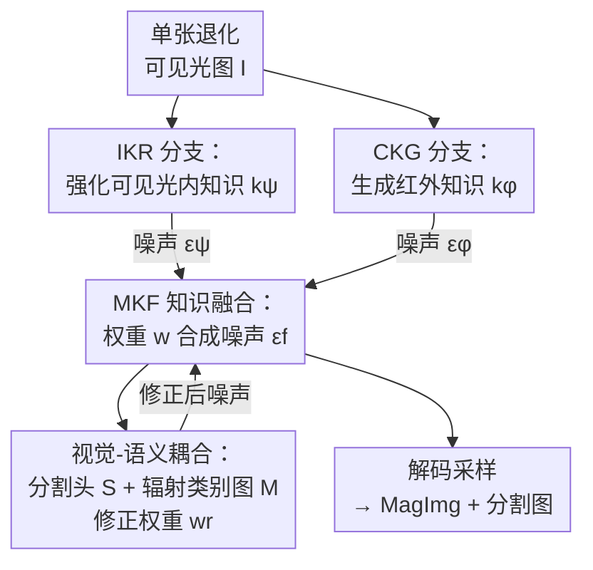

# MagicFuse: Single Image Fusion for Visual and Semantic Reinforcement

**会议**: CVPR 2026  
**arXiv**: [2602.01760](https://arxiv.org/abs/2602.01760)  
**代码**: https://github.com/zhayanping/MagicFuse (有)  
**领域**: 扩散模型 / 图像融合 / 多模态  
**关键词**: 单图融合, 红外可见光融合, 潜在扩散模型, 跨光谱知识生成, 语义分割

## 一句话总结
针对"现实中往往只有可见光相机、没有红外相机"的痛点，本文提出"单图融合 (Single Image Fusion, SIF)"新范式：用两条扩散流分别从一张低质可见光图里**强化可见光内知识**、**凭空生成红外光知识**，再在噪声层面把两者融合，得到一张兼顾人眼观感与下游语义决策的 MagImg——在只用单张退化可见光图的条件下，视觉/语义指标可与用红外-可见光配对输入的 SOTA 融合方法持平甚至反超。

## 研究背景与动机
**领域现状**：红外可见光图像融合 (IVIF) 利用红外模态补全可见光在低光/雾霾/噪声等恶劣条件下丢失的场景信息，已广泛用于侦察、智能交通、辅助驾驶。近年 TarDAL、OmniFuse、Text-DiFuse 等深度方法不断把融合在复杂环境下的鲁棒性推向新高。

**现有痛点**：所有 IVIF 方法都有一个硬性前提——**必须同时拿到配准好的红外图和可见光图**。但现实里红外热像仪因成本高常常缺席，绝大多数场景只有可见光传感器。这种"数据级缺失"直接让所有 IVIF 方法失效。退一步用图像复原从单光谱里恢复信息，但单一可见光谱内的先验本就有限，退化类型多且耦合时复原往往不理想。

**核心矛盾**：融合的本质是"跨模态互补信息"，而互补信息需要**第二个模态**。一旦红外数据级缺失，传统"数据级融合"（把两张图的像素/特征拼在一起）就无从谈起。

**本文目标**：在只有单张低质可见光图的条件下，仍然享受 IVIF 的好处，得到一个兼顾视觉质量与语义决策的跨光谱场景表征。这要回答两个根本问题：(1) 超出可见光谱的新知识从哪来？(2) 既然数据级融合不可行，怎么从数据级跃迁到知识级融合？

**切入角度**：生成式扩散模型能从大规模数据里"学出/造出"新知识——可见光谱内被退化遮蔽的细节可以靠复原扩散流补回来，红外热辐射分布可以靠"可见光→红外"翻译扩散流凭经验生成。而扩散采样每一步估计的噪声 $\bm{\epsilon}_t$ 本身就编码了知识，可以当作融合的媒介。

**核心 idea**：把融合从"数据级"提升到"知识级"——不再拼像素，而是用两条扩散流分别产出"强化的可见光知识"和"生成的红外知识"，在**噪声层面**做加权融合，从同一个高斯噪声起点连续采样出一张 MagImg。

## 方法详解

### 整体框架
MagicFuse 输入一张退化可见光图 $\bm{\mathcal{I}}\in\mathbb{R}^{H\times W\times 3}$，输出一张具备跨光谱表征能力的 Magic Image (MagImg) 以及配套的语义分割图。它把 SIF 形式化为一个知识融合问题：先用两条潜在扩散模型 (LDM) 分别产出两类知识 $\bm{k}^\psi$（可见光谱内强化知识）和 $\bm{k}^\phi$（跨光谱生成的红外知识），再让融合网络 $\mathcal{F}$ 在噪声空间把两者按权重 $\bm{w}$ 合成，最后解码成 MagImg；同时一个分割头 $\mathcal{S}$ 把融合特征对齐到语义标签，反过来修正融合权重。整条管线从一个共享的标准高斯噪声 $\bm{z}_T$ 出发，三条扩散流（IKR/CKG/MKF）同步逐步采样。

### 关键设计

**1. 单图融合 (SIF)：把融合从数据级抬到知识级**

直接动机是上面的核心矛盾——红外数据级缺席让传统融合彻底失效。本文不再去"拼第二张图"，而是把融合重新定义为知识融合问题（式 1）：$\min_{\bm{\omega}^{\mathtt f}}\mathbb{E}_{\bm{z}_T\sim\mathcal{N}(0,\bm{I})}[\mathcal{L}^{\mathtt f}(\mathcal{F}(\bm{k}^\psi,\bm{k}^\phi;\bm{\omega}^{\mathtt f}))]$，其中 $\bm{k}^\psi$ 来自可见光复原扩散流 $\Psi$、$\bm{k}^\phi$ 来自"可见光→红外"翻译扩散流 $\Phi$，两条流共享同一个噪声起点 $\bm{z}_T$。这一步的关键洞察是：第二个模态的信息**不必来自传感器，可以来自生成模型从大规模配对数据里学到的分布规律**。这样融合的对象从"两张图的像素"变成了"两条扩散流产出的知识"，从根上绕开了红外缺失的限制——这也是论文自称的首个 SIF 提案

**2. IKR + CKG 双扩散流：一路补内知识、一路造外知识**

两类知识的学习目标本质不同：可见光复原是恢复光谱内的颜色/纹理细节，"可见光→红外"翻译则要建模跨光谱的语义对应关系。因此本文实例化两条专门的扩散分支——IKR (intra-spectral knowledge reinforcement) 训练 $\Psi$ 做退化可见光复原，CKG (cross-spectral knowledge generation) 训练 $\Phi$ 学红外热辐射分布并从可见光推断红外表征。两者共用同一套 LDM 设计（带 InstanceNorm 的轻量自编码器把图映到内容中心的潜空间 $\bm{z}=\bm{\mathcal{E}}(\bm{\mathcal{I}})$，U-Net 去噪器以退化图为条件 $\bm{c}$ 预测噪声 $\bm{\epsilon}_\theta(\bm{z}_t,\bm{c},t)$，DDIM 加速采样），但参数容量不同——翻译任务更难，所以 $\Phi$（517.67M）远大于 $\Psi$（39.65M）。关键的一点是：学到的知识并不显式输出成图，而是**隐式地编码在每步预测的噪声里** $\bm{\epsilon}^\psi_t,\bm{\epsilon}^\phi_t$，为下一步"在噪声层面融合"埋下接口

**3. MKF 噪声层融合：在概率空间动态加权两类知识**

有了两路噪声，怎么合？本文构造 MKF (multi-domain knowledge fusion) 分支，让融合网络 $\mathcal{F}$ 逐时刻估计一个加权系数 $\bm{w}$，把两路噪声线性组合：$\bm{\epsilon}_t^{\mathtt f}=\bm{w}\bm{\epsilon}^\psi_t+(1-\bm{w})\bm{\epsilon}^\phi_t$（式 3）。权重不是拍脑袋给的常数，而是综合三方面信息算出来的（式 4）：两条流当前的单步初值估计 $\widetilde{\bm{z}}^\psi_{t\to0}$、$\widetilde{\bm{z}}^\phi_{t\to0}$（衡量两路知识质量，由 $\widetilde{\bm{z}}_{t\to0}=(\bm{z}_t-\sqrt{1-\bar\alpha_t}\,\bm{\epsilon}_t)/\sqrt{\bar\alpha_t}$ 单步反推得到）、两路噪声 $\bm{\epsilon}^\psi_t,\bm{\epsilon}^\phi_t$ 本身、以及 MKF 当前步的采样表征 $\bm{z}_t^{\mathtt f}$。这样权重随时间步与内容自适应变化，让"补内知识"和"造外知识"在概率空间里始终保持平衡，而不是简单平均

**4. 视觉-语义耦合：分割头既注入语义、又救活训练**

只优化视觉会让 MagImg 好看但对机器感知没用；更隐蔽的是，由于 $\bm{\epsilon}^\psi$ 和 $\bm{\epsilon}^\phi$ 都从同一输入 $\{\bm{\mathcal{I}},\bm{z}_T\}$ 产生，二者存在内在相关 $\bm{\epsilon}^\phi=A\bm{\epsilon}^\psi$，式 3 可改写成 $\bm{\epsilon}_t^{\mathtt f}=(\bm{w}+(1-\bm{w})A)\bm{\epsilon}^\psi_t$——因为两条流的条件都是可见光图，优化会完全偏向 $\bm{\epsilon}^\psi_t$（即 $\bm{w}\to1$），导致红外知识被抹掉、训练坍塌。本文在 MKF 里嵌入分割头 $\mathcal{S}$，以融合网络的注意力特征 $\bm{\zeta}$ 为输入预测分割图 $\Gamma$（式 5），再从 $\Gamma$ 导出一张辐射类别图 $\mathcal{M}$（标出行人、车辆这类典型热目标）去修正权重：$\bm{w}^{\mathtt r}=\mathcal{M}\,\text{min}(\bm{w},\bm{\tau})+(1-\mathcal{M})\bm{w}$（式 6）。在热目标区域强制把权重压到不超过超参 $\bm{\tau}$，**既保证了行人/车辆的热辐射特征被保留（语义注入），又强行打破了 $\bm{w}\to1$ 的坍塌（优化救活）**——一个模块同时解决了语义对齐和训练稳定两个问题

### 损失函数 / 训练策略
采用两阶段优化。第一阶段：在配对数据上**独立**训练 $\Psi$ 和 $\Phi$（IKR 用 14,190 对退化-干净可见光图，CKG 用 25,186 对退化可见光-干净红外图）。第二阶段：冻结 $\Psi$、$\Phi$，只训融合网络 $\mathcal{F}$（2.74M）和分割头 $\mathcal{S}$，训练信号来自两条扩散流每个时间步的输出（见 Algorithm 1）。视觉端用对比/纹理/颜色三项正则（式 10）：$\mathcal{L}_{\text{cont}}$ 让 MagImg 亮度取两路解码图的逐像素 max、$\mathcal{L}_{\text{text}}$ 对 Sobel 梯度取 max、$\mathcal{L}_{\text{color}}$ 约束色度向可见光对齐，合成 $\mathcal{L}_{\text{visual}}=\lambda_1\mathcal{L}_{\text{cont}}+\lambda_2\mathcal{L}_{\text{text}}+\lambda_3\mathcal{L}_{\text{color}}$；语义端用交叉熵 $\mathcal{L}_{\text{seg}}$（式 11）。两者联合优化驱动视觉保真与语义一致双提升。扩散步数训练/推理为 1000/25。

## 实验关键数据

数据集：IKR/CKG 在 MFNet + FMB + LLVIP 合并集上训练；MKF 用 MFNet 的 1,177 张退化可见光图+分割标签训练，在 MFNet 的 392 张退化可见光图上测试。所有对比方法都用红外-可见光配对输入，MagicFuse 只用单张退化可见光图。

### 主实验
视觉质量对比（MFNet 测试集，↑ 越大越好）：

| 指标 | TarDAL | EMMA | Text-DiFuse | DAFusion | **Ours** |
|------|--------|------|-------------|----------|----------|
| EN | 5.11 | 6.74 | 7.08 | 7.26 | **7.29 (最佳)** |
| MI | 1.45 | 3.46 | 2.99 | 3.08 | **4.13 (最佳)** |
| PSNR | 57.48 | 61.96 | 62.99 | 61.71 | **63.49 (最佳)** |
| SSIM | 0.12 | 0.43 | 0.41 | 0.42 | 0.45 |
| Qabf | 0.21 | 0.45 | 0.40 | 0.33 | 0.50 (次优) |

只用单张退化可见光图，MagicFuse 在 EN/MI/PSNR 三项拿到最佳，整体与用红外-可见光配对的 SOTA 持平甚至反超。

语义分割对比（MFNet，SegFormer 重训，mIoU↑）：

| 方法 | 输入 | mIoU |
|------|------|------|
| SegMiF | IR+VIS | 62.28 (最佳) |
| **Ours-$\mathcal{F}$** | 单张 VIS | **62.19 (次优)** |
| EMMA | IR+VIS | 61.98 |
| Text-IF | IR+VIS | 60.65 |
| Degra. VIS（退化原图） | 单张 VIS | 54.09 |

仅以单张可见光图就拿到次优 mIoU，仅落后用双模态的 SegMiF 0.09，远超退化原图的 54.09。

### 消融实验
关键组件消融（视觉 Table 6 / 语义 Table 7）：

| 配置 | EN↑ | MI↑ | PSNR↑ | mIoU↑ | 说明 |
|------|-----|-----|-------|-------|------|
| Model I：权重去掉 $\widetilde{\bm{z}}_{t\to0}$ | 7.28 | 4.09 | 62.14 | 61.05 | 权重只看噪声、不看知识质量 |
| Model II：去掉分割头 | 7.33 | 4.10 | 62.16 | 60.83 | 只有视觉引导 |
| Model III：扩散后再聚合（非逐步噪声融合） | 7.17 | 3.24 | 61.49 | 59.74 | 跨光谱能力最弱 |
| Model IV：仅靠 IKR 增强的可见光 | 7.39 | 4.08 | 62.11 | 57.18 | 无红外知识，语义崩 |
| **Full Model** | 7.29 | **4.13** | **63.49** | 61–62 | 完整模型 |

### 关键发现
- **逐时刻噪声融合是关键**：Model III 把"先各自扩散完再聚合"换掉逐步噪声融合，MI 从 4.13 暴跌到 3.24、mIoU 跌到 59.74，说明知识必须在扩散过程中、噪声层面融合才有效，事后拼图丢失大量跨光谱信息。
- **红外知识对语义最致命**：Model IV 去掉 CKG 只留可见光增强，视觉指标几乎不掉（EN 甚至 7.39 最高），但 mIoU 崩到 57.18——印证了"生成的红外知识"主要在帮机器感知（突出行人/车辆等热目标）。
- **超参 $\bm{\tau}$ 的甜点在 0.4**：$\bm{\tau}$ 调节辐射类别图对融合的影响，取 0/0.2/0.4/0.6/0.8 时，MagImg 质量与分割精度都在 $\bm{\tau}=0.4$ 达到峰值，说明跨光谱知识虽能增强表征，但注入过强会破坏原始光谱信息。
- **泛化到非融合场景**：在 Cityscapes 上把可见光图增强成 MagImg 重训 SegFormer，分割 mIoU 从 65.80 提升到 66.91，证明方法不局限于红外-可见光融合数据集，可用于几乎任意自然图。

## 亮点与洞察
- **"融合不需要第二个传感器，只需要第二份知识"**：把融合从数据级抬到知识级，用生成模型造出缺失模态的知识，这一范式转换打开了"单图也能享受多模态融合红利"的新方向，实用价值极高（红外相机贵且常缺）。
- **噪声即知识载体**：不把扩散流产出解码成图再融合，而是直接在每步预测噪声 $\bm{\epsilon}_t$ 上加权融合，这一选择很巧——噪声同时编码了语义与结构知识，且天然处在两条流的共享采样轨迹上，融合代价极低（融合网络仅 2.74M）。
- **一个分割头身兼两职**：分割头既注入语义（让 MagImg 利于下游分割），又顺手解决了"两路噪声同源导致 $\bm{w}\to1$ 训练坍塌"的优化难题——用辐射类别图在热目标区强行压权重，是个很漂亮的"一石二鸟"设计，值得迁移到其他"双分支权重易塌陷"的融合/蒸馏场景。

## 局限与展望
- **CKG 是"凭经验幻想红外"**：红外知识完全由生成模型从训练分布里推断，对训练集没见过的热辐射模式（罕见物体、异常温度场景）可能编造出不真实的热分布，存在幻觉风险；论文未讨论生成红外的可信度评估。
- **依赖大规模配对数据训练上游**：虽然推理只要单张可见光图，但 IKR/CKG 训练仍需大量退化-干净、可见光-红外配对（合计近 4 万对），换新场景/新传感器仍要重训上游扩散流。
- **语义仍略逊纯双模态方法**：mIoU 次优、泛化到 FMB 时不及多模态融合，说明生成的红外知识终究不等于真实红外测量，极端环境下机器感知上限受限。
- **改进思路**：可引入红外生成的不确定性估计，对低置信热区降低融合权重；或用少量真实红外做半监督校准 CKG，缩小"生成红外 vs 真实红外"的差距。

## 相关工作与启发
- **vs 传统 IVIF（TarDAL / SegMiF / Text-DiFuse）**：它们做数据级融合、必须有配准的红外+可见光对；本文做知识级融合、只要单张可见光。区别在于第二模态信息源——前者来自传感器，后者来自生成模型。本文优势是摆脱红外硬件依赖、适用面广；劣势是红外知识是"造"的，语义上限略低于真实双模态。
- **vs 图像复原 (image restoration)**：复原只能从可见光谱内恢复有限信息；本文在复原（IKR）之外额外用 CKG 引入跨光谱新知识，并把两者融合，信息量超出单光谱先验。
- **vs 扩散融合方法 (DDFM / OmniFuse)**：同样用扩散，但它们仍在双模态输入上做去噪/融合；本文创新在"用噪声当融合媒介 + 逐时刻动态加权 + 分割头救坍塌"，把扩散从"融合工具"用成了"知识生成+融合"的统一框架。

## 评分
- 新颖性: ⭐⭐⭐⭐⭐ 首提单图融合 (SIF)，把融合从数据级抬到知识级，范式级创新
- 实验充分度: ⭐⭐⭐⭐ 视觉/语义/泛化/消融/超参/跨域 6 类实验齐全，但缺生成红外的可信度分析
- 写作质量: ⭐⭐⭐⭐ 两个根本问题驱动叙事清晰，公式与 Algorithm 完整；符号较密集
- 价值: ⭐⭐⭐⭐⭐ 摆脱红外硬件依赖、单可见光图即可享受融合红利，实用落地价值高

<!-- RELATED:START -->

## 相关论文

- [\[CVPR 2026\] Fusion in Your Way: Aligning Image Fusion with Heterogeneous Demands via Direct Preference Optimization](fusion_in_your_way_aligning_image_fusion_with_heterogeneous_demands_via_direct_p.md)
- [\[CVPR 2026\] Leveraging Verifier-Based Reinforcement Learning in Image Editing](leveraging_verifier-based_reinforcement_learning_in_image_editing.md)
- [\[CVPR 2026\] SplitFlux: Learning to Decouple Content and Style from a Single Image](splitflux_learning_to_decouple_content_and_style_from_a_single_image.md)
- [\[CVPR 2026\] Learning Latent Proxies for Controllable Single-Image Relighting](learning_latent_proxies_for_controllable_single-image_relighting.md)
- [\[CVPR 2026\] Efficient and Training-Free Single-Image Diffusion Models](efficient_and_training-free_single-image_diffusion_models.md)

<!-- RELATED:END -->
