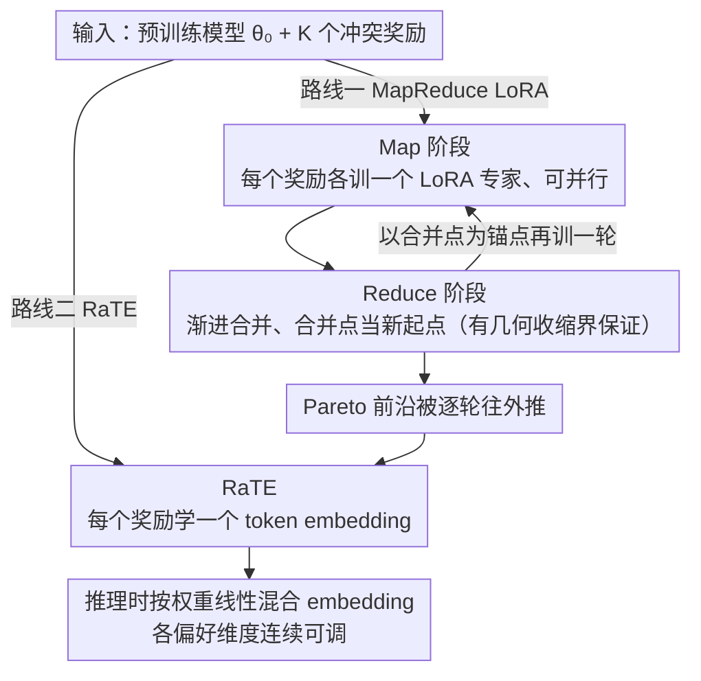

# MapReduce LoRA: Advancing the Pareto Front in Multi-Preference Optimization for Generative Models

**会议**: CVPR2026  
**arXiv**: [2511.20629](https://arxiv.org/abs/2511.20629)  
**代码**: [https://github.com/SHI-Labs/MapReduce-LoRA](https://github.com/SHI-Labs/MapReduce-LoRA)  
**领域**:图像生成
**关键词**: multi-preference optimization, LoRA merging, Pareto front, alignment tax, RLHF, text-to-image, text-to-video

## 一句话总结
提出 MapReduce LoRA 和 RaTE 两种互补方法来推进多偏好优化的 Pareto 前沿：前者通过"Map（并行训偏好专家）+ Reduce（迭代合并）"的策略渐进推进 Pareto 前沿；后者通过学习奖励感知的 token embedding 实现推理时可组合的偏好控制。

## 背景与动机
RLHF/RLAIF 已成为将生成模型与人类偏好对齐的主流范式，但现实中人类偏好本身是多维度的。以文生图为例，用户同时关注语义对齐（text alignment）、美学质量（aesthetic）、文字渲染（OCR accuracy）等多个维度，这些目标之间往往存在冲突。

传统做法是将多个奖励线性加权为单一标量进行优化，但这存在根本性问题——所谓的 **alignment tax（对齐税）**：

1. **维度间冲突**：优化某一维度（如文字渲染）常常导致其他维度（如美学质量）的退化，因为不同奖励模型的梯度方向互相矛盾
2. **线性加权的局限**：简单的线性加权只能探索 Pareto 前沿的凸包部分，非凸区域的帕累托最优解不可达
3. **超参数敏感**：权重系数需要大量消融实验调节，且不同基础模型、不同数据集上的最优权重不同
4. **无法推理时控制**：权重一旦训练时固定，推理时无法灵活调整不同偏好维度的相对重要性

从多目标优化的视角看，理想的方案应当能够**推进整个 Pareto 前沿**——即在不牺牲任何维度的前提下，同时提升所有维度或至少提升部分维度。这正是本文的核心出发点。

## 核心问题
如何在多偏好对齐中突破 alignment tax 的瓶颈，推进 Pareto 前沿，使生成模型在多个评价维度上同时提升，并支持推理时灵活调控各偏好维度？

## 方法详解

### 整体框架
本文要解决的是多偏好对齐里的 alignment tax：把 $K$ 个奖励 $\{R_k\}_{k=1}^K$ 线性加权成一个标量去优化时，提升一个维度往往以牺牲另一个维度为代价，整条 Pareto 前沿动不了。作者给出两条互补的路线。第一条 **MapReduce LoRA** 借了分布式计算里 MapReduce 的思路：先 Map——为每个偏好维度各训一个独立的 LoRA 专家，互不干扰、可并行；再 Reduce——把这些专家迭代地合并回一个模型，而且每合并一轮就把合并点当作新起点再训一轮，让前沿被逐步往外推。第二条 **RaTE** 则不动主模型，只为每个奖励学一个可训练的 token embedding，推理时按需线性混合，把"各维度权重"从训练期固定变成推理期可调。形式化地，记 $F_k(\theta) = \mathbb{E}[R_k(x, G_\theta(x))]$，目标是让向量 $\mathbf{F}(\theta) = [F_1(\theta), \ldots, F_K(\theta)]$ 达到 Pareto 最优——不是某一维独大，而是整条前沿被抬高。

### 关键设计

**1. Map 阶段——把冲突的奖励拆开，各训各的专家**

线性加权之所以会互相打架，是因为不同奖励模型的梯度方向天然矛盾，混在一起优化时谁也到不了自己的最优。Map 阶段干脆把它们解耦：对每个维度 $k$ 单独训一个 LoRA adapter $\Delta\theta_k$，只用对应的 $R_k$ 当目标，

$$\Delta\theta_k^* = \arg\max_{\Delta\theta_k} \mathbb{E}_{x}\big[R_k(x, G_{\theta_0 + \Delta\theta_k}(x))\big]$$

其中 $\theta_0$ 是预训练基础模型。因为各专家只看自己那一路奖励，训练完全互不依赖、可以并行铺开。代价是每个专家在自己维度上很强、在别的维度上往往退化——这正是留给 Reduce 阶段去缝合的。

**2. Reduce 阶段——迭代渐进合并，把合并点当锚点反复抬升**

最朴素的做法是把所有专家一次性平均（naive souping），但单次平均只能落在各专家张成的凸组合里，常常顾此失彼。本文改成**渐进合并**：先初始化 $\bar{\theta}^{(0)} = \theta_0 + \frac{1}{K}\sum_k \Delta\theta_k$，然后在第 $t$ 轮里，以当前合并模型 $\bar{\theta}^{(t-1)}$ 为参考点对每个维度重新微调出新专家 $\Delta\theta_k^{(t)}$，再合并成 $\bar{\theta}^{(t)} = \bar{\theta}^{(t-1)} + \frac{\eta}{K}\sum_k \Delta\theta_k^{(t)}$。关键在于每轮都把"上一轮的合并点"当作所有专家的新起点——专家不再从原始 $\theta_0$ 出发去拉扯，而是从一个已经多维都不差的位置做小幅修正，于是整条 Pareto 前沿被一轮轮往外推，而不是停在凸包上。实验里这种迭代很快收敛：1 轮就有明显提升，2–3 轮基本到顶。

**3. 收敛性理论——证明渐进合并是会收缩的**

渐进合并不只是经验技巧。作者证明它等价于一个 **averaged proximal consensus optimization**，并给出几何收缩界：设 $d^{(t)} = \max_k \|\Delta\theta_k^{(t)}\|$ 为第 $t$ 轮各专家相对合并点的最大偏移量，则

$$d^{(t+1)} \leq \rho \cdot d^{(t)}, \quad \rho < 1$$

收缩率 $\rho$ 取决于各奖励景观的光滑性与曲率。直观含义是：随着迭代推进，专家彼此的分歧 $d^{(t)}$ 单调缩小，合并点稳定地逼近一个"各维度都较优"的共识区域——这解释了为什么实验里几轮就收敛，而 naive 一次合并在语言模型上反而会退化。

**4. RaTE——把偏好权重从训练期固定挪到推理期可调**

MapReduce LoRA 抬高的是整体"天花板"，但权重一旦训完就锁死了，用户没法在推理时再权衡。RaTE 补上这块：为每个奖励维度 $k$ 学一个可训练的 token embedding $e_k \in \mathbb{R}^d$，推理时按权重线性组合成 $e = \sum_k w_k e_k$ 注入模型输入空间，而 $w_k$ 完全由用户在推理时给定。训练时则冻结主模型，只更新这些 embedding：每步从 Dirichlet 分布采一组权重 $\mathbf{w} \sim \text{Dir}(\alpha)$，以混合奖励 $R(\mathbf{w}) = \sum_k w_k R_k$ 为目标。这样 token embedding 学到的其实是"奖励空间 → embedding 空间"的映射，推理时在权重单纯形里平滑滑动，生成结果就在各偏好维度间连续变化。两者还能叠用：先用 MapReduce LoRA 把前沿推出去，再用 RaTE 在更高的前沿上做推理时的精细调控。

## 实验关键数据

### 文生图（Text-to-Image）

| 方法 | 基础模型 | GenEval ↑ | PickScore ↑ | OCR Acc ↑ | Pareto 推进 |
|------|---------|-----------|-------------|-----------|------------|
| 基线 (SD3.5M) | SD3.5M | 0.56 | 21.8 | 21.1% | - |
| Multi-reward RL | SD3.5M | 0.68 | 22.1 | 28.3% | 部分 |
| Naive Souping | SD3.5M | 0.70 | 22.3 | 30.5% | 部分 |
| **MapReduce LoRA** | SD3.5M | **0.76** (+36.1%) | **22.8** (+4.6%) | **32.9** (+55.7%) | **全面推进** |
| 基线 (FLUX) | FLUX | 0.62 | 22.0 | 18.9% | - |
| **MapReduce LoRA** | FLUX | **0.82** (+32.7%) | **22.9** (+4.3%) | **31.6** (+67.1%) | **全面推进** |

### 文生视频与语言模型

| 任务 | 模型 | 维度1 | 维度2 | 备注 |
|------|------|-------|-------|------|
| T2V | HunyuanVideo | VQ +48.1% | MQ +90.0% | 视觉/运动质量同时提升 |
| Language | Llama-2 7B | helpful +43.4% | harmless +136.7% | 有用性和无害性均大幅提升 |
| Language (ablation) | Llama-2 7B | naive soup 退化 | progressive soup 提升 | 验证迭代合并的必要性 |

### 消融实验
- **迭代轮数**：1 轮合并已有显著提升，2–3 轮后基本收敛，与理论预测的几何收缩一致
- **Naive vs Progressive Souping**：naive 一次合并在 T2I 上仅推进约 60% 的 Pareto 面积（相对 progressive），在语言模型上甚至会退化
- **RaTE 的可控性**：在 RaTE 的权重空间中均匀采样，生成结果在各偏好维度上呈现平滑的连续变化，验证了可控性

## 亮点
- **MapReduce 范式**：借鉴分布式计算的 MapReduce 思想，将多偏好优化解耦为"独立训练 + 迭代合并"，简洁优雅且有理论保证
- **跨模态通用性**：同一框架在 T2I（SD3.5M, FLUX）、T2V（HunyuanVideo）和语言模型（Llama-2 7B）上均有效，说明方法的通用性
- **Pareto 前沿的系统性推进**：不是单点提升，而是在多个维度上同时提升，真正解决了 alignment tax 问题
- **推理时可控**：RaTE 提供了轻量级的推理时偏好调控，用户可以根据需求灵活调整各维度权重
- **理论扎实**：progressive souping 的收敛性有严格的数学证明，不是纯经验的方法

## 局限与展望
1. **LoRA 专家数量扩展性**：当偏好维度 $K$ 很大时，Map 阶段的计算和存储成本线性增长，需要探索更高效的专家共享机制
2. **奖励模型质量的依赖**：方法的上限受限于奖励模型的质量，如果奖励模型本身有偏差，Pareto 前沿也会偏移
3. **迭代合并的额外开销**：虽然每轮迭代可并行，但多轮迭代总计算量仍然不小（每轮都需要重新微调所有专家）
4. **RaTE 的表达能力**：token embedding 的维度和注入方式可能限制了可控性的精细度，对于高度非线性的偏好交互可能不够
5. **评估维度有限**：目前主要在 3–4 个偏好维度上验证，更大规模的多维偏好（如 10+ 维）上的表现有待验证

## 评分
- 新颖性: ⭐⭐⭐⭐ MapReduce 范式简洁优雅，理论与实践结合紧密
- 实验充分度: ⭐⭐⭐⭐⭐ 跨 T2I/T2V/语言三个模态，多个基础模型，消融完整
- 写作质量: ⭐⭐⭐⭐ 结构清晰，理论部分自成体系
- 价值: ⭐⭐⭐⭐⭐ 切中多偏好对齐的核心痛点，方法通用性强，实用价值高

<!-- RELATED:START -->

## 相关论文

- [\[ICLR 2026\] Pareto-Conditioned Diffusion Models for Offline Multi-Objective Optimization](../../ICLR2026/image_generation/pareto-conditioned_diffusion_models_for_offline_multi-objective_optimization.md)
- [\[CVPR 2026\] Quantization with Unified Adaptive Distillation to enable multi-LoRA based one-for-all Generative Vision Models on edge](quantization_with_unified_adaptive_distillation_to_enable_multi-lora_based_one-f.md)
- [\[CVPR 2026\] MICo-150K: A Comprehensive Dataset Advancing Multi-Image Composition](mico-150k_a_comprehensive_dataset_advancing_multi-image_composition.md)
- [\[CVPR 2026\] ChimeraLoRA: Multi-Head LoRA-Guided Synthetic Datasets](chimeralora_multi-head_lora-guided_synthetic_datasets.md)
- [\[CVPR 2025\] Calibrated Multi-Preference Optimization for Aligning Diffusion Models](../../CVPR2025/image_generation/calibrated_multi-preference_optimization_for_aligning_diffusion_models.md)

<!-- RELATED:END -->
