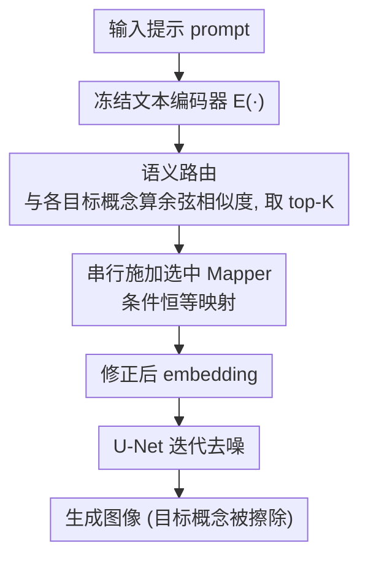

# MapRoute: Semantic Routing for Precise Concept Erasure with Mapper

**会议**: CVPR 2026  
**论文**: [CVF Open Access](https://openaccess.thecvf.com/content/CVPR2026/html/Li_MapRoutePrecise-Concept_Erasing_Mappers_via_Semantic_Routing_CVPR_2026_paper.html)  
**代码**: https://github.com/GG-li/MapRoute  
**领域**: 图像生成 / 概念擦除 / 扩散模型安全  
**关键词**: 概念擦除, 文本到图像扩散, 条件恒等映射, 语义路由, 即插即用适配器

## 一句话总结
MapRoute 在冻结文本编码器之后插入一组轻量"Mapper"模块——每个 Mapper 通过两阶段训练学会一个"条件恒等映射"（把待擦除目标概念的 embedding 映射到代理概念、对其余概念保持恒等），推理时再用 top-K 语义路由按输入提示动态选择并串行施加相关 Mapper，从而在彻底擦除指定概念的同时几乎不损伤无关概念，在物体/名人/艺术风格/混合概念擦除上全面超过 MACE、UCE 等 SOTA。

## 研究背景与动机

**领域现状**：大规模文本到图像（T2I）扩散模型生成能力极强，但也带来版权侵权、隐私泄露、违规内容等风险。概念擦除（Concept Erasure）旨在让模型"忘记"特定概念（如某名人脸、某艺术家风格、某物体类别）。现有方法可归为三类：基于损失的优化（如 ESD、CRCE、AGE）、闭式解析投影（如 UCE、MACE、RealEra）、即插即用适配器（如 SPM、Receler）。其中适配器范式在可定制性与可迁移性间取得较好平衡——新增敏感概念时只需微调/替换适配器，无需重训基座。

**现有痛点**：擦除方法普遍有两个硬伤。(1) **擦除不彻底**：模型偶尔仍会生成含目标概念的图像；(2) **语义选择性差**：擦除目标的同时殃及无关概念，整体生成质量下降。具体到适配器范式，还有两个额外约束：一是**强依赖高质量配对数据**（"目标概念 vs 代理概念"对），缺好的代理就擦不干净或误伤合法概念，且为每个目标手工指定"语义近邻"代理极其繁琐（如判断两位艺术家风格是否相似几乎不可操作）；二是**多概念擦除时参数冲突**——把多个适配器堆在一起会引发部分擦除失败、画质退化，需要复杂的参数隔离机制；而闭式投影法用 SVD 抽取并清零目标主成分时，常因目标概念与合法概念非线性纠缠而误伤（如抹掉"英国史宾格犬"时连带损坏所有犬类）。

**核心矛盾**：擦除（彻底删掉目标）与保持（不动无关概念）之间存在 trade-off，根因在于大多数方法**全局修改模型参数**，无法把干预精确局部化到目标概念上。

**本文目标**：(1) 设计一个不改基座权重、不依赖高质量配对数据的轻量擦除模块；(2) 让多概念擦除时各模块互不冲突、不发生灾难性遗忘。

**切入角度**：作者借助 CLIP/文本编码器 embedding 空间的**语义线性结构**——任意语义可近似表示为人类可解释概念的稀疏线性组合——把擦除转化为"在 embedding 空间里对特定概念做映射"。

**核心 idea**：在冻结文本编码器后插入 Mapper，让它学一个"对目标概念做替换、对其余概念恒等"的条件映射；再用输入驱动的 top-K 路由，按提示只激活相关 Mapper 并串行施加，实现精准、可扩展、无配对数据依赖的擦除。

## 方法详解

### 整体框架
MapRoute 由三部分组成：(1) Mapper 模块设计、(2) 两阶段学习策略、(3) 语义路由。**训练侧**：为每个目标概念 $c_{tar}$ 单独训练一个 Mapper $M_{c_{tar}}$，先自监督学恒等映射、再学"目标→代理"映射，产出一个可复用的 Mapper 擦除语料库。**推理侧**：提示经冻结文本编码器得到 embedding 后，语义路由计算该 embedding 与所有目标概念 embedding 的余弦相似度，取 top-K 最相关的 Mapper，把它们**串行**接在文本编码器之后依次施加，得到修正后的 embedding，再喂给 U-Net 迭代去噪生成图像。由于干预只发生在 embedding 层、且只对被激活概念生效，无关概念几乎零损伤。

### 关键设计

**1. Mapper：在 embedding 空间学条件恒等映射**

为什么不直接微调已有的线性层或注意力层？因为那会**全局**改动参数、连带拉低无关概念的生成质量。Mapper 改为在文本编码器之后**插入新模块**，把擦除局部化到 embedding 变换上。它是一个轻量前馈模块，含三个 Map 层（每层 = 线性层 + GELU）加一个 LayerNorm。它学的是一个**条件恒等映射** $M_{c_{tar}}$：

$$M_{c_{tar}}(E(c))=\begin{cases}E(c_{sur}), & c=c_{tar}\\ E(c), & \text{其他}\end{cases}$$

其中 $E(\cdot)$ 是冻结的预训练文本编码器，$c_{sur}$ 是代理（替换）概念的 embedding。直觉是：对要擦的目标概念，把它的 embedding 改写成一个良性代理；对其余所有概念，原样保留（恒等）。因为每个目标概念配一个专属 Mapper，多概念场景可灵活定制，也避免了把大量 Mapper 简单串联导致的灾难性遗忘。

**2. 两阶段训练：先学"全保留"，再学"定点替换"**

Mapper 的"条件"二字靠两阶段优化实现。**阶段一（自监督恒等，前 10 个 epoch）**：冻结文本编码器，让 Mapper 对概念字典中**所有**概念学恒等映射，

$$\mathcal{L}_{stage1}=\mathbb{E}_{c\in C}\big[\|M_{c_{tar}}(E(c))-E(c)\|_2^2\big]$$

作者用 1000 个随机 768 维向量模拟真实文本 embedding 验证，10 个 epoch 后输入输出平均 MSE 仅 $1\times10^{-6}$，说明 Mapper 已学到精确恒等。**阶段二（定点替换）**：在恒等基础上只把目标概念映射到代理，同时用两项保持损失防止误伤：

$$\mathcal{L}_{learn}=\mathbb{E}_{c_{tar}}\big[\|M_{c_{tar}}(E(c_{tar}))-E(c_{sur})\|_2^2\big]$$

$$\mathcal{L}_{stage2}=\mathcal{L}_{learn}+\alpha\,\mathcal{L}_{keep1}+\beta\,\mathcal{L}_{keep2}$$

其中 $\mathcal{L}_{keep1}$ 在概念字典上保持恒等、$\mathcal{L}_{keep2}$ 在 8578 个英文人名集合上保持恒等（专为名人擦除设计），$\alpha=\beta=1$。概念字典取自 LAION-400M 中最高频的 10,000 个单词概念 + 5,000 个双词概念（去 NSFW、两两余弦相似度 $<0.9$）。两阶段下来，Mapper 既能精准擦目标、又对其余概念近乎零失真。

**3. 代理概念无关性：摆脱对高质量配对数据的依赖**

适配器方法的老大难是"为每个目标手工挑一个语义近邻代理"。MapRoute 指出：既然 Mapper 学的是**条件恒等映射**，代理概念是什么并不重要——可以把"汽车"映射到"梵高"、"卡车"映射到"猫"这种毫无语义关联的目标。实验表明，不同代理概念给出的擦除效果**高度一致**、最终结果几乎与代理选择无关（图 2 用四个不同代理训练的 Mapper 对同一提示生成，擦除效果一致）。这直接消除了对高质量"目标 vs 代理"配对数据的依赖，也省去了为海量概念定义语义近邻的繁琐工程。

**4. 语义路由：top-K 动态选择 + 串行施加，避免参数冲突与遗忘**

为每个概念都训了 Mapper 后，如何让单个模型灵活擦除一条提示里的多个概念、又不触发"把所有 Mapper 一锅端"带来的灾难性遗忘？作者设计输入驱动的语义路由：计算输入提示 embedding 与所有目标概念 embedding 的余弦相似度，取 top-K：

$$\mathcal{M}^{(k)}=\big\{M_i\in\mathcal{M}\mid sim_i\in\mathrm{TopK}(\{sim_1,sim_2,\dots\},k)\big\}$$

被选中的 $k$ 个 Mapper **串行**接在文本编码器之后，提示 embedding 依次穿过每个激活模块，逐个抹掉对应的不需要概念。这样既无需为每个目标概念重跑整条擦除流水线，也因为"只激活相关模块"而天然避开了多适配器参数冲突——这是它在混合概念擦除上尤其突出的原因。

## 实验关键数据

> 全部实验基于 Stable Diffusion v1.4；单个 Mapper 训练约 13.3 分钟（A100），推理约 6 秒；采样用 PNDM、50 步、CFG=7.5。对比 MACE、FMN、UCE、SPM、ESD、RECE、GLoCE 等。
>
> **自定义指标**：物体擦除用三调和均值 $H_o=\dfrac{3}{(1-\text{ACC}_e)^{-1}+(\text{ACC}_s)^{-1}+(1-\text{ACC}_g)^{-1}}$，其中 $\text{ACC}_e$ 为目标类残留准确率（越低越好）、$\text{ACC}_s$ 为无关类保持准确率（越高越好）、$\text{ACC}_g$ 为同义词泛化擦除准确率（越低越好）。名人擦除用 $H_c=\dfrac{2}{(1-GCD_e)^{-1}+(GCD_s)^{-1}}$（GCD = GIPHY 名人检测器）。艺术风格用 $H_a=\text{CLIP}_s-\text{CLIP}_e$。

### 主实验：物体擦除（CIFAR-10，10 类平均，Table 1）

| 方法 | ACCe ↓ | ACCs ↑ | ACCg ↓ | Ho ↑ |
|------|------|------|------|------|
| FMN | 96.96 | 96.73 | 82.56 | 6.13 |
| SPM | 95.00 | 99.53 | 83.36 | 14.95 |
| UCE | 13.54 | 98.45 | 23.18 | 85.48 |
| RECE | 21.55 | 98.32 | 22.92 | 81.59 |
| MACE | 10.53 | 92.61* | — | 92.61 |
| **MapRoute（Ours）** | **0.92** | **99.37** | — | **99.37** |

MapRoute 把目标残留 ACCe 压到接近 0、无关类保持 ACCs 接近 99.4，10 类平均 Ho≈99，远超此前最强的 MACE/UCE。⚠️ 缓存中 Table 1 多列数值密集换行、个别单元（如 MACE 的 ACCs/Ho 对应列）易错位，具体数值以原文 PDF 为准。

### 名人擦除（Table 2，50 名人多概念）

| 方法 | GCDe ↓ | GCDs ↑ | Hc ↑ |
|------|------|------|------|
| GLoCE | 3.20 | 79.28 | 87.17 |
| MACE | 9.50 | 81.83 | 85.95 |
| **MapRoute（Ours）** | **0.00** | **90.16** | **94.83** |

MapRoute 在单/多名人擦除上 GCDe 均接近 0，且 GCDs 几乎与原模型（SD v1.4）持平，说明"擦得干净"与"保得住"两头兼顾；而 FMN 擦不净还误伤、GLoCE 对部分名人（如 Adriana Lima）直接擦除失败。

### 消融与定性发现
- **擦除-保持 trade-off 被打破**：现有方法要么擦不净（FMN、SPM 的高 ACCe）、要么过度正则误伤无关类（ESD-x/-u 略降 ACCs）；MapRoute 在精度、可控性、泛化三方面同时领先。
- **两阶段缺一不可**：阶段一恒等映射的 MSE 仅 $1\times10^{-6}$ 是后续精准擦除的前提；阶段二的 $\mathcal{L}_{keep1/2}$ 保证擦目标时不动字典概念与人名（4.5 节与附录有详细消融）。
- **代理无关性可定性验证**：图 2 用四个语义无关代理（如 Map-truck、Map-Bruce Lee）训练的 Mapper 对同一提示生成，擦除效果一致，印证代理选择对结果近乎无影响。
- **混合概念最突出**：在 CIFAR-10 物体 × 三种艺术风格（Van Gogh/Canaletto/Monet）的混合提示上，MACE 擦物体尚可但损风格、SPM 漏擦；MapRoute 因 top-K 路由只激活相关模块，能同时擦掉物体与风格并保住其余（图 5/6）。

## 亮点与洞察
- **把擦除当 embedding 空间的条件映射**：不动基座权重、只在文本 embedding 上做"目标替换 + 其余恒等"，从机制上把干预局部化，这是它"擦得净又不误伤"的根。
- **代理无关性是真正解放**：证明 Mapper 学的是条件映射、代理可任意（汽车→梵高），一举甩掉适配器方法对高质量配对数据/语义近邻的依赖——这个观察很反直觉也很实用。
- **路由解决多概念冲突**：用输入驱动的 top-K 串行路由替代"堆所有适配器"，天然规避参数冲突与灾难性遗忘，可扩展到多概念且无需重训整条流水线。
- **轻量可复用**：每个 Mapper 13.3 分钟即可训好、即插即用，新增敏感概念只需训一个新 Mapper 加进语料库，适合动态更新的安全策略。

## 局限与展望
- **每概念一个 Mapper 的存储/管理成本**：擦除语料库随概念数线性增长，超大规模概念集下的存储与路由检索开销值得关注。
- **依赖 embedding 语义线性假设**：方法建立在 CLIP/文本编码器 embedding 近似线性可分解之上，对语义高度纠缠或编码器表达不足的概念，恒等-替换映射是否仍精确存疑。
- **路由 K 与相似度阈值的鲁棒性**：top-K 选择依赖余弦相似度排序，提示改写、同义词攻击或对抗性 prompt 下能否稳定命中正确 Mapper，论文主要靠同义词泛化（ACCg）间接评估。
- **仅在 SD v1.4 验证**：未在 SDXL、新一代 T2I 或更大编码器上验证可迁移性。
- ⚠️ 缓存为 OCR 文本，多处公式（式 1–7）与大表（Table 1/2）存在断行、符号缺失，关键数值与公式以原文为准。

## 相关工作与启发
- **vs MACE / UCE（闭式投影）**：闭式法用 SVD/最小二乘在交叉注意力 K/V 上清零目标子空间，目标与合法概念非线性纠缠时易误伤（抹某犬种连带损全部犬类）；MapRoute 在 embedding 上做条件映射，按概念精准定点、保持更好。
- **vs SPM / Receler（即插即用适配器）**：SPM 需为每个目标手工指定唯一代理、Receler 需对抗训练且依赖安全/不安全图像对；MapRoute 代理无关、无需图像配对，且用路由化解多适配器参数冲突。
- **vs ESD / CRCE / AGE（损失优化）**：这类法微调基座、迭代成本高且会不可预期地影响整体生成能力；MapRoute 冻结基座、只训轻量 Mapper，干预可逆、副作用小。

## 评分
- 新颖性: ⭐⭐⭐⭐ "条件恒等映射 + 代理无关 + 语义路由"组合在擦除任务中较新颖。
- 实验充分度: ⭐⭐⭐⭐ 覆盖物体/名人/风格/混合四类擦除，对比 7 个 SOTA，指标设计完整。
- 写作质量: ⭐⭐⭐⭐ 动机与方法清晰，三组件分工明确；自定义指标解释到位。
- 价值: ⭐⭐⭐⭐ 即插即用、代理无关、可扩展多概念，对 T2I 安全与版权合规有实用价值。

<!-- RELATED:START -->

## 相关论文

- [\[CVPR 2026\] Beyond Text Prompts: Precise Concept Erasure through Text–Image Collaboration](beyond_text_prompts_precise_concept_erasure_through_text-image_collaboration.md)
- [\[CVPR 2026\] EMMA: Concept Erasure Benchmark with Comprehensive Semantic Metrics and Diverse Categories](emma_concept_erasure_benchmark_with_comprehensive_semantic_metrics_and_diverse_c.md)
- [\[CVPR 2026\] Closed-Form Concept Erasure via Double Projections](closed-form_concept_erasure_via_double_projections.md)
- [\[CVPR 2026\] Prototype-Guided Concept Erasure in Diffusion Models](prototype-guided_concept_erasure_in_diffusion_models.md)
- [\[ICLR 2026\] SPEED: Scalable, Precise, and Efficient Concept Erasure for Diffusion Models](../../ICLR2026/image_generation/speed_scalable_precise_and_efficient_concept_erasure_for_diffusion_models.md)

<!-- RELATED:END -->
