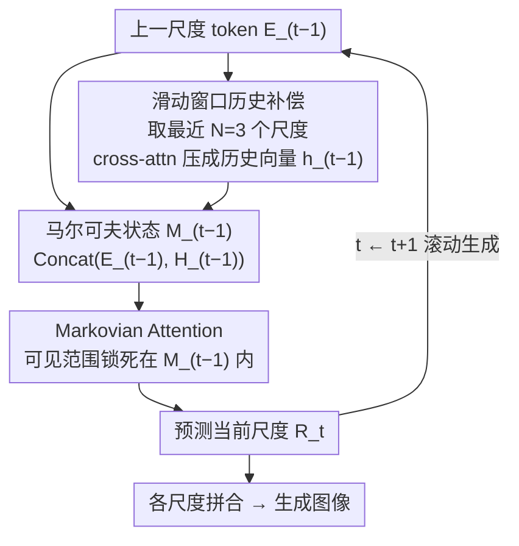

# Markovian Scale Prediction: A New Era of Visual Autoregressive Generation

**会议**: CVPR 2026  
**arXiv**: [2511.23334](https://arxiv.org/abs/2511.23334)  
**代码**: [有](https://luokairo.github.io/markov-var-page/)  
**领域**:图像生成
**关键词**: 视觉自回归生成, 马尔可夫过程, 多尺度预测, 内存效率, 图像生成  

## 一句话总结

将视觉自回归模型 (VAR) 从全上下文依赖的 next-scale prediction 重构为基于马尔可夫过程的 Markovian scale prediction，通过滑动窗口历史补偿机制实现非全上下文建模，在 ImageNet 上 FID 降低 10.5%、峰值内存减少 83.8%。

## 研究背景与动机

视觉自回归建模 (VAR) 通过 next-scale prediction 取代 next-token prediction，以粗到细方式生成图像，在视觉生成领域取得突破。然而 VAR 的**全上下文依赖**（预测当前尺度需关注所有先前尺度）引发三大问题：

**计算开销巨大**：随尺度增长 token 数二次增长，跨尺度累积建模使计算超线性增加。1024×1024 分辨率下 depth-24 VAR 峰值内存达 117.9GB

**误差持续累积**：自回归的单向因果链无法修正早期预测误差。实验表明早期注入的扰动对 FID 的影响远大于后期注入（第一个尺度扰动导致最大 FID 下降），且全上下文依赖反复利用错误信息加剧累积

**跨尺度干扰**：全上下文注意力使不同尺度的梯度在共享特征空间竞争和冲突。作者计算 RFA (Residual-Feature Alignment) 分数——当前尺度输出残差特征与各先前尺度输入特征的余弦相似度，发现**早期尺度对当前表征学习通常有负面影响**

核心动机源自信息论**充分统计量**概念：连续链式传播中每个节点本身维护了代表性历史信息，适当蒸馏即可实现有效预测而无需全部历史。

## 方法详解

### 整体框架

Markov-VAR 将 VAR 改造为非全上下文马尔可夫过程：

- **VAR 原始建模**：$p(R_1, \ldots, R_T) = \prod_{t=1}^{T} p(R_t | \langle\text{sos}\rangle, R_{<t})$，每尺度依赖所有先前尺度
- **Markov-VAR 建模**：$p(R_1, \ldots, R_T) = \prod_{t=1}^{T} p(R_t | M_{t-1})$，每尺度仅依赖当前马尔可夫状态

其中 $M_t = f_\phi(R_t, M_{t-1})$ 为代表性动态状态，$M_0 = \langle\text{sos}\rangle$。

### 关键设计

**1. 马尔可夫状态定义：让当前尺度自己充当"历史的浓缩"**

VAR 的痛点在于预测第 $t$ 个尺度时要回看全部 $R_{<t}$，既贵又会反复放大早期错误。作者从信息论的充分统计量切入跳出这个困境：完整历史 $c_{<t}$ 与当前时刻 $c_t$ 的互信息高度冗余，存在一个充分统计量 $c_{t-1}$ 使得 $I(c_{t-1}; c_t) = I(c_{<t}; c_t)$——也就是说，只要 $c_{t-1}$ 已经把"对预测 $c_t$ 有用的历史"都编码进去了，再往前翻就是多余的。链式单向自回归恰好满足这个条件：每个尺度在生成时已经吸收了代表性的历史信息，可以直接当作马尔可夫状态用。这样建模就从 $p(R_t | R_{<t})$ 收缩为 $p(R_t | M_{t-1})$，从根本上消掉全上下文依赖，连 KV cache 都不再需要。

**2. 滑动窗口历史补偿：补回"只看上一个尺度"丢掉的近期信息**

只用 $E_{t-1}$ 当状态毕竟太激进，单个尺度未必真的是完美的充分统计量。作者用一个大小为 $N$ 的滑动窗口 $\mathcal{W}_t = \{E_{t-1}, E_{t-2}, \ldots, E_{t-N}\}$ 把最近几个尺度的 token 序列拼成 $\hat{X}_t$，再用一个可学习的全局状态查询 $q$ 通过 cross-attention 把它压成一个固定维度的历史向量：

$$h_{t-1} = \text{Attn}(q, \hat{X}_t, \hat{X}_t)$$

这个历史向量广播后与当前尺度特征拼接，就得到送进下一步的代表性动态状态：

$$M_{t-1} = \text{Concat}(E_{t-1}, H_{t-1})$$

关键是窗口"滑动"而非"全收"：生成第 4 个尺度时只看尺度 1–3，到第 5 个尺度时窗口前移、丢掉尺度 1 只看 2–4，历史始终是固定大小的一小段近邻而不是越堆越长的全序列。窗口大小取 $N=3$ 经消融最优，正好和 RFA 分析对上——最近 3 个尺度对当前表征是正贡献，再早的尺度反而带来干扰，所以"补一点近期、丢掉远期"既省又准。

**3. Markovian Attention：把注意力锁死在动态状态内，掐断跨尺度干扰**

光改建模公式还不够，注意力掩码也得跟着改。VAR 用的是全因果注意力，每个尺度都能看到此前所有尺度，这正是跨尺度梯度在共享特征空间里互相竞争的根源。Markovian attention 把每个尺度的可见范围严格限制在它自己的动态状态 $M_{t-1}$ 内，不同尺度之间互不窥视，于是每个尺度能专心学自己那一层的独特表征。配合前两点，整条链既不需要保存历史 KV、又消除了干扰，质量和效率同时受益。

### 损失函数 / 训练策略

- **损失函数**：交叉熵 $\mathcal{L} = \sum_{t=1}^{T} CE(\hat{R}_t, R_t)$
- **训练方案**：Teacher-forcing + Markovian attention mask
- **优化器**：AdamW，lr=$8 \times 10^{-5}$，$\beta_1=0.9$，$\beta_2=0.95$
- **规模**：batch 768-1536，epochs 200-400，8×H200 GPU
- **编码器**：使用 VAR 预训练的多尺度 VQ-VAE tokenizer
- **位置编码**：Rotary Positional Embedding (RoPE)
- **网络结构**：LLaMA-style attention 和 MLP blocks，宽度 $w=64d$，注意力头数 $h=d$

## 实验关键数据

### 主实验 (ImageNet 256×256 class-conditional)

| 模型 | 参数量 | FID↓ | IS↑ | Precision↑ | Recall↑ |
|------|--------|------|-----|------------|---------|
| VAR-d16 | 310M | 3.61 | 225.6 | 0.81 | 0.52 |
| **Markov-VAR-d16** | 329M | **3.23** | **256.2** | **0.84** | 0.52 |
| VAR-d20 | 600M | 2.67 | 254.4 | 0.81 | 0.57 |
| **Markov-VAR-d20** | 623M | **2.44** | **286.1** | 0.83 | 0.56 |
| VAR-d24 | 1.0B | 2.17 | 271.9 | 0.81 | 0.59 |
| **Markov-VAR-d24** | 1.02B | **2.15** | **310.9** | 0.83 | 0.59 |
| DiT-XL/2 (Diffusion) | 675M | 2.27 | 278.2 | 0.83 | 0.57 |

效率对比 (batch=25, single H200):

| 模型 | 分辨率 | 推理时间(s)↓ | 峰值内存(GB)↓ | 内存降幅 |
|------|--------|--------------|---------------|---------|
| VAR-d24 | 256 | 0.711 | 12.4 | — |
| Markov-VAR-d24 | 256 | 0.608 | 4.7 | **-62.1%** |
| VAR-d24 | 512 | 1.335 | 31.4 | — |
| Markov-VAR-d24 | 512 | 1.261 | 8.1 | **-74.2%** |
| VAR-d24 | 1024 | 5.891 | 117.9 | — |
| Markov-VAR-d24 | 1024 | 5.322 | 19.1 | **-83.8%** |

### 消融实验

历史补偿机制 (depth-16):

| 方法 | 参数量 | FID↓ | IS↑ |
|------|--------|------|-----|
| 无历史补偿 | 300M | 3.64 | 247.7 |
| 全局历史（全上下文补偿） | 324M | 3.41 | 245.2 |
| 混合历史 | 359M | 3.45 | 257.4 |
| **滑动窗口 (Ours)** | 329M | **3.23** | **256.2** |

滑动窗口大小:

| 窗口大小 | FID(d16)↓ | IS(d16)↑ | FID(d20)↓ | IS(d20)↑ |
|----------|-----------|----------|-----------|----------|
| 1 | 3.53 | 237.8 | 2.50 | 267.9 |
| 2 | 3.39 | 248.6 | 2.47 | 281.4 |
| **3** | **3.23** | **256.2** | **2.44** | **286.1** |
| 4 | 3.33 | 252.3 | 2.56 | 278.2 |

### 关键发现

1. d16 模型 FID 从 3.61→3.23 (提升 10.5%)，IS 从 225.6→256.2 (提升 13.6%)
2. 1024 分辨率峰值内存从 117.9GB→19.1GB (减少 83.8%)，且无需 KV cache
3. 窗口大小 $N=3$ 在所有深度上均最优，理论分析与实验高度一致
4. 缩放定律良好：loss 和 error rate 随模型增大呈幂律下降，$R^2 > 0.99$
5. Markov-VAR-d20 仅用 M-VAR-d20 约 70% 参数即达到竞争性能

## 亮点与洞察

1. **理论与实验的优美统一**：从信息论充分统计量出发论证马尔可夫假设，RFA 分析和扰动实验提供直接实证
2. **"Less is more" 的深刻验证**：减少上下文依赖反而提升质量，因全上下文引入跨尺度干扰
3. **架构级效率提升**：不需要 KV cache 是根本性优势，随分辨率增加优势持续扩大
4. **极简设计**：仅一个 cross-attention + 一个可学习 query 的历史补偿，额外参数极少却效果显著

## 局限与展望

1. 仅在 ImageNet class-conditional 生成验证，文生图等复杂任务效果待验证
2. 依赖 VAR 预训练的 VQ-VAE tokenizer，更强 tokenizer 可能进一步提升
3. 单个可学习 query 可能限制历史信息表达能力，可探索多 query 或自适应 query
4. 未探索与量化、蒸馏等加速技术的结合

## 评分

- **新颖性**: ⭐⭐⭐⭐⭐ — 马尔可夫假设挑战全上下文依赖，理论动机反直觉但有力
- **实验**: ⭐⭐⭐⭐⭐ — 性能/效率/消融/缩放定律全覆盖，多分辨率验证，公开全系列模型权重
- **写作**: ⭐⭐⭐⭐⭐ — 动机分析深刻（RFA/扰动实验），图表精美，逻辑流畅
- **价值**: ⭐⭐⭐⭐⭐ — 同时提升性能和效率，83.8% 内存节省对高分辨率生成落地意义重大

<!-- RELATED:START -->

## 相关论文

- [\[ICLR 2026\] MVAR: Visual Autoregressive Modeling with Scale and Spatial Markovian Conditioning](../../ICLR2026/image_generation/mvar_visual_autoregressive_modeling_with_scale_and_spatial_markovian_conditionin.md)
- [\[CVPR 2026\] FVAR: Next-Focus Prediction for Visual Autoregressive Modeling](fvar_next-focus_prediction_for_visual_autoregressive_modeling.md)
- [\[CVPR 2026\] Mirai: Autoregressive Visual Generation Needs Foresight](mirai_autoregressive_visual_generation_needs_foresight.md)
- [\[CVPR 2026\] DPAR: Dynamic Patchification for Efficient Autoregressive Visual Generation](dpar_dynamic_patchification_for_efficient_autoregressive_visual_generation.md)
- [\[ICLR 2026\] SSG: Scaled Spatial Guidance for Multi-Scale Visual Autoregressive Generation](../../ICLR2026/image_generation/ssg_scaled_spatial_guidance_for_multi-scale_visual_autoregressive_generation.md)

<!-- RELATED:END -->
