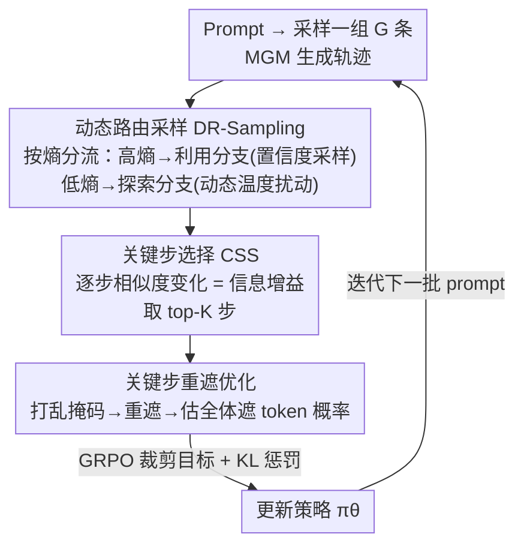

# MaskFocus: Focusing Policy Optimization on Critical Steps for Masked Image Generation

**会议**: CVPR 2026  
**论文**: [CVF Open Access](https://openaccess.thecvf.com/content/CVPR2026/html/Zhang_MaskFocus_Focusing_Policy_Optimization_on_Critical_Steps_for_Masked_Image_CVPR_2026_paper.html)  
**代码**: 有（论文称 "Code is available at here"，具体仓库地址待确认 ⚠️）  
**领域**: 图像生成 / 掩码生成模型 / 强化学习  
**关键词**: 掩码生成模型, GRPO, 关键步选择, 动态路由采样, 文生图

## 一句话总结
MaskFocus 给掩码生成模型（MGM）设计了一套强化学习后训练框架：先用「中间图嵌入与最终图嵌入的余弦相似度变化」识别出对成像最关键的少数采样步，只在这些步上做策略优化以省掉整轨迹估计的高成本；再用「基于熵的动态路由采样」分流高/低熵样本平衡探索与利用，最终把开源 MGM Meissonic 的 GenEval 从 0.54 推到 0.76，多项指标逼近 FLUX。

## 研究背景与动机

**领域现状**：掩码生成模型（MGM，如 MaskGIT、Muse、Meissonic）是与扩散模型、自回归模型并列的第三类视觉生成范式。它把图像量化成离散 token，推理时从全 [MASK] 画布出发，每步并行预测所有被遮 token、只按置信度保留一小部分、其余继续遮住迭代细化，速度优势明显且质量可比 SDXL。与此同时，RLVR/GRPO 在 LLM 后训练、以及在自回归和扩散视觉模型上都已证明能显著提升指令遵循与画质。

**现有痛点**：把 RL 搬到 MGM 上却很别扭。GRPO 这类策略优化需要每一步动作的概率似然，而 MGM 的「由粗到细」是一个多步迭代过程——要拿到每步概率就得沿整条采样轨迹做 step-wise 概率估计。Mask-GRPO 把整条去遮轨迹当多步决策、对全轨迹做优化，计算开销巨大；MaskGRPO（另一篇同名缩写不同的工作）改成挑「掩码比例高」的步来加速，但这种非动态、固定规则的选步没考虑不同步对最终图贡献的差异，结果次优。

**核心矛盾**：MGM 上做 RL 的根本矛盾是**「概率估计成本」与「优化效果」的权衡**——要算全轨迹概率太贵，随便挑几步又选不准、白白浪费时间步预算。

**本文目标**：在不做全轨迹估计的前提下，找到采样轨迹中真正"决定成像"的关键步，把有限的策略优化预算集中砸到这些步上；同时缓解 MGM 置信度采样导致的"早期一直在画背景、主体被压缩"的探索不足问题。

**切入角度**：作者做了两个观察。其一，MGM 每步所有被遮 token（哪怕没被选中保留）的概率分布都和最终图强相关，因为预训练目标就是用 ground truth 监督预测全部遮 token——所以可以直接用"全体被遮 token 的概率"做策略优化，不必只盯被保留的那批。其二，沿采样轨迹测"中间图嵌入 vs 最终图嵌入"的余弦相似度，发现相似度增长**很不均匀**：早期几步（如 1–25 步）相似度涨得快、快速奠定全局结构与外观，后期（25–64 步）只在抠局部细节。这种非均匀性恰好是"每步价值"的天然度量。

**核心 idea**：用"逐步相似度变化量"当 information gain 找出 top-K 关键步，**只在关键步上做 GRPO**；再加一个按熵分流的动态采样，对低熵（过度确定）样本注入更多探索。

## 方法详解

### 整体框架
MaskFocus 是一套围绕 GRPO 的 MGM 后训练流程，基座是 Meissonic。对每个 prompt 先采样一组（group size $G$）完整生成轨迹，沿途记录每步的图嵌入和掩码；然后两条主线并行：**Critical Step Select (CSS)** 负责从这条轨迹里挑出 $K$ 个信息增益最高的关键步，**Dynamic Routing Sampling (DR-Sampling)** 负责在组内按熵把样本分流到探索/利用两个分支以决定如何采样。最后只把这 $K$ 个关键步的样本喂进优化阶段：随机打乱该步掩码、重新遮住已生成 token、估计这些被遮 token 在 $\pi_\theta$/$\pi_{old}$/$\pi_{ref}$ 下的对数似然，算出 GRPO 的裁剪目标与 KL 惩罚来更新策略。整套流程把"全轨迹估概率"压缩成"只估 $K$ 个关键步"，既省算又选得准。

### 关键设计

**1. 关键步选择 CSS：用逐步相似度变化锁定"决定成像"的少数步**

这一设计直接针对"全轨迹估概率太贵、随机选步又次优"的痛点。作者先用图 tokenizer（VQ-VAE）把每个采样步 $t$ 的中间图编码成嵌入 $E_t$，与最终生成图嵌入 $E_T$ 算余弦相似度 $S_t = \mathrm{CosSim}(E_t, E_T)$；再取相邻步相似度的绝对差值作为该步的信息增益 $V_t = |\Delta S_t| = |S_{t+1} - S_t|$。信息增益越大，说明这一步对最终图的"推进"越大。于是在全部采样步里取信息增益 top-$K$ 的步作为关键步（论文 64 步里选 $K=6$）。直觉上这把策略优化集中到了"决定图像质量走向"的转折步上，避开了后期只抠细节的低价值步——既高效分配了时间步预算，也避开了在细节步上训练易诱发的 reward hacking。配套地，作者用的是"全体被遮 token 的概率"而非只用被保留 token：因为 MGM 预训练就是用 GT 监督全部遮 token，这些 token 本身已携带最终图信息，直接拿来做优化目标既合理又省事。

**2. 动态路由采样 DR-Sampling：按熵分流，给"过度确定"的样本注入探索**

这一设计针对 MGM 置信度采样的固有毛病：保守的置信度策略倾向在早期大量步里先填简单区域（如背景），压缩了主体的多样性与质量，根因是部分采样轨迹熵太低、采样过于确定。作者在每次采样迭代前算每个样本的熵 $H_i = -\sum_{v \in \mathcal{V}} p(v)\log p(v)$（$\mathcal{V}$ 是码本，$p(v)$ 是 token 预测概率），并在组内按熵排序后一分为二。**利用分支**收高熵那一半：它们本身不确定性已足够，沿用标准置信度采样以免再加噪声破坏训练稳定。**探索分支**收低熵那一半：对这些"模型已经很自信"的样本用动态温度 $T_i = T\,e^{-H_{i,j}/\alpha} + T_{min}$ 适度扰动（$T$ 为最高温、$T_{min}$ 为下界、$\alpha$ 控制温度随熵衰减速率），鼓励它们去试探新的去遮位置。之所以不对全体样本统一升温，是因为高熵样本对温度更敏感，过度升温会导致采样不稳甚至 reward hacking——分流正是为了"只在该探的地方探"。

**3. 关键步上的重遮概率估计与 GRPO 更新：让 off-policy 估计更可靠**

选出关键步后，优化阶段并非直接复用采样时的轨迹掩码，而是**随机打乱该步掩码 $M_k$ 得到新掩码 $M_k'$、重新遮住已生成 token**，再估计这些遮 token 在策略/旧策略/参考模型下的对数似然，按 $p(z_M|z_V) = \prod_{i\in M} p(z_i|z_V)$ 计算重要性比率 $r_t^i$ 与 KL，套进 GRPO 裁剪目标更新 $\pi_\theta$。优势用组内标准化 $A^i = (R^i - \mathrm{mean}(\{R^i\}))/\mathrm{std}(\{R^i\})$。作者特意做了消融：若沿用采样时的轨迹掩码直接重遮（trajectory-based masking），在 off-policy 训练下概率估计误差大，导致策略与参考模型间 KL 惩罚过大、训练受损；重新生成掩码反而更稳。这点把"为什么要打乱重遮"讲清楚了，也指出了未来可深挖的方向。

> 框架图中的三个贡献节点（DR-Sampling、CSS、关键步重遮优化）与上面三个关键设计一一对应；首尾的"采样轨迹"与"更新 πθ"是标准 GRPO 脚手架。

### 损失函数 / 训练策略
优化目标是 GRPO 的裁剪式目标加 KL 惩罚：

$$\mathcal{J} = \mathbb{E}_{\{o^i\}\sim\pi_{old}}\Big[\tfrac{1}{\sum_i |o^i|}\sum_i\sum_t \big(\min(r_t^i\hat{A}^i,\ \mathrm{clip}(r_t^i,1-\varepsilon,1+\varepsilon)\hat{A}^i) - \beta D_{KL}(\pi_\theta\|\pi_{ref})\big)\Big]$$

其中 $r_t^i = \pi_\theta(o_t^i)/\pi_{\theta_{old}}(o_t^i)$。训练基座为 1024×1024 的 Meissonic，采样 64 步、关键步数 $K=6$、组大小 $G=8$、训练与推理 CFG 均取 5（论文发现 Meissonic 默认 CFG=9 偏高，过高会大幅扭曲采样分布、过低保不住画质，中等 CFG 训练最优）。组合生成任务用 5 万条 GenEval 风格 prompt（来自 Flow-GRPO，且与官方 GenEval prompt 不重叠），奖励用 CLIP + GenEval reward；偏好对齐任务用 HPSv2 训练集 1 万条，奖励用 HPS。

## 实验关键数据

### 主实验
在 GenEval 上，MaskFocus 把基座 Meissonic 从 0.54 大幅拉到 0.76，并超过同类 mask-based RL 方法（Meissonic+MaskGRPO 0.73、Mask-GRPO 0.73），在 counting、position 等子任务提升尤其明显。

| 方法 | Overall↑ | Two Obj.↑ | Counting↑ | Color↑ | Position↑ | Color Attr.↑ |
|------|----------|-----------|-----------|--------|-----------|--------------|
| SDXL | 0.55 | 0.74 | 0.39 | 0.85 | 0.15 | 0.23 |
| FLUX.1-dev | 0.66 | 0.81 | 0.74 | 0.79 | 0.22 | 0.45 |
| Janus-Pro-1B | 0.73 | 0.82 | 0.51 | 0.89 | 0.65 | 0.56 |
| Mask-GRPO | 0.73 | 0.90 | 0.69 | 0.85 | 0.35 | 0.59 |
| Meissonic（基座） | 0.54 | 0.66 | 0.42 | 0.86 | 0.10 | 0.22 |
| Meissonic + MaskGRPO | 0.73 | 0.87 | 0.83 | 0.87 | 0.39 | 0.48 |
| **Meissonic + MaskFocus** | **0.76** | **0.91** | **0.85** | 0.87 | **0.42** | 0.54 |

在 DrawBench 上的人类偏好类指标（DEQA-Score、PickScore、HPS、ImageReward），MaskFocus 把 Meissonic 几乎全面拉到与 FLUX.1-dev 同档甚至更高：

| 方法 | DEQA↑ | PickScore↑ | HPS↑ | ImageReward↑ |
|------|-------|-----------|------|--------------|
| SD3.5-M | 4.24 | 22.50 | 30.17 | 0.98 |
| FLUX.1-dev | 4.37 | 22.97 | 31.13 | 1.06 |
| Meissonic（基座） | 4.00 | 21.63 | 28.89 | 0.39 |
| Meissonic + MaskGRPO | 4.35 | 22.34 | 35.48 | 1.06 |
| **Meissonic + MaskFocus** | **4.39** | 22.39 | **35.52** | **1.09** |

> 注：DEQA-Score 为基于多模态模型打分的图文质量分；HPS / PickScore / ImageReward 均为人类偏好奖励模型分值，数值越高越好（不同指标量纲不同，不可横向比绝对值）。

### 消融实验
| 配置 | GenEval↑ | DEQA↑ | PickScore↑ | 说明 |
|------|---------|-------|-----------|------|
| MaskFocus（完整） | 0.76 | 4.39 | 22.39 | 完整模型 |
| w/o CSS（改随机选早期步） | 0.72 | 4.34 | 22.34 | 去掉关键步选择，所有指标下滑 |
| w/o DR-Sampling | 0.74 | 4.35 | 22.31 | 画质类指标掉得更明显，GenEval 影响小 |

### 关键发现
- **CSS 贡献更偏"指令遵循"，DR-Sampling 贡献更偏"画质"**：去掉 CSS 后 GenEval 从 0.76 掉到 0.72（选步不准则 RL 学不到位）；去掉 DR-Sampling 则 PickScore/DEQA 等画质指标掉得更明显、GenEval 受影响小，说明动态采样主要在提升画质与探索效率。
- **选步策略很讲究**：只在前 40% 步里随机选会在训练后期退化、易 reward hacking（模型钻细节步的奖励空子）；固定取前 20% 区间虽强于只用最早几步，但仍不如按信息增益选关键步——"早期步有效，但还有更优的步可选"。
- **采样策略需要分流**：MaskGIT 采样探索不足、提升有限；对全体样本统一用熵采样后期训练不稳；动态路由恰好在两者间取得平衡。
- **掩码策略**：复用采样轨迹掩码做重遮在 off-policy 下概率估计误差大、KL 惩罚过大；重新生成掩码更稳。

## 亮点与洞察
- **"用嵌入相似度的逐步变化量当 step value"是个轻巧又通用的度量**：不需要额外网络或标注，只要 VQ-VAE 嵌入做余弦相似度的差分，就能给采样轨迹的每一步打"价值分"，思路可迁移到任何多步迭代生成模型的步级信用分配。
- **"直接用全体被遮 token 概率"绕开了 MGM 做 RL 的最大成本**：抓住"预训练目标本就监督全部遮 token"这一点，把"必须沿全轨迹估概率"的硬约束松开，是这篇能把开销压下来的关键洞察。
- **按熵分流而非统一升温**很务实：识别到"高熵样本对温度更敏感、过度升温会崩"，于是只对低熵样本探索，是对探索-利用权衡的一个细颗粒度处理，可迁移到其他需要采样多样性的 RL 场景。

## 局限与展望
- **关键步数 $K$、组大小等为固定超参**：$K=6$、$G=8$ 是按 Meissonic + 64 步经验设定，是否随模型/步数自适应、对不同任务最优值是否一致，论文未充分扫描（更多超参在补充材料）。
- **off-policy 概率估计仍有误差**：作者自己指出轨迹掩码重遮会带来过大 KL，虽改用重新生成掩码缓解，但 off-policy 下的概率估计误差仍是悬而未决的问题，被列为"未来研究重点"。
- **仅在 Meissonic 单一基座上验证**：方法面向 MGM 通用设计，但实验只在 Meissonic 上做，跨 MGM 架构（如 Show-o、Muse 系）的普适性待验证。
- **代码可得性需确认 ⚠️**：论文称代码可用但正文未给出明确仓库地址，复现细节（如温度 $\alpha$、$T_{min}$ 取值）部分依赖补充材料。

## 相关工作与启发
- **vs Mask-GRPO**：Mask-GRPO 把整条去遮轨迹当多步决策、对全轨迹做策略优化，估概率成本高；MaskFocus 只在 top-$K$ 关键步上优化，省算且选得准，GenEval 0.76 vs 0.73。
- **vs MaskGRPO（另一篇）**：该工作靠"选掩码比例高的步"来加速并增强探索，但属固定规则、非动态选步，没区分不同步对成像的贡献差异；MaskFocus 用信息增益动态选步，避免了对细节步过拟合导致的次优与 reward hacking。
- **vs 扩散模型上的 RL（如 Flow-GRPO / DDPO 系）**：那些方法面向连续去噪轨迹；MaskFocus 针对的是离散 token 的并行去遮迭代，核心难点（每步概率似然）和解法（关键步 + 全遮 token 概率）都是 MGM 特有的。

## 评分
- 新颖性: ⭐⭐⭐⭐ 把"步级信息增益选关键步"与"按熵分流采样"组合进 MGM 的 RL 后训练，切入点清晰且少见，但单个组件（GRPO、熵采样、温度调度）多为已有技术的巧妙组装。
- 实验充分度: ⭐⭐⭐⭐ 覆盖 GenEval / T2I-CompBench / DrawBench 多基准 + 选步/采样/CFG/掩码四组讨论，较扎实；但仅单一基座、缺跨模型与更大规模验证。
- 写作质量: ⭐⭐⭐⭐ 动机—观察—方法的逻辑链顺畅，图 2 的相似度/熵分析有说服力；公式排版（缓存中 LaTeX 有损）与代码地址表述略含糊。
- 价值: ⭐⭐⭐⭐ 为"如何高效地把 RL 用到掩码生成模型"给出了实用且可复用的范式，对推动 MGM 与扩散/AR 缩小差距有参考意义。

<!-- RELATED:START -->

## 相关论文

- [\[CVPR 2026\] Curriculum Group Policy Optimization: Adaptive Sampling for Unleashing the Potential of Text-to-Image Generation](curriculum_group_policy_optimization_adaptive_sampling_for_unleashing_the_potent.md)
- [\[CVPR 2026\] Seeing What Matters: Visual Preference Policy Optimization for Visual Generation](seeing_what_matters_visual_preference_policy_optimization_for_visual_generation.md)
- [\[CVPR 2026\] Neighbor GRPO: Contrastive ODE Policy Optimization Aligns Flow Models](neighbor_grpo_contrastive_ode_policy_optimization_aligns_flow_models.md)
- [\[CVPR 2026\] VA-π: Variational Policy Alignment for Pixel-Aware Autoregressive Generation](va-p_variational_policy_alignment_for_pixel-aware_autoregressive_generation.md)
- [\[CVPR 2026\] OSPO: Object-Centric Self-Improving Preference Optimization for Text-to-Image Generation](ospo_object-centric_self-improving_preference_optimization_for_text-to-image_gen.md)

<!-- RELATED:END -->
