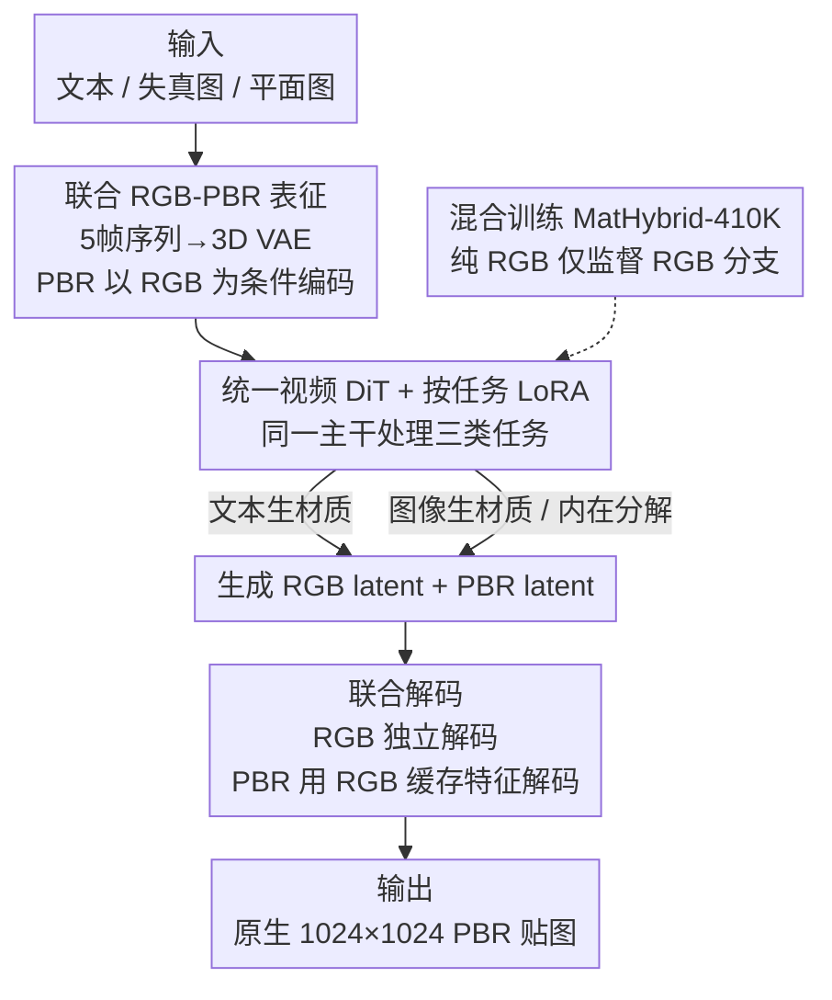

# MatPedia: A Universal Generative Foundation for High-Fidelity Material Synthesis

**会议**: CVPR 2026  
**论文**: [CVF Open Access](https://openaccess.thecvf.com/content/CVPR2026/html/Luo_MatPedia_A_Universal_Generative_Foundation_for_High-Fidelity_Material_Synthesis_CVPR_2026_paper.html)  
**代码**: 待确认  
**领域**: 图像生成 / 扩散模型 / PBR 材质合成  
**关键词**: PBR 材质, 联合表征, 视频扩散, 内在分解, 基础模型

## 一句话总结
MatPedia 把"贴图 RGB + 四张 PBR 贴图"编码成一段 5 帧序列、套用视频扩散架构来联合建模，从而用单一模型统一文本生材质、图像生材质、内在分解三类任务，并能借助海量纯 RGB 图片训练，在原生 1024×1024 分辨率上超越此前专用方法。

## 研究背景与动机

**领域现状**：物理渲染（PBR）材质是真实感图形的基础，每个材质由 basecolor（漫反射反照率）、normal（法线）、roughness（粗糙度）、metallic（金属度）四张贴图按 Cook-Torrance 微表面模型描述。手工制作这些贴图既费力又需要专业技能，因此近年用 GAN / 扩散模型自动生成材质成为热点。

**现有痛点**：作者指出现有方法有两个根本短板。其一是**任务碎片化**——内在分解、文本生材质、图像生材质各自一套专用 pipeline（如 ControlMat、MatFuse、Material Palette、RGB↔X），缺一个能同时处理多任务的统一架构。其二是**数据受限**——它们只能在小规模 PBR 数据集（往往几千上万个材质）上训练，无法利用质量更高、规模更大的自然 RGB 图像数据，导致合成材质的质量与多样性远低于现代 RGB 图像生成器的水准。

**核心矛盾**：缺少一个能**同时桥接自然图像外观（RGB）与物理材质属性（PBR）**的统一隐空间表征。没有它，就既无法做统一架构，也无法把 RGB 大数据引入材质训练。

**切入角度**：作者的关键观察是 RGB 与 PBR 之间存在**不对称的互补关系**——RGB 图像本身已包含丰富的外观线索（纹理、颜色、结构），而四张 PBR 贴图主要补充的是 RGB 背后的物理解释（表面几何、材质类型、反射率）。于是不该把 PBR 当成与 RGB 平行的独立模态，而应**以 RGB 为条件**去编码 PBR，只需表征"增量物理属性"即可高度压缩。

**核心 idea**：借鉴视频压缩——3D VAE 能跨时间相干的多帧建模依赖关系；把 RGB 帧与四张 PBR 贴图拼成一段 5 帧"视频"，用视频 VAE/DiT 学习它们的联合分布，既天然捕捉 RGB↔PBR 的耦合，又能迁移视频生成模型的视觉先验。

## 方法详解

### 整体框架
MatPedia 的目标是用**单一架构**完成文本生材质、图像生材质、内在分解三类任务。核心是一个**联合 RGB-PBR 表征**：把一张 RGB 帧和四张 PBR 贴图当作一段 5 帧序列，用微调过的 3D（视频）VAE 编码成两个相互依赖的隐变量——一个表示着色后的 RGB 外观，一个联合编码四张 PBR 贴图（且以 RGB 为条件）。在这之上接一个视频 DiT 主干，用按任务区分的 LoRA 做灵活条件控制，三类任务靠"喂不同的条件信号"统一起来。训练数据则是混合语料 MatHybrid-410K（RGB-PBR 配对 + 纯 RGB 图像）。

### 关键设计

**1. 联合 RGB-PBR 表征：以 RGB 为条件压缩 PBR，把材质当作 5 帧视频**

针对"缺少桥接 RGB 与 PBR 的统一隐空间"这一根本痛点，作者把一张 RGB 图 $\mathbf{I}_{rgb}\in\mathbb{R}^{H\times W\times 3}$ 与四张 PBR 贴图 $(a,n,r,m)$ 拼成一段 5 帧序列，喂给预训练视频 VAE（Wan2.2-VAE，3D 因果卷积、空间 16× / 时间 4× 高压缩）。编码端是不对称的：RGB 独立编码 $\mathbf{z}_{rgb}=\mathcal{E}_{rgb}(\mathbf{I}_{rgb})$，而 PBR 用 RGB 分支缓存的特征 $\mathcal{F}_{enc}$ 作条件编码 $\mathbf{z}_{pbr}=\mathcal{E}_{pbr}([\mathcal{F}_{enc}(\mathbf{z}_{rgb}),a,n,r,m])$；解码端镜像对称，RGB 独立解码，PBR 用 RGB 解码缓存特征 $\mathcal{F}_{dec}$ 做"增量精修"。这样设计有效的原因是：RGB 已携带大量视觉结构，PBR latent 只需补编码 RGB 里没有的物理属性，从而获得很高的压缩比却仍保住材质细节，支撑原生 1024×1024 生成。为了在保留预训练隐分布的同时提升材质保真，作者**只微调解码器**（编码器冻结），用像素 + 感知损失：$\mathcal{L}_{\mathrm{VAE}}=\lambda_1\|\hat{\mathbf{x}}-\mathbf{x}\|_1+\lambda_2\|\phi(\hat{\mathbf{x}})-\phi(\mathbf{x})\|_2^2$，其中 $\phi$ 取自预训练 VGG。

**2. 统一视频 DiT + 按任务 LoRA：一个主干、三个任务靠条件切换**

针对"任务碎片化"，作者在联合 latent 上接一个视频 DiT，三类任务共享同一主干、只用不同 LoRA 与条件信号区分。**文本生材质**：DiT 从噪声出发、以文本为条件同时生成 RGB 与 PBR latent，再联合解码。**图像生材质**：把可能带几何失真的照片经 VAE 编码成条件 latent，DiT 生成"校正后的平面 RGB + PBR"两个新 latent，解码时 RGB 独立重建（顺带校正失真）、PBR 用缓存 RGB 特征解码，该任务从文本生材质 checkpoint 用 LoRA 微调而来。**内在分解**：输入平面 RGB，DiT 只生成对应 PBR latent，同样从文本权重 LoRA 微调。三任务都用 rectified flow 目标优化：$\mathcal{L}_{\mathrm{RF}}=\mathbb{E}_{\mathbf{x}_0,\mathbf{x}_1,t}\big[\|v_\theta(\mathbf{x}_t,t,\mathbf{c})-(\mathbf{x}_0-\mathbf{x}_1)\|_2^2\big]$，其中 $\mathbf{x}_t=(1-t)\mathbf{x}_0+t\mathbf{x}_1$。DiT 从大规模视频生成模型初始化，靠 LoRA（rank 128）迁移视觉先验——既省训练，又把"视频先验"用作跨贴图相关性与空间对齐的来源。

**3. 混合训练 MatHybrid-410K：用纯 RGB 大数据补 PBR 数据稀缺**

针对"PBR 数据太少"，作者构建混合语料 MatHybrid-410K：① **RGB 外观子集**约 5 万张平面材质图（Gemini 2.5 Flash Image 程序生成 + 公开真实平面材质照片），每张配 Qwen2.5-VL-72B 生成的文本描述，提供纯 RGB（无 PBR 标注）的多样外观；② **完整 PBR 子集**约 6000 套材质（源自 Matsynth 等），用 Blender Disney Principled BSDF 渲染出平面视图（32 张 HDR 环境图，得 19.2 万对供内在分解）与失真视图（渲到立方体/球/圆柱等几何体上，约 16.8 万对供图像生材质）。训练时对纯 RGB 样本**只监督 RGB latent 生成**，PBR latent 分布仍只从配对数据学习——这样既让 RGB 分支吸收海量视觉知识、又不污染 PBR 隐分布。消融证实去掉 RGB 子集会让 CLIP 从 0.283 跌到 0.275、DINO-FID 从 1.31 升到 1.62，说明这部分外观数据确实同时改善了语义对齐与感知真实感。

### 损失函数 / 训练策略
3D VAE 解码器在 1024×1024 的 RGB-PBR 配对数据上微调 10K 步（AdamW，lr=5×10⁻⁵，λ₁=10，λ₂=1）。视频 DiT 用 LoRA（rank 128，作用于注意力投影与 FFN 线性层）在混合数据上每任务训练 200K 步（batch 16，lr=1×10⁻⁴）。推理时先在 1024×1024 生成、再用 RealESRGAN 上采到 4K，完整 PBR 生成 50 步采样约需 20 秒。

## 实验关键数据

评测沿用 MaterialPicker 的测试集。自定义/常用指标含义：**CLIP score** 衡量语义对齐（文本生材质看文本-图像相似度，图像生材质看图像-图像相似度），越高越好；**DINO score** 用 DINOv2 嵌入衡量感知相似度，越高越好；**DINO-FID** 把 FID 的 Inception 特征换成 DINOv2 特征，越低越好；**MSE / LPIPS** 分别衡量像素误差与感知距离，越低越好。

### 主实验

文本生材质（与统一框架 MatFuse 对比）：

| 方法 | CLIP↑ | DINO-FID↓ |
|------|-------|-----------|
| MatFuse | 0.261 | 1.90 |
| **MatPedia（本文）** | **0.283** | **1.31** |
| MatPedia（无混合训练） | 0.275 | 1.62 |

图像生材质（CLIP / DINO 分通道，对比 MatFuse、Material Palette）：

| 指标 | 方法 | basecolor | Normal | Roughness | Render |
|------|------|-----------|--------|-----------|--------|
| CLIP↑ | MatFuse | 0.833 | 0.906 | 0.873 | 0.859 |
| CLIP↑ | Material Palette | 0.813 | 0.875 | 0.780 | 0.824 |
| CLIP↑ | **本文** | **0.943** | **0.927** | **0.903** | **0.923** |
| DINO↑ | MatFuse | 0.649 | 0.755 | 0.717 | 0.677 |
| DINO↑ | **本文** | **0.907** | **0.762** | **0.752** | **0.843** |

内在分解上，本文在 basecolor/Normal/Roughness/Render 各通道的 MSE 与 LPIPS 也全面最低（如 basecolor MSE 0.009 vs Material Palette 0.058 / RGB↔X 0.122）。

### 消融实验

| 配置 | 关键指标 | 说明 |
|------|---------|------|
| 完整模型（混合训练） | CLIP 0.283 / DINO-FID 1.31 | 文本生材质最佳 |
| w/o RGB 外观子集 | CLIP 0.275 / DINO-FID 1.62 | 仅用 PBR 数据，语义与真实感同时下降 |
| VAE 解码器 微调前 | Normal 27.29 / Roughness 31.36 dB | 重建 PSNR |
| VAE 解码器 微调后 | Normal 30.84 / Roughness 36.56 dB | Normal +3.55 dB、Roughness +5.20 dB |

### 关键发现
- **混合训练是质量来源之一**：引入纯 RGB 外观数据同时改善了文本生材质的语义对齐（CLIP↑）与分布真实感（DINO-FID↓），印证"用 RGB 大数据补 PBR 稀缺"的设计有效。
- **解码器微调对 Normal/Roughness 增益最大**：这两张贴图对材质外观最关键，微调后 PSNR 分别 +3.55 / +5.20 dB，说明冻结编码器、只精修解码器的策略足以补回材质细节。
- **图像生材质提升集中在 basecolor**：相对 MatFuse 在 basecolor 上 +0.11 CLIP / +0.26 DINO，表明本文在失真输入下更能恢复"去掉光照后的本征颜色"。

## 亮点与洞察
- **把材质类比成视频**：用"RGB↔PBR 物理耦合 ≈ 视频相邻帧时间相干"的类比，直接复用视频 VAE/DiT 的成熟架构与预训练先验，这个跨域迁移的视角很巧。
- **不对称编码**：以 RGB 为条件压缩 PBR，让 PBR latent 只编码增量物理信息，是高压缩比 + 高分辨率得以兼顾的关键，可迁移到其他"主模态 + 互补模态"的联合生成场景。
- **纯 RGB 半监督**：对无 PBR 标注的样本只监督 RGB 分支、保护 PBR 隐分布，是一种低成本扩数据的实用范式。

## 局限与展望
- 作者承认联合压缩**耦合了空间特征**，难以直接靠 noise rolling 支持可平铺（tileable）材质生成；不过原生 1024×1024（上采到 4096²）对多数生产场景够用。
- 依赖预训练视频 VAE/DiT 的视觉先验，方法质量与所选底座强相关；⚠️ 论文未充分给出对底座更换的鲁棒性分析。
- 改进方向：探索可平铺生成、把更多 PBR 通道（如各向异性、透射）纳入联合表征。

## 相关工作与启发
- **vs MaterialPicker**：同样用视频骨干处理失真输入，但 MaterialPicker 独立压缩各帧、分辨率受限于 256×256；本文用联合 5 帧表征与 3D VAE，原生 1024×1024。
- **vs IntrinsicX**：IntrinsicX 给每张 PBR 贴图各配一个 LoRA + 交叉注意力保持一致；本文改为在共享联合 latent 上做**按任务**的 LoRA，结构更统一。
- **vs MatFuse / ControlMat / Material Palette**：它们多为任务专用且受限于小 PBR 数据；本文用单一架构统一三任务，并借纯 RGB 大数据提升质量与多样性。

## 评分
- 新颖性: ⭐⭐⭐⭐⭐ "材质=视频"的联合表征 + 以 RGB 为条件的不对称编码是真正新颖的统一视角
- 实验充分度: ⭐⭐⭐⭐ 覆盖三任务且有消融，但多数对比缺公开权重、部分只能定性
- 写作质量: ⭐⭐⭐⭐ 动机—观察—方法链条清晰，图 2 pipeline 信息量大
- 价值: ⭐⭐⭐⭐⭐ 统一架构 + 可释放的 MatHybrid-410K 对材质生成社区价值高

<!-- RELATED:START -->

## 相关论文

- [\[CVPR 2026\] DiT360: High-Fidelity Panoramic Image Generation via Hybrid Training](dit360_high-fidelity_panoramic_image_generation_via_hybrid_training.md)
- [\[CVPR 2026\] PROMO: Promptable Outfitting for Efficient High-Fidelity Virtual Try-On](promo_promptable_virtual_tryon_efficient.md)
- [\[CVPR 2026\] High-Fidelity Diffusion Face Swapping with ID-Constrained Facial Conditioning](high-fidelity_diffusion_face_swapping_with_id-constrained_facial_conditioning.md)
- [\[CVPR 2026\] The Universal Normal Embedding](the_universal_normal_embedding.md)
- [\[CVPR 2026\] Preserving Source Video Realism: High-Fidelity Face Swapping for Cinematic Quality](preserving_source_video_realism_high-fidelity_face_swapping_for_cinematic_qualit.md)

<!-- RELATED:END -->
